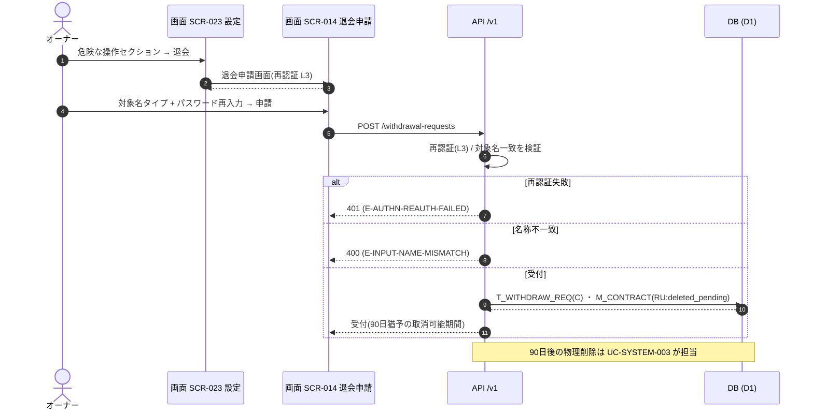

<!-- portal-top -->
[設計ポータル](../../README.md) ／ [基本設計](../index.md) ／ [ユースケース設計](index.md) ／ **UC-10: 退会申請(90 日猶予)**
<!-- /portal-top -->

# UC-10: 退会申請(90 日猶予)

> **このページは、オーナーが設定画面の危険な操作から退会を開始し、再認証(L3)と対象名のタイプ確認を経て退会申請を確定し、契約を 90 日猶予付きの削除保留状態へ移すまでの横断業務フローを定義します。**

*版数 v1.0 ・ 更新 2026-06-21 ・ 種別 横断フロー ・ ステータス ドラフト*

## 1. 概要

オーナーが [SCR-023](../01_screen-design/SCR-023.md#SCR-023) 設定の危険な操作セクションから退会へ進み、[SCR-014](../01_screen-design/SCR-014.md#SCR-014) 退会申請画面で退会の影響を確認する。誤操作を防ぐため再認証(L3 = パスワード再入力)と対象契約名のタイプ確認を要求し、双方が通過したときのみ退会申請を確定する。確定により退会申請(`T_WITHDRAW_REQ`)を作成し、`M_CONTRACT.status` を削除保留(`deleted_pending`)へ遷移させて 90 日間の取消可能な猶予期間に入る。猶予期間満了後の物理削除は別の定期バッチが担う。

| 項目 | 内容 |
|---|---|
| 目的 | 契約データの削除を、本人確認と誤操作防止のうえ 90 日猶予付きで安全に受け付ける |
| 関連要件 | [FR-001](../../01_requirements/FR01.md#FR-001) アカウント管理 ・ [FR-099](../../01_requirements/FR13.md#FR-099) プライバシー・データ管理 |
| 主テーブル | `T_WITHDRAW_REQ(C)` ・ `M_CONTRACT(RU:deleted_pending)` |
| 関連 API | [API-TRM-005](../02_api-design/API-terms.md#API-TRM-005) 退会申請(`POST /withdrawal-requests`) |
| 関連画面 | [SCR-023](../01_screen-design/SCR-023.md#SCR-023) ・ [SCR-014](../01_screen-design/SCR-014.md#SCR-014) |

## 2. 利用者(アクター)

| アクター | 役割 |
|---|---|
| オーナー | 退会を開始し、再認証と名称確認のうえ退会申請を確定する(オーナー専有) |
| 画面 SCR-023 | 危険な操作セクションから退会申請画面への導線を提供する |
| 画面 SCR-014 | 退会の影響提示・再認証(L3)・対象名タイプ確認・申請を担う |
| API /v1 | 再認証検証・名称一致検証・退会申請の受付と契約状態遷移を担う |

## 3. 事前条件

- オーナーとして契約ワークスペースにログイン済みである(退会はオーナー専有)。
- 契約が有効(`active`)で、退会申請が未提出である。

## 4. トリガー

オーナーが [SCR-023](../01_screen-design/SCR-023.md#SCR-023) 設定の危険な操作セクションで「退会」を選択し、[SCR-014](../01_screen-design/SCR-014.md#SCR-014) 退会申請画面で申請を実行する。

## 5. 基本フロー

1. オーナーが [SCR-023](../01_screen-design/SCR-023.md#SCR-023) 設定の危険な操作セクションから退会を選び、[SCR-014](../01_screen-design/SCR-014.md#SCR-014) 退会申請画面へ遷移する。
2. 画面が退会の影響(データ削除範囲・90 日猶予・取消可能期間)を提示する。
3. オーナーが本人確認のためパスワードを再入力する(再認証 L3)。
4. オーナーが確認のため対象契約名をタイプ入力する。
5. オーナーが申請を実行し、画面が [API-TRM-005](../02_api-design/API-terms.md#API-TRM-005)(`POST /withdrawal-requests`)へ再認証情報と入力名称を送る。
6. API が再認証(L3)と対象名一致を検証し、双方合格時に `T_WITHDRAW_REQ(C)` を作成、`M_CONTRACT(U)` を `deleted_pending` へ遷移させる。
7. 画面が受付完了と 90 日猶予(取消可能期間)を提示する。

> [!NOTE]
> **物理削除は別 UC が担当** 90 日猶予の満了後の契約データ物理削除は、定期バッチ [UC-SYSTEM-003](UC-SYSTEM-003.md#UC-SYSTEM-003) 90 日物理削除バッチが担う。本ユースケースは退会申請の受付と `deleted_pending` への遷移までを範囲とする。

## 6. 異常系フロー

- **再認証失敗**: パスワード再入力(L3)が一致しない場合、[API-TRM-005](../02_api-design/API-terms.md#API-TRM-005) が `401`(`E-AUTHN-REAUTH-FAILED`)で拒否する。退会申請は作成されず、契約状態は変化しない。画面は再入力を促す。
- **名称不一致**: 入力された対象契約名が一致しない場合、画面側および API 側の検証で `400`(`E-INPUT-NAME-MISMATCH`)として申請を拒否する。退会申請は作成されない。
- **権限不足**: オーナー以外が退会申請を試みた場合、`403`(`E-AUTHZ-FORBIDDEN`)で拒否する。

## 7. 事後条件

- 退会申請が `T_WITHDRAW_REQ` に作成され、`M_CONTRACT.status` が `deleted_pending` へ遷移し、90 日の取消可能な猶予期間に入る([FR-099](../../01_requirements/FR13.md#FR-099))。
- 猶予期間中は取消が可能で、満了後に [UC-SYSTEM-003](UC-SYSTEM-003.md#UC-SYSTEM-003) が物理削除を実行する。
- 異常終了時は退会申請は作成されず、契約は `active` のまま維持される。

## 8. シーケンス図

---

<!-- portal-bottom -->
[← ユースケース設計](index.md) ・ [基本設計](../index.md) ・ [↑ 設計ポータル](../../README.md)
<!-- /portal-bottom -->
