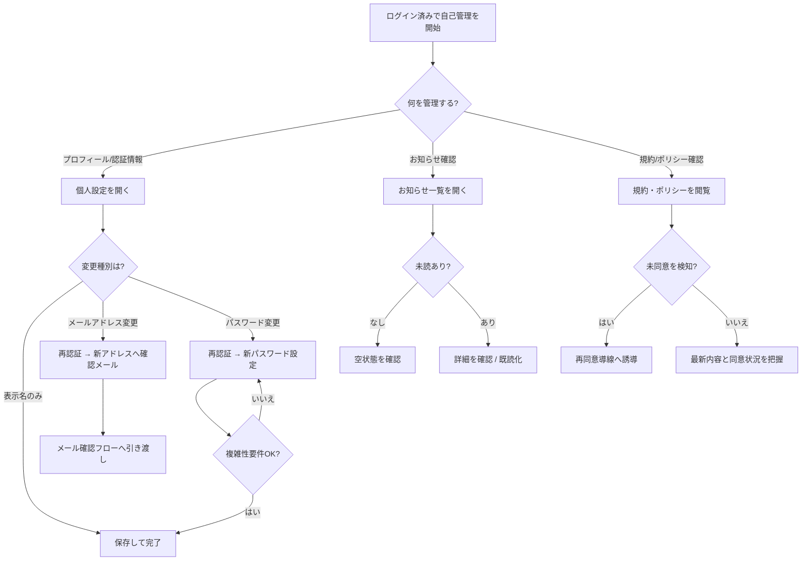

<!-- portal-top -->
[設計ポータル](../../README.md) ／ [基本設計](../index.md) ／ [ユースケース設計](index.md) ／ **UC-BIZ-002: アカウント設定と通知を管理する**
<!-- /portal-top -->

# UC-BIZ-002: アカウント設定と通知を管理する

> **このページは、アカウント利用者がアカウント設定と通知を管理する業務ユースケースを定義します。画面・API・DB の詳細手順は関連する詳細ユースケース(UC-SCR-* / UC-SYSTEM-*)へ委譲し、本書は業務レベルの流れを示します。**

*版数 v1.0 ・ 更新 2026-06-21 ・ アクター アカウント利用者(共通) ・ ステータス ドラフト*

## 1. 概要

アカウント利用者(オーナー / メンバーの両方)が、自身のプロフィール・認証情報を最新の状態に保ち、サービスからのお知らせを把握し、利用規約・プライバシーポリシーの内容と自身の同意状況を確認するまでの日常的な自己管理業務を示す。表示名・メールアドレスの更新、パスワード変更、お知らせの閲覧と既読化、規約文書の参照を一体の自己管理として扱う。本ユースケースの価値は「利用者が自分の情報と通知を自律的に管理し、重要な変更や告知を見落とさない」ことにある。

| 項目 | 内容 |
|---|---|
| アクター | アカウント利用者(オーナー / メンバーの共通業務) |
| 業務価値 | 利用者が自身の設定を最新化し、サービス告知と規約の最新内容を確実に把握できる |
| 関連要件 | [FR-005](../../01_requirements/FR01.md#FR-005) 重要操作の再認証 ・ [FR-101](../../01_requirements/FR13.md#FR-101) 規約改定時の再同意 ・ [FR-116](../../01_requirements/FR15.md#FR-116) お知らせ一覧の取得 ・ [FR-117](../../01_requirements/FR15.md#FR-117) お知らせ詳細の表示 ・ [FR-118](../../01_requirements/FR15.md#FR-118) お知らせの既読化 |
| 関連詳細UC | [UC-SCR-017](UC-SCR-017.md)(個人設定) ・ [UC-SCR-011](UC-SCR-011.md)(お知らせ一覧) ・ [UC-SCR-012](UC-SCR-012.md)(お知らせ詳細) ・ [UC-SCR-010](UC-SCR-010.md)(利用規約閲覧) ・ [UC-SCR-020](UC-SCR-020.md)(プライバシーポリシー閲覧) |

## 2. アクター

| アクター | 関与 |
|---|---|
| アカウント利用者(オーナー) | 自身のプロフィール・パスワードを管理し、お知らせと規約を確認する |
| アカウント利用者(メンバー) | 自身のプロフィール・パスワードを管理し、お知らせと規約を確認する |
| 認証基盤(システム) | 重要操作(メールアドレス変更・パスワード変更)の再認証を判定する |

## 3. 事前条件

- アクターはログイン済みである([UC-BIZ-001](UC-BIZ-001.md#UC-BIZ-001))。
- お知らせの閲覧は自契約宛のお知らせに限定される。

## 4. トリガー

アクターが自身の設定を変更したい、未読のお知らせを確認したい、または規約・ポリシーの内容と同意状況を確認したいと考える。

## 5. 主成功シナリオ(業務ステップ)

1. アクターが個人設定を開き、自身のプロフィール(表示名・メールアドレス)と参加プロジェクトを確認する。([UC-SCR-017](UC-SCR-017.md) ・ [SCR-017](../01_screen-design/SCR-017.md#SCR-017))
2. アクターが表示名やメールアドレスを編集して保存する。メールアドレス変更は重要操作のため再認証を経て、新アドレスへの確認メールによる確認フローへ引き渡される。([UC-SCR-017](UC-SCR-017.md) ・ [FR-005](../../01_requirements/FR01.md#FR-005))
3. アクターが必要に応じてパスワードを変更する。現パスワードによる再認証を経て、複雑性要件を満たす新パスワードに更新する。([UC-SCR-017](UC-SCR-017.md) ・ [FR-005](../../01_requirements/FR01.md#FR-005))
4. アクターがお知らせ一覧を開き、未読のお知らせを把握する。必要に応じて条件で絞り込み、一括で既読化する。([UC-SCR-011](UC-SCR-011.md) ・ [SCR-011](../01_screen-design/SCR-011.md#SCR-011) ・ [FR-116](../../01_requirements/FR15.md#FR-116) ・ [FR-118](../../01_requirements/FR15.md#FR-118))
5. アクターが個別のお知らせ詳細を開いて内容を確認する。初回表示時は自動で既読化される。([UC-SCR-012](UC-SCR-012.md) ・ [SCR-012](../01_screen-design/SCR-012.md#SCR-012) ・ [FR-117](../../01_requirements/FR15.md#FR-117))
6. アクターが利用規約・プライバシーポリシーを閲覧し、最新版の内容と自身の同意状況を確認する。([UC-SCR-010](UC-SCR-010.md) ・ [SCR-010](../01_screen-design/SCR-010.md#SCR-010) ・ [UC-SCR-020](UC-SCR-020.md) ・ [SCR-020](../01_screen-design/SCR-020.md#SCR-020))

## 6. 例外・代替フロー(業務レベル)

- **再認証の失敗**: メールアドレス変更・パスワード変更時の再認証に失敗した場合は、当該変更を保存せずエラーを表示する。([UC-SCR-017](UC-SCR-017.md) ・ [FR-005](../../01_requirements/FR01.md#FR-005))
- **入力検証エラー**: 表示名の文字数超過やメールアドレス形式不正、パスワード複雑性不足は保存・変更を行わずエラーを表示する。([UC-SCR-017](UC-SCR-017.md))
- **メールアドレス変更の確認未完了**: 新アドレスへの確認メールが確認されるまで、メールアドレス変更は確定しない(確認フローは [UC-SCR-013](UC-SCR-013.md) へ引き渡し)。([UC-SCR-017](UC-SCR-017.md))
- **お知らせ 0 件**: 未読のお知らせがない場合は空状態を表示する。([UC-SCR-011](UC-SCR-011.md))
- **規約未同意の検知**: 規約閲覧画面で未同意が判明した場合は、再同意導線を経て規約再同意([UC-SCR-015](UC-SCR-015.md))へ誘導される。([UC-SCR-010](UC-SCR-010.md) ・ [UC-SCR-020](UC-SCR-020.md) ・ [FR-101](../../01_requirements/FR13.md#FR-101))

## 7. 事後条件

- アクターのプロフィール・パスワードは、検証と再認証を満たした変更のみが反映されている。
- 確認したお知らせは既読として記録されている。
- アクターは規約・ポリシーの最新内容と自身の同意状況を把握している。

## 8. 業務アクティビティ図

---

<!-- portal-bottom -->
[← ユースケース設計](index.md) ・ [基本設計](../index.md) ・ [↑ 設計ポータル](../../README.md)
<!-- /portal-bottom -->
