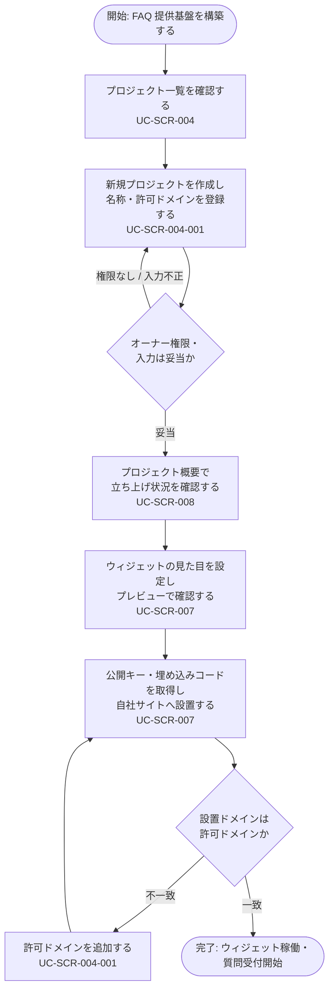

<!-- portal-top -->
[設計ポータル](../../README.md) ／ [基本設計](../index.md) ／ [ユースケース設計](index.md) ／ **UC-BIZ-004: FAQ 提供基盤を構築する(プロジェクト・ウィジェット設置)**
<!-- /portal-top -->

# UC-BIZ-004: FAQ 提供基盤を構築する(プロジェクト・ウィジェット設置)

> **このページは、契約オーナーが FAQ を提供するためのプロジェクトを作成し、ウィジェットを自社サイトへ設置して公開できる状態に整えるまでの業務ユースケースを、業務粒度で定義します。**

*版数 v1.0 ・ 更新 2026-06-21 ・ アクター 契約オーナー ・ ステータス ドラフト*

## 1. 概要

契約オーナーは、FAQ の提供単位となるプロジェクトを作成し、許可ドメインを設定したうえで、ウィジェットの公開キー・埋め込みコードを取得して自社サイトへ設置します。これにより、エンドユーザーがウィジェットから質問できる「FAQ 提供基盤」が立ち上がります。本ユースケースは個々の画面イベント(詳細 UC)を束ねた業務目的の達成までを範囲とし、画面内の入力検証や API/DB の挙動は詳細 UC に委ねます。

| 項目 | 内容 |
|----|----|
| アクター | 契約オーナー |
| 業務価値 | FAQ を提供する単位(プロジェクト)を立ち上げ、自社サイト上でウィジェットを稼働させ、エンドユーザーからの質問受付を開始できる |
| 関連要件 | [FR-019](../../01_requirements/FR03.md#FR-019)(プロジェクト一覧)・[FR-020](../../01_requirements/FR03.md#FR-020)・[FR-021](../../01_requirements/FR03.md#FR-021)(プロジェクト作成・編集)・[FR-092](../../01_requirements/FR12.md#FR-092)(埋め込みコード取得)・[FR-093](../../01_requirements/FR12.md#FR-093)(許可ドメイン)・[FR-094](../../01_requirements/FR12.md#FR-094)(見た目設定) |
| 関連詳細 UC | [UC-SCR-004](UC-SCR-004.md)(プロジェクト)・[UC-SCR-004-001](UC-SCR-004-001.md)(プロジェクト作成・編集モーダル)・[UC-SCR-008](UC-SCR-008.md)(概要)・[UC-SCR-007](UC-SCR-007.md)(ウィジェット設定) |

## 2. アクター

| アクター | 役割 |
|----|----|
| 契約オーナー | プロジェクトを作成・編集し、ウィジェットを設定して自社サイトへ設置する主体。プロジェクト作成はオーナー専有 |

## 3. 事前条件

- 契約オーナーのアカウントが有効で、ログイン済みである。
- 利用規約・プライバシーポリシーへの同意が完了している。

## 4. トリガー

契約オーナーが、新しい FAQ 提供単位を立ち上げる、またはウィジェットを自社サイトへ設置する必要が生じたとき。

## 5. 主成功シナリオ(業務ステップ)

1. オーナーがプロジェクト一覧を開き、現在のプロジェクトを確認する。詳細 UC: [UC-SCR-004](UC-SCR-004.md) ／ 画面 [SCR-004](../01_screen-design/SCR-004.md#SCR-004)。
2. オーナーが新規プロジェクトを作成し、プロジェクト名と許可ドメインを登録する。詳細 UC: [UC-SCR-004-001](UC-SCR-004-001.md) ／ 画面 [SCR-004-001](../01_screen-design/SCR-004-001.md#SCR-004-001)。関連要件 [FR-021](../../01_requirements/FR03.md#FR-021) ・ [FR-093](../../01_requirements/FR12.md#FR-093)。
3. オーナーが作成したプロジェクトの概要画面で、立ち上げ状況(質問数・公開 FAQ 件数など)を確認する。詳細 UC: [UC-SCR-008](UC-SCR-008.md) ／ 画面 [SCR-008](../01_screen-design/SCR-008.md#SCR-008)。
4. オーナーがウィジェット設定画面で見た目(主色)を設定し、必要に応じてプレビューで確認する。詳細 UC: [UC-SCR-007](UC-SCR-007.md) ／ 画面 [SCR-007](../01_screen-design/SCR-007.md#SCR-007)。関連要件 [FR-094](../../01_requirements/FR12.md#FR-094)。
5. オーナーが公開キーと埋め込みコードを取得し、自社サイトの対象ページへ設置する。詳細 UC: [UC-SCR-007](UC-SCR-007.md) ／ 画面 [SCR-007](../01_screen-design/SCR-007.md#SCR-007)。関連要件 [FR-092](../../01_requirements/FR12.md#FR-092)。
6. 許可ドメイン上でウィジェットが稼働し、エンドユーザーが質問できる状態になる。

## 6. 例外・代替フロー(業務レベル)

- プロジェクト作成権限がない(オーナー以外)場合、プロジェクト作成は実行できない。プロジェクト作成はオーナー専有のため、当該操作は拒否される。詳細 UC: [UC-SCR-004](UC-SCR-004.md)。
- プロジェクト名・許可ドメインの入力が不正(重複・形式不正)な場合、作成は確定せず、修正を促される。詳細 UC: [UC-SCR-004-001](UC-SCR-004-001.md)。
- ウィジェットを設置したドメインが許可ドメインに含まれない場合、ウィジェットは動作しない。許可ドメインを追加して再設置する。関連要件 [FR-093](../../01_requirements/FR12.md#FR-093)。
- 公開キーを再発行した場合、旧キーで設置済みの埋め込みコードは無効となるため、新しい埋め込みコードへ差し替える。詳細 UC: [UC-SCR-007](UC-SCR-007.md)。

## 7. 事後条件

- プロジェクトが作成され、許可ドメインが登録されている。
- ウィジェットの公開キー・埋め込みコードが取得され、自社サイトへ設置されている。
- 許可ドメイン上でウィジェットが稼働し、エンドユーザーからの質問を受け付けられる。

## 8. 業務アクティビティ図

---

<!-- portal-bottom -->
[← ユースケース設計](index.md) ・ [基本設計](../index.md) ・ [↑ 設計ポータル](../../README.md)
<!-- /portal-bottom -->
