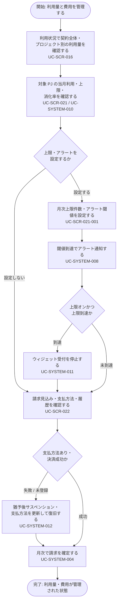

<!-- portal-top -->
[設計ポータル](../../README.md) ／ [基本設計](../index.md) ／ [ユースケース設計](index.md) ／ **UC-BIZ-006: 利用量と費用を管理する(利用状況・上限・請求)**
<!-- /portal-top -->

# UC-BIZ-006: 利用量と費用を管理する(利用状況・上限・請求)

> **このページは、契約オーナーが契約全体およびプロジェクト単位の利用量を把握し、質問数の月次上限・アラートを設定し、請求・支払いを管理する業務ユースケースを、業務粒度で定義します。**

*版数 v1.0 ・ 更新 2026-06-21 ・ アクター 契約オーナー ・ ステータス ドラフト*

## 1. 概要

契約オーナーは、契約全体と各プロジェクトの利用量(質問数・未解決数・コスト等)を確認し、プロジェクトごとに質問数の月次上限とアラート閾値を設定して、想定外の利用増や費用超過を抑制します。月次の請求確定・支払方法・請求履歴を請求画面で管理し、上限到達やアラート、決済失敗時のシステム挙動を踏まえて運用します。上限・アラートの設定はオーナーおよび当該プロジェクトのメンバーが行えますが、利用量・費用の全体管理と請求はオーナーが主体です。

| 項目 | 内容 |
|----|----|
| アクター | 契約オーナー(利用状況・請求はオーナー専有。上限設定はメンバーも可) |
| 業務価値 | 利用量を可視化し、上限・アラートで費用を制御し、請求・支払いを安定して管理できる |
| 関連要件 | [FR-064](../../01_requirements/FR09.md#FR-064)(利用量集計)・[FR-065](../../01_requirements/FR09.md#FR-065)(月次上限・アラート設定)・[FR-066](../../01_requirements/FR09.md#FR-066)(上限到達時受付停止)・[FR-067](../../01_requirements/FR09.md#FR-067)(請求画面)・[FR-068](../../01_requirements/FR09.md#FR-068)(支払失敗・停止制限)・[FR-071](../../01_requirements/FR09.md#FR-071)(アラート閾値)・[FR-077](../../01_requirements/FR10.md#FR-077)(質問数・未解決数確認) |
| 関連詳細 UC | [UC-SCR-016](UC-SCR-016.md)(利用状況)・[UC-SCR-021](UC-SCR-021.md)(利用量と上限)・[UC-SCR-021-001](UC-SCR-021-001.md)(質問数上限設定モーダル)・[UC-SCR-022](UC-SCR-022.md)(請求)・[UC-SYSTEM-010](UC-SYSTEM-010.md#UC-SYSTEM-010)(利用量集計)・[UC-SYSTEM-008](UC-SYSTEM-008.md#UC-SYSTEM-008)(上限アラート)・[UC-SYSTEM-011](UC-SYSTEM-011.md#UC-SYSTEM-011)(上限受付停止)・[UC-SYSTEM-004](UC-SYSTEM-004.md#UC-SYSTEM-004)(月次請求確定)・[UC-SYSTEM-012](UC-SYSTEM-012.md#UC-SYSTEM-012)(決済失敗→サスペンション) |

## 2. アクター

| アクター | 役割 |
|----|----|
| 契約オーナー | 契約全体・プロジェクト別の利用状況を確認し、請求・支払方法を管理する。利用状況・請求はオーナー専有 |
| プロジェクトメンバー | 当該プロジェクトの利用量・上限を確認し、質問数上限・アラートの設定変更を行える |

## 3. 事前条件

- 契約オーナーがログイン済みで、契約が有効である。
- 1 つ以上のプロジェクトが存在し、利用量が集計されている。

## 4. トリガー

契約オーナーが利用量・費用の状況を把握したい、上限を見直したい、または請求・支払いを確認・更新する必要が生じたとき。

## 5. 主成功シナリオ(業務ステップ)

1. オーナーが利用状況画面で、契約全体と各プロジェクトの当月利用量(質問数・未解決数等)を確認する。詳細 UC: [UC-SCR-016](UC-SCR-016.md) ／ 画面 [SCR-016](../01_screen-design/SCR-016.md#SCR-016)。関連要件 [FR-077](../../01_requirements/FR10.md#FR-077)。
2. 必要に応じて、対象プロジェクトの利用量と上限画面で当月利用・月次上限・消化率を確認する。詳細 UC: [UC-SCR-021](UC-SCR-021.md) ／ 画面 [SCR-021](../01_screen-design/SCR-021.md#SCR-021)。利用量はシステムがリアルタイムに集計・反映する。詳細 UC: [UC-SYSTEM-010](UC-SYSTEM-010.md#UC-SYSTEM-010)。関連要件 [FR-064](../../01_requirements/FR09.md#FR-064)。
3. プロジェクトごとに質問数の月次上限件数とアラート閾値を設定する。詳細 UC: [UC-SCR-021-001](UC-SCR-021-001.md) ／ 画面 [SCR-021-001](../01_screen-design/SCR-021-001.md#SCR-021-001)。関連要件 [FR-065](../../01_requirements/FR09.md#FR-065) ・ [FR-071](../../01_requirements/FR09.md#FR-071)。
4. 利用がアラート閾値に到達すると、システムがオーナーおよび当該プロジェクトのメンバーへアラート通知する。詳細 UC: [UC-SYSTEM-008](UC-SYSTEM-008.md#UC-SYSTEM-008)。
5. 上限がオンで上限に到達した場合、システムがウィジェットの新規質問受付を停止する。詳細 UC: [UC-SYSTEM-011](UC-SYSTEM-011.md#UC-SYSTEM-011)。関連要件 [FR-066](../../01_requirements/FR09.md#FR-066)。
6. オーナーが請求画面で、契約全体の請求見込み・プロジェクト別内訳・支払方法・請求履歴を確認し、支払方法を管理する。詳細 UC: [UC-SCR-022](UC-SCR-022.md) ／ 画面 [SCR-022](../01_screen-design/SCR-022.md#SCR-022)。関連要件 [FR-067](../../01_requirements/FR09.md#FR-067)。
7. 月次でシステムが請求を確定する。詳細 UC: [UC-SYSTEM-004](UC-SYSTEM-004.md#UC-SYSTEM-004)。

## 6. 例外・代替フロー(業務レベル)

- 利用状況・請求画面はオーナー専有のため、メンバーがアクセスした場合は権限不足となる。詳細 UC: [UC-SCR-016](UC-SCR-016.md) ・ [UC-SCR-022](UC-SCR-022.md)。
- 上限がオフ、または全閾値未選択の場合、上限到達による受付停止やアラート通知は行われない。関連要件 [FR-065](../../01_requirements/FR09.md#FR-065) ・ [FR-071](../../01_requirements/FR09.md#FR-071)。
- 上限到達後に上限を引き上げる、または上限をオフにすると、ウィジェットの受付停止が解除される。詳細 UC: [UC-SCR-021-001](UC-SCR-021-001.md) ・ [UC-SYSTEM-011](UC-SYSTEM-011.md#UC-SYSTEM-011)。
- 支払方法が未登録、または決済が失敗した場合、システムは猶予期間を経てサスペンション(利用制限)へ移行する。オーナーは請求画面の復旧導線から支払方法を更新して復旧する。詳細 UC: [UC-SYSTEM-012](UC-SYSTEM-012.md#UC-SYSTEM-012) ／ 関連要件 [FR-068](../../01_requirements/FR09.md#FR-068)。

## 7. 事後条件

- 契約全体・プロジェクト別の利用量が把握されている。
- プロジェクトごとの質問数上限・アラート閾値が設定されている(設定した場合)。
- 請求見込み・支払方法・請求履歴が確認され、必要な支払方法が登録されている。
- 上限・決済の状態に応じて、ウィジェット受付やサービス利用の制限状態が一貫している。

## 8. 業務アクティビティ図

---

<!-- portal-bottom -->
[← ユースケース設計](index.md) ・ [基本設計](../index.md) ・ [↑ 設計ポータル](../../README.md)
<!-- /portal-bottom -->
