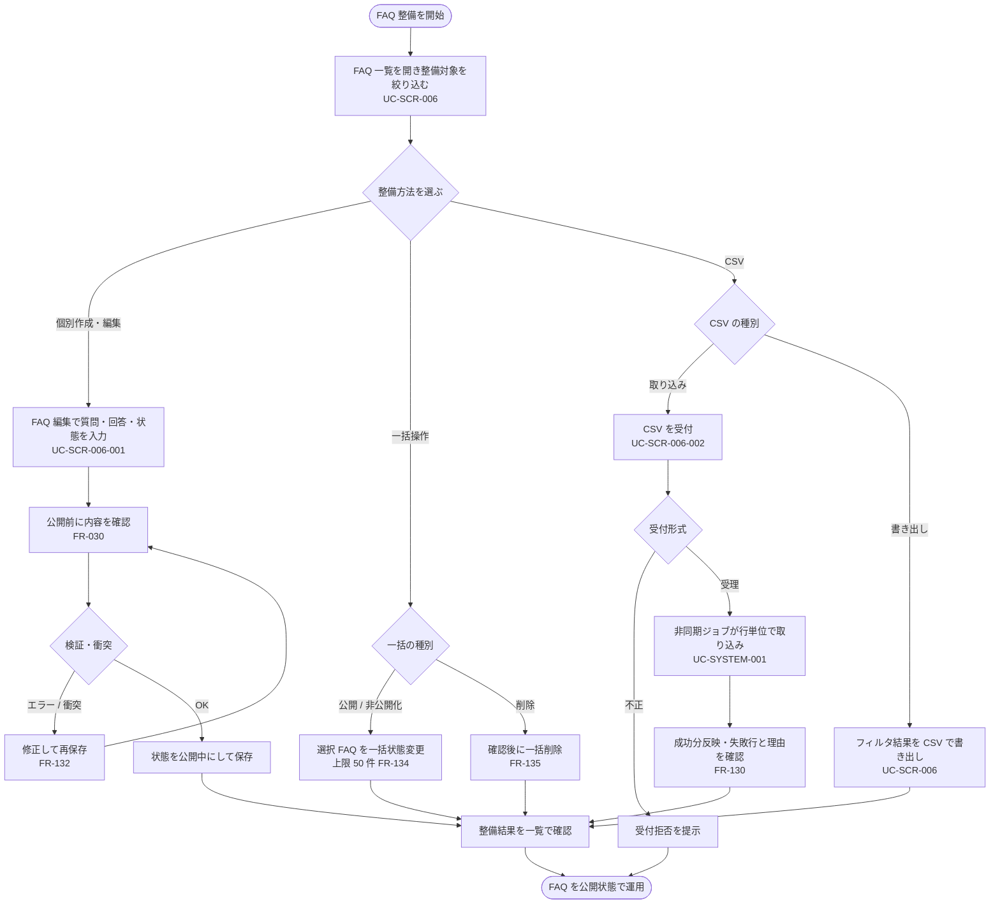

<!-- portal-top -->
[設計ポータル](../../README.md) ／ [基本設計](../index.md) ／ [ユースケース設計](index.md) ／ **UC-BIZ-008: FAQ を整備して公開する(作成・編集・一括・CSV)**
<!-- /portal-top -->

# UC-BIZ-008: FAQ を整備して公開する(作成・編集・一括・CSV)

> **このページは、プロジェクトメンバーが AI 回答の唯一の根拠となる FAQ を、登録・編集・一括操作・CSV 取り込み / 書き出しを通じて整備し、公開状態まで運用する業務を、業務粒度で定義します。**
>
> - 個別の FAQ 作成・編集と、公開前の内容確認
> - 一覧での一括公開 / 非公開化 / 削除と CSV の取り込み・書き出し
> - 大量 FAQ の初期投入・一括更新

*版数 v1.0 ・ 更新 2026-06-21 ・ アクター プロジェクトメンバー ・ ステータス ドラフト*

## 1. 概要

プロジェクトメンバーは、担当プロジェクトの FAQ を AI 回答の根拠として整備する。FAQ は個別の作成・編集に加え、一覧からの一括状態変更・削除、CSV による一括取り込み・書き出しで効率よく運用する。公開前にメンバーが内容を確認し、下書き / 公開中 / 非公開の状態で管理する。本ユースケースは「FAQ を整備して公開する」という業務目的を業務ステップで束ねるものであり、各画面イベント単位の詳細は詳細ユースケース([UC-SCR-006](UC-SCR-006.md) ほか)に委譲する。

| 項目 | 内容 |
|----|----|
| アクター | プロジェクトメンバー(当該プロジェクトの FAQ 管理権限を持つアカウント利用者) |
| 業務価値 | FAQ を継続的に整備・公開し、AI 回答の網羅性と正確性を高めて自己解決率を向上させる |
| 関連要件 | [FR-025](../../01_requirements/FR04.md#FR-025) FAQ の登録・編集・削除 ・ [FR-027](../../01_requirements/FR04.md#FR-027) 状態管理 ・ [FR-030](../../01_requirements/FR04.md#FR-030) 公開前の内容確認 ・ [FR-029](../../01_requirements/FR04.md#FR-029) 検索・並び替え・絞り込み ・ [FR-129](../../01_requirements/FR16.md#FR-129) FAQ 全文検索 ・ [FR-130](../../01_requirements/FR17.md#FR-130) CSV 一括取り込み ・ [FR-131](../../01_requirements/FR17.md#FR-131) CSV 書き出し ・ [FR-134](../../01_requirements/FR18.md#FR-134) 一括操作の上限 ・ [FR-135](../../01_requirements/FR18.md#FR-135) 影響度に応じた確認 |
| 関連詳細 UC | [UC-SCR-006](UC-SCR-006.md)(FAQ 一覧・一括操作・CSV エクスポート)・ [UC-SCR-006-001](UC-SCR-006-001.md)(FAQ 編集・公開)・ [UC-SCR-006-002](UC-SCR-006-002.md)(CSV インポートモーダル)・ [UC-SYSTEM-001](UC-SYSTEM-001.md#UC-SYSTEM-001)(非同期 CSV 取り込みジョブ) |

## 2. アクター

| アクター | 役割 |
|----|----|
| プロジェクトメンバー | 担当プロジェクトの FAQ を作成・編集し、一括操作・CSV 取り込み / 書き出しで整備して公開する |
| FAQ 編集者(オーナーを含むメンバー) | 公開前に質問・回答・状態を確認し、公開可否を判断する |

## 3. 事前条件

- プロジェクトメンバーがログイン済みで、当該プロジェクトへの割当(FAQ 管理権限)がある。
- 対象プロジェクトが選択されており、FAQ 一覧([SCR-006](../01_screen-design/SCR-006.md#SCR-006))へ到達できる。
- CSV 取り込みを行う場合、取り込み対象が CSV(UTF-8、ヘッダ行あり、1 ファイル最大 1000 件)である([FR-130](../../01_requirements/FR17.md#FR-130))。

## 4. トリガー

プロジェクトメンバーが FAQ を新規作成・編集する、または既存 FAQ を一括で公開 / 非公開化 / 削除する、あるいは CSV で一括取り込み・書き出しを行おうとしたとき。

## 5. 主成功シナリオ(業務ステップ)

1. メンバーが FAQ 一覧([SCR-006](../01_screen-design/SCR-006.md#SCR-006))を開き、キーワード・カテゴリ・並び順で整備対象の FAQ を絞り込む([UC-SCR-006](UC-SCR-006.md))。
2. 整備方法を選ぶ。
   1. 個別整備: 新規作成または FAQ 行から編集画面([SCR-006-001](../01_screen-design/SCR-006-001.md#SCR-006-001))を開き、質問・回答・カテゴリ・状態を入力する([UC-SCR-006-001](UC-SCR-006-001.md))。
   2. 一括整備: 一覧で対象を選択し、一括公開 / 非公開化 / 削除を実行する([UC-SCR-006](UC-SCR-006.md))。
   3. CSV 整備: テンプレートに沿った CSV を取り込み、または現在のフィルタ結果を CSV で書き出す([UC-SCR-006-002](UC-SCR-006-002.md) / [UC-SCR-006](UC-SCR-006.md))。
3. 個別整備では、メンバーが公開前に質問・回答・状態を確認し([FR-030](../../01_requirements/FR04.md#FR-030))、状態を「公開中」にして保存する。
4. CSV 取り込みでは、受付後に非同期ジョブが行単位で新規登録 / 上書き / 行失敗を判定し、結果を集計する([UC-SYSTEM-001](UC-SYSTEM-001.md#UC-SYSTEM-001))。
5. メンバーは整備結果(公開・更新・取り込み件数)を一覧で確認し、FAQ を公開状態として運用に乗せる。

## 6. 例外・代替フロー(業務レベル)

- **入力検証エラー(個別)**: 質問・回答が文字数上限を超える、または必須未入力のとき、保存できずエラーを提示する。メンバーは修正して再保存する([UC-SCR-006-001](UC-SCR-006-001.md))。
- **同時編集の衝突(個別)**: 他メンバーが同一 FAQ を更新済みのとき、衝突を検出して再読み込みを促し、上書きを防ぐ([FR-132](../../01_requirements/FR18.md#FR-132))。
- **一括操作の上限超過**: 1 操作あたり FAQ の一括状態変更が 50 件を超えるとき、上限超過として受け付けない([FR-134](../../01_requirements/FR18.md#FR-134))。
- **一括削除の確認**: 削除は復元できないため、確認を経てから実行する([FR-135](../../01_requirements/FR18.md#FR-135))。
- **CSV 受付形式不正**: CSV 以外 / UTF-8 不正 / ヘッダ欠落 / 件数上限超過のとき、受付前に拒否しジョブを起動しない([UC-SYSTEM-001](UC-SYSTEM-001.md#UC-SYSTEM-001))。
- **CSV 部分失敗**: 一部の行が失敗しても成功分は反映し、失敗行と理由をメンバーが確認できる([FR-130](../../01_requirements/FR17.md#FR-130))。
- **権限なし**: 当該プロジェクト未割当のメンバーが直アクセスした場合、操作不可を提示する。

## 7. 事後条件

- 整備した FAQ が、選択した状態(下書き / 公開中 / 非公開)で保存される。
- 「公開中」とした FAQ が AI 回答の根拠として参照可能になる。
- CSV 取り込みでは、成功した行が反映され、失敗した行は反映されず、件数と失敗理由が確認できる([UC-SYSTEM-001](UC-SYSTEM-001.md#UC-SYSTEM-001))。
- 一括操作・削除の結果が一覧に反映される。

## 8. 業務アクティビティ図

---

<!-- portal-bottom -->
[← ユースケース設計](index.md) ・ [基本設計](../index.md) ・ [↑ 設計ポータル](../../README.md)
<!-- /portal-bottom -->
