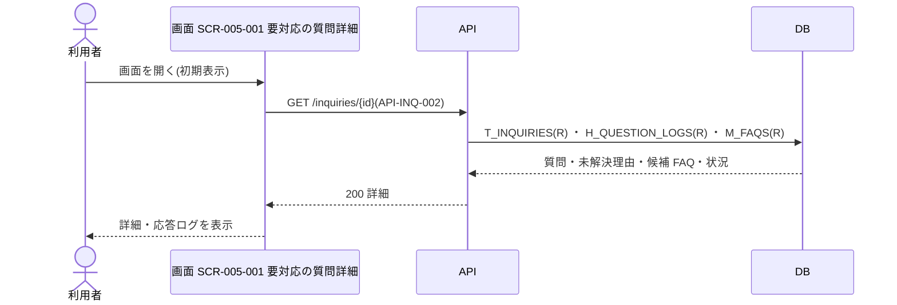
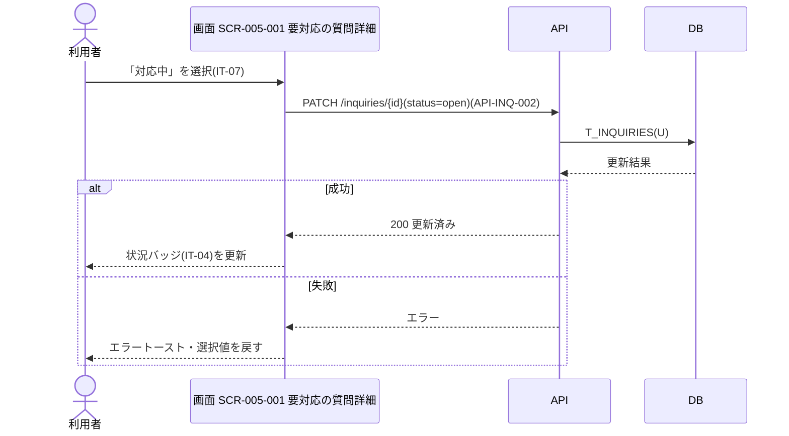
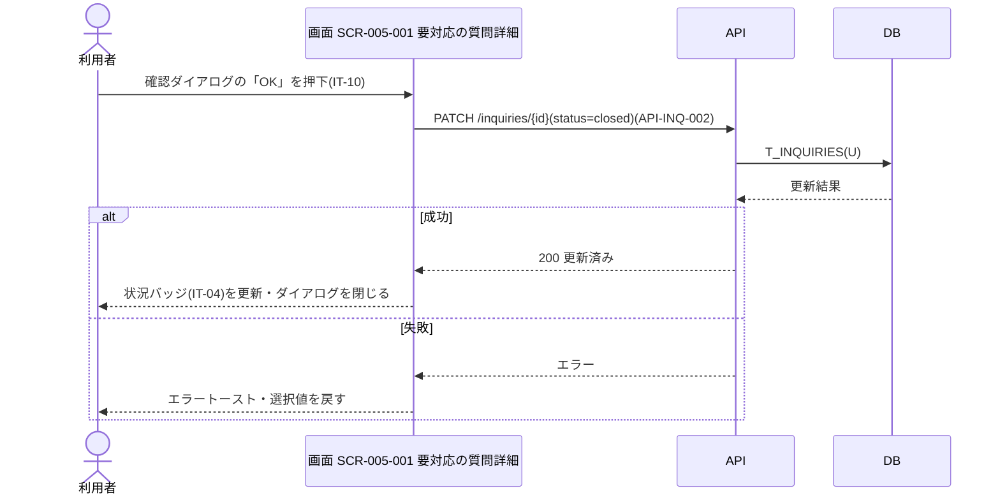

<!-- portal-top -->
[設計ポータル](../../README.md) ／ [基本設計](../index.md) ／ [ユースケース設計](index.md) ／ **UC-SCR-005-001: 要対応の質問詳細 ユースケース**
<!-- /portal-top -->

# UC-SCR-005-001: 要対応の質問詳細 ユースケース

> **このページは、画面 SCR-005-001(要対応の質問詳細)の画面イベント EV-01〜EV-08 に対応する 8 つのユースケースを「1 イベント = 1 ユースケース」で定義します。**

*版数 v1.0 ・ 更新 2026-06-21 ・ ユースケース 8 ・ ステータス ドラフト*

## 0. イベント↔ユースケース対応表

画面 [SCR-005-001](../01_screen-design/SCR-005-001.md#SCR-005-001) の §6 画面イベント一覧(EV-01〜EV-08)を、ユースケース ID へ 1:1 で対応づけます。種別は、サーバ API・DB へアクセスする「API/DB 連携」と、画面内のみで完結する「クライアント内処理のみ」に区別します。

| イベント ID | イベント名 | ユースケース ID | 種別 |
|----|----|----|----|
| `EV-01` | 初期表示 | [UC-SCR-005-001-EV01](#UC-SCR-005-001-EV01) | API/DB 連携 |
| `EV-02` | 「対応済み」を選択 | [UC-SCR-005-001-EV02](#UC-SCR-005-001-EV02) | クライアント内処理のみ |
| `EV-03` | 「対応中」を選択 | [UC-SCR-005-001-EV03](#UC-SCR-005-001-EV03) | API/DB 連携 |
| `EV-04` | 確認ダイアログの「OK」を押下 | [UC-SCR-005-001-EV04](#UC-SCR-005-001-EV04) | API/DB 連携 |
| `EV-05` | 確認ダイアログの「キャンセル」を押下 | [UC-SCR-005-001-EV05](#UC-SCR-005-001-EV05) | クライアント内処理のみ |
| `EV-06` | 登録先 FAQ リンクを押下 | [UC-SCR-005-001-EV06](#UC-SCR-005-001-EV06) | クライアント内処理のみ |
| `EV-07` | 候補 FAQ リンクを押下 | [UC-SCR-005-001-EV07](#UC-SCR-005-001-EV07) | クライアント内処理のみ |
| `EV-08` | 「FAQ 登録へ」を押下 | [UC-SCR-005-001-EV08](#UC-SCR-005-001-EV08) | クライアント内処理のみ |

## 1. ユースケース定義

### UC-SCR-005-001-EV01 初期表示

> 要対応の質問詳細画面を開いたとき、質問・未解決理由・候補 FAQ・対応状況を取得して表示します。

| 項目 | 内容 |
|----|----|
| 利用者 | オーナー / 当該プロジェクトのメンバー |
| 事前条件 | ログイン済みで、当該プロジェクトへの割当がある |
| トリガー | 一覧(SCR-005)から問い合わせ ID を選択して画面 SCR-005-001 を開く |
| 事後条件 | 質問本文・未解決理由・候補 FAQ・状況バッジ・応答ログを表示する |
| 関連 | [SCR-005-001](../01_screen-design/SCR-005-001.md#SCR-005-001) ・ [API-INQ-002](../02_api-design/API-inquiry.md#API-INQ-002) ・ [FR-045](../../01_requirements/FR06.md#FR-045) |

基本フロー

1. 利用者が要対応の質問詳細画面を開く。
2. 画面は対象の問い合わせ ID で未解決質問詳細・状況切替 API を呼び出す。
3. API は認証・認可を検証し、質問・未解決理由・候補 FAQ・状況を取得して返す。
4. 画面は質問本文(IT-02)・未解決理由(IT-03)・状況バッジ(IT-04)・登録先 FAQ(IT-05)・候補 FAQ(IT-06)・応答ログ(IT-12)を表示する。

異常系フロー

- 認可エラー(403): 当該プロジェクトへの割当がない場合、操作不可をグレーアウトとツールチップ(IT-09)で示す。
- 取得失敗: 詳細を表示せず、エラーメッセージを表示する。

### UC-SCR-005-001-EV02 「対応済み」を選択

> 状況プルダウンで「対応済み」を選択すると、保存前に確認ダイアログを表示します(クライアント内処理のみ)。

| 項目 | 内容 |
|----|----|
| 利用者 | オーナー / 当該プロジェクトのメンバー |
| 事前条件 | 詳細画面を表示している |
| トリガー | 状況(変更)(IT-07)で「対応済み」を選択する |
| 事後条件 | 確認ダイアログを表示する(実際の保存は EV-04 で実行) |
| 関連 | [SCR-005-001](../01_screen-design/SCR-005-001.md#SCR-005-001) ・ [FR-052](../../01_requirements/FR06.md#FR-052) |

基本フロー

1. 利用者が状況(変更)(IT-07)で「対応済み」を選択する。
2. 画面は保存前に確認ダイアログ(IT-10 / IT-11)を表示する。

異常系フロー

- なし(クライアント内処理のみ。保存は EV-04、取消は EV-05 で扱う)。

クライアント内処理のみのため、シーケンス図は省略します。

### UC-SCR-005-001-EV03 「対応中」を選択

> 状況プルダウンで「対応中」を選択すると、確認なしで即時保存し、状況バッジを更新します。

| 項目 | 内容 |
|----|----|
| 利用者 | オーナー / 当該プロジェクトのメンバー |
| 事前条件 | 詳細画面を表示している |
| トリガー | 状況(変更)(IT-07)で「対応中」を選択する |
| 事後条件 | 対応状況を `open`(対応中)に保存し、状況バッジ(IT-04)を更新する |
| 関連 | [SCR-005-001](../01_screen-design/SCR-005-001.md#SCR-005-001) ・ [API-INQ-002](../02_api-design/API-inquiry.md#API-INQ-002) ・ [FR-052](../../01_requirements/FR06.md#FR-052) |

基本フロー

1. 利用者が状況(変更)(IT-07)で「対応中」を選択する。
2. 画面は確認なしで未解決質問詳細・状況切替 API を呼び出し、対応状況を保存する。
3. API は状況を更新して結果を返す。
4. 画面は状況バッジ(IT-04)を更新する。

異常系フロー

- 保存失敗: エラートーストを表示し、選択値を変更前に戻す。

### UC-SCR-005-001-EV04 確認ダイアログの「OK」を押下

> 確認ダイアログで「OK」を押下すると、対応状況を「対応済み」で保存し、状況バッジを更新します。

| 項目 | 内容 |
|----|----|
| 利用者 | オーナー / 当該プロジェクトのメンバー |
| 事前条件 | EV-02 で「対応済み」を選択し、確認ダイアログを表示している |
| トリガー | 確認ダイアログの OK ボタン(IT-10)を押下する |
| 事後条件 | 対応状況を `closed`(対応済み)に保存し、状況バッジ(IT-04)を更新する |
| 関連 | [SCR-005-001](../01_screen-design/SCR-005-001.md#SCR-005-001) ・ [API-INQ-002](../02_api-design/API-inquiry.md#API-INQ-002) ・ [FR-052](../../01_requirements/FR06.md#FR-052) |

基本フロー

1. 利用者が確認ダイアログの OK ボタン(IT-10)を押下する。
2. 画面は未解決質問詳細・状況切替 API を呼び出し、対応状況を「対応済み」で保存する。
3. API は状況を更新して結果を返す。
4. 画面は状況バッジ(IT-04)を更新し、確認ダイアログを閉じる。

異常系フロー

- 保存失敗: エラートーストを表示し、選択値を変更前に戻す。

> [!NOTE]
> 状況は本詳細画面のプルダウン(変更時即時保存)のみで `open` ↔ `closed` を切り替えます。FAQ 下書き保存・FAQ 公開・個別チャット操作は `T_INQUIRIES.status` を変更しません([FR-052](../../01_requirements/FR06.md#FR-052))。

### UC-SCR-005-001-EV05 確認ダイアログの「キャンセル」を押下

> 確認ダイアログで「キャンセル」を押下すると、選択値を変更前に戻してダイアログを閉じます(クライアント内処理のみ)。

| 項目 | 内容 |
|----|----|
| 利用者 | オーナー / 当該プロジェクトのメンバー |
| 事前条件 | EV-02 で「対応済み」を選択し、確認ダイアログを表示している |
| トリガー | 確認ダイアログのキャンセルボタン(IT-11)を押下する |
| 事後条件 | 状況の選択値を変更前に戻し、確認ダイアログを閉じる(状態不変) |
| 関連 | [SCR-005-001](../01_screen-design/SCR-005-001.md#SCR-005-001) |

基本フロー

1. 利用者が確認ダイアログのキャンセルボタン(IT-11)を押下する。
2. 画面は状況(変更)(IT-07)の選択値を変更前に戻し、確認ダイアログを閉じる。

異常系フロー

- なし(クライアント内処理のみ)。

クライアント内処理のみのため、シーケンス図は省略します。

### UC-SCR-005-001-EV06 登録先 FAQ リンクを押下

> 登録先 FAQ リンクを押下し、当該質問から登録された FAQ の編集画面へ遷移します(クライアント内処理のみ)。

| 項目 | 内容 |
|----|----|
| 利用者 | オーナー / 当該プロジェクトのメンバー |
| 事前条件 | 登録先 FAQ が作成済みで、登録先 FAQ リンク(IT-05)が活性表示されている |
| トリガー | 登録先 FAQ リンク(IT-05)を押下する |
| 事後条件 | 登録先 FAQ の編集画面(SCR-006)へ遷移する |
| 関連 | [SCR-005-001](../01_screen-design/SCR-005-001.md#SCR-005-001) ・ [SCR-006](../01_screen-design/SCR-006.md#SCR-006) |

基本フロー

1. 利用者が登録先 FAQ リンク(IT-05)を押下する。
2. 画面は対象 FAQ を引き継ぎ、FAQ 編集画面(SCR-006)へ遷移する。

異常系フロー

- 登録先 FAQ が未作成の場合は IT-05 が非活性のため、本イベントは発生しない。

クライアント内処理のみ(画面遷移)のため、シーケンス図は省略します。

### UC-SCR-005-001-EV07 候補 FAQ リンクを押下

> 候補 FAQ リンクを押下し、選択した候補 FAQ の編集画面へ遷移します(クライアント内処理のみ)。

| 項目 | 内容 |
|----|----|
| 利用者 | オーナー / 当該プロジェクトのメンバー |
| 事前条件 | 候補 FAQ(IT-06)が右ペインに表示されている |
| トリガー | 候補 FAQ リンク(IT-06)を押下する |
| 事後条件 | 選択した候補 FAQ の編集画面(SCR-006)へ遷移する |
| 関連 | [SCR-005-001](../01_screen-design/SCR-005-001.md#SCR-005-001) ・ [SCR-006](../01_screen-design/SCR-006.md#SCR-006) |

基本フロー

1. 利用者が候補 FAQ リンク(IT-06)を押下する。
2. 画面は選択した候補 FAQ を引き継ぎ、FAQ 編集画面(SCR-006)へ遷移する。

異常系フロー

- なし(画面遷移のみ)。

クライアント内処理のみ(画面遷移)のため、シーケンス図は省略します。

### UC-SCR-005-001-EV08 「FAQ 登録へ」を押下

> 「FAQ 登録へ」を押下し、当該質問を起点に FAQ 編集画面を開きます(クライアント内処理のみ)。

| 項目 | 内容 |
|----|----|
| 利用者 | オーナー / 当該プロジェクトのメンバー(オーナーを含む。割当のあるメンバーのみ表示・操作可) |
| 事前条件 | 「FAQ 登録へ」ボタン(IT-08)が表示されている |
| トリガー | 「FAQ 登録へ」ボタン(IT-08)を押下する |
| 事後条件 | 当該質問を起点に FAQ 編集画面(SCR-006-001)を未解決質問起点モードで開く |
| 関連 | [SCR-005-001](../01_screen-design/SCR-005-001.md#SCR-005-001) ・ [SCR-006-001](../01_screen-design/SCR-006-001.md#SCR-006-001) |

基本フロー

1. 利用者が「FAQ 登録へ」ボタン(IT-08)を押下する。
2. 画面は当該質問を引き継ぎ、FAQ 編集画面(SCR-006-001)を未解決質問起点モードで開く。

異常系フロー

- 割当外メンバーの直アクセス時は IT-08 が非表示のため、本イベントは発生しない。

クライアント内処理のみ(画面遷移)のため、シーケンス図は省略します。

> [!NOTE]
> 遷移先 SCR-006-001 では未解決質問の質問文を質問欄へ初期反映(プリフィル)します。FAQ 編集の詳細は [UC-SCR-006-001-EV01](UC-SCR-006-001.md#UC-SCR-006-001-EV01) を参照してください。

---

<!-- portal-bottom -->
[← ユースケース設計](index.md) ・ [基本設計](../index.md) ・ [↑ 設計ポータル](../../README.md)
<!-- /portal-bottom -->
