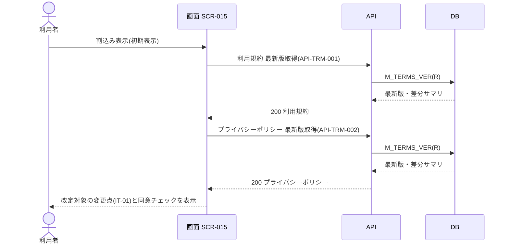
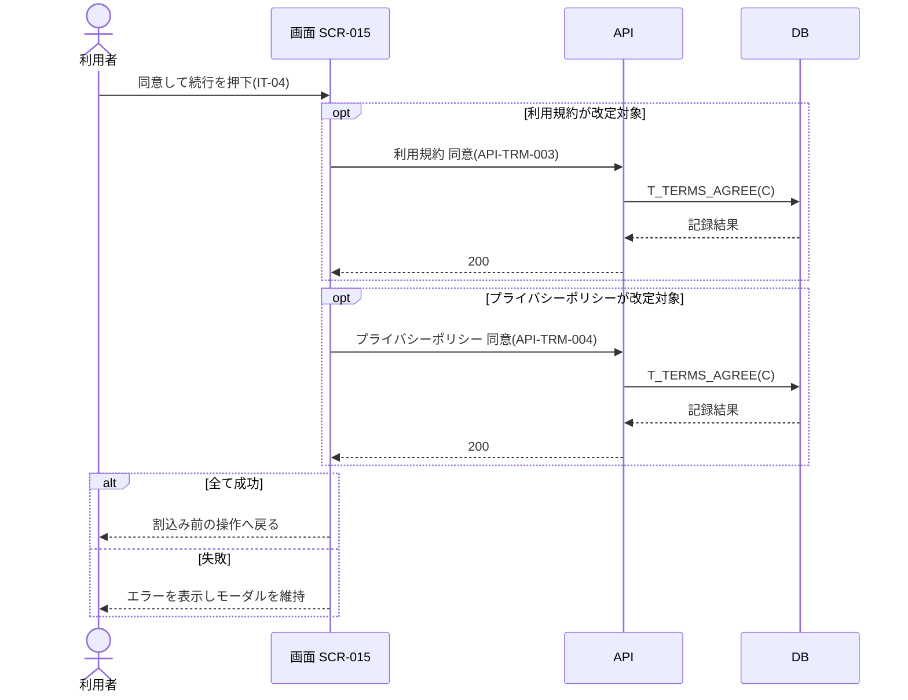

<!-- portal-top -->
[設計ポータル](../../README.md) ／ [基本設計](../index.md) ／ [ユースケース設計](index.md) ／ **UC-SCR-015: 規約再同意割込み ユースケース**
<!-- /portal-top -->

# UC-SCR-015: 規約再同意割込み ユースケース

> **このページは、画面 SCR-015(規約再同意割込み)の画面イベント EV-01〜EV-06 に対応する 6 のユースケースを「1 イベント = 1 ユースケース」で定義します。**

*版数 v1.0 ・ 更新 2026-06-21 ・ ユースケース 6 ・ ステータス ドラフト*

## 0. イベント↔ユースケース対応表

画面 [SCR-015](../01_screen-design/SCR-015.md#SCR-015) §6 の各イベントを、1 対 1 でユースケースへ対応づけます。種別は、サーバ API・DB へアクセスする「API/DB 連携」と、画面内で完結する「クライアント内処理のみ」を区別します。

| イベント ID | イベント名 | ユースケース ID | 種別 |
|----|----|----|----|
| `EV-01` | 初期表示 | [UC-SCR-015-EV01](#UC-SCR-015-EV01) | API/DB 連携 |
| `EV-02` | 「利用規約」リンクを押下 | [UC-SCR-015-EV02](#UC-SCR-015-EV02) | クライアント内処理のみ |
| `EV-03` | 「プライバシーポリシー」リンクを押下 | [UC-SCR-015-EV03](#UC-SCR-015-EV03) | クライアント内処理のみ |
| `EV-04` | 利用規約同意をチェック | [UC-SCR-015-EV04](#UC-SCR-015-EV04) | クライアント内処理のみ |
| `EV-05` | プライバシーポリシー同意をチェック | [UC-SCR-015-EV05](#UC-SCR-015-EV05) | クライアント内処理のみ |
| `EV-06` | 「同意して続行する」を押下 | [UC-SCR-015-EV06](#UC-SCR-015-EV06) | API/DB 連携 |

## 1. ユースケース定義

### UC-SCR-015-EV01 初期表示

> **概要** 利用規約・プライバシーポリシーの最新版取得 API で改定文書の差分サマリを取得し、改定対象のみの変更点と同意チェックを全画面モーダルで表示するユースケース。

| 項目 | 内容 |
|---|---|
| 利用者 | オーナー / メンバー(未同意の改定がある場合) |
| 事前条件 | ログイン後の操作中に、未同意の規約改定がある状態で割込み表示された |
| トリガー | EV-01: 初期表示 |
| 事後条件 | 改定対象文書(利用規約 / プライバシーポリシー、または両方)の主な変更点(IT-01)を全画面モーダルで表示し、改定対象外の文書の同意チェックは非表示にする |
| 関連 | [SCR-015](../01_screen-design/SCR-015.md#SCR-015) ・ [API-TRM-001](../02_api-design/API-terms.md#API-TRM-001) ・ [API-TRM-002](../02_api-design/API-terms.md#API-TRM-002) ・ [FR-010](../../01_requirements/FR01.md#FR-010) ・ [FR-101](../../01_requirements/FR13.md#FR-101) |

**基本フロー**
1. 画面が利用規約 最新版取得 API([API-TRM-001](../02_api-design/API-terms.md#API-TRM-001))とプライバシーポリシー 最新版取得 API([API-TRM-002](../02_api-design/API-terms.md#API-TRM-002))を呼び出す。
2. 各 API は規約バージョン(`M_TERMS_VER`)から最新版と差分サマリを取得して返す。
3. 画面は改定対象の文書(利用規約 / プライバシーポリシー、または両方)の主な変更点(IT-01)を全画面モーダルで表示する。
4. 画面は改定対象外の文書のチェックボックスを非表示にする。

**異常系フロー**
- 取得失敗: 変更点を表示せず、エラーを表示する(モーダルは維持する)。

### UC-SCR-015-EV02 「利用規約」リンクを押下

> **概要** 利用規約閲覧画面を別タブで開く、クライアント内処理のみのユースケース。

| 項目 | 内容 |
|---|---|
| 利用者 | オーナー / メンバー |
| 事前条件 | 規約再同意モーダルが表示されている |
| トリガー | EV-02: 利用規約リンクを押下 |
| 事後条件 | SCR-010 利用規約閲覧を別タブで開く |
| 関連 | [SCR-015](../01_screen-design/SCR-015.md#SCR-015) ・ SCR-010 利用規約閲覧 |

クライアント内処理のみ(バックエンド連携なし)。

**基本フロー**
1. 利用者が利用規約リンクを押下する。
2. 画面は SCR-010 利用規約閲覧を別タブで開く。

**異常系フロー**
- なし(別タブ表示のみ)。

### UC-SCR-015-EV03 「プライバシーポリシー」リンクを押下

> **概要** プライバシーポリシー閲覧画面を別タブで開く、クライアント内処理のみのユースケース。

| 項目 | 内容 |
|---|---|
| 利用者 | オーナー / メンバー |
| 事前条件 | 規約再同意モーダルが表示されている |
| トリガー | EV-03: プライバシーポリシーリンクを押下 |
| 事後条件 | SCR-020 プライバシーポリシー閲覧を別タブで開く |
| 関連 | [SCR-015](../01_screen-design/SCR-015.md#SCR-015) ・ SCR-020 プライバシーポリシー閲覧 |

クライアント内処理のみ(バックエンド連携なし)。

**基本フロー**
1. 利用者がプライバシーポリシーリンクを押下する。
2. 画面は SCR-020 プライバシーポリシー閲覧を別タブで開く。

**異常系フロー**
- なし(別タブ表示のみ)。

### UC-SCR-015-EV04 利用規約同意をチェック

> **概要** 利用規約同意チェックの状態を切り替え、両チェック充足に応じて続行ボタンの活性を更新する、クライアント内処理のみのユースケース。

| 項目 | 内容 |
|---|---|
| 利用者 | オーナー / メンバー |
| 事前条件 | 利用規約が改定対象で同意チェック(IT-02)が表示されている |
| トリガー | EV-04: 利用規約同意(IT-02)をチェック |
| 事後条件 | チェック状態を切り替え、両チェックの充足状態に応じて「同意して続行する」(IT-04)の活性 / 非活性を更新する |
| 関連 | [SCR-015](../01_screen-design/SCR-015.md#SCR-015) ・ [FR-010](../../01_requirements/FR01.md#FR-010) |

クライアント内処理のみ(バックエンド連携なし)。同意記録の永続化は EV-06 の同意 API で行います。

**基本フロー**
1. 利用者が利用規約同意(IT-02)をチェック / アンチェックする。
2. 画面は両チェックの充足状態を判定し、IT-04 の活性 / 非活性を更新する。

**異常系フロー**
- なし(画面内の状態更新のみ)。

### UC-SCR-015-EV05 プライバシーポリシー同意をチェック

> **概要** プライバシーポリシー同意チェックの状態を切り替え、両チェック充足に応じて続行ボタンの活性を更新する、クライアント内処理のみのユースケース。

| 項目 | 内容 |
|---|---|
| 利用者 | オーナー / メンバー |
| 事前条件 | プライバシーポリシーが改定対象で同意チェック(IT-03)が表示されている |
| トリガー | EV-05: プライバシーポリシー同意(IT-03)をチェック |
| 事後条件 | チェック状態を切り替え、両チェックの充足状態に応じて「同意して続行する」(IT-04)の活性 / 非活性を更新する |
| 関連 | [SCR-015](../01_screen-design/SCR-015.md#SCR-015) ・ [FR-010](../../01_requirements/FR01.md#FR-010) |

クライアント内処理のみ(バックエンド連携なし)。同意記録の永続化は EV-06 の同意 API で行います。

**基本フロー**
1. 利用者がプライバシーポリシー同意(IT-03)をチェック / アンチェックする。
2. 画面は両チェックの充足状態を判定し、IT-04 の活性 / 非活性を更新する。

**異常系フロー**
- なし(画面内の状態更新のみ)。

### UC-SCR-015-EV06 「同意して続行する」を押下

> **概要** 改定対象の文書のみを対象に同意 API を呼び出して同意を記録し、割込み前の操作へ戻る最重要ユースケース。

| 項目 | 内容 |
|---|---|
| 利用者 | オーナー / メンバー |
| 事前条件 | 改定対象の同意チェックが充足し、「同意して続行する」(IT-04)が活性化している |
| トリガー | EV-06: 同意して続行する(IT-04)を押下 |
| 事後条件 | 改定対象文書の同意を `T_TERMS_AGREE` に記録し、完了後は割込み前の操作へ戻る。失敗時はモーダルを維持しエラーを表示する |
| 関連 | [SCR-015](../01_screen-design/SCR-015.md#SCR-015) ・ [API-TRM-003](../02_api-design/API-terms.md#API-TRM-003) ・ [API-TRM-004](../02_api-design/API-terms.md#API-TRM-004) ・ [FR-010](../../01_requirements/FR01.md#FR-010) ・ [FR-099](../../01_requirements/FR13.md#FR-099) |

**基本フロー**
1. 利用者が「同意して続行する」(IT-04)を押下する。
2. 画面は改定対象の文書のみを対象に同意 API を呼び出す。利用規約が改定対象の場合は利用規約 同意 API([API-TRM-003](../02_api-design/API-terms.md#API-TRM-003))を、プライバシーポリシーが改定対象の場合はプライバシーポリシー 同意 API([API-TRM-004](../02_api-design/API-terms.md#API-TRM-004))を呼び出す。両文書が改定対象の場合は両 API を呼び出す。
3. 各 API は `doc_type` 別に同意(`T_TERMS_AGREE`)を記録する。
4. 完了後、画面は割込み前の操作へ戻る。

**異常系フロー**
- 同意失敗: エラーメッセージを表示し、モーダルはそのまま維持する。

---

<!-- portal-bottom -->
[← ユースケース設計](index.md) ・ [基本設計](../index.md) ・ [↑ 設計ポータル](../../README.md)
<!-- /portal-bottom -->
