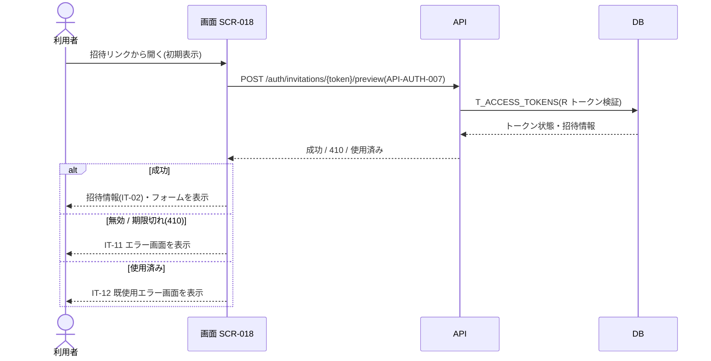
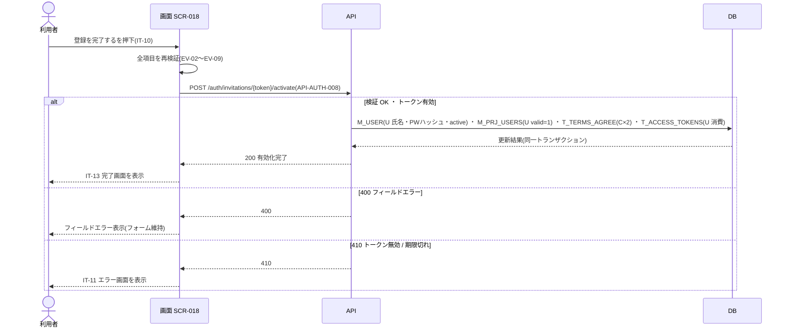

<!-- portal-top -->
[設計ポータル](../../README.md) ／ [基本設計](../index.md) ／ [ユースケース設計](index.md) ／ **UC-SCR-018: メンバーアカウント有効化 ユースケース**
<!-- /portal-top -->

# UC-SCR-018: メンバーアカウント有効化 ユースケース

> **このページは、画面 SCR-018(メンバーアカウント有効化)の画面イベント EV-01〜EV-13 に対応する 13 のユースケースを「1 イベント = 1 ユースケース」で定義します。**

*版数 v1.0 ・ 更新 2026-06-21 ・ ユースケース 13 ・ ステータス ドラフト*

## 0. イベント↔ユースケース対応表

画面 [SCR-018](../01_screen-design/SCR-018.md#SCR-018) §6 の各イベントを、1 対 1 でユースケースへ対応づけます。種別は、サーバ API・DB へアクセスする「API/DB 連携」と、画面内で完結する「クライアント内処理のみ」を区別します。

| イベント ID | イベント名 | ユースケース ID | 種別 |
|----|----|----|----|
| `EV-01` | 初期表示 | [UC-SCR-018-EV01](#UC-SCR-018-EV01) | API/DB 連携 |
| `EV-02` | 氏名(表示名)を入力 | [UC-SCR-018-EV02](#UC-SCR-018-EV02) | クライアント内処理のみ |
| `EV-03` | 初回パスワードを入力 | [UC-SCR-018-EV03](#UC-SCR-018-EV03) | クライアント内処理のみ |
| `EV-04` | パスワード(確認)を入力 | [UC-SCR-018-EV04](#UC-SCR-018-EV04) | クライアント内処理のみ |
| `EV-05` | 「利用規約に同意します」をチェック | [UC-SCR-018-EV05](#UC-SCR-018-EV05) | クライアント内処理のみ |
| `EV-06` | 利用規約の「全文を見る」を押下 | [UC-SCR-018-EV06](#UC-SCR-018-EV06) | クライアント内処理のみ |
| `EV-07` | 「プライバシーポリシーに同意します」をチェック | [UC-SCR-018-EV07](#UC-SCR-018-EV07) | クライアント内処理のみ |
| `EV-08` | プライバシーポリシーの「全文を見る」を押下 | [UC-SCR-018-EV08](#UC-SCR-018-EV08) | クライアント内処理のみ |
| `EV-09` | Turnstile を実行 | [UC-SCR-018-EV09](#UC-SCR-018-EV09) | クライアント内処理のみ |
| `EV-10` | 「登録を完了する」を押下 | [UC-SCR-018-EV10](#UC-SCR-018-EV10) | API/DB 連携 |
| `EV-11` | 「ログインする」を押下(完了画面) | [UC-SCR-018-EV11](#UC-SCR-018-EV11) | クライアント内処理のみ |
| `EV-12` | 「ログインへ」を押下(トークン無効 / 期限切れエラー画面) | [UC-SCR-018-EV12](#UC-SCR-018-EV12) | クライアント内処理のみ |
| `EV-13` | 「ログインへ」を押下(既使用エラー画面) | [UC-SCR-018-EV13](#UC-SCR-018-EV13) | クライアント内処理のみ |

## 1. ユースケース定義

### UC-SCR-018-EV01 初期表示

> **概要** 招待トークン検証・プレビュー API を実行し、成功時は招待情報と入力フォーム、無効 / 期限切れ・使用済み時は各エラー画面を表示するユースケース。

| 項目 | 内容 |
|---|---|
| 利用者 | 招待メンバー(トークン) |
| 事前条件 | 招待メール内リンク(`purpose='activation'` の有効トークン付き URL)からアクセスした |
| トリガー | EV-01: 初期表示 |
| 事後条件 | 成功時は招待情報パネル(IT-02)・メールアドレス(IT-03)・入力フォームを表示する。無効 / 期限切れ(410)は IT-11、使用済みは IT-12 を表示する |
| 関連 | [SCR-018](../01_screen-design/SCR-018.md#SCR-018) ・ [API-AUTH-007](../02_api-design/API-auth.md#API-AUTH-007) ・ [FR-013](../../01_requirements/FR02.md#FR-013) |

**基本フロー**
1. 画面が招待トークン検証・プレビュー API(`POST /auth/invitations/{token}/preview` = [API-AUTH-007](../02_api-design/API-auth.md#API-AUTH-007))を実行する。
2. API は招待トークン(`T_ACCESS_TOKENS`)を検証し、招待情報(プロジェクト名 / 招待元)を返す。
3. 成功時、画面は招待情報パネル(IT-02)・メールアドレス(IT-03)・入力フォームを表示する。

**異常系フロー**
- トークン無効 / 期限切れ(HTTP 410): IT-11 トークン無効 / 期限切れエラー画面を表示する(有効期限 7 日)。
- トークン使用済み: IT-12 既使用エラー画面を表示する。

### UC-SCR-018-EV02 氏名(表示名)を入力

> **概要** 氏名の必須・文字数・前後空白トリムをリアルタイム検証する、クライアント内処理のみのユースケース。

| 項目 | 内容 |
|---|---|
| 利用者 | 招待メンバー(トークン) |
| 事前条件 | 入力フォームが表示されている |
| トリガー | EV-02: 氏名(IT-04)を入力 |
| 事後条件 | 必須・1〜100 文字・前後空白トリムを検証し、不正ならエラーを表示する |
| 関連 | [SCR-018](../01_screen-design/SCR-018.md#SCR-018) ・ [FR-013d](../../01_requirements/FR02.md#FR-013d) |

クライアント内処理のみ(バックエンド連携なし)。氏名は招待された本人のみが入力します(FR-013d 個人情報原則)。

**基本フロー**
1. 利用者が氏名(IT-04)を入力する。
2. 画面は必須・1〜100 文字・前後空白トリムをリアルタイム検証する。

**異常系フロー**
- 未入力・文字数超過の場合はエラーメッセージを表示する。

### UC-SCR-018-EV03 初回パスワードを入力

> **概要** 初回パスワードの強度(FR-006)をリアルタイム検証し強度メーターを更新する、クライアント内処理のみのユースケース。

| 項目 | 内容 |
|---|---|
| 利用者 | 招待メンバー(トークン) |
| 事前条件 | 入力フォームが表示されている |
| トリガー | EV-03: 初回パスワード(IT-05)を入力 |
| 事後条件 | FR-006 強度要件を検証して強度メーターを更新し、要件未達の場合はエラーを表示する |
| 関連 | [SCR-018](../01_screen-design/SCR-018.md#SCR-018) ・ [FR-006](../../01_requirements/FR01.md#FR-006) |

クライアント内処理のみ(バックエンド連携なし)。

**基本フロー**
1. 利用者が初回パスワード(IT-05)を入力する。
2. 画面は FR-006 強度要件(12 文字以上・3 種類以上)を検証し、パスワード強度メーターを更新する。

**異常系フロー**
- 要件未達の場合はエラーを表示する。

### UC-SCR-018-EV04 パスワード(確認)を入力

> **概要** パスワード(確認)と初回パスワードの一致をリアルタイム検証する、クライアント内処理のみのユースケース。

| 項目 | 内容 |
|---|---|
| 利用者 | 招待メンバー(トークン) |
| 事前条件 | 入力フォームが表示されている |
| トリガー | EV-04: パスワード(確認)(IT-06)を入力 |
| 事後条件 | 初回パスワード(IT-05)との一致を検証し、不一致ならエラーを表示する |
| 関連 | [SCR-018](../01_screen-design/SCR-018.md#SCR-018) ・ [FR-006](../../01_requirements/FR01.md#FR-006) |

クライアント内処理のみ(バックエンド連携なし)。

**基本フロー**
1. 利用者がパスワード(確認)(IT-06)を入力する。
2. 画面は初回パスワード(IT-05)との一致をリアルタイム検証する。

**異常系フロー**
- 不一致の場合はエラーを表示する。

### UC-SCR-018-EV05 「利用規約に同意します」をチェック

> **概要** 利用規約同意チェックの状態を保持し、未チェックでの有効化を拒否対象とする、クライアント内処理のみのユースケース。

| 項目 | 内容 |
|---|---|
| 利用者 | 招待メンバー(トークン) |
| 事前条件 | 入力フォームが表示されている |
| トリガー | EV-05: 利用規約同意(IT-07)をチェック |
| 事後条件 | チェック状態を保持する。未チェックのまま有効化を試みた場合は必須エラーを表示する |
| 関連 | [SCR-018](../01_screen-design/SCR-018.md#SCR-018) ・ [FR-099](../../01_requirements/FR13.md#FR-099) |

クライアント内処理のみ(バックエンド連携なし)。同意記録の永続化は EV-10 の有効化 API で行います。

**基本フロー**
1. 利用者が利用規約同意(IT-07)をチェック / アンチェックする。
2. 画面はチェック状態を保持する。

**異常系フロー**
- 未チェックのまま有効化(IT-10)を試みた場合は必須エラーを表示する。

### UC-SCR-018-EV06 利用規約の「全文を見る」を押下

> **概要** 利用規約閲覧画面へ遷移する、クライアント内処理のみのユースケース。

| 項目 | 内容 |
|---|---|
| 利用者 | 招待メンバー(トークン) |
| 事前条件 | 入力フォームが表示されている |
| トリガー | EV-06: 利用規約の「全文を見る」を押下 |
| 事後条件 | SCR-010 利用規約閲覧へ遷移する(別タブまたは別画面) |
| 関連 | [SCR-018](../01_screen-design/SCR-018.md#SCR-018) ・ SCR-010 利用規約閲覧 |

クライアント内処理のみ(バックエンド連携なし)。

**基本フロー**
1. 利用者が利用規約の「全文を見る」を押下する。
2. 画面は SCR-010 利用規約閲覧へ遷移する(別タブまたは別画面)。

**異常系フロー**
- なし(画面遷移のみ)。

### UC-SCR-018-EV07 「プライバシーポリシーに同意します」をチェック

> **概要** プライバシーポリシー同意チェックの状態を保持し、未チェックでの有効化を拒否対象とする、クライアント内処理のみのユースケース。

| 項目 | 内容 |
|---|---|
| 利用者 | 招待メンバー(トークン) |
| 事前条件 | 入力フォームが表示されている |
| トリガー | EV-07: プライバシーポリシー同意(IT-08)をチェック |
| 事後条件 | チェック状態を保持する。未チェックのまま有効化を試みた場合は必須エラーを表示する |
| 関連 | [SCR-018](../01_screen-design/SCR-018.md#SCR-018) ・ [FR-099](../../01_requirements/FR13.md#FR-099) |

クライアント内処理のみ(バックエンド連携なし)。同意記録の永続化は EV-10 の有効化 API で行います。

**基本フロー**
1. 利用者がプライバシーポリシー同意(IT-08)をチェック / アンチェックする。
2. 画面はチェック状態を保持する。

**異常系フロー**
- 未チェックのまま有効化(IT-10)を試みた場合は必須エラーを表示する。

### UC-SCR-018-EV08 プライバシーポリシーの「全文を見る」を押下

> **概要** プライバシーポリシー閲覧画面へ遷移する、クライアント内処理のみのユースケース。

| 項目 | 内容 |
|---|---|
| 利用者 | 招待メンバー(トークン) |
| 事前条件 | 入力フォームが表示されている |
| トリガー | EV-08: プライバシーポリシーの「全文を見る」を押下 |
| 事後条件 | SCR-020 プライバシーポリシー閲覧へ遷移する(別タブまたは別画面) |
| 関連 | [SCR-018](../01_screen-design/SCR-018.md#SCR-018) ・ SCR-020 プライバシーポリシー閲覧 |

クライアント内処理のみ(バックエンド連携なし)。

**基本フロー**
1. 利用者がプライバシーポリシーの「全文を見る」を押下する。
2. 画面は SCR-020 プライバシーポリシー閲覧へ遷移する(別タブまたは別画面)。

**異常系フロー**
- なし(画面遷移のみ)。

### UC-SCR-018-EV09 Turnstile を実行

> **概要** Turnstile の CAPTCHA トークンを取得し、失敗時は登録ボタンを無効化する、クライアント内処理のみのユースケース。

| 項目 | 内容 |
|---|---|
| 利用者 | 招待メンバー(トークン) |
| 事前条件 | Turnstile ウィジェット(IT-09)が表示されている |
| トリガー | EV-09: Turnstile を実行 |
| 事後条件 | CAPTCHA トークンを取得する。検証失敗時はエラーを表示し「登録を完了する」(IT-10)を無効化する |
| 関連 | [SCR-018](../01_screen-design/SCR-018.md#SCR-018) ・ [FR-111](../../01_requirements/FR14.md#FR-111) |

クライアント内処理のみ(バックエンド連携なし)。トークンの最終的な妥当性確認は EV-10 の有効化 API で行います。

**基本フロー**
1. Turnstile ウィジェット(IT-09)が検証を行う。
2. 成功時、画面は CAPTCHA トークンを取得・保持する。

**異常系フロー**
- 検証失敗時: エラーを表示し「登録を完了する」(IT-10)を無効化する。

### UC-SCR-018-EV10 「登録を完了する」を押下

> **概要** 全項目を再検証してメンバーアカウント有効化 API を実行し、予約利用者への氏名・パスワード設定、割当有効化、規約同意記録、トークン消費を同一トランザクションで行い完了画面を表示する最重要ユースケース。

| 項目 | 内容 |
|---|---|
| 利用者 | 招待メンバー(トークン) |
| 事前条件 | 氏名・初回パスワード・確認・規約同意・Turnstile が入力・取得されている |
| トリガー | EV-10: 登録を完了する(IT-10)を押下 |
| 事後条件 | 成功時は予約 `M_USER` への氏名・パスワードハッシュ設定・`status='active'` 化、`M_PRJ_USERS.valid=1` 化、`T_TERMS_AGREE` 2 件登録、トークン消費を同一トランザクションで行い、IT-13 完了画面を表示する。失敗時は内容を確定しない |
| 関連 | [SCR-018](../01_screen-design/SCR-018.md#SCR-018) ・ [API-AUTH-008](../02_api-design/API-auth.md#API-AUTH-008) ・ [FR-013](../../01_requirements/FR02.md#FR-013) ・ [FR-099](../../01_requirements/FR13.md#FR-099) |

**基本フロー**
1. 全項目のクライアント側バリデーション(EV-02〜EV-09 の各検証)を実行し、エラーがある場合は送信せずエラーを表示する。
2. バリデーション通過後、メンバーアカウント有効化 API(`POST /auth/invitations/{token}/activate` = [API-AUTH-008](../02_api-design/API-auth.md#API-AUTH-008))を実行する。
3. API は同一トランザクションで、予約 `M_USER` への氏名・パスワードハッシュ設定と `status='active'` 化、`M_PRJ_USERS.valid=1` 化、`T_TERMS_AGREE` 2 件登録(利用規約・プライバシーポリシー)、招待トークン(`T_ACCESS_TOKENS`)の消費を行う。
4. 成功時、画面は IT-13 完了画面を表示する。

**異常系フロー**
- HTTP 400(フィールドエラー): フィールド単位のエラーメッセージを表示し、入力フォームを操作可能なまま維持する。
- HTTP 410(トークン期限切れ / 無効): IT-11 トークン無効 / 期限切れエラー画面を表示する。
- 入力再検証エラー: 送信を中止し、該当フィールドにエラーを表示する。

> [!NOTE]
> 有効化処理は API 側の同一トランザクションで複数テーブルを更新します。図は各更新を 1 段にまとめて抽象化し、トランザクション内の順序やロールバック実装は展開しません。

### UC-SCR-018-EV11 「ログインする」を押下(完了画面)

> **概要** 完了画面からログイン画面へ遷移する、クライアント内処理のみのユースケース。

| 項目 | 内容 |
|---|---|
| 利用者 | 招待メンバー(有効化完了後) |
| 事前条件 | IT-13 完了画面が表示されている |
| トリガー | EV-11: ログインする(IT-13)を押下 |
| 事後条件 | SCR-001 ログインへ遷移する |
| 関連 | [SCR-018](../01_screen-design/SCR-018.md#SCR-018) ・ [SCR-001](../01_screen-design/SCR-001.md#SCR-001) |

クライアント内処理のみ(バックエンド連携なし)。

**基本フロー**
1. 利用者が完了画面の「ログインする」CTA(IT-13)を押下する。
2. 画面は SCR-001 ログインへ遷移する。

**異常系フロー**
- なし(画面遷移のみ)。

### UC-SCR-018-EV12 「ログインへ」を押下(トークン無効 / 期限切れエラー画面)

> **概要** トークン無効 / 期限切れエラー画面からログイン画面へ遷移する、クライアント内処理のみのユースケース。

| 項目 | 内容 |
|---|---|
| 利用者 | 招待メンバー(トークンエラー) |
| 事前条件 | IT-11 トークン無効 / 期限切れエラー画面が表示されている |
| トリガー | EV-12: ログインへ(IT-14)を押下 |
| 事後条件 | SCR-001 ログインへ遷移する |
| 関連 | [SCR-018](../01_screen-design/SCR-018.md#SCR-018) ・ [SCR-001](../01_screen-design/SCR-001.md#SCR-001) |

クライアント内処理のみ(バックエンド連携なし)。

**基本フロー**
1. 利用者が IT-11 エラー画面の復旧リンク(IT-14)を押下する。
2. 画面は SCR-001 ログインへ遷移する。

**異常系フロー**
- なし(画面遷移のみ)。

### UC-SCR-018-EV13 「ログインへ」を押下(既使用エラー画面)

> **概要** 既使用エラー画面からログイン画面へ遷移する、クライアント内処理のみのユースケース。

| 項目 | 内容 |
|---|---|
| 利用者 | 招待メンバー(トークン既使用) |
| 事前条件 | IT-12 既使用エラー画面が表示されている |
| トリガー | EV-13: ログインへ(IT-15)を押下 |
| 事後条件 | SCR-001 ログインへ遷移する |
| 関連 | [SCR-018](../01_screen-design/SCR-018.md#SCR-018) ・ [SCR-001](../01_screen-design/SCR-001.md#SCR-001) |

クライアント内処理のみ(バックエンド連携なし)。

**基本フロー**
1. 利用者が IT-12 既使用エラー画面の復旧リンク(IT-15)を押下する。
2. 画面は SCR-001 ログインへ遷移する。

**異常系フロー**
- なし(画面遷移のみ)。

---

<!-- portal-bottom -->
[← ユースケース設計](index.md) ・ [基本設計](../index.md) ・ [↑ 設計ポータル](../../README.md)
<!-- /portal-bottom -->
