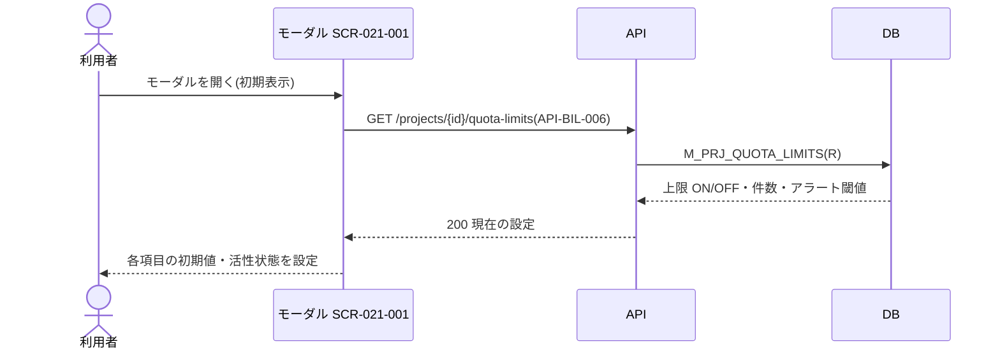
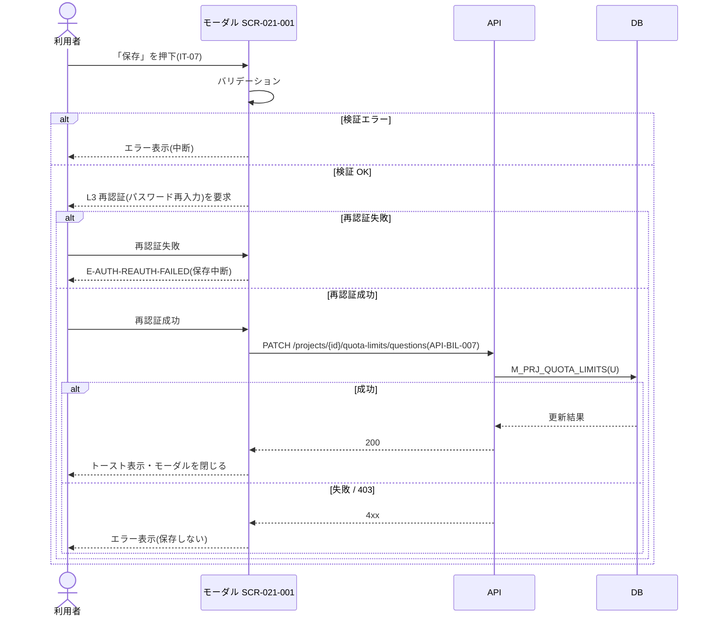

<!-- portal-top -->
[設計ポータル](../../README.md) ／ [基本設計](../index.md) ／ [ユースケース設計](index.md) ／ **UC-SCR-021-001: 質問数上限設定モーダル ユースケース**
<!-- /portal-top -->

# UC-SCR-021-001: 質問数上限設定モーダル ユースケース

> **このページは、画面 SCR-021-001(質問数上限設定モーダル)の画面イベント EV-01〜EV-06 に対応する 6 つのユースケースを「1 イベント = 1 ユースケース」で定義します。**

*版数 v1.0 ・ 更新 2026-06-21 ・ ユースケース 6 ・ ステータス ドラフト*

## 0. イベント↔ユースケース対応表

画面 [SCR-021-001](../01_screen-design/SCR-021-001.md#SCR-021-001) の §6 画面イベント一覧(EV-01〜EV-06)を、ユースケース ID へ 1:1 で対応づけます。種別は、サーバ API・DB へアクセスする「API/DB 連携」と、画面内のみで完結する「クライアント内処理のみ」に区別します。

| イベント ID | イベント名 | ユースケース ID | 種別 |
|----|----|----|----|
| `EV-01` | 初期表示 | [UC-SCR-021-001-EV01](#UC-SCR-021-001-EV01) | API/DB 連携 |
| `EV-02` | 上限設定トグルを切り替え | [UC-SCR-021-001-EV02](#UC-SCR-021-001-EV02) | クライアント内処理のみ |
| `EV-03` | 「今月の利用上限」を入力 | [UC-SCR-021-001-EV03](#UC-SCR-021-001-EV03) | クライアント内処理のみ |
| `EV-04` | アラート閾値をチェック | [UC-SCR-021-001-EV04](#UC-SCR-021-001-EV04) | クライアント内処理のみ |
| `EV-05` | 「保存」を押下 | [UC-SCR-021-001-EV05](#UC-SCR-021-001-EV05) | API/DB 連携 |
| `EV-06` | 「キャンセル」を押下 | [UC-SCR-021-001-EV06](#UC-SCR-021-001-EV06) | クライアント内処理のみ |

## 1. ユースケース定義

### UC-SCR-021-001-EV01 初期表示

> モーダルを開いたとき、当該プロジェクトの現在の上限 ON/OFF・件数・アラート閾値を取得し、各項目の初期値・活性状態を設定して表示します。

| 項目 | 内容 |
|----|----|
| 利用者 | オーナー / 当該プロジェクトのメンバー |
| 事前条件 | SCR-021 の「アラート設定」からモーダルを開く |
| トリガー | モーダルを開く(初期表示) |
| 事後条件 | 現在の上限 ON/OFF・件数・アラート閾値を各項目(IT-01 / IT-02 / IT-04)の初期値・活性状態に反映する |
| 関連 | [SCR-021-001](../01_screen-design/SCR-021-001.md#SCR-021-001) ・ [API-BIL-006](../02_api-design/API-billing.md#API-BIL-006) ・ [FR-065](../../01_requirements/FR09.md#FR-065) |

基本フロー

1. モーダルが開く。
2. 画面はプロジェクト上限・アラート取得 API で現在の上限 ON/OFF・件数・アラート閾値を取得する。
3. 画面は各項目(IT-01 / IT-02 / IT-04)の初期値・活性状態を設定して表示する。

異常系フロー

- 取得失敗: 初期値をセットできず、エラートーストを表示する。

### UC-SCR-021-001-EV02 上限設定トグルを切り替え

> 上限設定トグルを切り替え、ON / OFF に応じて件数入力・アラート設定の活性状態と課金計算式を切り替えます(クライアント内処理のみ)。

| 項目 | 内容 |
|----|----|
| 利用者 | オーナー / 当該プロジェクトのメンバー |
| 事前条件 | モーダルを表示している |
| トリガー | 上限設定トグル(IT-01)を切り替える |
| 事後条件 | OFF 時は件数入力(IT-02)・アラート設定(IT-04)を非活性化し全アラート閾値を未選択にする。ON 時は IT-02・IT-04 を活性化し課金計算式を再描画する |
| 関連 | [SCR-021-001](../01_screen-design/SCR-021-001.md#SCR-021-001) |

基本フロー

1. 利用者が上限設定トグル(IT-01)を切り替える。
2. OFF に切り替えたとき、画面は件数入力(IT-02)・アラート設定(IT-04)を非活性化し、全アラート閾値を未選択状態にする。
3. ON に切り替えたとき、画面は IT-02・IT-04 を活性化し、課金計算式を再描画する。

異常系フロー

- なし(クライアント内処理のみ。保存は EV-05 で扱う)。

クライアント内処理のみのため、シーケンス図は省略します。

### UC-SCR-021-001-EV03 「今月の利用上限」を入力

> 今月の利用上限を入力し、課金対象件数・最大課金額をリアルタイムで計算して計算式に反映します(クライアント内処理のみ)。

| 項目 | 内容 |
|----|----|
| 利用者 | オーナー / 当該プロジェクトのメンバー |
| 事前条件 | 上限 ON で、件数入力(IT-02)が活性化している |
| トリガー | 「今月の利用上限」(IT-02)へ入力する |
| 事後条件 | 妥当時は課金対象件数・最大課金額を計算して計算式に反映する。範囲外・非整数時はエラーを表示し保存ボタンを無効化する |
| 関連 | [SCR-021-001](../01_screen-design/SCR-021-001.md#SCR-021-001) ・ [FR-066](../../01_requirements/FR09.md#FR-066) |

基本フロー

1. 利用者が「今月の利用上限」(IT-02)へ件数を入力する。
2. 画面は入力値をもとに課金対象件数・最大課金額をリアルタイムで計算し、計算式に反映する。

異常系フロー

- 範囲外・非整数: 入力欄にエラーを表示し、保存ボタンを無効化する。

クライアント内処理のみのため、シーケンス図は省略します。

### UC-SCR-021-001-EV04 アラート閾値をチェック

> アラート閾値のチェックを操作し、通知する閾値の選択 / 解除を行います(クライアント内処理のみ)。

| 項目 | 内容 |
|----|----|
| 利用者 | オーナー / 当該プロジェクトのメンバー |
| 事前条件 | 上限 ON で、アラート設定(IT-04)が活性化している |
| トリガー | アラート閾値(IT-04)をチェック / 解除する |
| 事後条件 | 選択した閾値(25% / 50% / 80% / 90% / 100% のいずれか)を保持する。全未選択はアラート通知なしとする |
| 関連 | [SCR-021-001](../01_screen-design/SCR-021-001.md#SCR-021-001) ・ [FR-069](../../01_requirements/FR09.md#FR-069) |

基本フロー

1. 利用者がアラート閾値(IT-04)のチェックを操作する。
2. 選択時、画面は対象の閾値(25% / 50% / 80% / 90% / 100% のいずれか)にチェックを入れる。
3. 解除時、画面は対象の閾値のチェックを外す(全未選択はアラート通知なし)。

異常系フロー

- なし(クライアント内処理のみ。保存は EV-05 で扱う)。

クライアント内処理のみのため、シーケンス図は省略します。

### UC-SCR-021-001-EV05 「保存」を押下

> 「保存」を押下し、バリデーションと L3 再認証(パスワード再入力)を経て、プロジェクト上限・アラート更新 API で上限件数・アラート閾値を保存します。

| 項目 | 内容 |
|----|----|
| 利用者 | オーナー / 当該プロジェクトのメンバー |
| 事前条件 | モーダルを表示している。上限件数・アラート閾値の入力に検証エラーがないこと |
| トリガー | 「保存」(IT-07)を押下する |
| 事後条件 | バリデーション・L3 再認証成功時は上限件数・アラート閾値を保存し、トーストを表示してモーダルを閉じる。検証失敗・再認証失敗時は保存せずエラーを表示する |
| 関連 | [SCR-021-001](../01_screen-design/SCR-021-001.md#SCR-021-001) ・ [API-BIL-007](../02_api-design/API-billing.md#API-BIL-007) ・ [FR-071](../../01_requirements/FR09.md#FR-071) ・ [FR-005](../../01_requirements/FR01.md#FR-005) |

基本フロー

1. 利用者が「保存」(IT-07)を押下する。
2. 画面はバリデーションを実行する。エラーがあれば表示して処理を中断する。
3. 画面は L3 再認証(パスワード再入力。FR-005)を要求する。
4. 再認証成功時、画面はプロジェクト上限・アラート更新 API を呼び出す。
5. API は再認証・認可・入力を検証し、上限件数(OFF 時は `limit=null`)・アラート閾値を保存する。
6. 成功時、画面はトーストを表示してモーダルを閉じる。

異常系フロー

- バリデーション失敗(範囲外・非整数等): エラーを表示し、処理を中断する。
- 再認証失敗(`E-AUTH-REAUTH-FAILED`): エラーを表示し、保存を中断する。
- 保存失敗 / 認可エラー(403): エラーを表示し、保存しない。

### UC-SCR-021-001-EV06 「キャンセル」を押下

> 「キャンセル」を押下し、変更を破棄してモーダルを閉じます。未保存変更があれば確認を促します(クライアント内処理のみ)。

| 項目 | 内容 |
|----|----|
| 利用者 | オーナー / 当該プロジェクトのメンバー |
| 事前条件 | モーダルを表示している |
| トリガー | 「キャンセル」(IT-06)を押下する |
| 事後条件 | 未保存変更なしの場合は変更を破棄してモーダルを閉じ、SCR-021 へ戻る。未保存変更ありの場合は確認を促し、破棄確定でモーダルを閉じる |
| 関連 | [SCR-021-001](../01_screen-design/SCR-021-001.md#SCR-021-001) ・ [SCR-021](../01_screen-design/SCR-021.md#SCR-021) |

基本フロー

1. 利用者が「キャンセル」(IT-06)を押下する。
2. 未保存変更なしの場合、画面は変更を破棄してモーダルを閉じ、SCR-021 へ戻る。
3. 未保存変更ありの場合、画面は確認を促し、破棄確定でモーダルを閉じる。

異常系フロー

- なし(クライアント内処理のみ)。

クライアント内処理のみのため、シーケンス図は省略します。

---

<!-- portal-bottom -->
[← ユースケース設計](index.md) ・ [基本設計](../index.md) ・ [↑ 設計ポータル](../../README.md)
<!-- /portal-bottom -->
