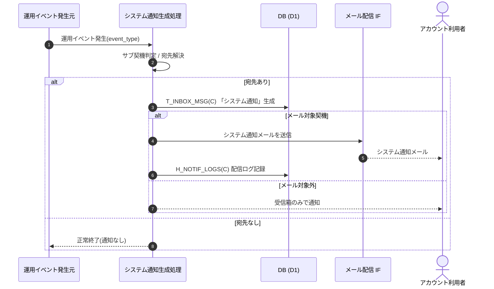

<!-- portal-top -->
[設計ポータル](../../README.md) ／ [基本設計](../index.md) ／ [ユースケース設計](index.md) ／ **UC-SYSTEM-006: 運用イベントのシステム通知自動生成**
<!-- /portal-top -->

# UC-SYSTEM-006: 運用イベントのシステム通知自動生成

> **このページは、運用イベント(利用上限接近・AI 利用上限到達・通知失敗急増・サスペンション・復元・規約改定・価格改定 等)の発生を契機に、対象アカウント利用者へ「システム通知」のお知らせを自動生成し、メール対象の契機はメールも送るシステムユースケースを定義します。**

*版数 v1.0 ・ 更新 2026-06-21 ・ 種別 イベントドリブン ・ ステータス ドラフト*

## 1. 概要

メインシステム内で運用イベントが発生したことを契機に、システム通知生成処理がサブ契機(`event_type`)を判定し、対象アカウント利用者を解決して、お知らせ受信箱 `T_INBOX_MSG(C)` に「システム通知」のお知らせを自動生成する。メール送信対象の契機(質問数上限関連 等)はメール配信 IF でシステム通知メールを送信し、`H_NOTIF_LOGS(C)` に配信ログを記録する。AI 利用上限到達のようなメール対象外の契機は受信箱のみで通知する。サブ契機ごとに件名・本文を動的に組み立てる。

| 項目 | 内容 |
|---|---|
| 目的 | 運用イベントを契機にシステム通知のお知らせを自動生成し、必要に応じてメール通知する |
| 関連要件 | [FR-091a](../../01_requirements/FR11.md#FR-091a) システム通知の自動生成 ・ [FR-082](../../01_requirements/FR11.md#FR-082) 契機による通知 |
| 主テーブル | `T_INBOX_MSG(C)` ・ `H_NOTIF_LOGS(C)` |
| 関連 API | [API-ANN-001](../02_api-design/API-inbox.md#API-ANN-001) お知らせ一覧(受信側参照) ・ [API-MAIL-001](../02_api-design/API-mail.md#API-MAIL-001) メール配信 IF |

## 2. 利用者(アクター)

| アクター | 役割 |
|---|---|
| 運用イベント発生元(システム) | 利用上限接近・サスペンション・復元・規約改定 等のイベントを発生させる |
| システム通知生成処理(システム) | サブ契機判定・宛先解決・受信箱生成・メール送信判定を行う |
| メール配信 IF(システム) | メール対象契機のシステム通知メールを送信する |

## 3. 事前条件

- 運用イベント(`event_type`)がメインシステム内で発生し、対象リソース(契約 / プロジェクト)が特定できる。
- 対象アカウント利用者(オーナー / 当該プロジェクトのメンバー 等)が解決可能である。

## 4. トリガー

イベントドリブン。利用上限接近・AI 利用上限到達・通知失敗急増・サスペンション・復元・規約改定・価格改定 等の運用イベント発生を契機に起動する。

## 5. 基本フロー

1. 運用イベントが発生し、システム通知生成処理を起動する。
2. 処理がサブ契機(`event_type`)を判定し、対象アカウント利用者を解決する。
3. サブ契機に応じた件名・本文でお知らせ受信箱 `T_INBOX_MSG(C)` に「システム通知」のお知らせを生成する([FR-091a](../../01_requirements/FR11.md#FR-091a))。
4. メール送信対象の契機かを判定する。
   1. メール対象(質問数上限関連 等): メール配信 IF([API-MAIL-001](../02_api-design/API-mail.md#API-MAIL-001))でシステム通知メールを送信し、`H_NOTIF_LOGS(C)` に配信ログを記録する。
   2. メール対象外(AI 利用上限到達 等): 受信箱お知らせのみで通知し、メールは送らない。
5. 受信者は管理画面のお知らせ一覧([API-ANN-001](../02_api-design/API-inbox.md#API-ANN-001))で当該システム通知を確認できる。

> [!NOTE]
> 質問数上限アラートは [UC-SYSTEM-008](UC-SYSTEM-008.md#UC-SYSTEM-008)、メンバー割当変更通知は [UC-SYSTEM-007](UC-SYSTEM-007.md#UC-SYSTEM-007) が個別契機として扱う。本ユースケースは運用イベント全般のシステム通知お知らせ生成を範囲とする。件名・本文テンプレートと配信先解決は メール設計書 を正本とする。

## 6. 異常系フロー

- **宛先なし**: 対象アカウント利用者が解決できない場合は通知を生成せず、正常終了する。
- **メール配信失敗**: 受信箱お知らせは生成済みとし、メール送信失敗は `H_NOTIF_LOGS` に失敗として記録する。再送は [UC-SYSTEM-009](UC-SYSTEM-009.md#UC-SYSTEM-009) 通知再送が扱う。

## 7. 事後条件

- 対象アカウント利用者の受信箱に「システム通知」のお知らせが生成される([FR-091a](../../01_requirements/FR11.md#FR-091a))。
- メール対象契機ではシステム通知メールが送信され、配信ログが記録される。
- メール対象外契機では受信箱のみで通知される。

## 8. シーケンス図

---

<!-- portal-bottom -->
[← ユースケース設計](index.md) ・ [基本設計](../index.md) ・ [↑ 設計ポータル](../../README.md)
<!-- /portal-bottom -->
