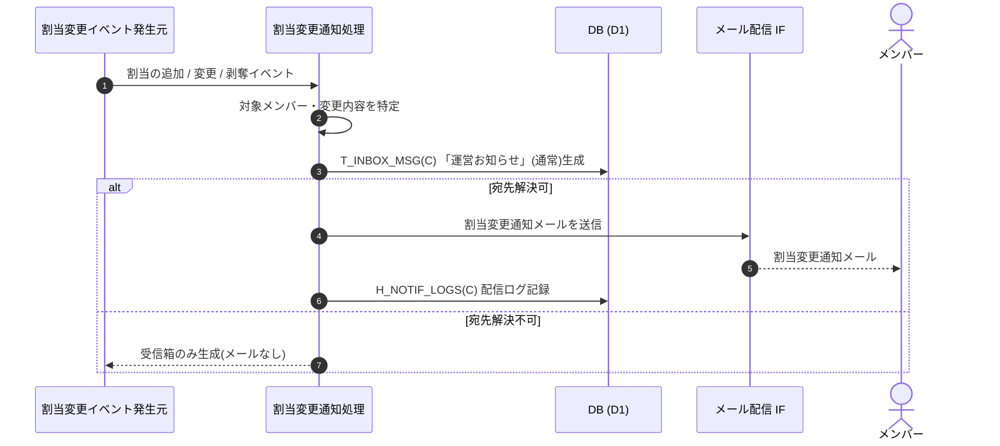

<!-- portal-top -->
[設計ポータル](../../README.md) ／ [基本設計](../index.md) ／ [ユースケース設計](index.md) ／ **UC-SYSTEM-007: メンバー割当変更通知**
<!-- /portal-top -->

# UC-SYSTEM-007: メンバー割当変更通知

> **このページは、メンバーのプロジェクト別の役割割当が追加・変更・剥奪されたことを契機に、当該メンバーへお知らせ受信箱(「運営お知らせ」種別・「通常」重要度)とメールで通知するシステムユースケースを定義します。**

*版数 v1.0 ・ 更新 2026-06-21 ・ 種別 イベントドリブン ・ ステータス ドラフト*

## 1. 概要

オーナー / 当該プロジェクトのメンバーによるメンバー管理操作(招待による割当追加・割当解除 等)で、あるメンバーのプロジェクト割当が追加・変更・剥奪されたことを契機に、割当変更通知処理が起動する。処理は対象メンバーを宛先として、お知らせ受信箱 `T_INBOX_MSG(C)` に「運営お知らせ」種別・「通常」重要度のお知らせを生成し、あわせて割当変更通知メールをメール配信 IF で送信して `H_NOTIF_LOGS(C)` に配信ログを記録する。

| 項目 | 内容 |
|---|---|
| 目的 | メンバーのプロジェクト割当変更を当該メンバーへ受信箱とメールで通知する |
| 関連要件 | [FR-087a](../../01_requirements/FR11.md#FR-087a) メンバー割当変更通知 ・ [FR-012b](../../01_requirements/FR02.md#FR-012b) メンバーのプロジェクト割当 |
| 主テーブル | `T_INBOX_MSG(C)` ・ `H_NOTIF_LOGS(C)` |
| 関連 API | [API-MBR-001](../02_api-design/API-member.md#API-MBR-001) メンバー管理(契機操作) ・ [API-MAIL-001](../02_api-design/API-mail.md#API-MAIL-001) メール配信 IF |

## 2. 利用者(アクター)

| アクター | 役割 |
|---|---|
| 割当変更イベント発生元(システム) | メンバー管理操作による割当の追加・変更・剥奪イベントを発生させる |
| 割当変更通知処理(システム) | 対象メンバー解決・受信箱生成・メール送信・配信ログ記録を行う |
| メール配信 IF(システム) | 割当変更通知メールを送信する |
| メンバー(アカウント利用者) | 受信箱とメールで割当変更の通知を受け取る |

## 3. 事前条件

- メンバーのプロジェクト別役割割当が追加・変更・剥奪され、対象メンバーが特定できる。
- 対象メンバーが有効なアカウント利用者として通知宛先を解決できる。

## 4. トリガー

イベントドリブン。メンバー管理操作によりメンバーのプロジェクト割当が追加・変更・剥奪されたことを契機に起動する。

## 5. 基本フロー

1. メンバー管理操作で割当の追加・変更・剥奪イベントが発生し、割当変更通知処理を起動する。
2. 処理が対象メンバーと変更内容(対象プロジェクト・追加 / 剥奪)を特定する。
3. 対象メンバーのお知らせ受信箱 `T_INBOX_MSG(C)` に「運営お知らせ」種別・「通常」重要度のお知らせを生成する([FR-087a](../../01_requirements/FR11.md#FR-087a))。
4. 対象メンバーへ割当変更通知メールをメール配信 IF([API-MAIL-001](../02_api-design/API-mail.md#API-MAIL-001))で送信する。
5. メール送信結果を `H_NOTIF_LOGS(C)` に配信ログとして記録する。

> [!NOTE]
> 招待そのものの送信(アクティベーションメール)はメンバー招待操作の範囲である。本ユースケースは割当が確定した後の当該メンバーへの変更通知を範囲とする。件名・本文テンプレートと配信先解決は メール設計書 を正本とする。

## 6. 異常系フロー

- **宛先解決不可**: 対象メンバーの通知宛先が解決できない場合は受信箱お知らせのみ生成し、メール送信は行わない。
- **メール配信失敗**: 受信箱お知らせは生成済みとし、メール送信失敗は `H_NOTIF_LOGS` に失敗として記録する。再送は [UC-SYSTEM-009](UC-SYSTEM-009.md#UC-SYSTEM-009) 通知再送が扱う。

## 7. 事後条件

- 対象メンバーの受信箱に「運営お知らせ」種別・「通常」重要度の割当変更お知らせが生成される([FR-087a](../../01_requirements/FR11.md#FR-087a))。
- 対象メンバーへ割当変更通知メールが送信され、配信ログが記録される。

## 8. シーケンス図

---

<!-- portal-bottom -->
[← ユースケース設計](index.md) ・ [基本設計](../index.md) ・ [↑ 設計ポータル](../../README.md)
<!-- /portal-bottom -->
