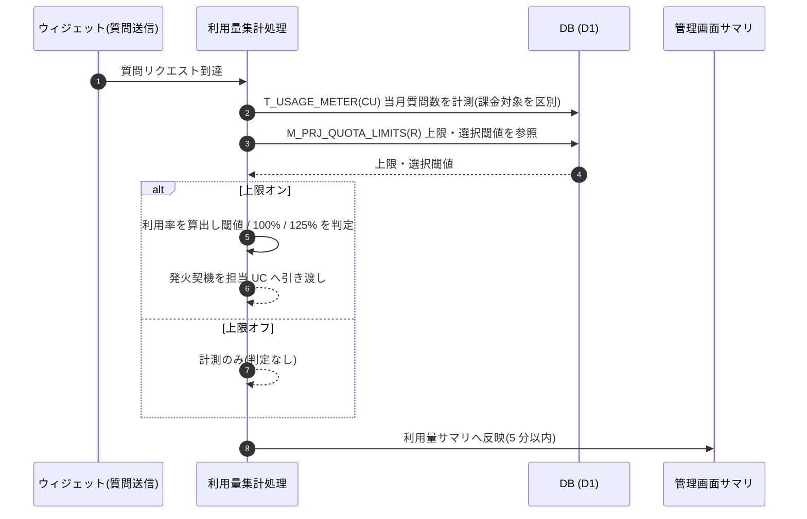

<!-- portal-top -->
[設計ポータル](../../README.md) ／ [基本設計](../index.md) ／ [ユースケース設計](index.md) ／ **UC-SYSTEM-010: 利用量リアルタイム集計・UI 反映**
<!-- /portal-top -->

# UC-SYSTEM-010: 利用量リアルタイム集計・UI 反映

> **このページは、ウィジェット利用者の質問送信到達時に利用量をリアルタイム集計し、上限アラート閾値到達・100% 停止・125% 通知を判定し、管理画面向けサマリへ 5 分以内に反映するシステムユースケースを定義します。**

*版数 v1.0 ・ 更新 2026-06-21 ・ 種別 同期内部処理 ・ ステータス ドラフト*

## 1. 概要

ウィジェット利用者の質問リクエスト到達時に、利用量集計処理が同期で `T_USAGE_METER(CU)` へ当月質問数を計測する(推論失敗分は課金対象外として区別して保持)。計測後、当該プロジェクトの上限・選択閾値 `M_PRJ_QUOTA_LIMITS(R)` と当月利用率を突き合わせ、選択アラート閾値到達・100% 停止・125% 追加通知の各判定を行う。集計結果は管理画面向け利用量サマリへ 5 分以内の遅延で反映され、利用量画面・ダッシュボードで確認できる。判定で発火した契機は、それぞれ担当のシステム通知 / 受付停止のユースケースへ引き渡す。

| 項目 | 内容 |
|---|---|
| 目的 | 質問発生時に利用量をリアルタイム集計し、閾値判定と管理画面サマリ反映を行う |
| 関連要件 | [FR-070](../../01_requirements/FR09.md#FR-070) リアルタイム集計・5 分以内反映 ・ [FR-064](../../01_requirements/FR09.md#FR-064) 利用量集計 |
| 主テーブル | `T_USAGE_METER(CU)` ・ `M_PRJ_QUOTA_LIMITS(R)` |
| 関連 API | [API-BIL-001](../02_api-design/API-billing.md#API-BIL-001) 利用量参照 ・ [API-DASH-001](../02_api-design/API-dashboard.md#API-DASH-001) ダッシュボードサマリ |

## 2. 利用者(アクター)

| アクター | 役割 |
|---|---|
| ウィジェット(質問送信元) | ウィジェット利用者の質問リクエストを到達させる(集計の契機) |
| 利用量集計処理(システム) | 同期で計測・閾値判定を行い、サマリへ反映する |
| 管理画面(利用量 / ダッシュボード) | 集計結果をサマリとして表示する |

## 3. 事前条件

- 対象プロジェクトの質問リクエストが到達している。
- 当該プロジェクトの上限設定・無料枠が `M_PRJ_QUOTA_LIMITS` に保持されている。

## 4. トリガー

同期内部処理。ウィジェット利用者の質問リクエスト到達を契機に、質問処理と同期で利用量集計が起動する。

## 5. 基本フロー

1. 質問リクエストが到達し、利用量集計処理が起動する。
2. 処理が当月質問数を `T_USAGE_METER(CU)` へ計測する。推論失敗の質問はカウントしつつ計測フラグで課金対象外として区別する。
3. 当該プロジェクトの上限・選択閾値 `M_PRJ_QUOTA_LIMITS(R)` を参照し、当月利用率を算出する。
4. 利用率に応じて各判定を行う。
   1. 選択アラート閾値(25 / 50 / 80 / 90 / 100%)到達: アラート通知契機を [UC-SYSTEM-008](UC-SYSTEM-008.md#UC-SYSTEM-008) へ引き渡す。
   2. 100% 到達: ウィジェット受付停止契機を [UC-SYSTEM-011](UC-SYSTEM-011.md#UC-SYSTEM-011) へ引き渡す。
   3. 125% 到達: 集計遅延・誤差対策の最終ガードとして追加通知契機を引き渡す。
5. 集計結果を管理画面向け利用量サマリへ 5 分以内の遅延で反映する([FR-070](../../01_requirements/FR09.md#FR-070))。利用量画面([API-BIL-001](../02_api-design/API-billing.md#API-BIL-001))・ダッシュボード([API-DASH-001](../02_api-design/API-dashboard.md#API-DASH-001))で確認できる。

> [!NOTE]
> 上限オフのプロジェクトは利用率の算出・アラート・上限到達停止を行わない。月次境界経過後の確定請求は [UC-SYSTEM-004](UC-SYSTEM-004.md#UC-SYSTEM-004) が扱う。本ユースケースは発生時計測・閾値判定・サマリ反映を範囲とする。

## 6. 異常系フロー

- **上限オフ**: 質問数上限がオフのプロジェクトは利用率算出・閾値判定・停止を行わず、計測のみ行う。
- **推論失敗**: 推論失敗の質問はカウントするが課金対象外として区別して保持し、請求集計から除外する。

## 7. 事後条件

- 当月質問数が `T_USAGE_METER` に計測され、課金対象 / 対象外が区別されて保持される。
- 閾値到達・100% 停止・125% の各契機が、担当ユースケースへ引き渡される。
- 集計結果が管理画面向けサマリへ 5 分以内に反映される([FR-070](../../01_requirements/FR09.md#FR-070))。

## 8. シーケンス図

---

<!-- portal-bottom -->
[← ユースケース設計](index.md) ・ [基本設計](../index.md) ・ [↑ 設計ポータル](../../README.md)
<!-- /portal-bottom -->
