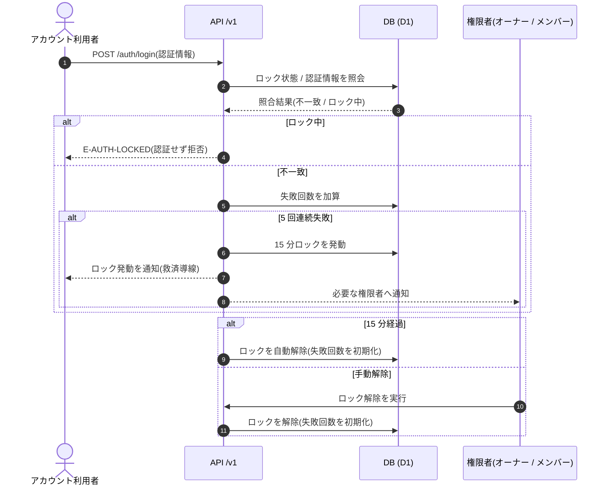

<!-- portal-top -->
[設計ポータル](../../README.md) ／ [基本設計](../index.md) ／ [ユースケース設計](index.md) ／ **UC-SYSTEM-014: ログイン失敗ロックアウト・解除**
<!-- /portal-top -->

# UC-SYSTEM-014: ログイン失敗ロックアウト・解除

> **このページは、ログインが 5 回連続で失敗したアカウントを 15 分間ロックし、ロック中の到達を拒否しつつ、時間経過または権限者の手動解除でロックを解除するシステムユースケースを定義します。**

*版数 v1.0 ・ 更新 2026-06-21 ・ 種別 イベントドリブン + 時間駆動 ・ ステータス ドラフト*

## 1. 概要

ログイン([API-AUTH-002](../02_api-design/API-auth.md#API-AUTH-002))の失敗イベントを契機に失敗回数を加算し、5 回連続失敗で当該アカウントを 15 分間ロックする。ロック中のログイン到達はロック分類のエラー(`E-AUTH-LOCKED`)に落とし、認証情報の検証を行わない。ロック発動時は本人および必要なオーナー / 当該プロジェクトのメンバーへ通知し、救済導線を案内する。ロックは 15 分の時間経過、または権限者の手動解除で解除する。条件・効果・復旧は [認証・認可設計書 §4.1](../07_auth-design.md#41-ログイン失敗ロックアウト) を正本とする。

| 項目 | 内容 |
|---|---|
| 目的 | 連続ログイン失敗による総当たり攻撃を、5 回 / 15 分のロックで抑止し、正規利用者には救済導線を提供する |
| 関連要件 | [FR-007](../../01_requirements/FR01.md#FR-007) ログイン試行の失敗回数制限 |
| 主テーブル | ロック状態(認証主体に紐づく失敗カウント・ロック期限) |
| 関連 API | [API-AUTH-002](../02_api-design/API-auth.md#API-AUTH-002) ログイン |

## 2. 利用者(アクター)

| アクター | 役割 |
|---|---|
| アカウント利用者 | ログインを試行し、ロック発動時は通知と救済導線を受ける |
| ロック判定処理(システム) | 失敗回数の加算・ロック発動・ロック中到達の拒否を行う |
| オーナー / 当該プロジェクトのメンバー | ロックされたアカウントを手動解除できる |
| 期限監視(システム) | 15 分のロック期限経過を評価し、自動解除する |

## 3. 事前条件

- ログイン対象のアカウントが存在する。
- ロック条件(5 回連続失敗)・効果(15 分ロック)が定義されている([認証・認可設計書 §4.1](../07_auth-design.md#41-ログイン失敗ロックアウト))。

## 4. トリガー

イベントドリブン + 時間駆動。ログイン失敗イベント(発動側)と、ロック期限 15 分の経過判定(解除側)を契機とする。手動解除は権限者の操作を契機とする。

## 5. 基本フロー

1. アカウント利用者がログイン([API-AUTH-002](../02_api-design/API-auth.md#API-AUTH-002))を試行し、認証情報が不一致になる。
2. システムが当該アカウントの失敗回数を加算する。
3. 失敗が 5 回連続に達した時点で、当該アカウントを 15 分間ロックする。
4. システムが本人および必要なオーナー / 当該プロジェクトのメンバーへロック発動を通知し、救済導線を案内する。
5. ロック中のログイン到達は `E-AUTH-LOCKED` に落とし、認証情報の検証を行わない。
6. ロックは次のいずれかで解除する。
   1. ロック発動から 15 分の時間経過(自動解除)。
   2. オーナー / 当該プロジェクトのメンバーによる手動解除。
7. 解除後はログイン試行を再び受け付け、失敗回数を初期化する。

> [!NOTE]
> **通知の宛先・文面は別正本** ロック通知の配信先・文面は [メール設計書](../06_mail-design.md) を正本とする。本ユースケースはロック発動・到達拒否・解除の判定を範囲とする。

## 6. 異常系フロー

- **ロック中の継続試行**: ロック中に追加のログイン試行が到達しても認証は行わず、一律に `E-AUTH-LOCKED` を返す。
- **解除直後の再失敗**: 解除後に再び 5 回連続失敗した場合は、改めて 15 分のロックを発動する。

## 7. 事後条件

- 5 回連続失敗したアカウントは 15 分間ロックされ、ロック中はログインできない([FR-007](../../01_requirements/FR01.md#FR-007))。
- ロックは時間経過または権限者の手動解除で解除され、解除後は試行を再受付する。
- ロック発動時に本人および必要な権限者へ通知され、救済導線が案内される。

## 8. シーケンス図

---

<!-- portal-bottom -->
[← ユースケース設計](index.md) ・ [基本設計](../index.md) ・ [↑ 設計ポータル](../../README.md)
<!-- /portal-bottom -->
