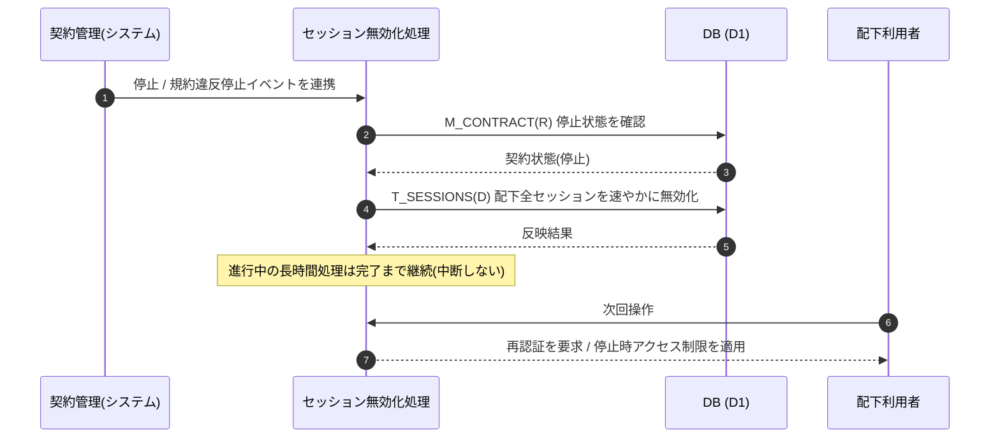

<!-- portal-top -->
[設計ポータル](../../README.md) ／ [基本設計](../index.md) ／ [ユースケース設計](index.md) ／ **UC-SYSTEM-015: 契約停止時セッション一斉無効化**
<!-- /portal-top -->

# UC-SYSTEM-015: 契約停止時セッション一斉無効化

> **このページは、契約の停止(手動停止 / 規約違反停止)を契機に、配下利用者の全セッションを速やかに一斉無効化し、進行中の長時間処理は完了まで継続させ、次回操作で再認証 / 停止時アクセス制限を適用するシステムユースケースを定義します。**

*版数 v1.0 ・ 更新 2026-06-21 ・ 種別 イベントドリブン(状態遷移) ・ ステータス ドラフト*

## 1. 概要

契約状態が停止へ遷移したイベントを契機に、システムは配下利用者の全セッション `T_SESSIONS(D)` を速やかに無効化する。停止の契機は手動停止・規約違反停止で、`M_CONTRACT(R:status)` の遷移を起点とする。進行中の長時間処理(大量インポート等)は中断せず完了まで継続し、完了後の次回操作で再認証を要求する。停止後の利用者の次回操作には停止時アクセス制限(課金・退会のみ許可等)を適用する。一斉無効化の方針は [認証・認可設計書 §3.6](../07_auth-design.md#36-強制ログアウト) を正本とする。

| 項目 | 内容 |
|---|---|
| 目的 | 契約停止イベントを契機に配下全セッションを一斉無効化し、停止後アクセスを制限する |
| 関連要件 | [FR-011](../../01_requirements/FR01.md#FR-011) 強制ログアウト(契約停止時) ・ [FR-008](../../01_requirements/FR01.md#FR-008) セッション失効 |
| 主テーブル | `T_SESSIONS(D)` ・ `M_CONTRACT(R:status)` |
| 関連 API | [API-AUTH-003](../02_api-design/API-auth.md#API-AUTH-003) ログアウト |

## 2. 利用者(アクター)

| アクター | 役割 |
|---|---|
| 契約管理(システム) | 手動停止 / 規約違反停止を契機に一斉無効化を連携する |
| セッション無効化処理(システム) | 配下利用者の全セッションを速やかに無効化する |
| 配下利用者 | 停止後の次回操作で再認証 / 停止時アクセス制限の適用を受ける |

## 3. 事前条件

- 対象契約が停止対象の状態遷移(手動停止 / 規約違反停止)を起こしている。
- 配下利用者に有効なセッション(`T_SESSIONS`)が存在しうる。

## 4. トリガー

イベントドリブン(状態遷移)。契約の停止(手動停止 / 規約違反停止)イベントを契機に起動する。

## 5. 基本フロー

1. 契約管理が停止(手動停止 / 規約違反停止)を契機にセッション無効化処理へ連携する。
2. システムが当該契約配下の利用者の全セッション `T_SESSIONS(D)` を速やかに無効化する。
3. 進行中の長時間処理は中断せず完了まで継続する。
4. 停止後、配下利用者の次回操作で再認証を要求し、停止時アクセス制限(課金・退会のみ許可等)を適用する。

> [!NOTE]
> **失効の最優先・別経路** 契約停止に伴う一斉無効化は失効の優先順位で最優先に位置づける([認証・認可設計書 §4.2](../07_auth-design.md#42-失効の優先順位))。タイムアウト失効・再認証の判定は [UC-SYSTEM-013](UC-SYSTEM-013.md#UC-SYSTEM-013) が扱う。決済失敗起因のサスペンション遷移自体は [UC-SYSTEM-012](UC-SYSTEM-012.md#UC-SYSTEM-012) が扱う。

## 6. 異常系フロー

- **無効化中の操作到達**: 一斉無効化の進行中に配下利用者の操作が到達しても、無効化済みのセッションでは認証が要求される。
- **長時間処理の継続**: 無効化時点で進行中の長時間処理は中断せず、完了後の次回操作で再認証を要求する。

## 7. 事後条件

- 停止契約配下の全セッションが無効化され、再ログインなしには操作できない([FR-011](../../01_requirements/FR01.md#FR-011))。
- 進行中の長時間処理は完了まで継続し、完了後の操作で再認証が求められる。
- 停止後の操作には停止時アクセス制限([認証・認可設計書 §5.7](../07_auth-design.md#57-契約状態によるアクセス制限))が適用される。

## 8. シーケンス図

---

<!-- portal-bottom -->
[← ユースケース設計](index.md) ・ [基本設計](../index.md) ・ [↑ 設計ポータル](../../README.md)
<!-- /portal-bottom -->
