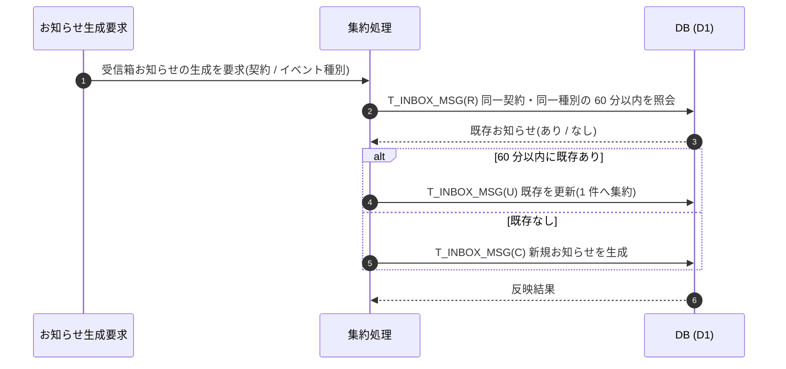

<!-- portal-top -->
[設計ポータル](../../README.md) ／ [基本設計](../index.md) ／ [ユースケース設計](index.md) ／ **UC-SYSTEM-017: 受信箱の重複集約**
<!-- /portal-top -->

# UC-SYSTEM-017: 受信箱の重複集約

> **このページは、同一契約・同一イベント種別で 60 分以内に連続発火した受信箱お知らせを 1 件に集約し、重複したお知らせの生成を抑えるシステムユースケースを定義します。**

*版数 v1.0 ・ 更新 2026-06-21 ・ 種別 同期内部処理(集約) + 定期 ・ ステータス ドラフト*

## 1. 概要

運用イベント等を契機に受信箱お知らせを生成する際、システムは同一契約・同一イベント種別で 60 分以内に連続発火したものを 1 件へ集約し、`T_INBOX_MSG(C/U)` の重複生成を抑える。直近 60 分以内に同一契約・同一種別の既存お知らせがある場合は新規生成せず既存を更新(集約)し、無い場合のみ新規生成する。集約ルールは [FR-125](../../01_requirements/FR15.md#FR-125) / [BR-112](../../01_requirements/FR15.md#BR-112) を正本とする。

| 項目 | 内容 |
|---|---|
| 目的 | 同一契約・同一イベント種別の 60 分以内の連続発火を 1 件に集約し、受信箱の重複を防ぐ |
| 関連要件 | [FR-125](../../01_requirements/FR15.md#FR-125) 運用イベントの受信箱生成と集約 ・ [BR-112](../../01_requirements/FR15.md#BR-112) 重複生成の集約 |
| 主テーブル | `T_INBOX_MSG(C/U)` |
| 関連 機能グループ | FR11 通知 ・ FR15 お知らせ |

## 2. 利用者(アクター)

| アクター | 役割 |
|---|---|
| お知らせ生成要求(システム) | 運用イベント等を契機に受信箱お知らせの生成を要求する |
| 集約処理(システム) | 同一契約・同一種別の 60 分窓を判定し、新規生成 / 既存集約を振り分ける |

## 3. 事前条件

- 受信箱お知らせの生成契機(運用イベント等)が発生している。
- 集約の窓(同一契約・同一イベント種別で 60 分以内)が定義されている([BR-112](../../01_requirements/FR15.md#BR-112))。

## 4. トリガー

同期内部処理(集約) + 定期。お知らせ生成要求(イベント)を主契機とし、60 分窓の経過判定を併用する。

## 5. 基本フロー

1. 運用イベント等を契機に、受信箱お知らせの生成要求が発生する。
2. 集約処理が、同一契約・同一イベント種別で 60 分以内の既存お知らせ `T_INBOX_MSG(R)` を照会する。
3. 60 分以内の既存お知らせがある場合は新規生成せず、既存お知らせを `T_INBOX_MSG(U)` で更新(集約)する。
4. 60 分以内の既存お知らせが無い場合は、`T_INBOX_MSG(C)` で新規にお知らせを生成する。

> [!NOTE]
> **生成契機・配信は別ユースケース** 請求確定・運営お知らせ・運用イベントによるお知らせ生成自体は各生成系のシステム処理が扱う。本ユースケースは生成時の重複集約判定に範囲を限定する。閲覧範囲は当該アカウント利用者本人に限る([BR-113](../../01_requirements/FR15.md#BR-113))。

## 6. 異常系フロー

- **窓境界の同時発火**: 60 分窓の境界近傍で複数イベントが同時到達した場合も、同一契約・同一種別であれば 1 件へ集約する。
- **異種別の同時発火**: イベント種別が異なる場合は別お知らせとして扱い、集約しない。

## 7. 事後条件

- 同一契約・同一イベント種別で 60 分以内に連続発火したお知らせは 1 件に集約される([FR-125](../../01_requirements/FR15.md#FR-125))。
- 60 分窓を外れた発火、または異なるイベント種別は別お知らせとして生成される。

## 8. シーケンス図

---

<!-- portal-bottom -->
[← ユースケース設計](index.md) ・ [基本設計](../index.md) ・ [↑ 設計ポータル](../../README.md)
<!-- /portal-bottom -->
