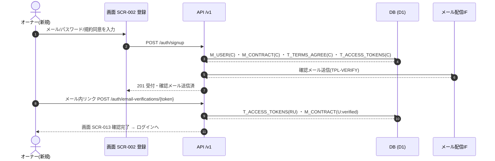
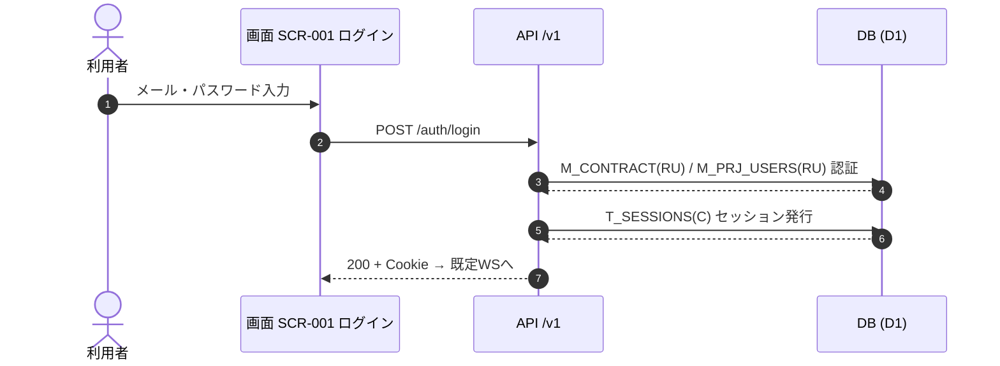
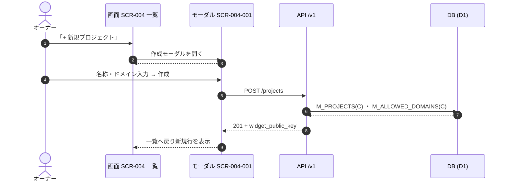
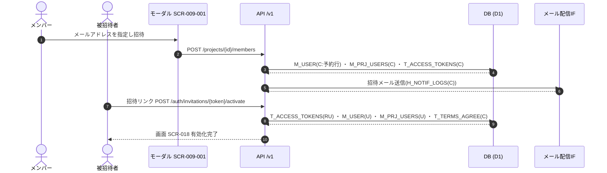
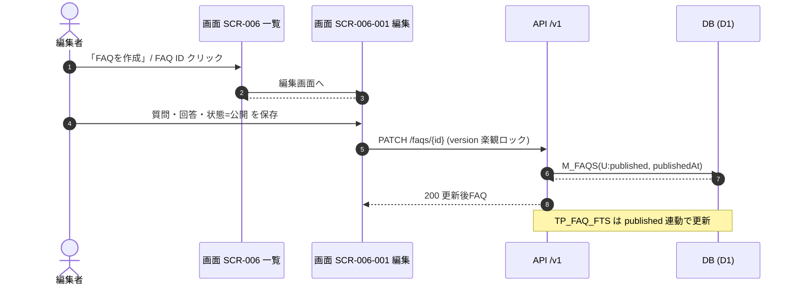
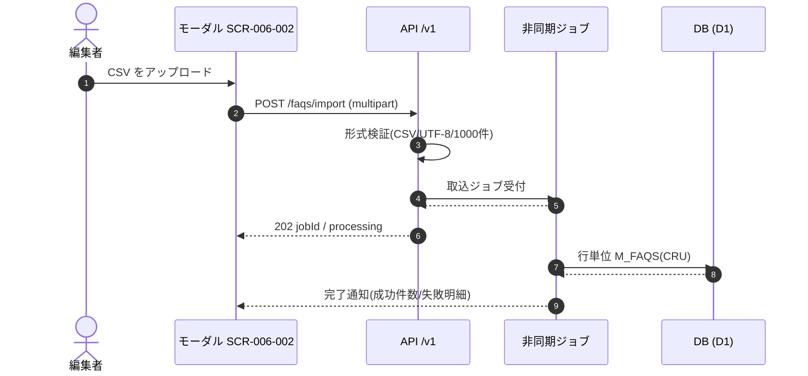
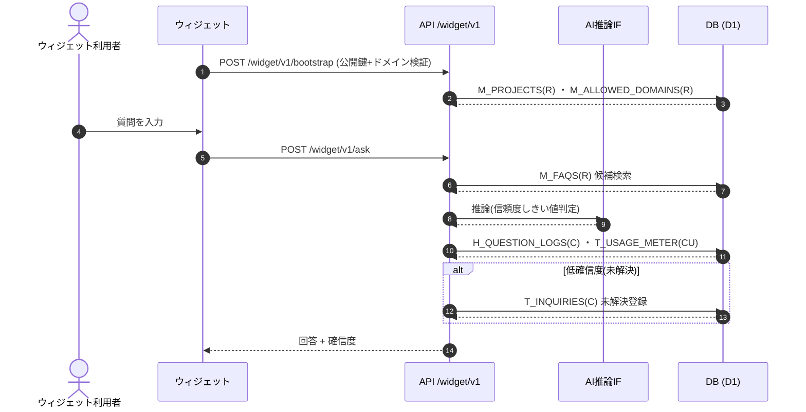
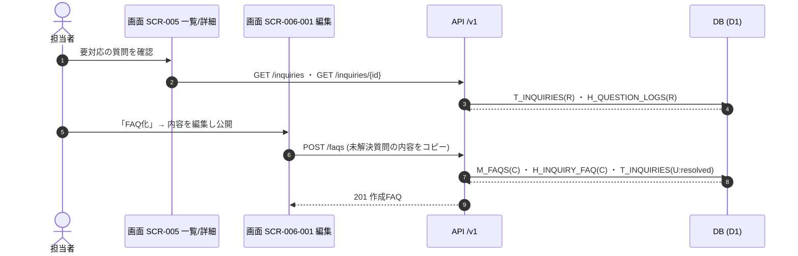
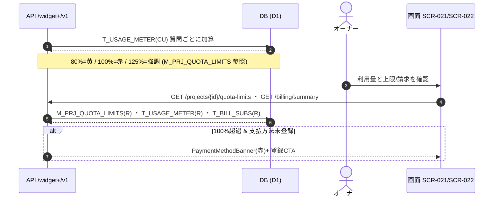
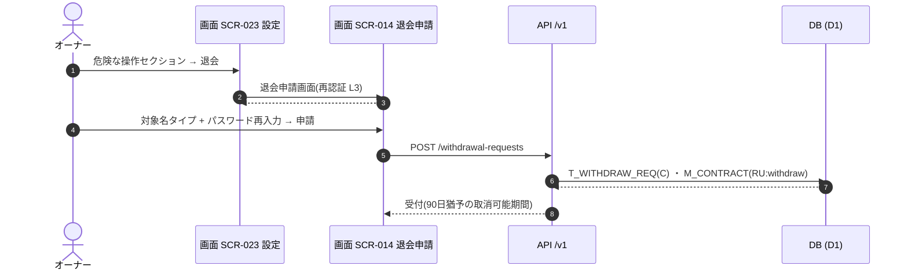

<!-- portal-top -->
[設計ポータル](../../README.md) ／ [基本設計](../index.md) ／ **ユースケース設計**
<!-- /portal-top -->

# ユースケース一覧

> **このページは、システム全体のユースケース(利用者が画面で実行する操作 + システムが自律的・内部的に実行する処理)を一元的に索引する正本カタログです。** 画面起点 UC は「1 画面イベント = 1 ユースケース」、システム起点 UC は「1 処理 = 1 ユースケース」で定義します。

*版数 v3.0 ・ 更新 2026-06-21 ・ 画面起点 229 ・ システム起点 18 ・ 横断フロー 10 ・ ステータス ドラフト*

> [!NOTE]
> **本カタログの範囲** 画面起点 UC は全 30 画面の画面イベント(`SCR-*.md` §6 の `EV-xx`)と 1 対 1 で対応します(合計 229 UC)。システム起点 UC は画面操作を伴わない自律処理を 1 処理 = 1 UC で定義します(18 UC)。複数画面・非同期処理をまたぐ横断的な業務フロー(粗粒度の 10 UC)は本書 [§3 横断ユースケースフロー](#flows) に統合しています。

## 0. 体系と採番

| 区分 | ファイル | UC ID | 粒度 |
|---|---|---|---|
| 画面起点 | `UC-<SCRID>.md`(例 `UC-SCR-006.md`) | `UC-<SCRID>-EV<nn>` | 画面の各 `EV-xx` と 1:1 |
| システム起点 | `UC-SYSTEM-<nnn>.md`(1 ファイル 1 UC) | `UC-SYSTEM-<nnn>` | 1 自律処理 = 1 UC |

各画面 UC ファイルの冒頭(§0)に「イベント↔ユースケース対応表」を備え、`EV-xx` と `UC-<SCRID>-EV<nn>` の 1:1 を可視化しています。

## 1. 画面起点ユースケース

全 30 画面をワークスペース別に索引します。各 UC ファイルがその画面の全イベントに 1:1 対応した UC 群を持ちます。

### 認証・規約フロー

| 画面 | 画面名 | UC ファイル | UC 数 |
|---|---|---|---|
| [SCR-001](../01_screen-design/SCR-001.md#SCR-001) | ログイン | [UC-SCR-001](UC-SCR-001.md) | 6 |
| [SCR-002](../01_screen-design/SCR-002.md#SCR-002) | アカウント登録 | [UC-SCR-002](UC-SCR-002.md) | 12 |
| [SCR-003](../01_screen-design/SCR-003.md#SCR-003) | パスワード再設定 | [UC-SCR-003](UC-SCR-003.md) | 9 |
| [SCR-013](../01_screen-design/SCR-013.md#SCR-013) | メール確認 | [UC-SCR-013](UC-SCR-013.md) | 5 |
| [SCR-015](../01_screen-design/SCR-015.md#SCR-015) | 規約再同意割込み | [UC-SCR-015](UC-SCR-015.md) | 6 |
| [SCR-018](../01_screen-design/SCR-018.md#SCR-018) | メンバーアカウント有効化 | [UC-SCR-018](UC-SCR-018.md) | 13 |
| [SCR-019](../01_screen-design/SCR-019.md#SCR-019) | プロジェクト連絡先メール確認完了 | [UC-SCR-019](UC-SCR-019.md) | 2 |

### 契約ワークスペース

| 画面 | 画面名 | UC ファイル | UC 数 |
|---|---|---|---|
| [SCR-004](../01_screen-design/SCR-004.md#SCR-004) | プロジェクト | [UC-SCR-004](UC-SCR-004.md) | 5 |
| [SCR-004-001](../01_screen-design/SCR-004-001.md#SCR-004-001) | プロジェクト作成・編集モーダル | [UC-SCR-004-001](UC-SCR-004-001.md) | 13 |
| [SCR-014](../01_screen-design/SCR-014.md#SCR-014) | 退会申請 | [UC-SCR-014](UC-SCR-014.md) | 8 |
| [SCR-016](../01_screen-design/SCR-016.md#SCR-016) | 利用状況 | [UC-SCR-016](UC-SCR-016.md) | 3 |
| [SCR-022](../01_screen-design/SCR-022.md#SCR-022) | 請求 | [UC-SCR-022](UC-SCR-022.md) | 7 |
| [SCR-023](../01_screen-design/SCR-023.md#SCR-023) | 設定 | [UC-SCR-023](UC-SCR-023.md) | 7 |

### プロジェクトワークスペース

| 画面 | 画面名 | UC ファイル | UC 数 |
|---|---|---|---|
| [SCR-005](../01_screen-design/SCR-005.md#SCR-005) | 要対応の質問一覧 | [UC-SCR-005](UC-SCR-005.md) | 8 |
| [SCR-005-001](../01_screen-design/SCR-005-001.md#SCR-005-001) | 要対応の質問詳細 | [UC-SCR-005-001](UC-SCR-005-001.md) | 8 |
| [SCR-006](../01_screen-design/SCR-006.md#SCR-006) | FAQ 一覧 | [UC-SCR-006](UC-SCR-006.md) | 14 |
| [SCR-006-001](../01_screen-design/SCR-006-001.md#SCR-006-001) | FAQ 編集 | [UC-SCR-006-001](UC-SCR-006-001.md) | 14 |
| [SCR-006-002](../01_screen-design/SCR-006-002.md#SCR-006-002) | FAQ CSV インポートモーダル | [UC-SCR-006-002](UC-SCR-006-002.md) | 6 |
| [SCR-007](../01_screen-design/SCR-007.md#SCR-007) | ウィジェット設定 | [UC-SCR-007](UC-SCR-007.md) | 11 |
| [SCR-008](../01_screen-design/SCR-008.md#SCR-008) | 概要(プロジェクト) | [UC-SCR-008](UC-SCR-008.md) | 8 |
| [SCR-009](../01_screen-design/SCR-009.md#SCR-009) | メンバー(プロジェクト) | [UC-SCR-009](UC-SCR-009.md) | 8 |
| [SCR-009-001](../01_screen-design/SCR-009-001.md#SCR-009-001) | メンバー招待 / 編集モーダル | [UC-SCR-009-001](UC-SCR-009-001.md) | 10 |
| [SCR-021](../01_screen-design/SCR-021.md#SCR-021) | 利用量と上限(プロジェクト単位) | [UC-SCR-021](UC-SCR-021.md) | 3 |
| [SCR-021-001](../01_screen-design/SCR-021-001.md#SCR-021-001) | 質問数上限設定モーダル | [UC-SCR-021-001](UC-SCR-021-001.md) | 6 |

### 共通領域

| 画面 | 画面名 | UC ファイル | UC 数 |
|---|---|---|---|
| [SCR-010](../01_screen-design/SCR-010.md#SCR-010) | 利用規約閲覧 | [UC-SCR-010](UC-SCR-010.md) | 3 |
| [SCR-011](../01_screen-design/SCR-011.md#SCR-011) | お知らせ一覧 | [UC-SCR-011](UC-SCR-011.md) | 11 |
| [SCR-012](../01_screen-design/SCR-012.md#SCR-012) | お知らせ詳細 | [UC-SCR-012](UC-SCR-012.md) | 4 |
| [SCR-017](../01_screen-design/SCR-017.md#SCR-017) | 個人設定 | [UC-SCR-017](UC-SCR-017.md) | 8 |
| [SCR-020](../01_screen-design/SCR-020.md#SCR-020) | プライバシーポリシー閲覧 | [UC-SCR-020](UC-SCR-020.md) | 3 |

### ウィジェット

| 画面 | 画面名 | UC ファイル | UC 数 |
|---|---|---|---|
| [SCR-WIDGET](../01_screen-design/SCR-WIDGET.md#WIDGET) | エンドユーザー向け FAQ ウィジェット | [UC-SCR-WIDGET](UC-SCR-WIDGET.md) | 8 |

## 2. システム起点ユースケース

画面操作を伴わず、システムが定期・イベント駆動・非同期・Webhook 受信で実行する処理です。

| UC-SYSTEM ID | 名称 | トリガー種別 | 関連(機能グループ) |
|---|---|---|---|
| [UC-SYSTEM-001](UC-SYSTEM-001.md#UC-SYSTEM-001) | 非同期 CSV インポートジョブ | 非同期ジョブ | FR17 インポート・エクスポート |
| [UC-SYSTEM-002](UC-SYSTEM-002.md#UC-SYSTEM-002) | Resend Webhook 受信(配信状態更新) | Webhook 受信 | FR11 通知 |
| [UC-SYSTEM-003](UC-SYSTEM-003.md#UC-SYSTEM-003) | 90 日物理削除バッチ | 定期バッチ | FR13 プライバシー・データ管理 |
| [UC-SYSTEM-004](UC-SYSTEM-004.md#UC-SYSTEM-004) | 月次請求確定バッチ | 定期バッチ(月次) | FR09 利用量・課金 |
| [UC-SYSTEM-005](UC-SYSTEM-005.md#UC-SYSTEM-005) | 運営お知らせ配信 | スケジュール/イベント | FR15 お知らせ |
| [UC-SYSTEM-006](UC-SYSTEM-006.md#UC-SYSTEM-006) | 運用イベントのシステム通知自動生成 | イベントドリブン | FR11 通知 |
| [UC-SYSTEM-007](UC-SYSTEM-007.md#UC-SYSTEM-007) | メンバー割当変更通知 | イベントドリブン | FR02 ユーザー管理 |
| [UC-SYSTEM-008](UC-SYSTEM-008.md#UC-SYSTEM-008) | 質問数上限アラート通知 | イベントドリブン | FR09 利用量・課金 |
| [UC-SYSTEM-009](UC-SYSTEM-009.md#UC-SYSTEM-009) | 通知再送 | 定期バッチ(失敗検出) | FR11 通知 |
| [UC-SYSTEM-010](UC-SYSTEM-010.md#UC-SYSTEM-010) | 利用量リアルタイム集計・UI 反映 | 同期内部処理 | FR09 / FR10 |
| [UC-SYSTEM-011](UC-SYSTEM-011.md#UC-SYSTEM-011) | 上限到達ウィジェット受付停止 | 同期内部処理 | FR09 / FR12 |
| [UC-SYSTEM-012](UC-SYSTEM-012.md#UC-SYSTEM-012) | 決済失敗→猶予→サスペンション | イベント+定期 | FR09 利用量・課金 |
| [UC-SYSTEM-013](UC-SYSTEM-013.md#UC-SYSTEM-013) | セッション失効・再認証 | 定期/検証時 | FR01 / FR14 |
| [UC-SYSTEM-014](UC-SYSTEM-014.md#UC-SYSTEM-014) | ログイン失敗ロックアウト・解除 | イベント+時間 | FR14 セキュリティ |
| [UC-SYSTEM-015](UC-SYSTEM-015.md#UC-SYSTEM-015) | 契約停止時セッション一斉無効化 | イベント(状態遷移) | FR01 / FR14 |
| [UC-SYSTEM-016](UC-SYSTEM-016.md#UC-SYSTEM-016) | AI しきい値変更の伝播・フォールバック | イベント | FR20 AI 推論動作 |
| [UC-SYSTEM-017](UC-SYSTEM-017.md#UC-SYSTEM-017) | 受信箱の重複集約 | 定期/集約 | FR11 / FR15 |
| [UC-SYSTEM-018](UC-SYSTEM-018.md#UC-SYSTEM-018) | 監査ログ整合性検証(日次) | 定期バッチ(日次) | NFR(監査) |

## 3. 横断ユースケースフロー

複数画面・API・非同期処理にまたがる主要 10 業務フローを「アクター → 画面 → API → DB」のシーケンスで示します。画面イベント単位の詳細は §1、システム自律処理は §2 を参照してください。メッセージ中の `テーブル名(CRUD)` は [データベース設計](../03_database-design/index.md) のテーブルに対応します。

### 3.1 横断ユースケース一覧

| UC ID | ユースケース | アクター | 主な画面 | 関連要件 |
|---|---|---|---|---|
| [UC-01](#UC-01) | アカウント新規登録〜メール確認 | 契約オーナー(新規) | [SCR-002](../01_screen-design/index.md#SCR-002) ・ [SCR-013](../01_screen-design/index.md#SCR-013) | FR01 アカウント管理 |
| [UC-02](#UC-02) | ログイン | 全認証ユーザー | [SCR-001](../01_screen-design/index.md#SCR-001) | FR01 アカウント管理 |
| [UC-03](#UC-03) | プロジェクト作成 | オーナー | [SCR-004](../01_screen-design/index.md#SCR-004) ・ [SCR-004-001](../01_screen-design/index.md#SCR-004-001) | FR03 プロジェクト管理 |
| [UC-04](#UC-04) | メンバー招待〜アカウント有効化 | オーナー / メンバー → 被招待者 | [SCR-009-001](../01_screen-design/index.md#SCR-009-001) ・ [SCR-018](../01_screen-design/index.md#SCR-018) | FR02 ユーザー管理 |
| [UC-05](#UC-05) | FAQ 作成・公開 | オーナー / メンバー+ | [SCR-006](../01_screen-design/index.md#SCR-006) ・ [SCR-006-001](../01_screen-design/index.md#SCR-006-001) | FR04 FAQ 管理 |
| [UC-06](#UC-06) | FAQ CSV 一括インポート(非同期) | オーナー / メンバー+ | [SCR-006-002](../01_screen-design/index.md#SCR-006-002) | FR17 インポート・エクスポート |
| [UC-07](#UC-07) | エンドユーザー質問 → AI 回答 | ウィジェット利用者(公開) | [WIDGET](../01_screen-design/index.md#WIDGET) | FR05 AI 回答 / FR20 AI 推論動作 |
| [UC-08](#UC-08) | 未解決質問 → FAQ 化 | オーナー / メンバー+ | [SCR-005](../01_screen-design/index.md#SCR-005) ・ [SCR-005-001](../01_screen-design/index.md#SCR-005-001) ・ [SCR-006-001](../01_screen-design/index.md#SCR-006-001) | FR06 未解決質問登録 / FR07 未解決質問から FAQ 登録 |
| [UC-09](#UC-09) | 利用量超過 → 支払方法ゲート | オーナー | [SCR-021](../01_screen-design/index.md#SCR-021) ・ [SCR-022](../01_screen-design/index.md#SCR-022) | FR09 利用量・課金 |
| [UC-10](#UC-10) | 退会申請(90 日猶予) | オーナー | [SCR-023](../01_screen-design/index.md#SCR-023) ・ [SCR-014](../01_screen-design/index.md#SCR-014) | FR01 アカウント管理 / FR13 プライバシー・データ管理 |

### 3.2 シーケンス図(フロー)

各横断フローを「アクター → 画面(SCR)→ API → DB」のシーケンスで示します。詳細なアクション単位の対応は [画面設計 §4](../01_screen-design/index.md#flow) を正本とします。

#### UC-01 アカウント新規登録〜メール確認

**アクター** 契約オーナー(新規) **関連要件** FR01 アカウント管理

|  |  |
|----|----|
| **事前条件** | 未登録のメールアドレスを保有している。 |
| **事後条件** | `M_CONTRACT` が `status=active` で作成され、ログイン可能になる。 |
| **関連画面** | [`SCR-002`](../01_screen-design/index.md#SCR-002) ・ [`SCR-013`](../01_screen-design/index.md#SCR-013) |

#### UC-02 ログイン

**アクター** 全認証ユーザー **関連要件** FR01 アカウント管理

|              |                                                         |
|--------------|---------------------------------------------------------|
| **事前条件** | 有効なアカウントを保有している。                        |
| **事後条件** | `T_SESSIONS` が発行され、既定ワークスペースへ着地する。 |
| **関連画面** | [`SCR-001`](../01_screen-design/index.md#SCR-001)              |

#### UC-03 プロジェクト作成

**アクター** オーナー **関連要件** FR03 プロジェクト管理

|  |  |
|----|----|
| **事前条件** | 契約ワークスペースにログインしている。 |
| **事後条件** | `M_PROJECTS` と許可ドメインが作成され、ウィジェット公開鍵が払い出される。 |
| **関連画面** | [`SCR-004`](../01_screen-design/index.md#SCR-004) ・ [`SCR-004-001`](../01_screen-design/index.md#SCR-004-001) |

#### UC-04 メンバー招待〜アカウント有効化

**アクター** オーナー / メンバー → 被招待者 **関連要件** FR02 ユーザー管理

|  |  |
|----|----|
| **事前条件** | オーナーまたは当該プロジェクトのメンバーである。 |
| **事後条件** | 被招待者の `M_USER`(予約行)が有効化(`status='active'`)され、当該プロジェクトのメンバー割当(`M_PRJ_USERS`)が有効になる。 |
| **関連画面** | [`SCR-009-001`](../01_screen-design/index.md#SCR-009-001) ・ [`SCR-018`](../01_screen-design/index.md#SCR-018) |

#### UC-05 FAQ 作成・公開

**アクター** オーナー / メンバー+ **関連要件** FR04 FAQ管理

|  |  |
|----|----|
| **事前条件** | プロジェクトに編集権限で参加している。 |
| **事後条件** | `M_FAQS` が `status=published` となる。 |
| **関連画面** | [`SCR-006`](../01_screen-design/index.md#SCR-006) ・ [`SCR-006-001`](../01_screen-design/index.md#SCR-006-001) |

#### UC-06 FAQ CSV 一括インポート(非同期)

**アクター** オーナー / メンバー+ **関連要件** FR17 インポート・エクスポート

|  |  |
|----|----|
| **事前条件** | CSV(UTF-8・最大1000件)を用意している。 |
| **事後条件** | 各行が新規/上書き判定され `M_FAQS` に取り込まれる(行単位エラー集計)。 |
| **関連画面** | [`SCR-006-002`](../01_screen-design/index.md#SCR-006-002) |

#### UC-07 エンドユーザー質問 → AI 回答

**アクター** ウィジェット利用者(公開) **関連要件** FR05 AI回答 / FR20 AI推論動作

|  |  |
|----|----|
| **事前条件** | ウィジェットが許可ドメインに設置されている。 |
| **事後条件** | 質問が `H_QUESTION_LOGS` に記録され、低確信度なら `T_INQUIRIES` に未解決登録される。利用量を計測。 |
| **関連画面** | [`WIDGET`](../01_screen-design/index.md#WIDGET) |

#### UC-08 未解決質問 → FAQ 化

**アクター** オーナー / メンバー+ **関連要件** FR06 未解決質問登録 / FR07 未解決質問からFAQ登録

|  |  |
|----|----|
| **事前条件** | UC-07 で未解決質問が登録されている。 |
| **事後条件** | 未解決質問を基に `M_FAQS` が作成され、`T_INQUIRIES` が解決状態に更新される。 |
| **関連画面** | [`SCR-005`](../01_screen-design/index.md#SCR-005) ・ [`SCR-005-001`](../01_screen-design/index.md#SCR-005-001) ・ [`SCR-006-001`](../01_screen-design/index.md#SCR-006-001) |

#### UC-09 利用量超過 → 支払方法ゲート

**アクター** オーナー **関連要件** FR09 利用量・課金

|  |  |
|----|----|
| **事前条件** | 当月の質問数が無料枠に近づいている。 |
| **事後条件** | 無料枠 100% 超過かつ支払方法未登録ならウィジェットを制限(契約は active のまま)。 |
| **関連画面** | [`SCR-021`](../01_screen-design/index.md#SCR-021) ・ [`SCR-022`](../01_screen-design/index.md#SCR-022) |

#### UC-10 退会申請(90日猶予)

**アクター** オーナー **関連要件** FR01 アカウント管理 / FR13 プライバシー・データ管理

|  |  |
|----|----|
| **事前条件** | オーナーとしてログインしている。 |
| **事後条件** | `T_WITHDRAW_REQ` が作成され、`M_CONTRACT.status` が退会フローに入る。 |
| **関連画面** | [`SCR-023`](../01_screen-design/index.md#SCR-023) ・ [`SCR-014`](../01_screen-design/index.md#SCR-014) |

## 4. 要件トレーサビリティ(機能グループ別)

各機能要件グループ(FR01〜FR21)が、少なくとも 1 つ以上のユースケースに対応していることを示します。横断フロー列は §3 の該当 UC を指します。

| 機能グループ | 対応する画面起点 UC | 対応するシステム起点 UC | 横断フロー |
|---|---|---|---|
| FR01 アカウント管理 | UC-SCR-001 / 002 / 003 / 013 / 014 / 023 | UC-SYSTEM-003 / 013 / 015 | [UC-01](#UC-01) / [UC-02](#UC-02) / [UC-10](#UC-10) |
| FR02 ユーザー管理 | UC-SCR-009 / 009-001 / 018 | UC-SYSTEM-007 | [UC-04](#UC-04) |
| FR03 プロジェクト管理 | UC-SCR-004 / 004-001 | — | [UC-03](#UC-03) |
| FR04 FAQ 管理 | UC-SCR-006 / 006-001 | — | [UC-05](#UC-05) |
| FR05 AI 回答 | UC-SCR-WIDGET | UC-SYSTEM-016 | [UC-07](#UC-07) |
| FR06 未解決質問登録 | UC-SCR-WIDGET / 005 / 005-001 | — | [UC-08](#UC-08) |
| FR07 未解決質問から FAQ 登録 | UC-SCR-005-001 / 006-001 | — | [UC-08](#UC-08) |
| FR08 処理エラー | UC-SCR-WIDGET(EV-08)ほか各 UC の異常系フロー | UC-SYSTEM-009 | — |
| FR09 利用量・課金 | UC-SCR-016 / 021 / 021-001 / 022 | UC-SYSTEM-004 / 008 / 010 / 011 / 012 | [UC-09](#UC-09) |
| FR10 管理ダッシュボード | UC-SCR-008 / 016 | UC-SYSTEM-010 | — |
| FR11 通知 | UC-SCR-011 / 012 | UC-SYSTEM-002 / 006 / 007 / 009 / 017 | — |
| FR12 ウィジェット | UC-SCR-007 / WIDGET | UC-SYSTEM-011 | [UC-07](#UC-07) |
| FR13 プライバシー・データ管理 | UC-SCR-014 / 017 / 020 | UC-SYSTEM-003 | [UC-10](#UC-10) |
| FR14 セキュリティ | UC-SCR-001 | UC-SYSTEM-013 / 014 / 015 | [UC-02](#UC-02) |
| FR15 お知らせ | UC-SCR-010 / 011 / 012 / 020 | UC-SYSTEM-005 / 017 | — |
| FR16 検索エンジン・全文検索 | UC-SCR-005 / 006 | — | — |
| FR17 インポート・エクスポート | UC-SCR-006 / 006-002 | UC-SYSTEM-001 | [UC-06](#UC-06) |
| FR18 UX 細部・データ運用 | UC-SCR-006 / 006-001 | — | — |
| FR19 アクセス制御細部 | UC-SCR-007 / 009-001 / 021(各 UC の権限ガード異常系) | UC-SYSTEM-015 | — |
| FR20 AI 推論動作 | UC-SCR-WIDGET | UC-SYSTEM-016 | [UC-07](#UC-07) |
| FR21 画面・機能要件一覧 | 全 30 画面の UC-SCR 群(本 §1) | — | §3 全フロー |

> [!NOTE]
> **監査・整合性** 監査ログの整合性検証(NFR 監査要件)は [UC-SYSTEM-018](UC-SYSTEM-018.md#UC-SYSTEM-018) が担います。各操作の監査記録は対応する画面起点・システム起点 UC の事後条件に記載します。

---

<!-- portal-bottom -->
[基本設計](../index.md) ・ [↑ 設計ポータル](../../README.md)
<!-- /portal-bottom -->
