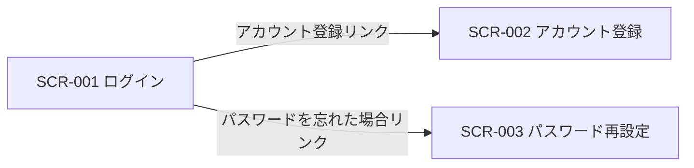
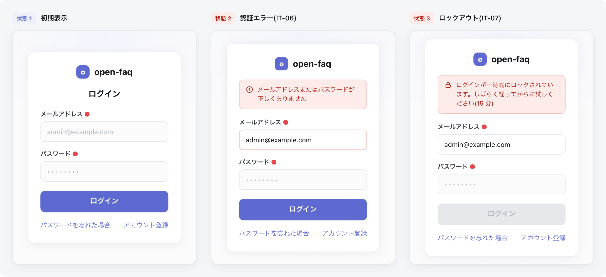

<!-- portal-top -->
[設計ポータル](../README.md) ／ [基本設計](index.md) ／ [画面設計](01_screen-design.md) ／ **SCR-001 ログイン**
<!-- /portal-top -->

# SCR-001 ログイン

> **このページは、アカウント利用者がメールアドレスとパスワードでセッションを確立する画面 SCR-001 を定義します。** 画面概要 / 画面遷移図 / 画面レイアウト / 画面項目定義 / 入出力一覧 / 画面イベント一覧 の 6 セクションで記述します。

*版数 v1.0 ・ 更新 2026-06-17 ・ 承認済*

## <span id="1-画面概要"></span>1. 画面概要

アカウント利用者がメールアドレスとパスワードを入力してセッションを確立する画面です。失敗回数制限・ロックアウトの警告表示と、アカウント登録・パスワード再設定への導線を持ちます。

| 画面 ID | 画面名 | 機能概要 |
|----|----|----|
| <span id="SCR-001"></span>`SCR-001` | ログイン | メールアドレスとパスワードによる認証でセッションを確立する |

| 関連 | 内容 |
|----|----|
| FR / BR | FR-004, FR-007, FR-008 / BR-028, BR-030 |
| 関連画面 | [`SCR-002` アカウント登録](SCR-002.md) / [`SCR-003` パスワード再設定](SCR-003.md) |

| ステークホルダ             | 対象 |
|----------------------------|------|
| 未認証ユーザー(ログイン前) | ◯    |

> [!NOTE]
> **補足** 本画面は認証前に表示されるため権限は不要です(認証前)。認証エラーはメールアドレスの存在有無を区別しない共通文言で表示し、攻撃者にヒントを与えません。

## <span id="2-画面遷移図"></span>2. 画面遷移図

本画面からの画面遷移を、画面 ID・画面名とイベント(操作)で示します。



## <span id="3-画面レイアウト"></span>3. 画面レイアウト



<details>
<summary>画面モック HTML（ソース）</summary>

```html
<div style="background:#f5f6f8;padding:24px;border-radius:12px;font-family:'Noto Sans JP',-apple-system,BlinkMacSystemFont,'Hiragino Kaku Gothic ProN',Meiryo,sans-serif;color:#3a3f46;-webkit-font-smoothing:antialiased;--accent:#5e6ad2">
<div style="max-width:1180px;margin:0 auto;display:flex;flex-direction:column;gap:32px">
  <div style="display:flex;gap:28px;align-items:flex-start;flex-wrap:wrap">
    <!-- STATE 1 -->
    <section style="flex:none;width:360px">
      <div style="display:flex;align-items:center;gap:9px;margin-bottom:12px">
        <span style="font-size:11px;font-weight:700;color:var(--accent,#5e6ad2);background:color-mix(in srgb,var(--accent,#5e6ad2) 10%,#fff);border-radius:6px;padding:3px 8px">状態 1</span>
        <span style="font-size:13px;font-weight:600;color:#16191d">初期表示</span>
      </div>
      <div style="height:460px;background:radial-gradient(120% 80% at 50% 0%,color-mix(in srgb,var(--accent,#5e6ad2) 7%,#fff) 0%,#fbfbfc 60%);border:1px solid #e6e8eb;border-radius:14px;box-shadow:0 1px 2px rgba(16,24,40,.04),0 6px 20px rgba(16,24,40,.05);display:flex;align-items:center;justify-content:center;padding:24px">
        <div style="width:300px;background:#fff;border:1px solid #eef0f2;border-radius:14px;box-shadow:0 4px 18px rgba(16,24,40,.06);padding:26px 24px">
          <div style="display:flex;align-items:center;justify-content:center;gap:9px;margin-bottom:18px"><span style="width:26px;height:26px;border-radius:8px;background:var(--accent,#5e6ad2);display:inline-flex;align-items:center;justify-content:center;color:#fff;font-size:14px;font-weight:800">o</span><span style="font-weight:700;font-size:17px;color:#16191d">open-faq</span></div>
          <h2 style="margin:0 0 18px;font-size:16px;font-weight:700;color:#16191d;text-align:center">ログイン</h2>
          <label style="display:block;font-size:12px;font-weight:600;color:#3a3f46;margin-bottom:6px">メールアドレス<span style="color:#e5484d;margin-left:3px">●</span></label>
          <div style="height:40px;border:1px solid #e6e8eb;border-radius:8px;background:#fbfbfc;display:flex;align-items:center;padding:0 12px;font-size:13px;color:#b5bac0;margin-bottom:14px">admin@example.com</div>
          <label style="display:block;font-size:12px;font-weight:600;color:#3a3f46;margin-bottom:6px">パスワード<span style="color:#e5484d;margin-left:3px">●</span></label>
          <div style="height:40px;border:1px solid #e6e8eb;border-radius:8px;background:#fbfbfc;display:flex;align-items:center;padding:0 12px;font-size:13px;letter-spacing:2px;color:#b5bac0;margin-bottom:18px">••••••••</div>
          <button style="width:100%;height:42px;border:none;border-radius:9px;background:var(--accent,#5e6ad2);color:#fff;font-size:14px;font-weight:600;cursor:pointer;box-shadow:0 1px 2px rgba(16,24,40,.12);font-family:inherit">ログイン</button>
          <div style="display:flex;justify-content:space-between;margin-top:16px;font-size:12.5px"><a style="color:var(--accent,#5e6ad2);text-decoration:none;cursor:pointer">パスワードを忘れた場合</a><a style="color:var(--accent,#5e6ad2);text-decoration:none;cursor:pointer">アカウント登録</a></div>
        </div>
      </div>
    </section>
    <!-- STATE 2 -->
    <section style="flex:none;width:360px">
      <div style="display:flex;align-items:center;gap:9px;margin-bottom:12px">
        <span style="font-size:11px;font-weight:700;color:#b42318;background:#fdecea;border-radius:6px;padding:3px 8px">状態 2</span>
        <span style="font-size:13px;font-weight:600;color:#16191d">認証エラー(IT-06)</span>
      </div>
      <div style="height:460px;background:radial-gradient(120% 80% at 50% 0%,color-mix(in srgb,var(--accent,#5e6ad2) 7%,#fff) 0%,#fbfbfc 60%);border:1px solid #e6e8eb;border-radius:14px;box-shadow:0 1px 2px rgba(16,24,40,.04),0 6px 20px rgba(16,24,40,.05);display:flex;align-items:center;justify-content:center;padding:24px">
        <div style="width:300px;background:#fff;border:1px solid #eef0f2;border-radius:14px;box-shadow:0 4px 18px rgba(16,24,40,.06);padding:26px 24px">
          <div style="display:flex;align-items:center;justify-content:center;gap:9px;margin-bottom:18px"><span style="width:26px;height:26px;border-radius:8px;background:var(--accent,#5e6ad2);display:inline-flex;align-items:center;justify-content:center;color:#fff;font-size:14px;font-weight:800">o</span><span style="font-weight:700;font-size:17px;color:#16191d">open-faq</span></div>
          <div style="display:flex;align-items:flex-start;gap:8px;padding:10px 12px;border:1px solid #f5c2bd;background:#fdecea;border-radius:9px;color:#b42318;font-size:12px;line-height:1.5;margin-bottom:16px"><svg width="15" height="15" viewBox="0 0 24 24" fill="none" stroke="currentColor" stroke-width="1.9" stroke-linecap="round" stroke-linejoin="round" style="flex:none;margin-top:1px"><circle cx="12" cy="12" r="9"></circle><path d="M12 8v5"></path><path d="M12 16h.01"></path></svg><span>メールアドレスまたはパスワードが正しくありません</span></div>
          <label style="display:block;font-size:12px;font-weight:600;color:#3a3f46;margin-bottom:6px">メールアドレス<span style="color:#e5484d;margin-left:3px">●</span></label>
          <div style="height:40px;border:1px solid #f0b6b0;border-radius:8px;background:#fff;display:flex;align-items:center;padding:0 12px;font-size:13px;color:#16191d;margin-bottom:14px">admin@example.com</div>
          <label style="display:block;font-size:12px;font-weight:600;color:#3a3f46;margin-bottom:6px">パスワード<span style="color:#e5484d;margin-left:3px">●</span></label>
          <div style="height:40px;border:1px solid #e6e8eb;border-radius:8px;background:#fbfbfc;display:flex;align-items:center;padding:0 12px;font-size:13px;letter-spacing:2px;color:#b5bac0;margin-bottom:18px">••••••••</div>
          <button style="width:100%;height:42px;border:none;border-radius:9px;background:var(--accent,#5e6ad2);color:#fff;font-size:14px;font-weight:600;cursor:pointer;box-shadow:0 1px 2px rgba(16,24,40,.12);font-family:inherit">ログイン</button>
          <div style="display:flex;justify-content:space-between;margin-top:16px;font-size:12.5px"><a style="color:var(--accent,#5e6ad2);text-decoration:none;cursor:pointer">パスワードを忘れた場合</a><a style="color:var(--accent,#5e6ad2);text-decoration:none;cursor:pointer">アカウント登録</a></div>
        </div>
      </div>
    </section>
    <!-- STATE 3 -->
    <section style="flex:none;width:360px">
      <div style="display:flex;align-items:center;gap:9px;margin-bottom:12px">
        <span style="font-size:11px;font-weight:700;color:#b42318;background:#fdecea;border-radius:6px;padding:3px 8px">状態 3</span>
        <span style="font-size:13px;font-weight:600;color:#16191d">ロックアウト(IT-07)</span>
      </div>
      <div style="height:460px;background:radial-gradient(120% 80% at 50% 0%,color-mix(in srgb,var(--accent,#5e6ad2) 7%,#fff) 0%,#fbfbfc 60%);border:1px solid #e6e8eb;border-radius:14px;box-shadow:0 1px 2px rgba(16,24,40,.04),0 6px 20px rgba(16,24,40,.05);display:flex;align-items:center;justify-content:center;padding:24px">
        <div style="width:300px;background:#fff;border:1px solid #eef0f2;border-radius:14px;box-shadow:0 4px 18px rgba(16,24,40,.06);padding:26px 24px">
          <div style="display:flex;align-items:center;justify-content:center;gap:9px;margin-bottom:18px"><span style="width:26px;height:26px;border-radius:8px;background:var(--accent,#5e6ad2);display:inline-flex;align-items:center;justify-content:center;color:#fff;font-size:14px;font-weight:800">o</span><span style="font-weight:700;font-size:17px;color:#16191d">open-faq</span></div>
          <div style="display:flex;align-items:flex-start;gap:8px;padding:10px 12px;border:1px solid #f5c2bd;background:#fdecea;border-radius:9px;color:#b42318;font-size:12px;line-height:1.5;margin-bottom:16px"><svg width="15" height="15" viewBox="0 0 24 24" fill="none" stroke="currentColor" stroke-width="1.9" stroke-linecap="round" stroke-linejoin="round" style="flex:none;margin-top:1px"><rect x="5" y="11" width="14" height="9" rx="2"></rect><path d="M8 11V8a4 4 0 0 1 8 0v3"></path></svg><span>ログインが一時的にロックされています。しばらく経ってからお試しください(15 分)</span></div>
          <label style="display:block;font-size:12px;font-weight:600;color:#3a3f46;margin-bottom:6px">メールアドレス<span style="color:#e5484d;margin-left:3px">●</span></label>
          <div style="height:40px;border:1px solid #e6e8eb;border-radius:8px;background:#fff;display:flex;align-items:center;padding:0 12px;font-size:13px;color:#16191d;margin-bottom:14px">admin@example.com</div>
          <label style="display:block;font-size:12px;font-weight:600;color:#3a3f46;margin-bottom:6px">パスワード<span style="color:#e5484d;margin-left:3px">●</span></label>
          <div style="height:40px;border:1px solid #e6e8eb;border-radius:8px;background:#fbfbfc;display:flex;align-items:center;padding:0 12px;font-size:13px;letter-spacing:2px;color:#b5bac0;margin-bottom:18px">••••••••</div>
          <button style="width:100%;height:42px;border:none;border-radius:9px;background:#e6e8eb;color:#b5bac0;font-size:14px;font-weight:600;cursor:not-allowed;font-family:inherit">ログイン</button>
          <div style="display:flex;justify-content:space-between;margin-top:16px;font-size:12.5px"><a style="color:var(--accent,#5e6ad2);text-decoration:none;cursor:pointer">パスワードを忘れた場合</a><a style="color:var(--accent,#5e6ad2);text-decoration:none;cursor:pointer">アカウント登録</a></div>
        </div>
      </div>
    </section>
  </div>
</div>
</div>
```

</details>

## <span id="4-画面項目定義"></span>4. 画面項目定義

本画面の入出力項目(入力フォーム・操作ボタン・エラー表示)を定義します。項目の正本は本表です。

| 項目 ID | 項目 | 説明 | 種類 | 表示条件 | 表示 |
|----|----|----|----|----|----|
| <span id="IT-01"></span>`IT-01` | メールアドレス | ログインに用いるメールアドレスを入力する(必須・形式チェック) | テキストボックス(メールアドレス) | — | placeholder「admin@example.com」 |
| <span id="IT-02"></span>`IT-02` | パスワード | ログインに用いるパスワードを入力する(必須) | テキストボックス(パスワード) | — | マスク表示 |
| <span id="IT-03"></span>`IT-03` | ログインボタン | 入力内容で認証を実行しセッションを確立する | ボタン(Primary) | — | 「ログイン」 |
| <span id="IT-04"></span>`IT-04` | パスワードを忘れた場合 | パスワード再設定画面へ遷移する導線 | リンク | — | 「パスワードを忘れた場合」 |
| <span id="IT-05"></span>`IT-05` | アカウント登録 | アカウント登録画面へ遷移する導線 | リンク | — | 「アカウント登録」 |
| <span id="IT-06"></span>`IT-06` | 認証エラーメッセージ | 認証失敗時に共通文言のエラーを表示する(メールアドレスの存在有無を区別しない) | アラート | 認証失敗時のみ | 「認証エラー: メールアドレスまたはパスワードが正しくありません」 |
| <span id="IT-07"></span>`IT-07` | ロックアウト警告 | 連続失敗(5 回)による一時ロック(15 分)中である旨を表示する | アラート | 5 回連続失敗後のみ | 「ログインが一時的にロックされています。しばらく経ってからお試しください(15 分)」 |

## <span id="5-入出力一覧"></span>5. 入出力一覧

本画面が読み書きするテーブルと、呼び出す API の一覧です。テーブルの正本は [03_テーブル設計](03_database-design.md)、API の正本は [02_API設計 §5.1.2](02_api-design.md#API-AUTH-002) です。

<table>
<thead>
<tr>
<th rowspan="2">入出力名</th>
<th rowspan="2">説明</th>
<th rowspan="2">種別</th>
<th rowspan="2">I/O</th>
<th colspan="4">アクセス種別(CRUD)</th>
<th rowspan="2">備考</th>
</tr>
<tr>
<th>C</th>
<th>R</th>
<th>U</th>
<th>D</th>
</tr>
</thead>
<tbody>
<tr>
<td>オーナー / プロジェクトユーザー</td>
<td>認証情報を照合する(オーナーマスタとプロジェクトユーザーマスタは完全分離。両マスタを照合対象とする)</td>
<td>テーブル</td>
<td>入力</td>
<td>—</td>
<td>◯</td>
<td>—</td>
<td>—</td>
<td><code>M_CONTRACT</code>(<a href="03_database-design.md#TBL-M-001">テーブル設計 3.2</a>)/ <code>M_PRJ_USERS</code>(<a href="03_database-design.md#TBL-M-003">テーブル設計 3.1</a>)</td>
</tr>
<tr>
<td>ログイン</td>
<td>認証してセッションを発行する</td>
<td>API</td>
<td>入力 / 出力</td>
<td>—</td>
<td>—</td>
<td>—</td>
<td>—</td>
<td><code>POST /auth/login</code>(<a href="02_api-design.md#API-AUTH-002">API 設計 5.1.2</a>)</td>
</tr>
</tbody>
</table>

## <span id="6-画面イベント一覧"></span>6. 画面イベント一覧

本画面で発生するイベントと発生タイミング・概要の一覧です。

<table>
<colgroup>
<col style="width: 20%" />
<col style="width: 20%" />
<col style="width: 20%" />
<col style="width: 20%" />
<col style="width: 20%" />
</colgroup>
<thead>
<tr>
<th>イベント ID</th>
<th>イベント</th>
<th>トリガー</th>
<th>処理</th>
<th>関連項目</th>
</tr>
</thead>
<tbody>
<tr>
<td><code>EV-01</code></td>
<td>入力バリデーション</td>
<td>各入力欄のフォーカスアウト時</td>
<td>メールアドレス形式・必須を検証しエラーを表示</td>
<td><a href="#IT-01">IT-01</a>, <a href="#IT-02">IT-02</a></td>
</tr>
<tr>
<td><code>EV-02</code></td>
<td>ログイン実行</td>
<td>ログインボタン押下時</td>
<td><ul>
<li><code>POST /auth/login</code> で認証</li>
<li>成功時は規約再同意チェック後に利用状況系画面へ遷移</li>
<li>失敗時は共通エラーを表示</li>
</ul></td>
<td><a href="#IT-03">IT-03</a>, <a href="#IT-06">IT-06</a></td>
</tr>
<tr>
<td><code>EV-03</code></td>
<td>ロックアウト表示</td>
<td>5 回連続失敗後のログイン試行時</td>
<td>15 分間のロックアウト警告を表示し試行を抑止(FR-007)</td>
<td><a href="#IT-07">IT-07</a></td>
</tr>
<tr>
<td><code>EV-04</code></td>
<td>パスワード再設定へ遷移</td>
<td>「パスワードを忘れた場合」押下時</td>
<td>SCR-003 へ遷移</td>
<td><a href="#IT-04">IT-04</a></td>
</tr>
<tr>
<td><code>EV-05</code></td>
<td>アカウント登録へ遷移</td>
<td>「アカウント登録」押下時</td>
<td>SCR-002 へ遷移</td>
<td><a href="#IT-05">IT-05</a></td>
</tr>
</tbody>
</table>

---

---

---

<!-- portal-bottom -->
[← 画面設計](01_screen-design.md) ・ [基本設計](index.md) ・ [↑ 設計ポータル](../README.md)
<!-- /portal-bottom -->
