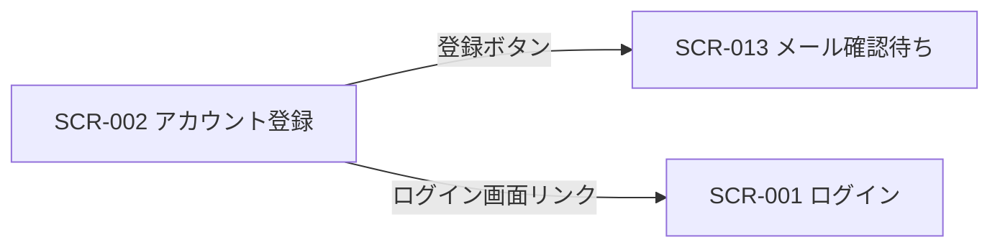
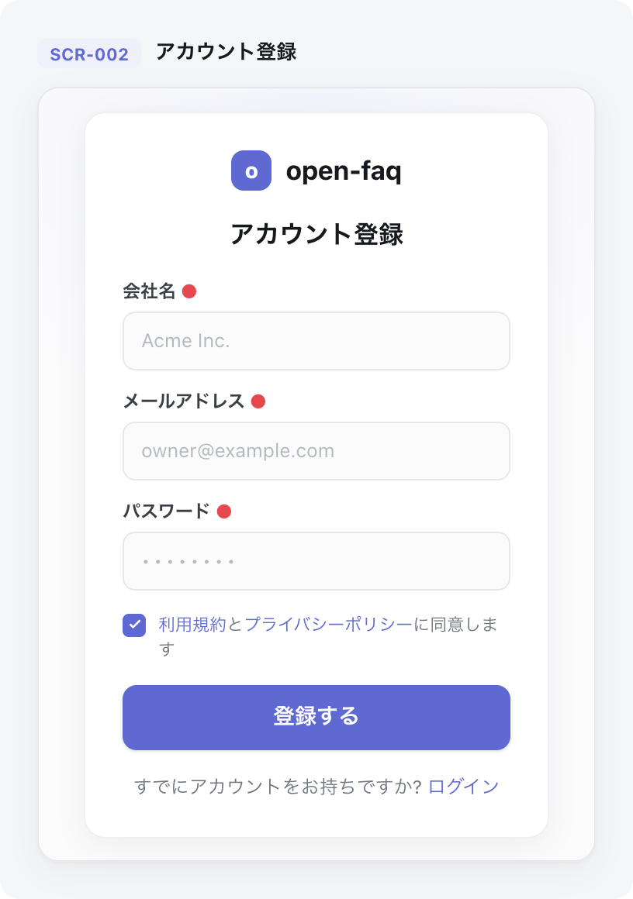

<!-- portal-top -->
[設計ポータル](../README.md) ／ [基本設計](index.md) ／ [画面設計](01_screen-design.md) ／ **SCR-002 アカウント登録**
<!-- /portal-top -->

# SCR-002 アカウント登録

> **このページは、新規オーナーがメールアドレスとパスワードでアカウントを登録し、確認メール送信フローへ進む画面 SCR-002 を定義します。** 画面概要 / 画面遷移図 / 画面レイアウト / 画面項目定義 / 入出力一覧 / 画面イベント一覧 の 6 セクションで記述します。

*版数 v1.0 ・ 更新 2026-06-17 ・ 承認済*

## <span id="1-画面概要"></span>1. 画面概要

新規オーナーがメールアドレス・パスワード・規約同意を入力してアカウントを登録し、確認メール送信フロー(SCR-013)へ進む画面です。

| 画面 ID | 画面名 | 機能概要 |
|----|----|----|
| <span id="SCR-002"></span>`SCR-002` | アカウント登録 | 新規オーナーのアカウント登録と確認メール送信フローへの導線を提供する |

| 関連     | 内容                               |
|----------|------------------------------------|
| FR / BR  | FR-001, FR-002 / BR-028            |
| 関連画面 | [`SCR-001` ログイン](SCR-001.md) |

| ステークホルダ             | 対象 |
|----------------------------|------|
| 未認証ユーザー(ログイン前) | ◯    |

> [!NOTE]
> **補足** 本画面は認証前に表示されるため権限は不要です(認証前)。登録するユーザーは契約のオーナー(契約あたり 1 ユーザー)となります。高規制業界(金融 / 医療等)を業種に選択した場合は標準提供範囲外である旨を表示し、サポート窓口を案内します。

## <span id="2-画面遷移図"></span>2. 画面遷移図

本画面からの画面遷移を、画面 ID・画面名とイベント(操作)で示します。



## <span id="3-画面レイアウト"></span>3. 画面レイアウト



<details>
<summary>画面モック HTML（ソース）</summary>

```html
<div style="background:#f5f6f8;padding:24px;border-radius:12px;font-family:'Noto Sans JP',-apple-system,BlinkMacSystemFont,'Hiragino Kaku Gothic ProN',Meiryo,sans-serif;color:#3a3f46;--accent:#5e6ad2;--row-pad:14px"><div style="max-width:1180px;margin:0 auto;display:flex;flex-direction:column;gap:28px"><section style="flex:none;width:360px">
      <div style="display:flex;align-items:center;gap:9px;margin-bottom:12px"><span style="font-size:11px;font-weight:700;color:var(--accent,#5e6ad2);background:color-mix(in srgb,var(--accent,#5e6ad2) 10%,#fff);border-radius:6px;padding:3px 8px">SCR-002</span><span style="font-size:13px;font-weight:600;color:#16191d">アカウント登録</span></div>
      <div style="height:500px;background:radial-gradient(120% 80% at 50% 0%,color-mix(in srgb,var(--accent,#5e6ad2) 7%,#fff) 0%,#fbfbfc 60%);border:1px solid #e6e8eb;border-radius:14px;box-shadow:0 1px 2px rgba(16,24,40,.04),0 6px 20px rgba(16,24,40,.05);display:flex;align-items:center;justify-content:center;padding:24px">
        <div style="width:300px;background:#fff;border:1px solid #eef0f2;border-radius:14px;box-shadow:0 4px 18px rgba(16,24,40,.06);padding:24px">
          <div style="display:flex;align-items:center;justify-content:center;gap:9px;margin-bottom:16px"><span style="width:26px;height:26px;border-radius:8px;background:var(--accent,#5e6ad2);display:inline-flex;align-items:center;justify-content:center;color:#fff;font-size:14px;font-weight:800">o</span><span style="font-weight:700;font-size:17px;color:#16191d">open-faq</span></div>
          <h2 style="margin:0 0 16px;font-size:16px;font-weight:700;color:#16191d;text-align:center">アカウント登録</h2>
          <label style="display:block;font-size:11.5px;font-weight:600;color:#3a3f46;margin-bottom:5px">会社名<span style="color:#e5484d;margin-left:3px">●</span></label>
          <div style="height:38px;border:1px solid #e6e8eb;border-radius:8px;background:#fbfbfc;display:flex;align-items:center;padding:0 11px;font-size:12.5px;color:#b5bac0;margin-bottom:11px">Acme Inc.</div>
          <label style="display:block;font-size:11.5px;font-weight:600;color:#3a3f46;margin-bottom:5px">メールアドレス<span style="color:#e5484d;margin-left:3px">●</span></label>
          <div style="height:38px;border:1px solid #e6e8eb;border-radius:8px;background:#fbfbfc;display:flex;align-items:center;padding:0 11px;font-size:12.5px;color:#b5bac0;margin-bottom:11px">owner@example.com</div>
          <label style="display:block;font-size:11.5px;font-weight:600;color:#3a3f46;margin-bottom:5px">パスワード<span style="color:#e5484d;margin-left:3px">●</span></label>
          <div style="height:38px;border:1px solid #e6e8eb;border-radius:8px;background:#fbfbfc;display:flex;align-items:center;padding:0 11px;font-size:12.5px;letter-spacing:2px;color:#b5bac0;margin-bottom:14px">••••••••</div>
          <div style="display:flex;align-items:flex-start;gap:8px;margin-bottom:14px"><span style="width:15px;height:15px;border:1.5px solid var(--accent,#5e6ad2);border-radius:4px;background:var(--accent,#5e6ad2);display:flex;align-items:center;justify-content:center;flex:none;margin-top:1px"><svg width="10" height="10" viewBox="0 0 24 24" fill="none" stroke="#fff" stroke-width="3" stroke-linecap="round" stroke-linejoin="round"><path d="m5 12 4 4 10-10"></path></svg></span><span style="font-size:11px;color:#71767e;line-height:1.5"><a style="color:var(--accent,#5e6ad2);text-decoration:none">利用規約</a>と<a style="color:var(--accent,#5e6ad2);text-decoration:none">プライバシーポリシー</a>に同意します</span></div>
          <button style="width:100%;height:42px;border:none;border-radius:9px;background:var(--accent,#5e6ad2);color:#fff;font-size:14px;font-weight:600;cursor:pointer;box-shadow:0 1px 2px rgba(16,24,40,.12);font-family:inherit">登録する</button>
          <div style="text-align:center;margin-top:14px;font-size:12px;color:#71767e">すでにアカウントをお持ちですか? <a style="color:var(--accent,#5e6ad2);text-decoration:none;cursor:pointer">ログイン</a></div>
        </div>
      </div>
    </section></div></div>
```

</details>

## <span id="4-画面項目定義"></span>4. 画面項目定義

本画面の入出力項目(入力フォーム・同意チェック・操作ボタン)を定義します。項目の正本は本表です。

| 項目 ID | 項目 | 説明 | 種類 | 表示条件 | 表示 |
|----|----|----|----|----|----|
| <span id="IT-01"></span>`IT-01` | メールアドレス | オーナー本人のメールアドレスを入力する(必須・形式チェック) | テキストボックス(メールアドレス) | — | placeholder「admin@example.com」 |
| <span id="IT-02"></span>`IT-02` | パスワード | アカウントのパスワードを入力する(必須・強度要件: 12 文字以上・3 種類以上の文字種) | テキストボックス(パスワード) | — | マスク表示 |
| <span id="IT-03"></span>`IT-03` | パスワード(確認) | パスワードを再入力して一致を確認する(必須・一致確認) | テキストボックス(パスワード) | — | マスク表示 |
| <span id="IT-04"></span>`IT-04` | 業種選択 | 利用者の業種を選択する(任意) | ドロップダウン | — | 「選択してください」/ IT / 小売 / 教育 / 金融 … |
| <span id="IT-05"></span>`IT-05` | 利用規約同意 | 利用規約への同意を表明する(必須チェック) | チェックボックス | — | 「利用規約に同意する」 |
| <span id="IT-06"></span>`IT-06` | プライバシーポリシー同意 | プライバシーポリシーへの同意を表明する(必須チェック) | チェックボックス | — | 「プライバシーポリシーに同意する」 |
| <span id="IT-07"></span>`IT-07` | 規約・ポリシーリンク | 利用規約・プライバシーポリシーの全文を別ウィンドウで表示する | リンク | — | 「全文を別ウィンドウで表示」 |
| <span id="IT-08"></span>`IT-08` | 登録ボタン | 入力内容で登録し確認メール送信フローへ進む | ボタン(Primary) | — | 「登録して確認メールを送信する」 |
| <span id="IT-09"></span>`IT-09` | ログイン画面リンク | 既存ユーザー向けにログイン画面へ遷移する導線 | リンク | — | 「ログインする」 |

## <span id="5-入出力一覧"></span>5. 入出力一覧

本画面が読み書きするテーブルと、呼び出す API の一覧です。テーブルの正本は [03_テーブル設計](03_database-design.md)、API の正本は [02_API設計 §5.1.1](02_api-design.md) です。

<table>
<thead>
<tr>
<th rowspan="2">入出力名</th>
<th rowspan="2">説明</th>
<th rowspan="2">種別</th>
<th rowspan="2">I/O</th>
<th colspan="4">アクセス種別(CRUD)</th>
<th rowspan="2">備考</th>
</tr>
<tr>
<th>C</th>
<th>R</th>
<th>U</th>
<th>D</th>
</tr>
</thead>
<tbody>
<tr>
<td>オーナー</td>
<td>メール重複を確認し新規オーナーを作成する(1 契約 = 1 オーナー。オーナーマスタはプロジェクトユーザーと完全分離)</td>
<td>テーブル</td>
<td>出力</td>
<td>◯</td>
<td>◯</td>
<td>—</td>
<td>—</td>
<td><code>M_CONTRACT</code>(<a href="03_database-design.md#TBL-M-001">テーブル設計 3.2</a>)</td>
</tr>
<tr>
<td>新規登録</td>
<td>登録して確認メールを送信する</td>
<td>API</td>
<td>入力 / 出力</td>
<td>—</td>
<td>—</td>
<td>—</td>
<td>—</td>
<td><code>POST /auth/signup</code>(<a href="02_api-design.md">API 設計 5.1.1</a>)</td>
</tr>
</tbody>
</table>

## <span id="6-画面イベント一覧"></span>6. 画面イベント一覧

本画面で発生するイベントと発生タイミング・概要の一覧です。

<table>
<colgroup>
<col style="width: 20%" />
<col style="width: 20%" />
<col style="width: 20%" />
<col style="width: 20%" />
<col style="width: 20%" />
</colgroup>
<thead>
<tr>
<th>イベント ID</th>
<th>イベント</th>
<th>トリガー</th>
<th>処理</th>
<th>関連項目</th>
</tr>
</thead>
<tbody>
<tr>
<td><code>EV-01</code></td>
<td>入力バリデーション</td>
<td>各入力欄のフォーカスアウト時</td>
<td>メール形式・パスワード強度・確認一致・必須同意を検証しエラーを表示</td>
<td><a href="#IT-01">IT-01</a>, <a href="#IT-02">IT-02</a>, <a href="#IT-03">IT-03</a>, <a href="#IT-05">IT-05</a>, <a href="#IT-06">IT-06</a></td>
</tr>
<tr>
<td><code>EV-02</code></td>
<td>業種選択</td>
<td>業種プルダウン変更時</td>
<td>高規制業界選択時に提供範囲外の注意とサポート窓口を表示</td>
<td><a href="#IT-04">IT-04</a></td>
</tr>
<tr>
<td><code>EV-03</code></td>
<td>登録実行</td>
<td>登録ボタン押下時</td>
<td><ul>
<li><code>POST /auth/signup</code> で登録し確認メールを送信</li>
<li>完了後 SCR-013 へ遷移</li>
</ul></td>
<td><a href="#IT-08">IT-08</a></td>
</tr>
<tr>
<td><code>EV-04</code></td>
<td>ログイン画面へ遷移</td>
<td>「ログインする」押下時</td>
<td>SCR-001 へ遷移</td>
<td><a href="#IT-09">IT-09</a></td>
</tr>
<tr>
<td><code>EV-05</code></td>
<td>規約・ポリシー全文表示</td>
<td>規約・ポリシーリンク押下時</td>
<td>利用規約 / プライバシーポリシーの全文を別ウィンドウで表示</td>
<td><a href="#IT-07">IT-07</a></td>
</tr>
</tbody>
</table>

---

---

---

<!-- portal-bottom -->
[← 画面設計](01_screen-design.md) ・ [基本設計](index.md) ・ [↑ 設計ポータル](../README.md)
<!-- /portal-bottom -->
