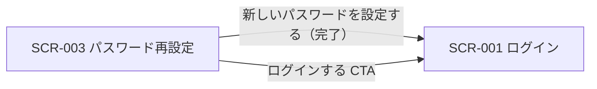

<!-- portal-top -->
[設計ポータル](../README.md) ／ [基本設計](index.md) ／ [画面設計](01_screen-design.md) ／ **SCR-003 パスワード再設定**
<!-- /portal-top -->

# SCR-003 パスワード再設定

> **このページは、アカウント利用者がメールの再設定リンクから新しいパスワードを設定する画面 SCR-003 を定義します。** 画面概要 / 画面遷移図 / 画面レイアウト / 画面項目定義 / 入出力一覧 / 画面イベント一覧 の 6 セクションで記述します。

*版数 v1.0 ・ 更新 2026-06-17 ・ 承認済*

## <span id="1-画面概要"></span>1. 画面概要

メールアドレス入力で再設定リンクを送信(段階 1)し、受信メールのリンクから新しいパスワードを設定する(段階 2)画面です。3 段階構成のタイムラインで進行を示します。

| 画面 ID | 画面名 | 機能概要 |
|----|----|----|
| <span id="SCR-003"></span>`SCR-003` | パスワード再設定 | 再設定リンク発行(段階 1)と新パスワード設定(段階 2)を行う |

| 関連     | 内容                               |
|----------|------------------------------------|
| FR / BR  | FR-004, FR-006 / BR-028            |
| 関連画面 | [`SCR-001` ログイン](SCR-001.md) |

| ステークホルダ             | 対象 |
|----------------------------|------|
| 未認証ユーザー(ログイン前) | ◯    |

> [!NOTE]
> **補足** 本画面は認証前に表示されるため権限は不要です(認証前)。段階 1 の送信応答はメールアドレスの存在有無を区別しません(列挙攻撃対策)。段階 2 の完了時に当該ユーザーの全セッションを失効します。

## <span id="2-画面遷移図"></span>2. 画面遷移図

本画面からの画面遷移を、画面 ID・画面名とイベント(操作)で示します。



## <span id="3-画面レイアウト"></span>3. 画面レイアウト


<details>
<summary>画面モック HTML（ソース）</summary>

```html
<div style="background:#f5f6f8;padding:24px;border-radius:12px;font-family:'Noto Sans JP',-apple-system,BlinkMacSystemFont,'Hiragino Kaku Gothic ProN',Meiryo,sans-serif;color:#3a3f46;--accent:#5e6ad2;--row-pad:14px"><div style="max-width:1180px;margin:0 auto;display:flex;flex-direction:column;gap:28px"><section style="flex:none;width:360px">
      <div style="display:flex;align-items:center;gap:9px;margin-bottom:12px"><span style="font-size:11px;font-weight:700;color:var(--accent,#5e6ad2);background:color-mix(in srgb,var(--accent,#5e6ad2) 10%,#fff);border-radius:6px;padding:3px 8px">SCR-003</span><span style="font-size:13px;font-weight:600;color:#16191d">パスワード再設定</span></div>
      <div style="height:500px;background:radial-gradient(120% 80% at 50% 0%,color-mix(in srgb,var(--accent,#5e6ad2) 7%,#fff) 0%,#fbfbfc 60%);border:1px solid #e6e8eb;border-radius:14px;box-shadow:0 1px 2px rgba(16,24,40,.04),0 6px 20px rgba(16,24,40,.05);display:flex;align-items:center;justify-content:center;padding:24px">
        <div style="width:300px;background:#fff;border:1px solid #eef0f2;border-radius:14px;box-shadow:0 4px 18px rgba(16,24,40,.06);padding:26px 24px">
          <div style="display:flex;align-items:center;justify-content:center;gap:9px;margin-bottom:18px"><span style="width:26px;height:26px;border-radius:8px;background:var(--accent,#5e6ad2);display:inline-flex;align-items:center;justify-content:center;color:#fff;font-size:14px;font-weight:800">o</span><span style="font-weight:700;font-size:17px;color:#16191d">open-faq</span></div>
          <h2 style="margin:0 0 8px;font-size:16px;font-weight:700;color:#16191d;text-align:center">パスワード再設定</h2>
          <p style="margin:0 0 18px;font-size:12px;color:#71767e;text-align:center;line-height:1.6">ご登録のメールアドレスに再設定用リンクをお送りします。</p>
          <label style="display:block;font-size:11.5px;font-weight:600;color:#3a3f46;margin-bottom:5px">メールアドレス<span style="color:#e5484d;margin-left:3px">●</span></label>
          <div style="height:40px;border:1px solid #e6e8eb;border-radius:8px;background:#fbfbfc;display:flex;align-items:center;padding:0 12px;font-size:13px;color:#b5bac0;margin-bottom:18px">admin@example.com</div>
          <button style="width:100%;height:42px;border:none;border-radius:9px;background:var(--accent,#5e6ad2);color:#fff;font-size:14px;font-weight:600;cursor:pointer;box-shadow:0 1px 2px rgba(16,24,40,.12);font-family:inherit">再設定リンクを送信</button>
          <div style="text-align:center;margin-top:16px;font-size:12px"><a style="color:var(--accent,#5e6ad2);text-decoration:none;cursor:pointer">ログインに戻る</a></div>
        </div>
      </div>
    </section></div></div>
```

</details>

## <span id="4-画面項目定義"></span>4. 画面項目定義

本画面の入出力項目(段階 1 / 段階 2 の入力フォーム・操作ボタン・状態表示)を定義します。項目の正本は本表です。

| 項目 ID | 項目 | 説明 | 種類 | 表示条件 | 表示 |
|----|----|----|----|----|----|
| <span id="IT-01"></span>`IT-01` | ステップタイムライン | 再設定の 3 段階の進行状況を表示する(現在ステップを強調) | タイムライン | — | ① メールアドレスを入力 → ② 受信メールのリンクをクリック → ③ 新しいパスワードを設定 |
| <span id="IT-02"></span>`IT-02` | メールアドレス(段階 1) | 再設定リンクの送信先メールアドレスを入力する(必須・形式チェック) | テキストボックス(メールアドレス) | 段階 1 のみ | placeholder「admin@example.com」 |
| <span id="IT-03"></span>`IT-03` | 再設定リンクを送信 | 入力アドレス宛に再設定リンクを送信する(存在有無は同一応答・列挙攻撃対策) | ボタン(Primary) | 段階 1 のみ | 「再設定リンクを送信」 |
| <span id="IT-04"></span>`IT-04` | メール送信済み案内 | 再設定メールを送信した旨と有効期限を案内表示する | アラート | 段階 1 送信完了後のみ | 「{メールアドレス} にメールを送信しました。1 時間以内にリンクをクリックして再設定を完了してください」 |
| <span id="IT-05"></span>`IT-05` | メールを再送信する | 再設定メールを再送する(5 分以内は押下不可) | ボタン(Secondary) | 段階 1 送信完了後のみ | 「メールを再送信する(あと N 分 N 秒)」(カウントダウン併記) |
| <span id="IT-06"></span>`IT-06` | 新パスワード(段階 2) | 新しいパスワードを入力し強度を確認する(必須・強度要件) | テキストボックス(パスワード)+ プログレスバー | 段階 2 のみ | マスク表示 + 強度 5 段階バー + 不足要件メッセージ(例「強度: 中(あと 2 文字、あと 1 種類の文字種が必要)」) |
| <span id="IT-07"></span>`IT-07` | 新パスワード(確認) | 新しいパスワードを再入力して一致を確認する(必須・一致確認) | テキストボックス(パスワード) | 段階 2 のみ | マスク表示 |
| <span id="IT-08"></span>`IT-08` | 新しいパスワードを設定する | 入力内容で新しいパスワードを確定する | ボタン(Primary) | 段階 2 のみ | 「新しいパスワードを設定する」 |
| <span id="IT-09"></span>`IT-09` | トークン無効 / 期限切れエラー | 再設定リンクが無効・期限切れである旨と再送導線を表示する | アラート + 再送リンク | 段階 2 でリンク不正時のみ | 「再設定リンクが期限切れ、または無効です(有効期限 1 時間)。新しいリンクを再送してください」+「再送する」 |
| <span id="IT-10"></span>`IT-10` | 完了画面 / ログインする | 設定完了を案内しログイン画面への導線を表示する | アラート + ボタン | パスワード設定完了後のみ | 「新しいパスワードを設定しました。ログインしてください」+「ログインする」 |

## <span id="5-入出力一覧"></span>5. 入出力一覧

本画面が読み書きするテーブルと、呼び出す API の一覧です。テーブルの正本は [03_テーブル設計](03_database-design.md)、API の正本は [02_API設計 §5.1.4](02_api-design.md) です。

<table>
<thead>
<tr>
<th rowspan="2">入出力名</th>
<th rowspan="2">説明</th>
<th rowspan="2">種別</th>
<th rowspan="2">I/O</th>
<th colspan="4">アクセス種別(CRUD)</th>
<th rowspan="2">備考</th>
</tr>
<tr>
<th>C</th>
<th>R</th>
<th>U</th>
<th>D</th>
</tr>
</thead>
<tbody>
<tr>
<td>オーナー / プロジェクトユーザー</td>
<td>段階 2 でパスワードハッシュを更新する(対象マスタはトークンの actor 種別で特定。両マスタは完全分離)</td>
<td>テーブル</td>
<td>入力 / 出力</td>
<td>—</td>
<td>◯</td>
<td>◯</td>
<td>—</td>
<td><code>M_CONTRACT</code>(<a href="03_database-design.md#TBL-M-001">テーブル設計 3.2</a>)/ <code>M_PRJ_USERS</code>(<a href="03_database-design.md#TBL-M-003">テーブル設計 3.1</a>)</td>
</tr>
<tr>
<td>パスワード再設定要求</td>
<td>段階 1 で再設定リンクを発行する(存在有無を返さない)</td>
<td>API</td>
<td>入力 / 出力</td>
<td>—</td>
<td>—</td>
<td>—</td>
<td>—</td>
<td><code>POST /auth/password-reset-request</code>(<a href="02_api-design.md">API 設計 5.1.4</a>)</td>
</tr>
</tbody>
</table>

## <span id="6-画面イベント一覧"></span>6. 画面イベント一覧

本画面で発生するイベントと発生タイミング・概要の一覧です。

<table>
<colgroup>
<col style="width: 20%" />
<col style="width: 20%" />
<col style="width: 20%" />
<col style="width: 20%" />
<col style="width: 20%" />
</colgroup>
<thead>
<tr>
<th>イベント ID</th>
<th>イベント</th>
<th>トリガー</th>
<th>処理</th>
<th>関連項目</th>
</tr>
</thead>
<tbody>
<tr>
<td><code>EV-01</code></td>
<td>再設定リンク送信</td>
<td>段階 1「再設定リンクを送信」押下時</td>
<td><ul>
<li><code>POST /auth/password-reset-request</code> を発行</li>
<li>送信済み案内を表示(存在有無は同一応答)</li>
</ul></td>
<td><a href="#IT-02">IT-02</a>, <a href="#IT-03">IT-03</a>, <a href="#IT-04">IT-04</a></td>
</tr>
<tr>
<td><code>EV-02</code></td>
<td>メール再送</td>
<td>段階 1 送信後「メールを再送信する」押下時</td>
<td>5 分のレート制限カウントダウン経過後に再送を許可</td>
<td><a href="#IT-05">IT-05</a></td>
</tr>
<tr>
<td><code>EV-03</code></td>
<td>トークン検証</td>
<td>段階 2 の画面表示時</td>
<td><ul>
<li>再設定リンクのトークンを検証</li>
<li>無効 / 期限切れ時はエラー帯と再送 CTA を表示</li>
</ul></td>
<td><a href="#IT-09">IT-09</a></td>
</tr>
<tr>
<td><code>EV-04</code></td>
<td>新パスワード設定</td>
<td>段階 2「新しいパスワードを設定する」押下時</td>
<td><ul>
<li>強度・一致を検証しパスワードを更新</li>
<li>全セッション失効後に完了画面 → SCR-001 へ</li>
</ul></td>
<td><a href="#IT-06">IT-06</a>, <a href="#IT-07">IT-07</a>, <a href="#IT-08">IT-08</a>, <a href="#IT-10">IT-10</a></td>
</tr>
</tbody>
</table>

---

---

---

<!-- portal-bottom -->
[← 画面設計](01_screen-design.md) ・ [基本設計](index.md) ・ [↑ 設計ポータル](../README.md)
<!-- /portal-bottom -->
