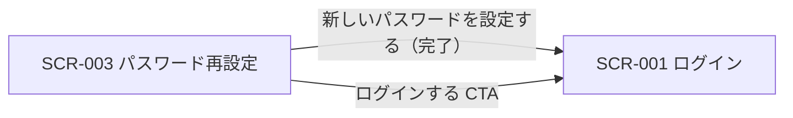

<!-- portal-top -->
[設計ポータル](../README.md) ／ [基本設計](index.md) ／ [画面設計](01_screen-design.md) ／ **SCR-003 パスワード再設定**
<!-- /portal-top -->

# SCR-003 パスワード再設定

> **このページは、アカウント利用者がメールの再設定リンクから新しいパスワードを設定する画面 SCR-003 を定義します。** 画面概要 / 画面遷移図 / 画面レイアウト / 画面項目定義 / 入出力一覧 / 画面イベント一覧 の 6 セクションで記述します。

*版数 v1.0 ・ 更新 2026-06-17 ・ 承認済*

## 1. 画面概要

メールアドレス入力で再設定リンクを送信(段階 1)し、受信メールのリンクから新しいパスワードを設定する(段階 2)画面です。3 段階構成のタイムラインで進行を示します。

| 画面 ID | 画面名 | 機能概要 |
|----|----|----|
| `SCR-003` | パスワード再設定 | 再設定リンク発行(段階 1)と新パスワード設定(段階 2)を行う |

| 関連     | 内容                               |
|----------|------------------------------------|
| FR / BR  | FR-004, FR-006 / BR-001            |
| 関連画面 | [`SCR-001` ログイン](SCR-001.md) |

| ステークホルダ             | 対象 |
|----------------------------|------|
| 未認証ユーザー(ログイン前) | ◯    |

> [!NOTE]
> **補足** 本画面は認証前に表示されるため権限は不要です(認証前)。段階 1 の送信応答はメールアドレスの存在有無を区別しません(列挙攻撃対策)。段階 2 の完了時に当該ユーザーの全セッションを失効します。

## 2. 画面遷移図

本画面からの画面遷移を、画面 ID・画面名とイベント(操作)で示します。

## 3. 画面レイアウト

## 4. 画面項目定義

本画面の入出力項目(段階 1 / 段階 2 の入力フォーム・操作ボタン・状態表示)を定義します。項目の正本は本表です。

| 項目 ID | 項目 | 説明 | 種類 | 表示条件 | 表示 |
|----|----|----|----|----|----|
| `IT-01` | ステップタイムライン | 再設定の 3 段階の進行状況を表示する(現在ステップを強調) | タイムライン | — | ① メールアドレスを入力 → ② 受信メールのリンクをクリック → ③ 新しいパスワードを設定 |
| `IT-02` | メールアドレス(段階 1) | 再設定リンクの送信先メールアドレスを入力する(必須・形式チェック) | テキストボックス(メールアドレス) | 段階 1 のみ | placeholder「admin@example.com」 |
| `IT-03` | 再設定リンクを送信 | 入力アドレス宛に再設定リンクを送信する(存在有無は同一応答・列挙攻撃対策) | ボタン(Primary) | 段階 1 のみ | 「再設定リンクを送信」 |
| `IT-04` | メール送信済み案内 | 再設定メールを送信した旨と有効期限を案内表示する | アラート | 段階 1 送信完了後のみ | 「{メールアドレス} にメールを送信しました。1 時間以内にリンクをクリックして再設定を完了してください」 |
| `IT-05` | メールを再送信する | 再設定メールを再送する(5 分以内は押下不可) | ボタン(Secondary) | 段階 1 送信完了後のみ | 「メールを再送信する(あと N 分 N 秒)」(カウントダウン併記) |
| `IT-06` | 新パスワード(段階 2) | 新しいパスワードを入力し強度を確認する(必須・強度要件) | テキストボックス(パスワード)+ プログレスバー | 段階 2 のみ | マスク表示 + 強度 5 段階バー + 不足要件メッセージ(例「強度: 中(あと 2 文字、あと 1 種類の文字種が必要)」) |
| `IT-07` | 新パスワード(確認) | 新しいパスワードを再入力して一致を確認する(必須・一致確認) | テキストボックス(パスワード) | 段階 2 のみ | マスク表示 |
| `IT-08` | 新しいパスワードを設定する | 入力内容で新しいパスワードを確定する | ボタン(Primary) | 段階 2 のみ | 「新しいパスワードを設定する」 |
| `IT-09` | トークン無効 / 期限切れエラー | 再設定リンクが無効・期限切れである旨と再送導線を表示する | アラート + 再送リンク | 段階 2 でリンク不正時のみ | 「再設定リンクが期限切れ、または無効です(有効期限 1 時間)。新しいリンクを再送してください」+「再送する」 |
| `IT-10` | 完了画面 / ログインする | 設定完了を案内しログイン画面への導線を表示する | アラート + ボタン | パスワード設定完了後のみ | 「新しいパスワードを設定しました。ログインしてください」+「ログインする」 |
| `IT-11` | ログインに戻る | 段階 1 フォーム下部に表示するテキストリンク。押下でログイン画面へ戻る | テキストリンク | 段階 1 のみ | 「ログインに戻る」 |

## 5. 入出力一覧

本画面が読み書きするテーブルと、呼び出す API の一覧です。テーブルの正本は [データベース設計](03_database-design.md)、API の正本は [API設計](02_api-design.md) です。

<table>
<thead>
<tr>
<th rowspan="2">入出力名</th>
<th rowspan="2">説明</th>
<th rowspan="2">種別</th>
<th rowspan="2">I/O</th>
<th colspan="4">アクセス種別(CRUD)</th>
<th rowspan="2">備考</th>
</tr>
<tr>
<th>C</th>
<th>R</th>
<th>U</th>
<th>D</th>
</tr>
</thead>
<tbody>
<tr>
<td>オーナー / プロジェクトユーザー</td>
<td>段階 2 でパスワードハッシュを更新する(対象マスタはトークンの actor 種別で特定。両マスタは完全分離)</td>
<td>テーブル</td>
<td>入力 / 出力</td>
<td>—</td>
<td>◯</td>
<td>◯</td>
<td>—</td>
<td><code>M_CONTRACT</code>(<a href="03_database-design.md#TBL-M-001">テーブル設計 3.2</a>)/ <code>M_PRJ_USERS</code>(<a href="03_database-design.md#TBL-M-003">テーブル設計 3.1</a>)</td>
</tr>
<tr>
<td>パスワード再設定要求</td>
<td>段階 1 で再設定リンクを発行する(存在有無を返さない)</td>
<td>API</td>
<td>入力 / 出力</td>
<td>—</td>
<td>—</td>
<td>—</td>
<td>—</td>
<td><a href="API-auth.md#API-AUTH-004">パスワード再設定要求</a>(<code>POST /auth/password-reset-request</code>)</td>
</tr>
<tr>
<td>パスワード再設定確定</td>
<td>段階 2 でトークンと新パスワードを受け取り、パスワードハッシュを更新して全セッションを失効する</td>
<td>API</td>
<td>入力 / 出力</td>
<td>—</td>
<td>◯</td>
<td>◯</td>
<td>—</td>
<td><a href="API-auth.md#API-AUTH-010">パスワード再設定確定</a>(<code>POST /auth/password-reset</code>)</td>
</tr>
</tbody>
</table>

## 6. 画面イベント一覧

本画面のイベント(初期表示・各操作)ごとに、対象の項目 ID と処理内容を定義します。

<table>
<colgroup>
<col style="width: 12%" />
<col style="width: 12%" />
<col style="width: 30%" />
<col style="width: 46%" />
</colgroup>
<thead>
<tr>
<th>イベント ID</th>
<th>項目 ID</th>
<th>イベント</th>
<th>処理</th>
</tr>
</thead>
<tbody>
<tr>
<td><code>EV-01</code></td>
<td>—</td>
<td>初期表示(段階 1)</td>
<td><ul>
<li>IT-01 タイムライン(段階 1 を強調)を表示</li>
<li>IT-02 メールアドレス入力フィールドと IT-03 送信ボタンを表示</li>
</ul></td>
</tr>
<tr>
<td><code>EV-02</code></td>
<td><a href="#IT-03">IT-03</a></td>
<td>「再設定リンクを送信」を押下</td>
<td><ul>
<li>IT-02 の形式バリデーションを実行する</li>
<li>形式不正時: IT-02 直下にエラーメッセージを表示してリクエストを中断</li>
<li>形式正常時: <a href="API-auth.md#API-AUTH-004">パスワード再設定要求</a> API を発行する(存在有無は漏らさず一律応答)</li>
<li>応答受取後: IT-04 送信済み案内と IT-05 再送ボタン(カウントダウン付き)を表示する</li>
</ul></td>
</tr>
<tr>
<td><code>EV-03</code></td>
<td><a href="#IT-05">IT-05</a></td>
<td>「メールを再送信する」を押下</td>
<td><ul>
<li>5 分のレート制限カウントダウン中は非活性のため操作不可</li>
<li>カウントダウン完了後: <a href="API-auth.md#API-AUTH-004">パスワード再設定要求</a> API を再発行する</li>
<li>応答受取後: カウントダウンをリセットして IT-05 を再び非活性にする</li>
</ul></td>
</tr>
<tr>
<td><code>EV-04</code></td>
<td>—</td>
<td>初期表示(段階 2)</td>
<td><ul>
<li>メールの再設定リンクから URL トークンを取得して検証する</li>
<li>トークン有効時: IT-01 タイムライン(段階 2 を強調)、IT-06・IT-07・IT-08 フォームを表示する</li>
<li>トークン無効 / 期限切れ時: IT-09 エラーアラートと再送リンクを表示する</li>
</ul></td>
</tr>
<tr>
<td><code>EV-05</code></td>
<td><a href="#IT-09">IT-09</a></td>
<td>「再送する」を押下(段階 2 エラー時)</td>
<td><ul>
<li><a href="API-auth.md#API-AUTH-004">パスワード再設定要求</a> API を発行する</li>
<li>応答受取後: 段階 1 送信済み状態(IT-04・IT-05 表示)へ遷移する</li>
</ul></td>
</tr>
<tr>
<td><code>EV-06</code></td>
<td><a href="#IT-06">IT-06</a></td>
<td>新パスワードを入力</td>
<td><ul>
<li>入力のたびに強度バーと不足要件メッセージ(IT-06)をリアルタイム更新する(FR-006 準拠: 12 文字以上・3 種類以上の文字種)</li>
</ul></td>
</tr>
<tr>
<td><code>EV-07</code></td>
<td><a href="#IT-08">IT-08</a></td>
<td>「新しいパスワードを設定する」を押下</td>
<td><ul>
<li>IT-06 の強度要件(FR-006: 12 文字以上・英大小文字・数字・記号 3 種類以上)を検証する</li>
<li>IT-07 の一致を検証する</li>
<li>検証失敗時: 不足要件メッセージ / 不一致エラーを表示してリクエストを中断する</li>
<li>検証成功時: <a href="API-auth.md#API-AUTH-010">パスワード再設定確定</a> API を発行する。成功時はパスワードハッシュを更新し当該ユーザーの全セッションを失効させる</li>
<li>完了後: IT-10 完了画面(「ログインしてください」案内 + IT-10 ボタン)を表示する</li>
</ul></td>
</tr>
<tr>
<td><code>EV-08</code></td>
<td><a href="#IT-10">IT-10</a></td>
<td>「ログインする」を押下</td>
<td>SCR-001 ログイン画面へ遷移する</td>
</tr>
<tr>
<td><code>EV-09</code></td>
<td><a href="#IT-11">IT-11</a></td>
<td>「ログインに戻る」を押下</td>
<td>SCR-001 ログイン画面へ遷移する</td>
</tr>
</tbody>
</table>

---

<!-- portal-bottom -->
[← 画面設計](01_screen-design.md) ・ [基本設計](index.md) ・ [↑ 設計ポータル](../README.md)
<!-- /portal-bottom -->
