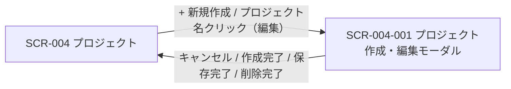

<!-- portal-top -->
[設計ポータル](../README.md) ／ [基本設計](index.md) ／ [画面設計](01_screen-design.md) ／ **SCR-004-001 プロジェクト作成・編集モーダル**
<!-- /portal-top -->

# SCR-004-001 プロジェクト作成・編集モーダル

> **このページは、SCR-004 から開くプロジェクトの作成・編集・削除を行うモーダル SCR-004-001 を定義します。** 画面概要 / 画面遷移図 / 画面レイアウト / 画面項目定義 / 入出力一覧 / 画面イベント一覧 の 6 セクションで記述します。

*版数 v1.0 ・ 更新 2026-06-17 ・ 承認済*

## 1. 画面概要

SCR-004 から開く、プロジェクトの新規作成・編集・削除を全画面割込みモーダルで行う画面です(オーナー専有)。呼出元で新規作成 / 編集モードを切り替えます。

| 画面 ID | 画面名 | 機能概要 |
|----|----|----|
| `SCR-004-001` | プロジェクト作成・編集モーダル | プロジェクトの新規作成・編集・削除を全画面割込みモーダルで実施する |

| 関連 | 内容 |
|----|----|
| FR / BR | FR-019, FR-019a, FR-019b / BR-018, BR-019 |
| 関連画面 | [`SCR-004` プロジェクト](SCR-004.md)(呼出元) / [`SCR-009-001` メンバー招待・編集モーダル](SCR-009-001.md) |

| ステークホルダ | 対象 |
|----------------|------|
| オーナー       | ◯    |
| メンバー       | —    |

> [!IMPORTANT]
> **重要** プロジェクト作成時、作成者であるオーナーを当該プロジェクトの member として `M_PRJ_USERS` に自動登録します(オーナーの認可権威は引き続き `M_CONTRACT` の `isOwner`。メンバー行は一覧表示・担当割当・通知宛先の網羅用です)。他者を追加する場合はプロジェクト作成後に SCR-009 / SCR-009-001 から招待します。

## 2. 画面遷移図

本モーダルの呼出元・遷移先を、画面 ID・画面名とイベント(操作)で示します。

## 3. 画面レイアウト

## 4. 画面項目定義

本モーダルの入力項目・操作ボタン・DangerSection と各バリデーションを定義します。項目の正本は本表です。編集モードのみ表示する項目は備考に明記します。

| 項目 ID | 項目 | 説明 | 種類 | 表示条件 | 表示 |
|----|----|----|----|----|----|
| `IT-01` | 見出し | モードに応じてモーダルの見出しを表示する | 見出し | — | 新規「新規プロジェクトを作成」/ 編集「プロジェクトを編集」 |
| `IT-02` | プロジェクト ID | 編集対象プロジェクトの ID を読み取り専用で表示しコピーを提供する(クリック遷移には使わない) | ラベル + アイコンボタン | 編集モードのみ | プロジェクト ID(例「prj_01HMK4Z8Q...」)+「コピー」 |
| `IT-03` | プロジェクト名 | プロジェクトの名称を入力する(必須・1〜100 文字) | テキストボックス | — | placeholder「例: サポートサイト」+ 文字数カウンタ「N / 100」 |
| `IT-04` | 許可ドメイン | ウィジェット埋め込みを許可するドメインを複数入力する(必須・Enter またはカンマで追加・即時検証。完全一致 + `*.example.com` 形式可、IP アドレス・プロトコル指定は不可) | テキストボックス(タグ入力) | — | 入力済みドメインのタグ(例「https://example.com」「\*.example.com」) |
| `IT-05` | 許可ドメイン補足ヘルプ | 許可ドメインの入力形式を補足説明する | ラベル | — | 「ウィジェット埋め込みを許可するドメイン。サブドメインを許可するには `*.example.com` のように記載します」 |
| `IT-06` | プロジェクト連絡先メール | プロジェクトの連絡先メールアドレスを入力する(任意・確認完了後にウィジェットの「お問い合わせ先」表示にのみ利用) | テキストボックス(メールアドレス) | — | placeholder「例: support@example.com」 |
| `IT-07` | 連絡先メール確認状態 | 連絡先メールの確認状態を表示し再送導線を提供する | バッジ + ボタン | 編集モードのみ | 「確認済み」/「確認待ち」/「未設定」+ 確認待ち時「確認メールを再送」 |
| `IT-08` | キャンセル | 変更を破棄してモーダルを閉じる | ボタン(Secondary) | — | 「キャンセル」 |
| `IT-09` | プロジェクトを作成 | 入力内容で新規プロジェクトを作成する | ボタン(Primary) | 新規モードのみ | 「プロジェクトを作成」 |
| `IT-10` | 保存 | 編集内容でプロジェクトを更新する | ボタン(Primary) | 編集モードのみ | 「保存」 |
| `IT-11` | プロジェクトを削除 | 名称タイプ確認と再認証(L3)を経てプロジェクトを論理削除する(削除導線は本 DangerSection のみに集約) | ボタン(Danger) | 編集モードのみ | 「プロジェクトを削除」+ 名称タイプ確認欄(placeholder にプロジェクト名) |

> [!WARNING]
> **注意** バリデーション: プロジェクト名は必須 1〜100 文字、許可ドメインは必須(URL またはワイルドカード形式、IP / プロトコル指定不可)、連絡先メールは任意(メール形式)。削除はプロジェクト名の完全一致タイプ確認 + 再認証(L3)を必須とします。

## 5. 入出力一覧

本モーダルが読み書きするテーブルと、呼び出す API の一覧です。テーブルの正本は [データベース設計](03_database-design.md)、API の正本は [API設計](02_api-design.md) / [§5.3.3](02_api-design.md#API-PRJ-003) です。

<table>
<thead>
<tr>
<th rowspan="2">入出力名</th>
<th rowspan="2">説明</th>
<th rowspan="2">種別</th>
<th rowspan="2">I/O</th>
<th colspan="4">アクセス種別(CRUD)</th>
<th rowspan="2">備考</th>
</tr>
<tr>
<th>C</th>
<th>R</th>
<th>U</th>
<th>D</th>
</tr>
</thead>
<tbody>
<tr>
<td>プロジェクト</td>
<td>新規作成・現値ロード・更新・論理削除を行う</td>
<td>テーブル</td>
<td>入力 / 出力</td>
<td>◯</td>
<td>◯</td>
<td>◯</td>
<td>◯</td>
<td>論理削除は <code>valid=0</code>。<code>M_PROJECTS</code>(<a href="03_database-design.md#TBL-M-004">テーブル設計 3.6</a>)</td>
</tr>
<tr>
<td>許可ドメイン</td>
<td>許可ドメインの登録・更新・削除を行う</td>
<td>テーブル</td>
<td>入力 / 出力</td>
<td>◯</td>
<td>◯</td>
<td>◯</td>
<td>◯</td>
<td><code>M_ALLOWED_DOMAINS</code>(<a href="03_database-design.md#TBL-M-005">テーブル設計 3.8</a>)</td>
</tr>
<tr>
<td>プロジェクト割当</td>
<td>作成時にオーナーのメンバー行を作成し、削除時に当該プロジェクトの割当を論理削除する</td>
<td>テーブル</td>
<td>出力</td>
<td>◯</td>
<td>—</td>
<td>◯</td>
<td>—</td>
<td>削除時 <code>valid=0</code>。<code>M_PRJ_USERS</code>(<a href="03_database-design.md#TBL-M-003">テーブル設計 3.3</a>)</td>
</tr>
<tr>
<td>プロジェクト作成</td>
<td>新規プロジェクトを作成する API を呼び出す</td>
<td>API</td>
<td>入力 / 出力</td>
<td>—</td>
<td>—</td>
<td>—</td>
<td>—</td>
<td><code>POST /projects</code>(<a href="02_api-design.md">API 設計 5.3.2</a>)</td>
</tr>
<tr>
<td>プロジェクト更新・削除</td>
<td>編集での現値ロード・更新・削除 API を呼び出す</td>
<td>API</td>
<td>入力 / 出力</td>
<td>—</td>
<td>—</td>
<td>—</td>
<td>—</td>
<td>編集 <code>PATCH /projects/{id}</code> / 削除 <code>DELETE /projects/{id}</code> / 現値ロード <code>GET /projects/{id}</code>(<a href="02_api-design.md#API-PRJ-003">API 設計 5.3.3</a>)</td>
</tr>
<tr>
<td>連絡先メール確認</td>
<td>連絡先メールの確認トークンを検証する API を呼び出す</td>
<td>API</td>
<td>入力 / 出力</td>
<td>—</td>
<td>—</td>
<td>—</td>
<td>—</td>
<td><code>POST /auth/contact-verifications/{token}</code>(<a href="02_api-design.md">API 設計 5.1.9</a>)</td>
</tr>
</tbody>
</table>

## 6. 画面イベント一覧

本モーダルのイベント(初期表示・各操作)ごとに、対象の項目 ID と処理内容を定義します。

<table>
<colgroup>
<col style="width: 12%" />
<col style="width: 12%" />
<col style="width: 30%" />
<col style="width: 46%" />
</colgroup>
<thead>
<tr>
<th>イベント ID</th>
<th>項目 ID</th>
<th>イベント</th>
<th>処理</th>
</tr>
</thead>
<tbody>
<tr>
<td><code>EV-01</code></td>
<td>—</td>
<td>初期表示(編集モード)</td>
<td>プロジェクトの現値を取得し各入力欄に初期表示</td>
</tr>
<tr>
<td><code>EV-02</code></td>
<td><a href="#IT-03">IT-03</a></td>
<td>プロジェクト名を入力</td>
<td>必須・文字数を検証しエラーを表示</td>
</tr>
<tr>
<td><code>EV-03</code></td>
<td><a href="#IT-04">IT-04</a></td>
<td>許可ドメインを入力</td>
<td>ドメイン形式を検証しエラーを表示(タグ追加時)</td>
</tr>
<tr>
<td><code>EV-04</code></td>
<td><a href="#IT-06">IT-06</a></td>
<td>プロジェクト連絡先メールを入力</td>
<td>メール形式を検証しエラーを表示</td>
</tr>
<tr>
<td><code>EV-05</code></td>
<td><a href="#IT-09">IT-09</a></td>
<td>「プロジェクトを作成」を押下</td>
<td><ul>
<li><a href="API-project.md#API-PRJ-002">プロジェクト新規作成</a> API で作成しウィジェット公開キーを発行</li>
<li>オーナーを当該プロジェクトの member として <code>M_PRJ_USERS</code> に登録する</li>
</ul></td>
</tr>
<tr>
<td><code>EV-06</code></td>
<td><a href="#IT-10">IT-10</a></td>
<td>「保存」を押下</td>
<td><ul>
<li><a href="API-project.md#API-PRJ-003">プロジェクト更新・削除</a> API で更新</li>
<li>連絡先メール変更時: 確認メールを再送信</li>
</ul></td>
</tr>
<tr>
<td><code>EV-07</code></td>
<td><a href="#IT-07">IT-07</a></td>
<td>確認メール再送ボタンを押下</td>
<td>確認メールを再送信(レート制限あり)</td>
</tr>
<tr>
<td><code>EV-08</code></td>
<td><a href="#IT-11">IT-11</a></td>
<td>プロジェクト削除ボタンを押下</td>
<td>プロジェクト名タイプ確認 + 再認証(L3)を経て <a href="API-project.md#API-PRJ-003">プロジェクト更新・削除</a> API で論理削除を実行</td>
</tr>
<tr>
<td><code>EV-09</code></td>
<td><a href="#IT-08">IT-08</a></td>
<td>「キャンセル」を押下</td>
<td>変更を破棄して閉じる(未保存変更があれば UnsavedChangesGuard で警告)</td>
</tr>
<tr>
<td><code>EV-10</code></td>
<td><a href="#IT-02">IT-02</a></td>
<td>プロジェクト ID コピーを押下</td>
<td>プロジェクト ID をクリップボードにコピー</td>
</tr>
</tbody>
</table>

---

<!-- portal-bottom -->
[← 画面設計](01_screen-design.md) ・ [基本設計](index.md) ・ [↑ 設計ポータル](../README.md)
<!-- /portal-bottom -->
