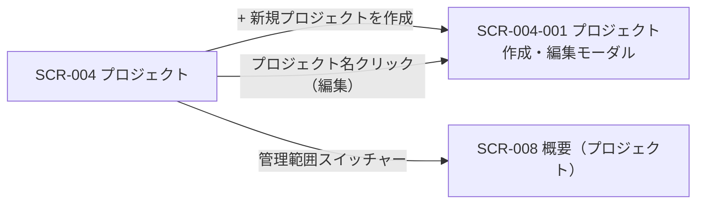
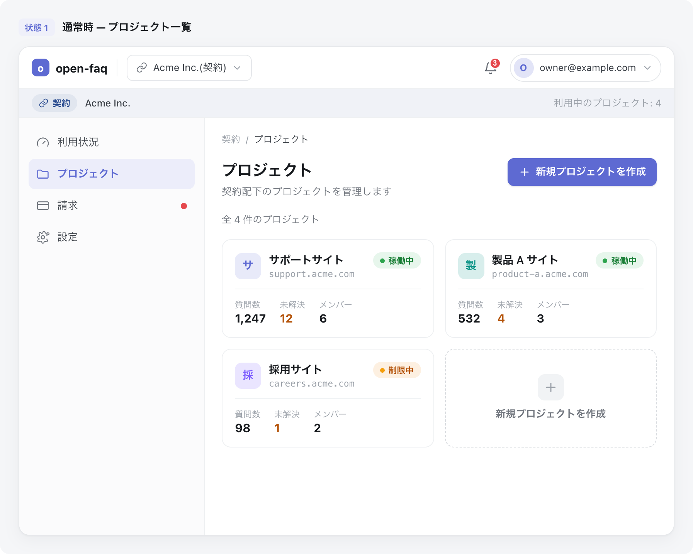

<!-- portal-top -->
[設計ポータル](../README.md) ／ [基本設計](index.md) ／ [画面設計](01_screen-design.md) ／ **SCR-004 プロジェクト**
<!-- /portal-top -->

# SCR-004 プロジェクト

> **このページは、オーナーが契約内のプロジェクトを一覧表示し、新規作成・編集・削除モーダルへの導線を提供する画面 SCR-004 を定義します。** 画面概要 / 画面遷移図 / 画面レイアウト / 画面項目定義 / 入出力一覧 / 画面イベント一覧 の 6 セクションで記述します。

*版数 v1.0 ・ 更新 2026-06-17 ・ 承認済*

## 1. 画面概要

オーナーが契約内のプロジェクトを一覧で確認し、新規作成・編集・削除を行う画面です(オーナー専有)。作成・編集・削除動線は SCR-004-001 モーダルに集約します。

| 画面 ID | 画面名 | 機能概要 |
|----|----|----|
| `SCR-004` | プロジェクト | 契約内のプロジェクトを一覧表示し、作成・編集・削除モーダルへ導線を提供する |

| 関連 | 内容 |
|----|----|
| FR / BR | FR-030〜FR-035, FR-030a, FR-030b / BR-045, BR-046, BR-047 |
| 関連画面 | [`SCR-004-001` プロジェクト作成・編集モーダル](SCR-004-001.md) / [`SCR-008` 概要(プロジェクト)](SCR-008.md) |

| ステークホルダ              | 対象 |
|-----------------------------|------|
| オーナー                    | ◯    |
| プロジェクト管理者(`admin`) | —    |
| メンバー(`member`)          | —    |

> [!NOTE]
> **補足** 本画面はオーナー専有です。プロジェクト管理者・メンバーは利用できません(URL 直アクセスは権限不足表示)。各プロジェクトの SCR-008 概要へは管理範囲スイッチャーから遷移します。

## 2. 画面遷移図

本画面からの画面遷移を、画面 ID・画面名とイベント(操作)で示します。

## 3. 画面レイアウト

## 4. 画面項目定義

本画面の入出力項目(一覧の列・件数表示・空状態を含む)を定義します。項目の正本は本表です。一覧表に「操作」列・プロジェクト ID 列・更新日時列は設けず、編集遷移はプロジェクト名(主リンク)に集約します(クリックで SCR-004-001 を編集モードで開く)。

| 項目 ID | 項目 | 説明 | 種類 | 表示条件 | 表示 |
|----|----|----|----|----|----|
| `IT-01` | \+ 新規プロジェクトを作成 | 新規プロジェクト作成モーダルを開く(ページヘッダー右上に 1 件のみ配置) | ボタン(Primary) | — | 「+ 新規プロジェクトを作成」 |
| `IT-02` | プロジェクト名 | 各プロジェクトの名称を表示し、編集モーダルへの導線を兼ねる(一覧先頭列) | リンク | — | プロジェクト名(例「サポートサイト」) |
| `IT-03` | 許可ドメイン | プロジェクトに登録された許可ドメインを表示する(最大 3 件、超過分は折り畳み) | バッジ | — | ドメイン名(例「support.example.com」「\*.help.example.com」)、超過分は「+N 件」 |
| `IT-04` | ステータス | 連絡先メールの確認状態を表示する(色のみ依存禁止・テキストラベル併記) | バッジ | — | 「確認済み」(緑)/「確認待ち」(黄)/「未設定」(灰) |
| `IT-05` | 連絡先メール | プロジェクトの連絡先メールアドレスを表示する | ラベル | — | メールアドレス(例「support@example.com」)、未設定行は `—` |
| `IT-06` | 件数表示 | 一覧の表示範囲と総件数を表示する | ラベル | 1 件以上ある時 | 「1-50 / 全 N 件」形式 |
| `IT-07` | 空状態 | プロジェクトが 0 件の場合に作成を促す案内を表示する | 空状態表示 | 0 件時(空状態) | 「プロジェクトがまだありません。最初のプロジェクトを作成しましょう」+「+ 新規プロジェクトを作成」 |
| `IT-08` | ローディング状態 | 一覧取得中にスケルトンを表示する | プログレスバー | 読み込み中のみ | テーブル行スケルトン 3 行 |

## 5. 入出力一覧

本画面が読み書きするテーブルと、呼び出す API の一覧です。テーブルの正本は [03_テーブル設計](03_database-design.md)、API の正本は [02_API設計 §5.3.1](02_api-design.md#API-PRJ-001) です。

<table>
<thead>
<tr>
<th rowspan="2">入出力名</th>
<th rowspan="2">説明</th>
<th rowspan="2">種別</th>
<th rowspan="2">I/O</th>
<th colspan="4">アクセス種別(CRUD)</th>
<th rowspan="2">備考</th>
</tr>
<tr>
<th>C</th>
<th>R</th>
<th>U</th>
<th>D</th>
</tr>
</thead>
<tbody>
<tr>
<td>プロジェクト</td>
<td>プロジェクト一覧を取得する</td>
<td>テーブル</td>
<td>入力</td>
<td>—</td>
<td>◯</td>
<td>—</td>
<td>—</td>
<td><code>M_PROJECTS</code>(<a href="03_database-design.md#TBL-M-004">テーブル設計 3.6</a>)</td>
</tr>
<tr>
<td>許可ドメイン</td>
<td>各プロジェクトの許可ドメインを取得する</td>
<td>テーブル</td>
<td>入力</td>
<td>—</td>
<td>◯</td>
<td>—</td>
<td>—</td>
<td><code>M_ALLOWED_DOMAINS</code>(<a href="03_database-design.md#TBL-M-005">テーブル設計 3.8</a>)</td>
</tr>
<tr>
<td>プロジェクト一覧取得</td>
<td>プロジェクト一覧を取得する API を呼び出す</td>
<td>API</td>
<td>入力</td>
<td>—</td>
<td>—</td>
<td>—</td>
<td>—</td>
<td><code>GET /projects</code>(<a href="02_api-design.md#API-PRJ-001">API 設計 5.3.1</a>)</td>
</tr>
</tbody>
</table>

## 6. 画面イベント一覧

本画面のイベント(初期表示・各操作)ごとに、対象の項目 ID と処理内容を定義します。

<table>
<colgroup>
<col style="width: 12%" />
<col style="width: 12%" />
<col style="width: 30%" />
<col style="width: 46%" />
</colgroup>
<thead>
<tr>
<th>イベント ID</th>
<th>項目 ID</th>
<th>イベント</th>
<th>処理</th>
</tr>
</thead>
<tbody>
<tr>
<td><code>EV-01</code></td>
<td>—</td>
<td>初期表示</td>
<td><ul>
<li><code>GET /projects</code> で一覧を取得し表示</li>
<li>0 件時: EmptyState / 取得中: LoadingSkeleton</li>
</ul></td>
</tr>
<tr>
<td><code>EV-02</code></td>
<td><a href="#IT-01">IT-01</a></td>
<td>「+ 新規プロジェクトを作成」を押下</td>
<td>SCR-004-001 を新規作成モードで開く</td>
</tr>
<tr>
<td><code>EV-03</code></td>
<td><a href="#IT-02">IT-02</a></td>
<td>プロジェクト名リンクを押下</td>
<td>SCR-004-001 を編集モードで開く(現値ロード)</td>
</tr>
</tbody>
</table>

---

---

---

<!-- portal-bottom -->
[← 画面設計](01_screen-design.md) ・ [基本設計](index.md) ・ [↑ 設計ポータル](../README.md)
<!-- /portal-bottom -->
