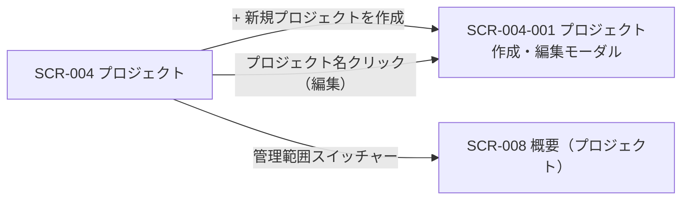
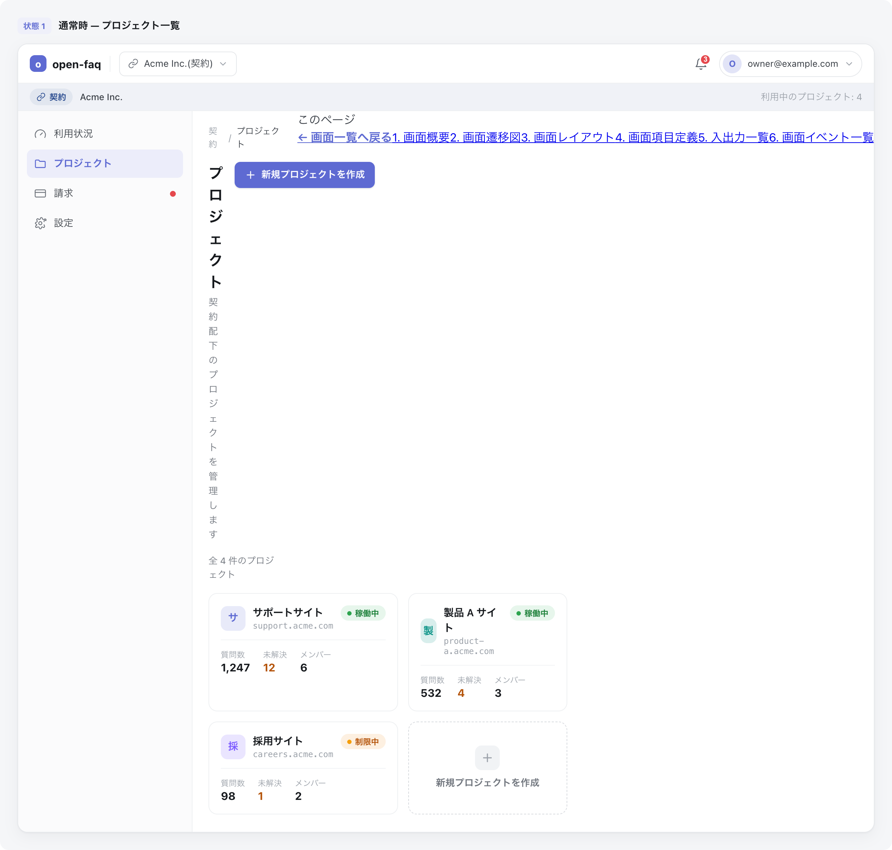

<!-- portal-top -->
[設計ポータル](../README.md) ／ [基本設計](index.md) ／ [画面設計](01_screen-design.md) ／ **SCR-004 プロジェクト**
<!-- /portal-top -->

# SCR-004 プロジェクト

> **このページは、オーナーが契約内のプロジェクトを一覧表示し、新規作成・編集・削除モーダルへの導線を提供する画面 SCR-004 を定義します。** 画面概要 / 画面遷移図 / 画面レイアウト / 画面項目定義 / 入出力一覧 / 画面イベント一覧 の 6 セクションで記述します。

*版数 v1.0 ・ 更新 2026-06-17 ・ 承認済*

## <span id="1-画面概要"></span>1. 画面概要

オーナーが契約内のプロジェクトを一覧で確認し、新規作成・編集・削除を行う画面です(オーナー専有)。作成・編集・削除動線は SCR-004-001 モーダルに集約します。

| 画面 ID | 画面名 | 機能概要 |
|----|----|----|
| <span id="SCR-004"></span>`SCR-004` | プロジェクト | 契約内のプロジェクトを一覧表示し、作成・編集・削除モーダルへ導線を提供する |

| 関連 | 内容 |
|----|----|
| FR / BR | FR-030〜FR-035, FR-030a, FR-030b / BR-045, BR-046, BR-047 |
| 関連画面 | [`SCR-004-001` プロジェクト作成・編集モーダル](SCR-004-001.md) / [`SCR-008` 概要(プロジェクト)](SCR-008.md) |

| ステークホルダ              | 対象 |
|-----------------------------|------|
| オーナー                    | ◯    |
| プロジェクト管理者(`admin`) | —    |
| メンバー(`member`)          | —    |

> [!NOTE]
> **補足** 本画面はオーナー専有です。プロジェクト管理者・メンバーは利用できません(URL 直アクセスは権限不足表示)。各プロジェクトの SCR-008 概要へは管理範囲スイッチャーから遷移します。

## <span id="2-画面遷移図"></span>2. 画面遷移図

本画面からの画面遷移を、画面 ID・画面名とイベント(操作)で示します。



## <span id="3-画面レイアウト"></span>3. 画面レイアウト



<details>
<summary>画面モック HTML（ソース）</summary>

```html
<div style="background:#f5f6f8;padding:24px;border-radius:12px;font-family:'Noto Sans JP',-apple-system,BlinkMacSystemFont,'Hiragino Kaku Gothic ProN',Meiryo,sans-serif;color:#3a3f46;-webkit-font-smoothing:antialiased;--accent:#5e6ad2">
<div style="max-width:1180px;margin:0 auto;display:flex;flex-direction:column;gap:40px">
  <section>
    <div style="display:flex;align-items:center;gap:10px;margin-bottom:13px">
      <span style="font-size:11px;font-weight:700;color:var(--accent,#5e6ad2);background:color-mix(in srgb,var(--accent,#5e6ad2) 10%,#fff);border-radius:6px;padding:3px 8px">状態 1</span>
      <span style="font-size:13.5px;font-weight:600;color:#16191d">通常時 — プロジェクト一覧</span>
    </div>
    <div style="background:#fff;border:1px solid #e6e8eb;border-radius:14px;box-shadow:0 1px 2px rgba(16,24,40,.04),0 6px 20px rgba(16,24,40,.05);overflow:hidden">
      <div style="display:flex;align-items:center;justify-content:space-between;height:54px;padding:0 16px;border-bottom:1px solid #eef0f2;background:#fff">
        <div style="display:flex;align-items:center;gap:12px">
          <span style="display:inline-flex;align-items:center;gap:8px;font-weight:700;font-size:15px;color:#16191d"><span style="width:23px;height:23px;border-radius:7px;background:var(--accent,#5e6ad2);display:inline-flex;align-items:center;justify-content:center;color:#fff;font-size:13px;font-weight:800">o</span>open-faq</span>
          <span style="width:1px;height:22px;background:#eef0f2"></span>
          <button style="display:inline-flex;align-items:center;gap:7px;padding:6px 11px;border:1px solid #e6e8eb;border-radius:8px;background:#fff;font-size:13px;color:#3a3f46;cursor:pointer;font-family:inherit"><svg width="15" height="15" viewBox="0 0 24 24" fill="none" stroke="#71767e" stroke-width="1.8" stroke-linecap="round" stroke-linejoin="round"><path d="M10 13a5 5 0 0 0 7.5.5l3-3a5 5 0 0 0-7-7l-1.5 1.5"></path><path d="M14 11a5 5 0 0 0-7.5-.5l-3 3a5 5 0 0 0 7 7l1.5-1.5"></path></svg>Acme Inc.(契約)<svg width="14" height="14" viewBox="0 0 24 24" fill="none" stroke="#9aa0a8" stroke-width="1.9" stroke-linecap="round" stroke-linejoin="round"><path d="m6 9 6 6 6-6"></path></svg></button>
        </div>
        <div style="display:flex;align-items:center;gap:8px">
          <button style="position:relative;width:34px;height:34px;border-radius:8px;border:none;background:transparent;display:inline-flex;align-items:center;justify-content:center;color:#5b616a;cursor:pointer"><svg width="18" height="18" viewBox="0 0 24 24" fill="none" stroke="currentColor" stroke-width="1.8" stroke-linecap="round" stroke-linejoin="round"><path d="M6 8a6 6 0 0 1 12 0c0 7 3 9 3 9H3s3-2 3-9z"></path><path d="M10.3 21a1.94 1.94 0 0 0 3.4 0"></path></svg><span style="position:absolute;top:3px;right:3px;min-width:16px;height:16px;padding:0 3px;border-radius:999px;background:#e5484d;color:#fff;font-size:10px;font-weight:700;display:flex;align-items:center;justify-content:center;border:2px solid #fff">3</span></button>
          <button style="display:inline-flex;align-items:center;gap:8px;padding:4px 10px 4px 4px;border:1px solid #e6e8eb;border-radius:999px;background:#fff;cursor:pointer;font-family:inherit"><span style="width:26px;height:26px;border-radius:999px;background:color-mix(in srgb,var(--accent,#5e6ad2) 18%,#fff);color:var(--accent,#5e6ad2);font-weight:700;font-size:12px;display:flex;align-items:center;justify-content:center">O</span><span style="font-size:12.5px;color:#3a3f46">owner@example.com</span><svg width="14" height="14" viewBox="0 0 24 24" fill="none" stroke="#9aa0a8" stroke-width="1.9" stroke-linecap="round" stroke-linejoin="round"><path d="m6 9 6 6 6-6"></path></svg></button>
        </div>
      </div>
      <div style="display:flex;align-items:center;gap:10px;height:38px;padding:0 16px;background:color-mix(in srgb,#294b8f 7%,#fff);border-bottom:1px solid #eef0f2;font-size:12.5px;color:#71767e">
        <span style="display:inline-flex;align-items:center;gap:5px;padding:3px 9px;border-radius:999px;background:color-mix(in srgb,#294b8f 14%,#fff);color:#294b8f;font-weight:600;font-size:11.5px"><svg width="13" height="13" viewBox="0 0 24 24" fill="none" stroke="currentColor" stroke-width="1.9" stroke-linecap="round" stroke-linejoin="round"><path d="M10 13a5 5 0 0 0 7.5.5l3-3a5 5 0 0 0-7-7l-1.5 1.5"></path><path d="M14 11a5 5 0 0 0-7.5-.5l-3 3a5 5 0 0 0 7 7l1.5-1.5"></path></svg>契約</span>
        <span style="color:#3a3f46;font-weight:500">Acme Inc.</span>
        <span style="margin-left:auto;color:#9aa0a8">利用中のプロジェクト: 4</span>
      </div>
      <div style="display:flex;min-height:540px">
        <aside style="width:240px;flex:none;background:#fbfbfc;border-right:1px solid #eef0f2;padding:12px 12px 16px;display:flex;flex-direction:column;gap:2px">
          <a style="display:flex;align-items:center;gap:10px;padding:9px 10px;border-radius:8px;color:#3a3f46;font-size:13.5px;text-decoration:none"><svg width="17" height="17" viewBox="0 0 24 24" fill="none" stroke="#71767e" stroke-width="1.7" stroke-linecap="round" stroke-linejoin="round"><path d="m12 14 4-4"></path><path d="M3.34 19a10 10 0 1 1 17.32 0"></path></svg>利用状況</a>
          <a style="display:flex;align-items:center;gap:10px;padding:9px 10px;border-radius:8px;background:color-mix(in srgb,var(--accent,#5e6ad2) 12%,#fff);color:var(--accent,#5e6ad2);font-weight:600;font-size:13.5px;text-decoration:none"><svg width="17" height="17" viewBox="0 0 24 24" fill="none" stroke="currentColor" stroke-width="1.8" stroke-linecap="round" stroke-linejoin="round"><path d="M4 5h5l2 2.5h9A1.5 1.5 0 0 1 21.5 9v9A1.5 1.5 0 0 1 20 19.5H4A1.5 1.5 0 0 1 2.5 18V6.5A1.5 1.5 0 0 1 4 5z"></path></svg>プロジェクト</a>
          <a style="display:flex;align-items:center;gap:10px;padding:9px 10px;border-radius:8px;color:#3a3f46;font-size:13.5px;text-decoration:none"><svg width="17" height="17" viewBox="0 0 24 24" fill="none" stroke="#71767e" stroke-width="1.7" stroke-linecap="round" stroke-linejoin="round"><rect x="2" y="5" width="20" height="14" rx="2"></rect><path d="M2 10h20"></path></svg>請求<span style="margin-left:auto;width:8px;height:8px;border-radius:999px;background:#e5484d"></span></a>
          <a style="display:flex;align-items:center;gap:10px;padding:9px 10px;border-radius:8px;color:#3a3f46;font-size:13.5px;text-decoration:none"><svg width="17" height="17" viewBox="0 0 24 24" fill="none" stroke="#71767e" stroke-width="1.7" stroke-linecap="round" stroke-linejoin="round"><circle cx="12" cy="12" r="3"></circle><path d="M19.4 15a1.65 1.65 0 0 0 .33 1.82l.06.06a2 2 0 1 1-2.83 2.83l-.06-.06a1.65 1.65 0 0 0-2.82 1.17V21a2 2 0 0 1-4 0v-.09A1.65 1.65 0 0 0 8 19.4a1.65 1.65 0 0 0-1.82.33l-.06.06a2 2 0 1 1-2.83-2.83l.06-.06A1.65 1.65 0 0 0 4.6 14H4.5a2 2 0 0 1 0-4h.09A1.65 1.65 0 0 0 6 8.6a1.65 1.65 0 0 0-.33-1.82l-.06-.06a2 2 0 1 1 2.83-2.83l.06.06A1.65 1.65 0 0 0 11 4.6h.09A1.65 1.65 0 0 0 12 3.09V3a2 2 0 0 1 4 0v.09A1.65 1.65 0 0 0 18 4.6a1.65 1.65 0 0 0 1.82-.33l.06-.06a2 2 0 1 1 2.83 2.83l-.06.06A1.65 1.65 0 0 0 19.4 9v.09"></path></svg>設定</a>
        </aside>
        <main style="flex:1;min-width:0;background:#fff;padding:18px 22px 24px;display:flex;flex-direction:column;gap:16px">
          <nav style="display:flex;align-items:center;gap:7px;font-size:12px;color:#9aa0a8"><span>契約</span><span>/</span><span style="color:#3a3f46">プロジェクト</span></nav>
          <div style="display:flex;align-items:flex-start;justify-content:space-between;gap:16px">
            <div>
              <h1 style="margin:0 0 4px;font-size:20px;font-weight:700;color:#16191d;letter-spacing:-.01em">プロジェクト</h1>
              <p style="margin:0;font-size:13px;color:#71767e">契約配下のプロジェクトを管理します</p>
            </div>
            <button style="display:inline-flex;align-items:center;gap:7px;padding:8px 14px;border:none;border-radius:8px;background:var(--accent,#5e6ad2);color:#fff;font-size:13px;font-weight:600;cursor:pointer;white-space:nowrap;box-shadow:0 1px 2px rgba(16,24,40,.12);font-family:inherit"><svg width="16" height="16" viewBox="0 0 24 24" fill="none" stroke="currentColor" stroke-width="2" stroke-linecap="round" stroke-linejoin="round"><path d="M12 5v14"></path><path d="M5 12h14"></path></svg>新規プロジェクトを作成</button>
          </div>
          <div style="font-size:12.5px;color:#71767e">全 4 件のプロジェクト</div>
          <div style="display:grid;grid-template-columns:repeat(2,1fr);gap:14px">
            <div style="border:1px solid #eef0f2;border-radius:12px;padding:16px;display:flex;flex-direction:column;gap:12px;cursor:pointer">
              <div style="display:flex;align-items:flex-start;justify-content:space-between;gap:10px">
                <div style="display:flex;align-items:center;gap:10px"><span style="width:34px;height:34px;border-radius:9px;background:color-mix(in srgb,var(--accent,#5e6ad2) 14%,#fff);color:var(--accent,#5e6ad2);display:flex;align-items:center;justify-content:center;font-weight:700;font-size:14px">サ</span><div><div style="font-size:14px;font-weight:600;color:#16191d">サポートサイト</div><div style="font-size:11.5px;color:#9aa0a8;font-family:ui-monospace,Menlo,monospace">support.acme.com</div></div></div>
                <span style="display:inline-flex;align-items:center;gap:5px;padding:2px 9px;border-radius:999px;background:#e7f6ec;color:#1a7f37;font-size:11px;font-weight:600;white-space:nowrap"><span style="width:6px;height:6px;border-radius:999px;background:#2da44e"></span>稼働中</span>
              </div>
              <div style="display:flex;gap:18px;border-top:1px solid #f1f3f5;padding-top:11px">
                <div><div style="font-size:11px;color:#9aa0a8">質問数</div><div style="font-size:15px;font-weight:700;color:#16191d">1,247</div></div>
                <div><div style="font-size:11px;color:#9aa0a8">未解決</div><div style="font-size:15px;font-weight:700;color:#b45309">12</div></div>
                <div><div style="font-size:11px;color:#9aa0a8">メンバー</div><div style="font-size:15px;font-weight:700;color:#16191d">6</div></div>
              </div>
            </div>
            <div style="border:1px solid #eef0f2;border-radius:12px;padding:16px;display:flex;flex-direction:column;gap:12px;cursor:pointer">
              <div style="display:flex;align-items:flex-start;justify-content:space-between;gap:10px">
                <div style="display:flex;align-items:center;gap:10px"><span style="width:34px;height:34px;border-radius:9px;background:color-mix(in srgb,#0d9488 16%,#fff);color:#0d9488;display:flex;align-items:center;justify-content:center;font-weight:700;font-size:14px">製</span><div><div style="font-size:14px;font-weight:600;color:#16191d">製品 A サイト</div><div style="font-size:11.5px;color:#9aa0a8;font-family:ui-monospace,Menlo,monospace">product-a.acme.com</div></div></div>
                <span style="display:inline-flex;align-items:center;gap:5px;padding:2px 9px;border-radius:999px;background:#e7f6ec;color:#1a7f37;font-size:11px;font-weight:600;white-space:nowrap"><span style="width:6px;height:6px;border-radius:999px;background:#2da44e"></span>稼働中</span>
              </div>
              <div style="display:flex;gap:18px;border-top:1px solid #f1f3f5;padding-top:11px">
                <div><div style="font-size:11px;color:#9aa0a8">質問数</div><div style="font-size:15px;font-weight:700;color:#16191d">532</div></div>
                <div><div style="font-size:11px;color:#9aa0a8">未解決</div><div style="font-size:15px;font-weight:700;color:#b45309">4</div></div>
                <div><div style="font-size:11px;color:#9aa0a8">メンバー</div><div style="font-size:15px;font-weight:700;color:#16191d">3</div></div>
              </div>
            </div>
            <div style="border:1px solid #eef0f2;border-radius:12px;padding:16px;display:flex;flex-direction:column;gap:12px;cursor:pointer">
              <div style="display:flex;align-items:flex-start;justify-content:space-between;gap:10px">
                <div style="display:flex;align-items:center;gap:10px"><span style="width:34px;height:34px;border-radius:9px;background:color-mix(in srgb,#7c5cff 16%,#fff);color:#7c5cff;display:flex;align-items:center;justify-content:center;font-weight:700;font-size:14px">採</span><div><div style="font-size:14px;font-weight:600;color:#16191d">採用サイト</div><div style="font-size:11.5px;color:#9aa0a8;font-family:ui-monospace,Menlo,monospace">careers.acme.com</div></div></div>
                <span style="display:inline-flex;align-items:center;gap:5px;padding:2px 9px;border-radius:999px;background:#fdf0e1;color:#b45309;font-size:11px;font-weight:600;white-space:nowrap"><span style="width:6px;height:6px;border-radius:999px;background:#f59e0b"></span>制限中</span>
              </div>
              <div style="display:flex;gap:18px;border-top:1px solid #f1f3f5;padding-top:11px">
                <div><div style="font-size:11px;color:#9aa0a8">質問数</div><div style="font-size:15px;font-weight:700;color:#16191d">98</div></div>
                <div><div style="font-size:11px;color:#9aa0a8">未解決</div><div style="font-size:15px;font-weight:700;color:#b45309">1</div></div>
                <div><div style="font-size:11px;color:#9aa0a8">メンバー</div><div style="font-size:15px;font-weight:700;color:#16191d">2</div></div>
              </div>
            </div>
            <div style="border:1px dashed #d8dbdf;border-radius:12px;padding:16px;display:flex;flex-direction:column;align-items:center;justify-content:center;gap:8px;cursor:pointer;color:#9aa0a8;min-height:128px">
              <div style="width:34px;height:34px;border-radius:9px;background:#f1f3f5;display:flex;align-items:center;justify-content:center"><svg width="18" height="18" viewBox="0 0 24 24" fill="none" stroke="#9aa0a8" stroke-width="2" stroke-linecap="round" stroke-linejoin="round"><path d="M12 5v14"></path><path d="M5 12h14"></path></svg></div>
              <div style="font-size:13px;font-weight:600;color:#71767e">新規プロジェクトを作成</div>
            </div>
          </div>
        </main><aside class="rightbar"><div class="rb-title">このページ</div><nav class="toc"><a class="back" href="01_screen-design.md" style="font-weight:600;color:var(--accent)">← 画面一覧へ戻る</a><a href="#1-画面概要">1. 画面概要</a><a href="#2-画面遷移図">2. 画面遷移図</a><a href="#3-画面レイアウト">3. 画面レイアウト</a><a href="#4-画面項目定義">4. 画面項目定義</a><a href="#5-入出力一覧">5. 入出力一覧</a><a href="#6-画面イベント一覧">6. 画面イベント一覧</a></nav></aside>
      </div>
    </div>
  </section>
</div>
</div>
```

</details>

## <span id="4-画面項目定義"></span>4. 画面項目定義

本画面の入出力項目(一覧の列・件数表示・空状態を含む)を定義します。項目の正本は本表です。一覧表に「操作」列・プロジェクト ID 列・更新日時列は設けず、編集遷移はプロジェクト名(主リンク)に集約します(クリックで SCR-004-001 を編集モードで開く)。

| 項目 ID | 項目 | 説明 | 種類 | 表示条件 | 表示 |
|----|----|----|----|----|----|
| <span id="IT-01"></span>`IT-01` | \+ 新規プロジェクトを作成 | 新規プロジェクト作成モーダルを開く(ページヘッダー右上に 1 件のみ配置) | ボタン(Primary) | — | 「+ 新規プロジェクトを作成」 |
| <span id="IT-02"></span>`IT-02` | プロジェクト名 | 各プロジェクトの名称を表示し、編集モーダルへの導線を兼ねる(一覧先頭列) | リンク | — | プロジェクト名(例「サポートサイト」) |
| <span id="IT-03"></span>`IT-03` | 許可ドメイン | プロジェクトに登録された許可ドメインを表示する(最大 3 件、超過分は折り畳み) | バッジ | — | ドメイン名(例「support.example.com」「\*.help.example.com」)、超過分は「+N 件」 |
| <span id="IT-04"></span>`IT-04` | ステータス | 連絡先メールの確認状態を表示する(色のみ依存禁止・テキストラベル併記) | バッジ | — | 「確認済み」(緑)/「確認待ち」(黄)/「未設定」(灰) |
| <span id="IT-05"></span>`IT-05` | 連絡先メール | プロジェクトの連絡先メールアドレスを表示する | ラベル | — | メールアドレス(例「support@example.com」)、未設定行は `—` |
| <span id="IT-06"></span>`IT-06` | 件数表示 | 一覧の表示範囲と総件数を表示する | ラベル | 1 件以上ある時 | 「1-50 / 全 N 件」形式 |
| <span id="IT-07"></span>`IT-07` | 空状態 | プロジェクトが 0 件の場合に作成を促す案内を表示する | 空状態表示 | 0 件時(空状態) | 「プロジェクトがまだありません。最初のプロジェクトを作成しましょう」+「+ 新規プロジェクトを作成」 |
| <span id="IT-08"></span>`IT-08` | ローディング状態 | 一覧取得中にスケルトンを表示する | プログレスバー | 読み込み中のみ | テーブル行スケルトン 3 行 |

## <span id="5-入出力一覧"></span>5. 入出力一覧

本画面が読み書きするテーブルと、呼び出す API の一覧です。テーブルの正本は [03_テーブル設計](03_database-design.md)、API の正本は [02_API設計 §5.3.1](02_api-design.md#API-PRJ-001) です。

<table>
<thead>
<tr>
<th rowspan="2">入出力名</th>
<th rowspan="2">説明</th>
<th rowspan="2">種別</th>
<th rowspan="2">I/O</th>
<th colspan="4">アクセス種別(CRUD)</th>
<th rowspan="2">備考</th>
</tr>
<tr>
<th>C</th>
<th>R</th>
<th>U</th>
<th>D</th>
</tr>
</thead>
<tbody>
<tr>
<td>プロジェクト</td>
<td>プロジェクト一覧を取得する</td>
<td>テーブル</td>
<td>入力</td>
<td>—</td>
<td>◯</td>
<td>—</td>
<td>—</td>
<td><code>M_PROJECTS</code>(<a href="03_database-design.md#TBL-M-004">テーブル設計 3.6</a>)</td>
</tr>
<tr>
<td>許可ドメイン</td>
<td>各プロジェクトの許可ドメインを取得する</td>
<td>テーブル</td>
<td>入力</td>
<td>—</td>
<td>◯</td>
<td>—</td>
<td>—</td>
<td><code>M_ALLOWED_DOMAINS</code>(<a href="03_database-design.md#TBL-M-005">テーブル設計 3.8</a>)</td>
</tr>
<tr>
<td>プロジェクト一覧取得</td>
<td>プロジェクト一覧を取得する API を呼び出す</td>
<td>API</td>
<td>入力</td>
<td>—</td>
<td>—</td>
<td>—</td>
<td>—</td>
<td><code>GET /projects</code>(<a href="02_api-design.md#API-PRJ-001">API 設計 5.3.1</a>)</td>
</tr>
</tbody>
</table>

## <span id="6-画面イベント一覧"></span>6. 画面イベント一覧

本画面で発生するイベントと発生タイミング・概要の一覧です。

<table>
<colgroup>
<col style="width: 20%" />
<col style="width: 20%" />
<col style="width: 20%" />
<col style="width: 20%" />
<col style="width: 20%" />
</colgroup>
<thead>
<tr>
<th>イベント ID</th>
<th>イベント</th>
<th>トリガー</th>
<th>処理</th>
<th>関連項目</th>
</tr>
</thead>
<tbody>
<tr>
<td><code>EV-01</code></td>
<td>一覧初期表示</td>
<td>画面遷移・リロード時</td>
<td><ul>
<li><code>GET /projects</code> で一覧を取得し表示</li>
<li>0 件時は EmptyState</li>
<li>取得中は LoadingSkeleton</li>
</ul></td>
<td><a href="#IT-02">IT-02</a>, <a href="#IT-03">IT-03</a>, <a href="#IT-04">IT-04</a>, <a href="#IT-05">IT-05</a>, <a href="#IT-06">IT-06</a>, <a href="#IT-07">IT-07</a>, <a href="#IT-08">IT-08</a></td>
</tr>
<tr>
<td><code>EV-02</code></td>
<td>新規作成モーダル起動</td>
<td>「+ 新規プロジェクトを作成」押下時</td>
<td>SCR-004-001 を新規作成モードで開く</td>
<td><a href="#IT-01">IT-01</a></td>
</tr>
<tr>
<td><code>EV-03</code></td>
<td>編集モーダル起動</td>
<td>プロジェクト名リンク押下時</td>
<td>SCR-004-001 を編集モードで開く(現値ロード)</td>
<td><a href="#IT-02">IT-02</a></td>
</tr>
</tbody>
</table>

---

---

---

<!-- portal-bottom -->
[← 画面設計](01_screen-design.md) ・ [基本設計](index.md) ・ [↑ 設計ポータル](../README.md)
<!-- /portal-bottom -->
