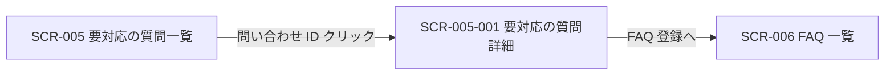

<!-- portal-top -->
[設計ポータル](../README.md) ／ [基本設計](index.md) ／ [画面設計](01_screen-design.md) ／ **SCR-005-001 要対応の質問詳細**
<!-- /portal-top -->

# SCR-005-001 要対応の質問詳細

> **このページは、一覧(SCR-005)から選択した未解決質問の内容を確認し、対応状況の切替と FAQ 登録への導線を提供する画面 SCR-005-001 を定義します。** 画面概要 / 画面遷移図 / 画面レイアウト / 画面項目定義 / 入出力一覧 / 画面イベント一覧 の 6 セクションで記述します。

*版数 v1.0 ・ 更新 2026-06-17 ・ 承認済*

## 1. 画面概要

一覧から選択した未解決質問の内容を確認し、対応状況の切替と FAQ 登録への導線を提供する画面です。

| 画面 ID | 画面名 | 機能概要 |
|----|----|----|
| `SCR-005-001` | 要対応の質問詳細 | 質問内容の確認、対応状況の切替、FAQ 登録導線を提供する |

| 関連     | 内容                                       |
|----------|--------------------------------------------|
| FR / BR  | FR-070〜FR-077 / BR-019, BR-020            |
| 関連画面 | [`SCR-005` 要対応の質問一覧](SCR-005.md) |

| ステークホルダ              | 対象 |
|-----------------------------|------|
| オーナー                    | ◯    |
| プロジェクト管理者(`admin`) | ◯    |
| メンバー(`member`)          | ◯    |

> [!NOTE]
> **補足** 各ステークホルダとも当該プロジェクトへの割当が前提です。割当のないプロジェクトの未解決質問は参照不可(URL 直アクセスは権限不足表示)。「FAQ 登録へ」ボタンは `admin` 以上(オーナーを含む)でのみ表示・操作可能で、`member` ロールでは非表示(操作不可)とします。

## 2. 画面遷移図

本画面への流入と本画面からの遷移を、画面 ID・画面名とイベント(操作)で示します。

## 3. 画面レイアウト

  

  <section>
    

      状態 1
      通常時 — 質問詳細
    

    

      

        

          oopen-faq
          
          <button style="display:inline-flex;align-items:center;gap:7px;padding:6px 11px;border:1px solid #e6e8eb;border-radius:8px;background:#fff;font-size:13px;color:#3a3f46;cursor:pointer;font-family:inherit"><svg width="15" height="15" viewBox="0 0 24 24" fill="none" stroke="#71767e" stroke-width="1.8" stroke-linecap="round" stroke-linejoin="round"><path d="M4 5h5l2 2.5h9A1.5 1.5 0 0 1 21.5 9v9A1.5 1.5 0 0 1 20 19.5H4A1.5 1.5 0 0 1 2.5 18V6.5A1.5 1.5 0 0 1 4 5z"></path></svg>サポートサイト<svg width="14" height="14" viewBox="0 0 24 24" fill="none" stroke="#9aa0a8" stroke-width="1.9" stroke-linecap="round" stroke-linejoin="round"><path d="m6 9 6 6 6-6"></path></svg></button>
        

        

          <button style="position:relative;width:34px;height:34px;border-radius:8px;border:none;background:transparent;display:inline-flex;align-items:center;justify-content:center;color:#5b616a;cursor:pointer"><svg width="18" height="18" viewBox="0 0 24 24" fill="none" stroke="currentColor" stroke-width="1.8" stroke-linecap="round" stroke-linejoin="round"><path d="M6 8a6 6 0 0 1 12 0c0 7 3 9 3 9H3s3-2 3-9z"></path><path d="M10.3 21a1.94 1.94 0 0 0 3.4 0"></path></svg>3</button>
          <button style="display:inline-flex;align-items:center;gap:8px;padding:4px 10px 4px 4px;border:1px solid #e6e8eb;border-radius:999px;background:#fff;cursor:pointer;font-family:inherit">Aadmin@example.com<svg width="14" height="14" viewBox="0 0 24 24" fill="none" stroke="#9aa0a8" stroke-width="1.9" stroke-linecap="round" stroke-linejoin="round"><path d="m6 9 6 6 6-6"></path></svg></button>
        

      

      
      

        <svg width="13" height="13" viewBox="0 0 24 24" fill="none" stroke="currentColor" stroke-width="1.9" stroke-linecap="round" stroke-linejoin="round"><path d="M4 5h5l2 2.5h9A1.5 1.5 0 0 1 21.5 9v9A1.5 1.5 0 0 1 20 19.5H4A1.5 1.5 0 0 1 2.5 18V6.5A1.5 1.5 0 0 1 4 5z"></path></svg>プロジェクト
        サポートサイト
        契約ワークスペースへ →
      

      
      

        <aside style="width:240px;flex:none;background:#fbfbfc;border-right:1px solid #eef0f2;padding:12px 12px 16px;display:flex;flex-direction:column">
          <a style="display:flex;align-items:center;gap:10px;padding:9px 10px;border-radius:8px;color:#3a3f46;font-size:13.5px;text-decoration:none"><svg width="17" height="17" viewBox="0 0 24 24" fill="none" stroke="#71767e" stroke-width="1.7" stroke-linecap="round" stroke-linejoin="round"><path d="M3 10.5 12 3l9 7.5"></path><path d="M5 9.5V20a1 1 0 0 0 1 1h12a1 1 0 0 0 1-1V9.5"></path><path d="M9.5 21v-6h5v6"></path></svg>概要</a>
          
対応

          <a style="display:flex;align-items:center;gap:10px;padding:9px 10px;border-radius:8px;background:color-mix(in srgb,var(--accent,#5e6ad2) 12%,#fff);color:var(--accent,#5e6ad2);font-weight:600;font-size:13.5px;text-decoration:none"><svg width="17" height="17" viewBox="0 0 24 24" fill="none" stroke="currentColor" stroke-width="1.8" stroke-linecap="round" stroke-linejoin="round"><path d="M22 12h-6l-2 3h-4l-2-3H2"></path><path d="M5.5 5.1 2 12v6a2 2 0 0 0 2 2h16a2 2 0 0 0 2-2v-6l-3.5-6.9A2 2 0 0 0 16.8 4H7.2a2 2 0 0 0-1.7 1.1z"></path></svg>要対応の質問12</a>
          
通知

          <a style="display:flex;align-items:center;gap:10px;padding:9px 10px;border-radius:8px;color:#3a3f46;font-size:13.5px;text-decoration:none"><svg width="17" height="17" viewBox="0 0 24 24" fill="none" stroke="#71767e" stroke-width="1.7" stroke-linecap="round" stroke-linejoin="round"><path d="M6 8a6 6 0 0 1 12 0c0 7 3 9 3 9H3s3-2 3-9z"></path><path d="M10.3 21a1.94 1.94 0 0 0 3.4 0"></path></svg>お知らせ3</a>
          
コンテンツ

          <a style="display:flex;align-items:center;gap:10px;padding:9px 10px;border-radius:8px;color:#3a3f46;font-size:13.5px;text-decoration:none"><svg width="17" height="17" viewBox="0 0 24 24" fill="none" stroke="#71767e" stroke-width="1.7" stroke-linecap="round" stroke-linejoin="round"><path d="M12 7v13"></path><path d="M3 18a1 1 0 0 1-1-1V5a1 1 0 0 1 1-1h5a4 4 0 0 1 4 4 4 4 0 0 1 4-4h5a1 1 0 0 1 1 1v12a1 1 0 0 1-1 1h-6a3 3 0 0 0-3 3 3 3 0 0 0-3-3z"></path></svg>FAQ</a>
          <a style="display:flex;align-items:center;gap:10px;padding:9px 10px;border-radius:8px;color:#3a3f46;font-size:13.5px;text-decoration:none"><svg width="17" height="17" viewBox="0 0 24 24" fill="none" stroke="#71767e" stroke-width="1.7" stroke-linecap="round" stroke-linejoin="round"><rect x="3" y="3" width="7" height="7" rx="1.5"></rect><rect x="14" y="3" width="7" height="7" rx="1.5"></rect><rect x="14" y="14" width="7" height="7" rx="1.5"></rect><rect x="3" y="14" width="7" height="7" rx="1.5"></rect></svg>ウィジェット</a>
          
プロジェクト

          <a style="display:flex;align-items:center;gap:10px;padding:9px 10px;border-radius:8px;color:#3a3f46;font-size:13.5px;text-decoration:none"><svg width="17" height="17" viewBox="0 0 24 24" fill="none" stroke="#71767e" stroke-width="1.7" stroke-linecap="round" stroke-linejoin="round"><path d="M16 21v-2a4 4 0 0 0-4-4H6a4 4 0 0 0-4 4v2"></path><circle cx="9" cy="7" r="4"></circle><path d="M22 21v-2a4 4 0 0 0-3-3.87"></path><path d="M16 3.1a4 4 0 0 1 0 7.75"></path></svg>メンバー</a>
          <a style="display:flex;align-items:center;gap:10px;padding:9px 10px;border-radius:8px;color:#3a3f46;font-size:13.5px;text-decoration:none"><svg width="17" height="17" viewBox="0 0 24 24" fill="none" stroke="#71767e" stroke-width="1.7" stroke-linecap="round" stroke-linejoin="round"><path d="m12 14 4-4"></path><path d="M3.34 19a10 10 0 1 1 17.32 0"></path></svg>利用量と上限</a>
        </aside>
        <main style="flex:1;min-width:0;background:#fff;padding:18px 22px 24px;display:flex;flex-direction:column;gap:16px">
          <nav style="display:flex;align-items:center;gap:7px;font-size:12px;color:#9aa0a8">要対応の質問/INQ-7K9N4</nav>
          

            

              <h1 style="margin:0;font-size:19px;font-weight:700;color:#16191d;letter-spacing:-.01em">料金プランの変更方法について教えてください</h1>
            

            

              <button style="padding:8px 13px;border:1px solid #e6e8eb;border-radius:8px;background:#fff;font-size:12.5px;font-weight:600;color:#3a3f46;cursor:pointer;white-space:nowrap;font-family:inherit">対応済みにする</button>
              <button style="display:inline-flex;align-items:center;gap:6px;padding:8px 14px;border:none;border-radius:8px;background:var(--accent,#5e6ad2);color:#fff;font-size:12.5px;font-weight:600;cursor:pointer;white-space:nowrap;box-shadow:0 1px 2px rgba(16,24,40,.12);font-family:inherit"><svg width="15" height="15" viewBox="0 0 24 24" fill="none" stroke="currentColor" stroke-width="2" stroke-linecap="round" stroke-linejoin="round"><path d="M12 5v14M5 12h14"></path></svg>FAQ にする</button>
            

          

          

            <!-- conversation -->
            

              

                
応答ログ

                

                  
U

エンドユーザー ・ 3 分前

料金プランの変更方法について教えてください。今より安いプランに変えたいです。

                  
<svg width="15" height="15" viewBox="0 0 24 24" fill="none" stroke="currentColor" stroke-width="1.8" stroke-linecap="round" stroke-linejoin="round"><path d="M12 2 4 7v6c0 5 3.5 7.5 8 9 4.5-1.5 8-4 8-9V7z"></path></svg>

AI ・ 3 分前 ・ 信頼度 0.38

十分な確信を持って回答できる FAQ が見つかりませんでした。担当者の対応が必要です。

                

              

            

            <!-- meta -->
            

              

状況
対応中

              

問い合わせ ID

INQ-7K9N4

              

未解決理由

該当 FAQ なし

              

発生日時

2026-06-19 09:12

              

チャネル

ウィジェット(サポートサイト)

            

          

        </main><aside class="rightbar">
このページ
<nav class="toc"><a class="back" href="01_screen-design.md" style="font-weight:600;color:var(--accent)">← 画面一覧へ戻る</a><a href="#1-画面概要">1. 画面概要</a><a href="#2-画面遷移図">2. 画面遷移図</a><a href="#3-画面レイアウト">3. 画面レイアウト</a><a href="#4-画面項目定義">4. 画面項目定義</a><a href="#5-入出力一覧">5. 入出力一覧</a><a href="#6-画面イベント一覧">6. 画面イベント一覧</a></nav></aside>
      

    

  </section>

## 4. 画面項目定義

本画面の入出力項目を定義します。項目の正本は本表です。

| 項目 ID | 項目 | 説明 | 種類 | 表示条件 | 表示 |
|----|----|----|----|----|----|
| `IT-01` | ページタイトル | 対象の質問コード・状況バッジを見出しに表示する | 見出し | — | 「未解決質問 — {問い合わせ番号}」+ 状況バッジ |
| `IT-02` | 質問 | ウィジェット利用者が投稿した質問本文を全文表示する | ラベル | — | 質問本文(全文)+ 投稿日時 |
| `IT-03` | 未解決理由 | 自動回答されず未解決となった理由(信頼度不足等)を表示する | バッジ + 補足 | — | 未解決理由バッジ(例「信頼度不足」)+ 信頼度・しきい値の補足文 |
| `IT-04` | 状況バッジ | 当該質問の対応状況を色とラベルで表示する | バッジ | — | 「対応中」/「対応済み」 |
| `IT-05` | 登録先 FAQ | 当該質問から登録された FAQ へのリンクを表示する(状況とは独立) | リンク | 登録先 FAQ 作成済み時(未作成時は「未作成」) | 登録先 FAQ 名へのリンク / 未作成時は「未作成」 |
| `IT-06` | 候補 FAQ | 当該質問に関連性の高い既存 FAQ を右ペインに一覧表示する | リンク | — | 候補 FAQ 名 + 関連度のリンク一覧 |
| `IT-07` | 状況(変更) | 対応状況を選択して即時保存する(現在値を選択済み表示) | ドロップダウン | — | 選択肢「対応中」/「対応済み」 |
| `IT-08` | FAQ 登録へ | 当該質問を起点に FAQ 編集画面へ遷移する | ボタン | ロールがプロジェクト管理者以上(オーナーを含む)の場合のみ表示(メンバーは非表示) | 「FAQ 登録へ」 |
| `IT-09` | 権限不足表示 | 割当外メンバーの直アクセス時に操作不可をグレーアウトと tooltip で示す | ツールチップ | 割当外・範囲外メンバーの URL 直アクセス時 | 操作不可の旨を示すツールチップ |

## 5. 入出力一覧

本画面が読み書きするテーブル・ファイルと、呼び出す API の一覧です。テーブルの正本は [03_テーブル設計](03_database-design.md)、API の正本は [02_API設計 §5.6](02_api-design.md#API-INQ-002) です。

<table>
<thead>
<tr>
<th rowspan="2">入出力名</th>
<th rowspan="2">説明</th>
<th rowspan="2">種別</th>
<th rowspan="2">I/O</th>
<th colspan="4">アクセス種別(CRUD)</th>
<th rowspan="2">備考</th>
</tr>
<tr>
<th>C</th>
<th>R</th>
<th>U</th>
<th>D</th>
</tr>
</thead>
<tbody>
<tr>
<td>未解決質問</td>
<td>詳細を取得し対応状況(<code>status</code>)を更新する</td>
<td>テーブル</td>
<td>入力 / 出力</td>
<td>—</td>
<td>◯</td>
<td>◯</td>
<td>—</td>
<td><code>T_INQUIRIES</code>(<a href="03_database-design.md#TBL-T-005">テーブル設計 3.14</a>)</td>
</tr>
<tr>
<td>質問ログ</td>
<td>未解決理由(<code>result_reason_code</code>)を取得する</td>
<td>テーブル</td>
<td>入力</td>
<td>—</td>
<td>◯</td>
<td>—</td>
<td>—</td>
<td><code>H_QUESTION_LOGS</code>(<a href="03_database-design.md">テーブル設計</a>)</td>
</tr>
<tr>
<td>FAQ</td>
<td>登録先 FAQ・候補 FAQ を取得する</td>
<td>テーブル</td>
<td>入力</td>
<td>—</td>
<td>◯</td>
<td>—</td>
<td>—</td>
<td><code>M_FAQS</code>(<a href="03_database-design.md">テーブル設計</a>)</td>
</tr>
<tr>
<td>未解決質問詳細取得</td>
<td>質問・未解決理由・候補 FAQ・状況を取得する</td>
<td>API</td>
<td>入力</td>
<td>—</td>
<td>—</td>
<td>—</td>
<td>—</td>
<td><code>GET /inquiries/{id}</code>(<a href="02_api-design.md#API-INQ-002">API 設計 5.6.2</a>)</td>
</tr>
<tr>
<td>未解決質問状況更新</td>
<td>対応状況を <code>open</code> ↔︎ <code>closed</code> で更新する</td>
<td>API</td>
<td>出力</td>
<td>—</td>
<td>—</td>
<td>—</td>
<td>—</td>
<td><code>PATCH /inquiries/{id}</code>(<a href="02_api-design.md#API-INQ-002">API 設計 5.6.2</a>)</td>
</tr>
</tbody>
</table>

## 6. 画面イベント一覧

本画面で発生するイベントと発生タイミング・概要の一覧です。

<table>
<colgroup>
<col style="width: 20%" />
<col style="width: 20%" />
<col style="width: 20%" />
<col style="width: 20%" />
<col style="width: 20%" />
</colgroup>
<thead>
<tr>
<th>イベント ID</th>
<th>イベント</th>
<th>トリガー</th>
<th>処理</th>
<th>関連項目</th>
</tr>
</thead>
<tbody>
<tr>
<td><code>EV-01</code></td>
<td>詳細初期表示</td>
<td>画面遷移・リロード時</td>
<td><code>GET /inquiries/{id}</code> で質問・未解決理由・候補 FAQ・状況を取得し表示</td>
<td><a href="#IT-01">IT-01</a>, <a href="#IT-02">IT-02</a>, <a href="#IT-03">IT-03</a>, <a href="#IT-04">IT-04</a>, <a href="#IT-05">IT-05</a>, <a href="#IT-06">IT-06</a></td>
</tr>
<tr>
<td><code>EV-02</code></td>
<td>状況変更</td>
<td>状況プルダウン変更時</td>
<td><ul>
<li><code>PATCH /inquiries/{id}</code> を即時呼び出し保存</li>
<li><code>open</code>→<code>closed</code> は確認ダイアログ</li>
</ul></td>
<td><a href="#IT-07">IT-07</a></td>
</tr>
<tr>
<td><code>EV-03</code></td>
<td>FAQ 登録へ遷移</td>
<td>「FAQ 登録へ」押下時(<code>admin</code> 以上(オーナーを含む))</td>
<td>SCR-006 へ遷移</td>
<td><a href="#IT-08">IT-08</a></td>
</tr>
</tbody>
</table>

> [!IMPORTANT]
> **状況遷移の正本** 状況は本詳細画面のプルダウン(変更時即時保存)のみで `open` ↔ `closed` を切り替えます。FAQ 下書き保存・FAQ 公開・個別チャット操作は `T_INQUIRIES.status` を変更しません(連動ロジックなし、FR-077)。状態遷移の正本は [テーブル構造設計 §5.2](03_database-design.md)。

---

---

<!-- portal-bottom -->
[← 画面設計](01_screen-design.md) ・ [基本設計](index.md) ・ [↑ 設計ポータル](../README.md)
<!-- /portal-bottom -->
