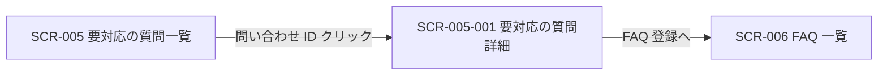
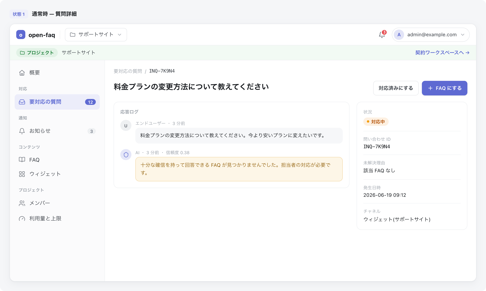

<!-- portal-top -->
[設計ポータル](../README.md) ／ [基本設計](index.md) ／ [画面設計](01_screen-design.md) ／ **SCR-005-001 要対応の質問詳細**
<!-- /portal-top -->

# SCR-005-001 要対応の質問詳細

> **このページは、一覧(SCR-005)から選択した未解決質問の内容を確認し、対応状況の切替と FAQ 登録への導線を提供する画面 SCR-005-001 を定義します。** 画面概要 / 画面遷移図 / 画面レイアウト / 画面項目定義 / 入出力一覧 / 画面イベント一覧 の 6 セクションで記述します。

*版数 v1.0 ・ 更新 2026-06-17 ・ 承認済*

## 1. 画面概要

一覧から選択した未解決質問の内容を確認し、対応状況の切替と FAQ 登録への導線を提供する画面です。

| 画面 ID | 画面名 | 機能概要 |
|----|----|----|
| `SCR-005-001` | 要対応の質問詳細 | 質問内容の確認、対応状況の切替、FAQ 登録導線を提供する |

| 関連     | 内容                                       |
|----------|--------------------------------------------|
| FR / BR  | FR-070〜FR-077 / BR-019, BR-020            |
| 関連画面 | [`SCR-005` 要対応の質問一覧](SCR-005.md) |

| ステークホルダ | 対象 |
|----------------|------|
| オーナー       | ◯    |
| メンバー       | ◯    |

> [!NOTE]
> **補足** 各ステークホルダとも当該プロジェクトへの割当が前提です。割当のないプロジェクトの未解決質問は参照不可(URL 直アクセスは権限不足表示)。「FAQ 登録へ」ボタンは当該プロジェクトのメンバー(オーナーを含む)に表示・操作可能です。

## 2. 画面遷移図

本画面への流入と本画面からの遷移を、画面 ID・画面名とイベント(操作)で示します。

## 3. 画面レイアウト

## 4. 画面項目定義

本画面の入出力項目を定義します。項目の正本は本表です。

| 項目 ID | 項目 | 説明 | 種類 | 表示条件 | 表示 |
|----|----|----|----|----|----|
| `IT-01` | ページタイトル | 対象の質問コード・状況バッジを見出しに表示する | 見出し | — | 「未解決質問 — {問い合わせ番号}」+ 状況バッジ |
| `IT-02` | 質問 | ウィジェット利用者が投稿した質問本文を全文表示する | ラベル | — | 質問本文(全文)+ 投稿日時 |
| `IT-03` | 未解決理由 | 自動回答されず未解決となった理由(信頼度不足等)を表示する | バッジ + 補足 | — | 未解決理由バッジ(例「信頼度不足」)+ 信頼度・しきい値の補足文 |
| `IT-04` | 状況バッジ | 当該質問の対応状況を色とラベルで表示する | バッジ | — | 「対応中」/「対応済み」 |
| `IT-05` | 登録先 FAQ | 当該質問から登録された FAQ へのリンクを表示する(状況とは独立) | リンク | 登録先 FAQ 作成済み時(未作成時は「未作成」) | 登録先 FAQ 名へのリンク / 未作成時は「未作成」 |
| `IT-06` | 候補 FAQ | 当該質問に関連性の高い既存 FAQ を右ペインに一覧表示する | リンク | — | 候補 FAQ 名 + 関連度のリンク一覧 |
| `IT-07` | 状況(変更) | 対応状況を選択して即時保存する(現在値を選択済み表示) | ドロップダウン | — | 選択肢「対応中」/「対応済み」 |
| `IT-08` | FAQ 登録へ | 当該質問を起点に FAQ 編集画面へ遷移する | ボタン | 当該プロジェクトのメンバー(オーナーを含む)に表示 | 「FAQ 登録へ」 |
| `IT-09` | 権限不足表示 | 割当外メンバーの直アクセス時に操作不可をグレーアウトと tooltip で示す | ツールチップ | 割当外・範囲外メンバーの URL 直アクセス時 | 操作不可の旨を示すツールチップ |

## 5. 入出力一覧

本画面が読み書きするテーブル・ファイルと、呼び出す API の一覧です。テーブルの正本は [03_テーブル設計](03_database-design.md)、API の正本は [02_API設計 §5.6](02_api-design.md#API-INQ-002) です。

<table>
<thead>
<tr>
<th rowspan="2">入出力名</th>
<th rowspan="2">説明</th>
<th rowspan="2">種別</th>
<th rowspan="2">I/O</th>
<th colspan="4">アクセス種別(CRUD)</th>
<th rowspan="2">備考</th>
</tr>
<tr>
<th>C</th>
<th>R</th>
<th>U</th>
<th>D</th>
</tr>
</thead>
<tbody>
<tr>
<td>未解決質問</td>
<td>詳細を取得し対応状況(<code>status</code>)を更新する</td>
<td>テーブル</td>
<td>入力 / 出力</td>
<td>—</td>
<td>◯</td>
<td>◯</td>
<td>—</td>
<td><code>T_INQUIRIES</code>(<a href="03_database-design.md#TBL-T-005">テーブル設計 3.14</a>)</td>
</tr>
<tr>
<td>質問ログ</td>
<td>未解決理由(<code>result_reason_code</code>)を取得する</td>
<td>テーブル</td>
<td>入力</td>
<td>—</td>
<td>◯</td>
<td>—</td>
<td>—</td>
<td><code>H_QUESTION_LOGS</code>(<a href="03_database-design.md">テーブル設計</a>)</td>
</tr>
<tr>
<td>FAQ</td>
<td>登録先 FAQ・候補 FAQ を取得する</td>
<td>テーブル</td>
<td>入力</td>
<td>—</td>
<td>◯</td>
<td>—</td>
<td>—</td>
<td><code>M_FAQS</code>(<a href="03_database-design.md">テーブル設計</a>)</td>
</tr>
<tr>
<td>未解決質問詳細取得</td>
<td>質問・未解決理由・候補 FAQ・状況を取得する</td>
<td>API</td>
<td>入力</td>
<td>—</td>
<td>—</td>
<td>—</td>
<td>—</td>
<td><code>GET /inquiries/{id}</code>(<a href="02_api-design.md#API-INQ-002">API 設計 5.6.2</a>)</td>
</tr>
<tr>
<td>未解決質問状況更新</td>
<td>対応状況を <code>open</code> ↔︎ <code>closed</code> で更新する</td>
<td>API</td>
<td>出力</td>
<td>—</td>
<td>—</td>
<td>—</td>
<td>—</td>
<td><code>PATCH /inquiries/{id}</code>(<a href="02_api-design.md#API-INQ-002">API 設計 5.6.2</a>)</td>
</tr>
</tbody>
</table>

## 6. 画面イベント一覧

本画面のイベント(初期表示・各操作)ごとに、対象の項目 ID と処理内容を定義します。

<table>
<colgroup>
<col style="width: 12%" />
<col style="width: 12%" />
<col style="width: 30%" />
<col style="width: 46%" />
</colgroup>
<thead>
<tr>
<th>イベント ID</th>
<th>項目 ID</th>
<th>イベント</th>
<th>処理</th>
</tr>
</thead>
<tbody>
<tr>
<td><code>EV-01</code></td>
<td>—</td>
<td>初期表示</td>
<td><a href="API-inquiry.md#API-INQ-002">未解決質問詳細・状況切替</a> API で質問・未解決理由・候補 FAQ・状況を取得し表示</td>
</tr>
<tr>
<td><code>EV-02</code></td>
<td><a href="#IT-07">IT-07</a></td>
<td>状況を変更</td>
<td><ul>
<li><a href="API-inquiry.md#API-INQ-002">未解決質問詳細・状況切替</a> API を即時呼び出し保存</li>
<li>open→closed 時: 確認ダイアログ</li>
</ul></td>
</tr>
<tr>
<td><code>EV-03</code></td>
<td><a href="#IT-08">IT-08</a></td>
<td>「FAQ 登録へ」を押下(メンバー / オーナー)</td>
<td>SCR-006 へ遷移</td>
</tr>
</tbody>
</table>

> [!IMPORTANT]
> **状況遷移の正本** 状況は本詳細画面のプルダウン(変更時即時保存)のみで `open` ↔ `closed` を切り替えます。FAQ 下書き保存・FAQ 公開・個別チャット操作は `T_INQUIRIES.status` を変更しません(連動ロジックなし、FR-077)。状態遷移の正本は [テーブル構造設計 §5.2](03_database-design.md)。

---

<!-- portal-bottom -->
[← 画面設計](01_screen-design.md) ・ [基本設計](index.md) ・ [↑ 設計ポータル](../README.md)
<!-- /portal-bottom -->
