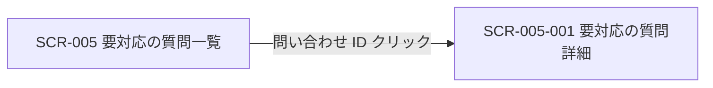
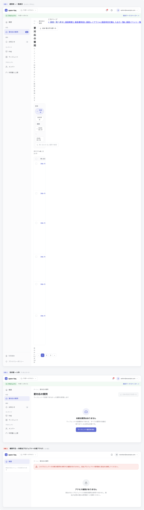

<!-- portal-top -->
[設計ポータル](../README.md) ／ [基本設計](index.md) ／ [画面設計](01_screen-design.md) ／ **SCR-005 要対応の質問一覧**
<!-- /portal-top -->

# SCR-005 要対応の質問一覧

> **このページは、AI が回答できなかった未解決質問を一覧表示し、絞り込み・CSV エクスポートと詳細画面への導線を提供する画面 SCR-005 を定義します。** 画面概要 / 画面遷移図 / 画面レイアウト / 画面項目定義 / 入出力一覧 / 画面イベント一覧 の 6 セクションで記述します。

*版数 v1.0 ・ 更新 2026-06-17 ・ 承認済*

## <span id="1-画面概要"></span>1. 画面概要

AI が回答できなかった未解決質問を一覧で確認し、絞り込み・CSV エクスポートと詳細画面への導線を提供する画面です。

| 画面 ID | 画面名 | 機能概要 |
|----|----|----|
| <span id="SCR-005"></span>`SCR-005` | 要対応の質問一覧 | 未解決質問の一覧表示・絞り込み・CSV エクスポートを行う |

| 関連     | 内容                                               |
|----------|----------------------------------------------------|
| FR / BR  | FR-070〜FR-077 / BR-019, BR-020                    |
| 関連画面 | [`SCR-005-001` 要対応の質問詳細](SCR-005-001.md) |

| ステークホルダ              | 対象 |
|-----------------------------|------|
| オーナー                    | ◯    |
| プロジェクト管理者(`admin`) | ◯    |
| メンバー(`member`)          | ◯    |

> [!NOTE]
> **補足** 各ステークホルダとも当該プロジェクトへの割当が前提です。割当のないプロジェクトの未解決質問は参照不可(URL 直アクセスは権限不足表示)。

## <span id="2-画面遷移図"></span>2. 画面遷移図

本画面からの画面遷移を、画面 ID・画面名とイベント(操作)で示します。



## <span id="3-画面レイアウト"></span>3. 画面レイアウト



<details>
<summary>画面モック HTML（ソース）</summary>

```html
<div style="background:#f5f6f8;padding:24px;border-radius:12px;font-family:'Noto Sans JP',-apple-system,BlinkMacSystemFont,'Hiragino Kaku Gothic ProN',Meiryo,sans-serif;color:#3a3f46;-webkit-font-smoothing:antialiased;--accent:#5e6ad2;--row-pad:14px">
<div style="max-width:1180px;margin:0 auto;display:flex;flex-direction:column;gap:40px">
  <!-- ===== Doc header ===== -->
  <!-- ===== STATE 1: 通常時 — 一覧 ===== -->
  <section>
    <div style="display:flex;align-items:center;gap:10px;margin-bottom:13px">
      <span style="font-size:11px;font-weight:700;color:var(--accent,#5e6ad2);background:color-mix(in srgb,var(--accent,#5e6ad2) 10%,#fff);border-radius:6px;padding:3px 8px">状態 1</span>
      <span style="font-size:13.5px;font-weight:600;color:#16191d">通常時 — 一覧表示</span>
      <span style="font-size:12px;color:#9aa0a8">EV-01 / 1 件以上</span>
    </div>
    <div style="background:#fff;border:1px solid #e6e8eb;border-radius:14px;box-shadow:0 1px 2px rgba(16,24,40,.04),0 6px 20px rgba(16,24,40,.05);overflow:hidden">
      <!-- header -->
      <div style="display:flex;align-items:center;justify-content:space-between;height:54px;padding:0 16px;border-bottom:1px solid #eef0f2;background:#fff">
        <div style="display:flex;align-items:center;gap:12px">
          <span style="display:inline-flex;align-items:center;gap:8px;font-weight:700;font-size:15px;color:#16191d"><span style="width:23px;height:23px;border-radius:7px;background:var(--accent,#5e6ad2);display:inline-flex;align-items:center;justify-content:center;color:#fff;font-size:13px;font-weight:800">o</span>open-faq</span>
          <span style="width:1px;height:22px;background:#eef0f2"></span>
          <button style="display:inline-flex;align-items:center;gap:7px;padding:6px 11px;border:1px solid #e6e8eb;border-radius:8px;background:#fff;font-size:13px;color:#3a3f46;cursor:pointer;font-family:inherit"><svg width="15" height="15" viewBox="0 0 24 24" fill="none" stroke="#71767e" stroke-width="1.8" stroke-linecap="round" stroke-linejoin="round"><path d="M4 5h5l2 2.5h9A1.5 1.5 0 0 1 21.5 9v9A1.5 1.5 0 0 1 20 19.5H4A1.5 1.5 0 0 1 2.5 18V6.5A1.5 1.5 0 0 1 4 5z"></path></svg>サポートサイト<svg width="14" height="14" viewBox="0 0 24 24" fill="none" stroke="#9aa0a8" stroke-width="1.9" stroke-linecap="round" stroke-linejoin="round"><path d="m6 9 6 6 6-6"></path></svg></button>
        </div>
        <div style="display:flex;align-items:center;gap:8px">
          <button style="position:relative;width:34px;height:34px;border-radius:8px;border:1px solid transparent;background:transparent;display:inline-flex;align-items:center;justify-content:center;color:#5b616a;cursor:pointer"><svg width="18" height="18" viewBox="0 0 24 24" fill="none" stroke="currentColor" stroke-width="1.8" stroke-linecap="round" stroke-linejoin="round"><path d="M6 8a6 6 0 0 1 12 0c0 7 3 9 3 9H3s3-2 3-9z"></path><path d="M10.3 21a1.94 1.94 0 0 0 3.4 0"></path></svg><span style="position:absolute;top:3px;right:3px;min-width:16px;height:16px;padding:0 3px;border-radius:999px;background:#e5484d;color:#fff;font-size:10px;font-weight:700;display:flex;align-items:center;justify-content:center;border:2px solid #fff">3</span></button>
          <button style="width:34px;height:34px;border-radius:8px;border:1px solid transparent;background:transparent;display:inline-flex;align-items:center;justify-content:center;color:#5b616a;cursor:pointer"><svg width="18" height="18" viewBox="0 0 24 24" fill="none" stroke="currentColor" stroke-width="1.8" stroke-linecap="round" stroke-linejoin="round"><circle cx="12" cy="12" r="9"></circle><path d="M9.6 9.2a2.5 2.5 0 0 1 4.5 1.5c0 1.7-2.1 2-2.1 3.6"></path><path d="M12 17h.01"></path></svg></button>
          <span style="width:1px;height:22px;background:#eef0f2;margin:0 2px"></span>
          <button style="display:inline-flex;align-items:center;gap:8px;padding:4px 10px 4px 4px;border:1px solid #e6e8eb;border-radius:999px;background:#fff;cursor:pointer;font-family:inherit"><span style="width:26px;height:26px;border-radius:999px;background:color-mix(in srgb,var(--accent,#5e6ad2) 18%,#fff);color:var(--accent,#5e6ad2);font-weight:700;font-size:12px;display:flex;align-items:center;justify-content:center">A</span><span style="font-size:12.5px;color:#3a3f46">admin@example.com</span><svg width="14" height="14" viewBox="0 0 24 24" fill="none" stroke="#9aa0a8" stroke-width="1.9" stroke-linecap="round" stroke-linejoin="round"><path d="m6 9 6 6 6-6"></path></svg></button>
        </div>
      </div>
      <!-- workspace bar -->
      <div style="display:flex;align-items:center;gap:10px;height:38px;padding:0 16px;background:color-mix(in srgb,#2da44e 6%,#fff);border-bottom:1px solid #eef0f2;font-size:12.5px;color:#71767e">
        <span style="display:inline-flex;align-items:center;gap:5px;padding:3px 9px;border-radius:999px;background:color-mix(in srgb,#2da44e 14%,#fff);color:#1a7f37;font-weight:600;font-size:11.5px"><svg width="13" height="13" viewBox="0 0 24 24" fill="none" stroke="currentColor" stroke-width="1.9" stroke-linecap="round" stroke-linejoin="round"><path d="M4 5h5l2 2.5h9A1.5 1.5 0 0 1 21.5 9v9A1.5 1.5 0 0 1 20 19.5H4A1.5 1.5 0 0 1 2.5 18V6.5A1.5 1.5 0 0 1 4 5z"></path></svg>プロジェクト</span>
        <span style="color:#3a3f46;font-weight:500">サポートサイト</span>
        <span style="margin-left:auto;color:var(--accent,#5e6ad2);font-weight:600;cursor:pointer">契約ワークスペースへ →</span>
      </div>
      <!-- body -->
      <div style="display:flex;min-height:560px">
        <!-- sidebar -->
        <aside style="width:240px;flex:none;background:#fbfbfc;border-right:1px solid #eef0f2;padding:12px 12px 16px;display:flex;flex-direction:column">
          <a style="display:flex;align-items:center;gap:10px;padding:var(--row-pad,9px) 10px;border-radius:8px;color:#3a3f46;font-size:13.5px;text-decoration:none;cursor:pointer"><svg width="17" height="17" viewBox="0 0 24 24" fill="none" stroke="#71767e" stroke-width="1.7" stroke-linecap="round" stroke-linejoin="round"><path d="M3 10.5 12 3l9 7.5"></path><path d="M5 9.5V20a1 1 0 0 0 1 1h12a1 1 0 0 0 1-1V9.5"></path><path d="M9.5 21v-6h5v6"></path></svg>概要</a>
          <div style="font-size:10.5px;font-weight:700;letter-spacing:.04em;color:#9aa0a8;padding:14px 10px 6px">対応</div>
          <a style="display:flex;align-items:center;gap:10px;padding:var(--row-pad,9px) 10px;border-radius:8px;background:color-mix(in srgb,var(--accent,#5e6ad2) 12%,#fff);color:var(--accent,#5e6ad2);font-weight:600;font-size:13.5px;text-decoration:none;cursor:pointer"><svg width="17" height="17" viewBox="0 0 24 24" fill="none" stroke="currentColor" stroke-width="1.8" stroke-linecap="round" stroke-linejoin="round"><path d="M22 12h-6l-2 3h-4l-2-3H2"></path><path d="M5.5 5.1 2 12v6a2 2 0 0 0 2 2h16a2 2 0 0 0 2-2v-6l-3.5-6.9A2 2 0 0 0 16.8 4H7.2a2 2 0 0 0-1.7 1.1z"></path></svg>要対応の質問<span style="margin-left:auto;font-size:11px;font-weight:700;background:var(--accent,#5e6ad2);color:#fff;border-radius:999px;padding:1px 7px">12</span></a>
          <div style="font-size:10.5px;font-weight:700;letter-spacing:.04em;color:#9aa0a8;padding:14px 10px 6px">通知</div>
          <a style="display:flex;align-items:center;gap:10px;padding:var(--row-pad,9px) 10px;border-radius:8px;color:#3a3f46;font-size:13.5px;text-decoration:none;cursor:pointer"><svg width="17" height="17" viewBox="0 0 24 24" fill="none" stroke="#71767e" stroke-width="1.7" stroke-linecap="round" stroke-linejoin="round"><path d="M6 8a6 6 0 0 1 12 0c0 7 3 9 3 9H3s3-2 3-9z"></path><path d="M10.3 21a1.94 1.94 0 0 0 3.4 0"></path></svg>お知らせ<span style="margin-left:auto;font-size:11px;font-weight:600;background:#eef0f2;color:#6b7280;border-radius:999px;padding:1px 7px">3</span></a>
          <div style="font-size:10.5px;font-weight:700;letter-spacing:.04em;color:#9aa0a8;padding:14px 10px 6px">コンテンツ</div>
          <a style="display:flex;align-items:center;gap:10px;padding:var(--row-pad,9px) 10px;border-radius:8px;color:#3a3f46;font-size:13.5px;text-decoration:none;cursor:pointer"><svg width="17" height="17" viewBox="0 0 24 24" fill="none" stroke="#71767e" stroke-width="1.7" stroke-linecap="round" stroke-linejoin="round"><path d="M12 7v13"></path><path d="M3 18a1 1 0 0 1-1-1V5a1 1 0 0 1 1-1h5a4 4 0 0 1 4 4 4 4 0 0 1 4-4h5a1 1 0 0 1 1 1v12a1 1 0 0 1-1 1h-6a3 3 0 0 0-3 3 3 3 0 0 0-3-3z"></path></svg>FAQ</a>
          <a style="display:flex;align-items:center;gap:10px;padding:var(--row-pad,9px) 10px;border-radius:8px;color:#3a3f46;font-size:13.5px;text-decoration:none;cursor:pointer"><svg width="17" height="17" viewBox="0 0 24 24" fill="none" stroke="#71767e" stroke-width="1.7" stroke-linecap="round" stroke-linejoin="round"><rect x="3" y="3" width="7" height="7" rx="1.5"></rect><rect x="14" y="3" width="7" height="7" rx="1.5"></rect><rect x="14" y="14" width="7" height="7" rx="1.5"></rect><rect x="3" y="14" width="7" height="7" rx="1.5"></rect></svg>ウィジェット</a>
          <div style="font-size:10.5px;font-weight:700;letter-spacing:.04em;color:#9aa0a8;padding:14px 10px 6px">プロジェクト</div>
          <a style="display:flex;align-items:center;gap:10px;padding:var(--row-pad,9px) 10px;border-radius:8px;color:#3a3f46;font-size:13.5px;text-decoration:none;cursor:pointer"><svg width="17" height="17" viewBox="0 0 24 24" fill="none" stroke="#71767e" stroke-width="1.7" stroke-linecap="round" stroke-linejoin="round"><path d="M16 21v-2a4 4 0 0 0-4-4H6a4 4 0 0 0-4 4v2"></path><circle cx="9" cy="7" r="4"></circle><path d="M22 21v-2a4 4 0 0 0-3-3.87"></path><path d="M16 3.1a4 4 0 0 1 0 7.75"></path></svg>メンバー</a>
          <a style="display:flex;align-items:center;gap:10px;padding:var(--row-pad,9px) 10px;border-radius:8px;color:#3a3f46;font-size:13.5px;text-decoration:none;cursor:pointer"><svg width="17" height="17" viewBox="0 0 24 24" fill="none" stroke="#71767e" stroke-width="1.7" stroke-linecap="round" stroke-linejoin="round"><path d="m12 14 4-4"></path><path d="M3.34 19a10 10 0 1 1 17.32 0"></path></svg>利用量と上限</a>
          <div style="margin-top:auto;border-top:1px solid #eef0f2;padding-top:8px">
            <a style="display:flex;align-items:center;gap:10px;padding:var(--row-pad,9px) 10px;border-radius:8px;color:#71767e;font-size:13px;text-decoration:none;cursor:pointer"><svg width="16" height="16" viewBox="0 0 24 24" fill="none" stroke="currentColor" stroke-width="1.7" stroke-linecap="round" stroke-linejoin="round"><path d="M14 3v5h5"></path><path d="M19 8v11a2 2 0 0 1-2 2H7a2 2 0 0 1-2-2V5a2 2 0 0 1 2-2h7z"></path><path d="M9 13h6"></path><path d="M9 17h4"></path></svg>利用規約</a>
            <a style="display:flex;align-items:center;gap:10px;padding:var(--row-pad,9px) 10px;border-radius:8px;color:#71767e;font-size:13px;text-decoration:none;cursor:pointer"><svg width="16" height="16" viewBox="0 0 24 24" fill="none" stroke="currentColor" stroke-width="1.7" stroke-linecap="round" stroke-linejoin="round"><path d="M12 3 5 6v5c0 4 3 7.5 7 9 4-1.5 7-5 7-9V6z"></path></svg>プライバシーポリシー</a>
          </div>
        </aside>
        <!-- main -->
        <main style="flex:1;min-width:0;background:#fff;padding:18px 22px 24px;display:flex;flex-direction:column;gap:16px">
          <nav style="display:flex;align-items:center;gap:7px;font-size:12px;color:#9aa0a8"><span style="cursor:pointer">ホーム</span><span>/</span><span style="color:#3a3f46">要対応の質問</span></nav>
          <div style="display:flex;align-items:flex-start;justify-content:space-between;gap:16px">
            <div>
              <h1 style="margin:0 0 4px;font-size:20px;font-weight:700;color:#16191d;letter-spacing:-.01em">要対応の質問</h1>
              <p style="margin:0;font-size:13px;color:#71767e">ウィジェットで回答できなかった質問を管理します</p>
            </div>
            <button style="display:inline-flex;align-items:center;gap:7px;padding:8px 13px;border:1px solid #e6e8eb;border-radius:8px;background:#fff;font-size:13px;font-weight:600;color:#3a3f46;cursor:pointer;white-space:nowrap;font-family:inherit"><svg width="16" height="16" viewBox="0 0 24 24" fill="none" stroke="#71767e" stroke-width="1.8" stroke-linecap="round" stroke-linejoin="round"><path d="M12 3v12"></path><path d="m7 11 5 5 5-5"></path><path d="M5 21h14"></path></svg>CSV をエクスポート</button>
          </div>
          <!-- filter bar -->
          <div style="display:flex;align-items:center;gap:10px;flex-wrap:wrap;padding:12px;background:#fbfbfc;border:1px solid #eef0f2;border-radius:10px">
            <span style="font-size:12px;font-weight:600;color:#71767e">状況</span>
            <button style="display:inline-flex;align-items:center;gap:6px;padding:6px 12px;border:1px solid color-mix(in srgb,var(--accent,#5e6ad2) 35%,#fff);border-radius:999px;background:color-mix(in srgb,var(--accent,#5e6ad2) 12%,#fff);font-size:12.5px;color:var(--accent,#5e6ad2);font-weight:600;cursor:pointer;font-family:inherit"><svg width="13" height="13" viewBox="0 0 24 24" fill="none" stroke="currentColor" stroke-width="2.4" stroke-linecap="round" stroke-linejoin="round"><path d="m5 12 4 4 10-10"></path></svg>対応中</button>
            <button style="display:inline-flex;align-items:center;gap:6px;padding:6px 12px;border:1px solid #e6e8eb;border-radius:999px;background:#fff;font-size:12.5px;color:#3a3f46;cursor:pointer;font-family:inherit">対応済み</button>
            <span style="width:1px;height:20px;background:#e6e8eb;margin:0 2px"></span>
            <span style="font-size:12px;font-weight:600;color:#71767e">期間</span>
            <span style="display:inline-flex;align-items:center;gap:7px;padding:6px 11px;border:1px solid #e6e8eb;border-radius:8px;background:#fff;font-size:12.5px;color:#3a3f46"><svg width="14" height="14" viewBox="0 0 24 24" fill="none" stroke="#9aa0a8" stroke-width="1.8" stroke-linecap="round" stroke-linejoin="round"><rect x="4" y="5" width="16" height="16" rx="2"></rect><path d="M4 9.5h16"></path><path d="M8 3v4"></path><path d="M16 3v4"></path></svg>2026-05-01</span>
            <span style="color:#c4c8cd">〜</span>
            <span style="display:inline-flex;align-items:center;padding:6px 11px;border:1px solid #e6e8eb;border-radius:8px;background:#fff;font-size:12.5px;color:#3a3f46">2026-05-19</span>
            <span style="display:inline-flex;align-items:center;gap:7px;padding:6px 11px;border:1px solid #e6e8eb;border-radius:8px;background:#fff;font-size:12.5px;color:#9aa0a8;margin-left:auto;min-width:200px"><svg width="14" height="14" viewBox="0 0 24 24" fill="none" stroke="#9aa0a8" stroke-width="1.8" stroke-linecap="round" stroke-linejoin="round"><circle cx="11" cy="11" r="7"></circle><path d="m21 21-4.3-4.3"></path></svg>問い合わせ ID / 質問で検索</span>
          </div>
          <div style="font-size:12.5px;color:#71767e">表示中 <b style="color:#3a3f46;font-weight:600">1–6</b> / 全 24 件</div>
          <!-- table -->
          <div style="border:1px solid #eef0f2;border-radius:12px;overflow:hidden">
            <table style="width:100%;border-collapse:collapse;font-size:13px">
              <thead>
                <tr style="background:#fbfbfc">
                  <th style="text-align:left;padding:10px 14px;border-bottom:1px solid #eef0f2;width:34px"><span style="display:inline-block;width:15px;height:15px;border:1.5px solid #cfd4da;border-radius:4px;vertical-align:middle"></span></th>
                  <th style="text-align:left;padding:10px 14px;border-bottom:1px solid #eef0f2;color:#71767e;font-weight:600;font-size:11.5px;white-space:nowrap">問い合わせ ID</th>
                  <th style="text-align:left;padding:10px 14px;border-bottom:1px solid #eef0f2;color:#71767e;font-weight:600;font-size:11.5px;white-space:nowrap">状況</th>
                  <th style="text-align:left;padding:10px 14px;border-bottom:1px solid #eef0f2;color:#71767e;font-weight:600;font-size:11.5px">質問</th>
                  <th style="text-align:right;padding:10px 14px;border-bottom:1px solid #eef0f2;color:#71767e;font-weight:600;font-size:11.5px;white-space:nowrap">日時</th>
                </tr>
              </thead>
              <tbody>
                <tr>
                  <td style="padding:var(--row-pad,14px) 14px;border-bottom:1px solid #f1f3f5;vertical-align:top"><span style="display:inline-block;width:15px;height:15px;border:1.5px solid #cfd4da;border-radius:4px"></span></td>
                  <td style="padding:var(--row-pad,14px) 14px;border-bottom:1px solid #f1f3f5;vertical-align:top"><a style="font-family:ui-monospace,SFMono-Regular,Menlo,monospace;font-size:12.5px;color:var(--accent,#5e6ad2);font-weight:600;text-decoration:none;cursor:pointer">INQ-7K9N4</a></td>
                  <td style="padding:var(--row-pad,14px) 14px;border-bottom:1px solid #f1f3f5;vertical-align:top"><span style="display:inline-flex;align-items:center;gap:5px;padding:2px 9px;border-radius:999px;background:#fdf0e1;color:#b45309;font-size:11.5px;font-weight:600;white-space:nowrap"><span style="width:6px;height:6px;border-radius:999px;background:#f59e0b"></span>対応中</span></td>
                  <td style="padding:var(--row-pad,14px) 14px;border-bottom:1px solid #f1f3f5;vertical-align:top"><div style="color:#16191d;font-weight:500;line-height:1.5">料金プランの変更方法について教えてください</div><div style="color:#9aa0a8;font-size:11.5px;margin-top:3px">未解決理由: 該当 FAQ なし</div></td>
                  <td style="padding:var(--row-pad,14px) 14px;border-bottom:1px solid #f1f3f5;vertical-align:top;text-align:right;color:#71767e;white-space:nowrap">3 分前</td>
                </tr>
                <tr>
                  <td style="padding:var(--row-pad,14px) 14px;border-bottom:1px solid #f1f3f5;vertical-align:top"><span style="display:inline-block;width:15px;height:15px;border:1.5px solid #cfd4da;border-radius:4px"></span></td>
                  <td style="padding:var(--row-pad,14px) 14px;border-bottom:1px solid #f1f3f5;vertical-align:top"><a style="font-family:ui-monospace,SFMono-Regular,Menlo,monospace;font-size:12.5px;color:var(--accent,#5e6ad2);font-weight:600;text-decoration:none;cursor:pointer">INQ-7K9N3</a></td>
                  <td style="padding:var(--row-pad,14px) 14px;border-bottom:1px solid #f1f3f5;vertical-align:top"><span style="display:inline-flex;align-items:center;gap:5px;padding:2px 9px;border-radius:999px;background:#fdf0e1;color:#b45309;font-size:11.5px;font-weight:600;white-space:nowrap"><span style="width:6px;height:6px;border-radius:999px;background:#f59e0b"></span>対応中</span></td>
                  <td style="padding:var(--row-pad,14px) 14px;border-bottom:1px solid #f1f3f5;vertical-align:top"><div style="color:#16191d;font-weight:500;line-height:1.5">パスワードを忘れた場合の手順を知りたいです</div><div style="color:#9aa0a8;font-size:11.5px;margin-top:3px">未解決理由: FAQ 間で内容が矛盾</div></td>
                  <td style="padding:var(--row-pad,14px) 14px;border-bottom:1px solid #f1f3f5;vertical-align:top;text-align:right;color:#71767e;white-space:nowrap">26 分前</td>
                </tr>
                <tr>
                  <td style="padding:var(--row-pad,14px) 14px;border-bottom:1px solid #f1f3f5;vertical-align:top"><span style="display:inline-block;width:15px;height:15px;border:1.5px solid #cfd4da;border-radius:4px"></span></td>
                  <td style="padding:var(--row-pad,14px) 14px;border-bottom:1px solid #f1f3f5;vertical-align:top"><a style="font-family:ui-monospace,SFMono-Regular,Menlo,monospace;font-size:12.5px;color:var(--accent,#5e6ad2);font-weight:600;text-decoration:none;cursor:pointer">INQ-7K9M2</a></td>
                  <td style="padding:var(--row-pad,14px) 14px;border-bottom:1px solid #f1f3f5;vertical-align:top"><span style="display:inline-flex;align-items:center;gap:5px;padding:2px 9px;border-radius:999px;background:#fdf0e1;color:#b45309;font-size:11.5px;font-weight:600;white-space:nowrap"><span style="width:6px;height:6px;border-radius:999px;background:#f59e0b"></span>対応中</span></td>
                  <td style="padding:var(--row-pad,14px) 14px;border-bottom:1px solid #f1f3f5;vertical-align:top"><div style="color:#16191d;font-weight:500;line-height:1.5">サポート時間外の問い合わせはどうなりますか</div><div style="color:#9aa0a8;font-size:11.5px;margin-top:3px">未解決理由: 信頼度 0.42(しきい値 0.60 未達)</div></td>
                  <td style="padding:var(--row-pad,14px) 14px;border-bottom:1px solid #f1f3f5;vertical-align:top;text-align:right;color:#71767e;white-space:nowrap">2 時間前</td>
                </tr>
                <tr>
                  <td style="padding:var(--row-pad,14px) 14px;border-bottom:1px solid #f1f3f5;vertical-align:top"><span style="display:inline-block;width:15px;height:15px;border:1.5px solid #cfd4da;border-radius:4px"></span></td>
                  <td style="padding:var(--row-pad,14px) 14px;border-bottom:1px solid #f1f3f5;vertical-align:top"><a style="font-family:ui-monospace,SFMono-Regular,Menlo,monospace;font-size:12.5px;color:var(--accent,#5e6ad2);font-weight:600;text-decoration:none;cursor:pointer">INQ-7K9L9</a></td>
                  <td style="padding:var(--row-pad,14px) 14px;border-bottom:1px solid #f1f3f5;vertical-align:top"><span style="display:inline-flex;align-items:center;gap:5px;padding:2px 9px;border-radius:999px;background:#fdf0e1;color:#b45309;font-size:11.5px;font-weight:600;white-space:nowrap"><span style="width:6px;height:6px;border-radius:999px;background:#f59e0b"></span>対応中</span></td>
                  <td style="padding:var(--row-pad,14px) 14px;border-bottom:1px solid #f1f3f5;vertical-align:top"><div style="color:#16191d;font-weight:500;line-height:1.5">領収書を再発行することはできますか</div><div style="color:#9aa0a8;font-size:11.5px;margin-top:3px">未解決理由: 該当 FAQ なし</div></td>
                  <td style="padding:var(--row-pad,14px) 14px;border-bottom:1px solid #f1f3f5;vertical-align:top;text-align:right;color:#71767e;white-space:nowrap">5 時間前</td>
                </tr>
                <tr>
                  <td style="padding:var(--row-pad,14px) 14px;border-bottom:1px solid #f1f3f5;vertical-align:top"><span style="display:inline-block;width:15px;height:15px;border:1.5px solid #cfd4da;border-radius:4px"></span></td>
                  <td style="padding:var(--row-pad,14px) 14px;border-bottom:1px solid #f1f3f5;vertical-align:top"><a style="font-family:ui-monospace,SFMono-Regular,Menlo,monospace;font-size:12.5px;color:var(--accent,#5e6ad2);font-weight:600;text-decoration:none;cursor:pointer">INQ-7K9L1</a></td>
                  <td style="padding:var(--row-pad,14px) 14px;border-bottom:1px solid #f1f3f5;vertical-align:top"><span style="display:inline-flex;align-items:center;gap:5px;padding:2px 9px;border-radius:999px;background:#e7f6ec;color:#1a7f37;font-size:11.5px;font-weight:600;white-space:nowrap"><svg width="12" height="12" viewBox="0 0 24 24" fill="none" stroke="currentColor" stroke-width="2.6" stroke-linecap="round" stroke-linejoin="round"><path d="m5 12 4 4 10-10"></path></svg>対応済み</span></td>
                  <td style="padding:var(--row-pad,14px) 14px;border-bottom:1px solid #f1f3f5;vertical-align:top"><div style="color:#16191d;font-weight:500;line-height:1.5">請求書の発行サイクルについて知りたいです</div><div style="color:#9aa0a8;font-size:11.5px;margin-top:3px">未解決理由: 利用者が未解決と回答</div></td>
                  <td style="padding:var(--row-pad,14px) 14px;border-bottom:1px solid #f1f3f5;vertical-align:top;text-align:right;color:#71767e;white-space:nowrap">1 日前</td>
                </tr>
                <tr>
                  <td style="padding:var(--row-pad,14px) 14px;vertical-align:top"><span style="display:inline-block;width:15px;height:15px;border:1.5px solid #cfd4da;border-radius:4px"></span></td>
                  <td style="padding:var(--row-pad,14px) 14px;vertical-align:top"><a style="font-family:ui-monospace,SFMono-Regular,Menlo,monospace;font-size:12.5px;color:var(--accent,#5e6ad2);font-weight:600;text-decoration:none;cursor:pointer">INQ-7K9K0</a></td>
                  <td style="padding:var(--row-pad,14px) 14px;vertical-align:top"><span style="display:inline-flex;align-items:center;gap:5px;padding:2px 9px;border-radius:999px;background:#e7f6ec;color:#1a7f37;font-size:11.5px;font-weight:600;white-space:nowrap"><svg width="12" height="12" viewBox="0 0 24 24" fill="none" stroke="currentColor" stroke-width="2.6" stroke-linecap="round" stroke-linejoin="round"><path d="m5 12 4 4 10-10"></path></svg>対応済み</span></td>
                  <td style="padding:var(--row-pad,14px) 14px;vertical-align:top"><div style="color:#16191d;font-weight:500;line-height:1.5">退会後のデータの取り扱いについて教えてください</div><div style="color:#9aa0a8;font-size:11.5px;margin-top:3px">未解決理由: 該当 FAQ なし</div></td>
                  <td style="padding:var(--row-pad,14px) 14px;vertical-align:top;text-align:right;color:#71767e;white-space:nowrap">2 日前</td>
                </tr>
              </tbody>
            </table>
          </div>
          <!-- pager -->
          <div style="display:flex;align-items:center;justify-content:space-between;gap:12px">
            <span style="font-size:12.5px;color:#71767e">表示中 1–6 / 全 24 件</span>
            <div style="display:flex;gap:4px">
              <button style="min-width:30px;height:30px;border:1px solid #e6e8eb;border-radius:8px;background:#fff;font-size:13px;color:#9aa0a8;cursor:pointer;font-family:inherit">‹</button>
              <button style="min-width:30px;height:30px;border:1px solid var(--accent,#5e6ad2);border-radius:8px;background:var(--accent,#5e6ad2);font-size:12.5px;color:#fff;font-weight:600;cursor:pointer;font-family:inherit">1</button>
              <button style="min-width:30px;height:30px;border:1px solid #e6e8eb;border-radius:8px;background:#fff;font-size:12.5px;color:#3a3f46;cursor:pointer;font-family:inherit">2</button>
              <button style="min-width:30px;height:30px;border:1px solid #e6e8eb;border-radius:8px;background:#fff;font-size:12.5px;color:#3a3f46;cursor:pointer;font-family:inherit">3</button>
              <button style="min-width:30px;height:30px;border:1px solid #e6e8eb;border-radius:8px;background:#fff;font-size:13px;color:#3a3f46;cursor:pointer;font-family:inherit">›</button>
            </div>
          </div>
        </main><aside class="rightbar"><div class="rb-title">このページ</div><nav class="toc"><a class="back" href="01_screen-design.md" style="font-weight:600;color:var(--accent)">← 画面一覧へ戻る</a><a href="#1-画面概要">1. 画面概要</a><a href="#2-画面遷移図">2. 画面遷移図</a><a href="#3-画面レイアウト">3. 画面レイアウト</a><a href="#4-画面項目定義">4. 画面項目定義</a><a href="#5-入出力一覧">5. 入出力一覧</a><a href="#6-画面イベント一覧">6. 画面イベント一覧</a></nav></aside>
      </div>
    </div>
  </section>
  <!-- ===== STATE 2: 空状態 ===== -->
  <section>
    <div style="display:flex;align-items:center;gap:10px;margin-bottom:13px">
      <span style="font-size:11px;font-weight:700;color:var(--accent,#5e6ad2);background:color-mix(in srgb,var(--accent,#5e6ad2) 10%,#fff);border-radius:6px;padding:3px 8px">状態 2</span>
      <span style="font-size:13.5px;font-weight:600;color:#16191d">空状態 — 0 件</span>
      <span style="font-size:12px;color:#9aa0a8">IT-09 / EV-01</span>
    </div>
    <div style="background:#fff;border:1px solid #e6e8eb;border-radius:14px;box-shadow:0 1px 2px rgba(16,24,40,.04),0 6px 20px rgba(16,24,40,.05);overflow:hidden">
      <div style="display:flex;align-items:center;justify-content:space-between;height:54px;padding:0 16px;border-bottom:1px solid #eef0f2;background:#fff">
        <div style="display:flex;align-items:center;gap:12px">
          <span style="display:inline-flex;align-items:center;gap:8px;font-weight:700;font-size:15px;color:#16191d"><span style="width:23px;height:23px;border-radius:7px;background:var(--accent,#5e6ad2);display:inline-flex;align-items:center;justify-content:center;color:#fff;font-size:13px;font-weight:800">o</span>open-faq</span>
          <span style="width:1px;height:22px;background:#eef0f2"></span>
          <button style="display:inline-flex;align-items:center;gap:7px;padding:6px 11px;border:1px solid #e6e8eb;border-radius:8px;background:#fff;font-size:13px;color:#3a3f46;cursor:pointer;font-family:inherit"><svg width="15" height="15" viewBox="0 0 24 24" fill="none" stroke="#71767e" stroke-width="1.8" stroke-linecap="round" stroke-linejoin="round"><path d="M4 5h5l2 2.5h9A1.5 1.5 0 0 1 21.5 9v9A1.5 1.5 0 0 1 20 19.5H4A1.5 1.5 0 0 1 2.5 18V6.5A1.5 1.5 0 0 1 4 5z"></path></svg>サポートサイト<svg width="14" height="14" viewBox="0 0 24 24" fill="none" stroke="#9aa0a8" stroke-width="1.9" stroke-linecap="round" stroke-linejoin="round"><path d="m6 9 6 6 6-6"></path></svg></button>
        </div>
        <div style="display:flex;align-items:center;gap:8px">
          <button style="position:relative;width:34px;height:34px;border-radius:8px;border:1px solid transparent;background:transparent;display:inline-flex;align-items:center;justify-content:center;color:#5b616a;cursor:pointer"><svg width="18" height="18" viewBox="0 0 24 24" fill="none" stroke="currentColor" stroke-width="1.8" stroke-linecap="round" stroke-linejoin="round"><path d="M6 8a6 6 0 0 1 12 0c0 7 3 9 3 9H3s3-2 3-9z"></path><path d="M10.3 21a1.94 1.94 0 0 0 3.4 0"></path></svg><span style="position:absolute;top:3px;right:3px;min-width:16px;height:16px;padding:0 3px;border-radius:999px;background:#e5484d;color:#fff;font-size:10px;font-weight:700;display:flex;align-items:center;justify-content:center;border:2px solid #fff">3</span></button>
          <button style="display:inline-flex;align-items:center;gap:8px;padding:4px 10px 4px 4px;border:1px solid #e6e8eb;border-radius:999px;background:#fff;cursor:pointer;font-family:inherit"><span style="width:26px;height:26px;border-radius:999px;background:color-mix(in srgb,var(--accent,#5e6ad2) 18%,#fff);color:var(--accent,#5e6ad2);font-weight:700;font-size:12px;display:flex;align-items:center;justify-content:center">A</span><span style="font-size:12.5px;color:#3a3f46">admin@example.com</span><svg width="14" height="14" viewBox="0 0 24 24" fill="none" stroke="#9aa0a8" stroke-width="1.9" stroke-linecap="round" stroke-linejoin="round"><path d="m6 9 6 6 6-6"></path></svg></button>
        </div>
      </div>
      <div style="display:flex;align-items:center;gap:10px;height:38px;padding:0 16px;background:color-mix(in srgb,#2da44e 6%,#fff);border-bottom:1px solid #eef0f2;font-size:12.5px;color:#71767e">
        <span style="display:inline-flex;align-items:center;gap:5px;padding:3px 9px;border-radius:999px;background:color-mix(in srgb,#2da44e 14%,#fff);color:#1a7f37;font-weight:600;font-size:11.5px"><svg width="13" height="13" viewBox="0 0 24 24" fill="none" stroke="currentColor" stroke-width="1.9" stroke-linecap="round" stroke-linejoin="round"><path d="M4 5h5l2 2.5h9A1.5 1.5 0 0 1 21.5 9v9A1.5 1.5 0 0 1 20 19.5H4A1.5 1.5 0 0 1 2.5 18V6.5A1.5 1.5 0 0 1 4 5z"></path></svg>プロジェクト</span>
        <span style="color:#3a3f46;font-weight:500">サポートサイト</span>
        <span style="margin-left:auto;color:var(--accent,#5e6ad2);font-weight:600;cursor:pointer">契約ワークスペースへ →</span>
      </div>
      <div style="display:flex;min-height:480px">
        <aside style="width:240px;flex:none;background:#fbfbfc;border-right:1px solid #eef0f2;padding:12px 12px 16px;display:flex;flex-direction:column">
          <a style="display:flex;align-items:center;gap:10px;padding:9px 10px;border-radius:8px;color:#3a3f46;font-size:13.5px;text-decoration:none"><svg width="17" height="17" viewBox="0 0 24 24" fill="none" stroke="#71767e" stroke-width="1.7" stroke-linecap="round" stroke-linejoin="round"><path d="M3 10.5 12 3l9 7.5"></path><path d="M5 9.5V20a1 1 0 0 0 1 1h12a1 1 0 0 0 1-1V9.5"></path><path d="M9.5 21v-6h5v6"></path></svg>概要</a>
          <div style="font-size:10.5px;font-weight:700;letter-spacing:.04em;color:#9aa0a8;padding:14px 10px 6px">対応</div>
          <a style="display:flex;align-items:center;gap:10px;padding:9px 10px;border-radius:8px;background:color-mix(in srgb,var(--accent,#5e6ad2) 12%,#fff);color:var(--accent,#5e6ad2);font-weight:600;font-size:13.5px;text-decoration:none"><svg width="17" height="17" viewBox="0 0 24 24" fill="none" stroke="currentColor" stroke-width="1.8" stroke-linecap="round" stroke-linejoin="round"><path d="M22 12h-6l-2 3h-4l-2-3H2"></path><path d="M5.5 5.1 2 12v6a2 2 0 0 0 2 2h16a2 2 0 0 0 2-2v-6l-3.5-6.9A2 2 0 0 0 16.8 4H7.2a2 2 0 0 0-1.7 1.1z"></path></svg>要対応の質問</a>
          <div style="font-size:10.5px;font-weight:700;letter-spacing:.04em;color:#9aa0a8;padding:14px 10px 6px">通知</div>
          <a style="display:flex;align-items:center;gap:10px;padding:9px 10px;border-radius:8px;color:#3a3f46;font-size:13.5px;text-decoration:none"><svg width="17" height="17" viewBox="0 0 24 24" fill="none" stroke="#71767e" stroke-width="1.7" stroke-linecap="round" stroke-linejoin="round"><path d="M6 8a6 6 0 0 1 12 0c0 7 3 9 3 9H3s3-2 3-9z"></path><path d="M10.3 21a1.94 1.94 0 0 0 3.4 0"></path></svg>お知らせ<span style="margin-left:auto;font-size:11px;font-weight:600;background:#eef0f2;color:#6b7280;border-radius:999px;padding:1px 7px">3</span></a>
          <div style="font-size:10.5px;font-weight:700;letter-spacing:.04em;color:#9aa0a8;padding:14px 10px 6px">コンテンツ</div>
          <a style="display:flex;align-items:center;gap:10px;padding:9px 10px;border-radius:8px;color:#3a3f46;font-size:13.5px;text-decoration:none"><svg width="17" height="17" viewBox="0 0 24 24" fill="none" stroke="#71767e" stroke-width="1.7" stroke-linecap="round" stroke-linejoin="round"><path d="M12 7v13"></path><path d="M3 18a1 1 0 0 1-1-1V5a1 1 0 0 1 1-1h5a4 4 0 0 1 4 4 4 4 0 0 1 4-4h5a1 1 0 0 1 1 1v12a1 1 0 0 1-1 1h-6a3 3 0 0 0-3 3 3 3 0 0 0-3-3z"></path></svg>FAQ</a>
          <a style="display:flex;align-items:center;gap:10px;padding:9px 10px;border-radius:8px;color:#3a3f46;font-size:13.5px;text-decoration:none"><svg width="17" height="17" viewBox="0 0 24 24" fill="none" stroke="#71767e" stroke-width="1.7" stroke-linecap="round" stroke-linejoin="round"><rect x="3" y="3" width="7" height="7" rx="1.5"></rect><rect x="14" y="3" width="7" height="7" rx="1.5"></rect><rect x="14" y="14" width="7" height="7" rx="1.5"></rect><rect x="3" y="14" width="7" height="7" rx="1.5"></rect></svg>ウィジェット</a>
          <div style="font-size:10.5px;font-weight:700;letter-spacing:.04em;color:#9aa0a8;padding:14px 10px 6px">プロジェクト</div>
          <a style="display:flex;align-items:center;gap:10px;padding:9px 10px;border-radius:8px;color:#3a3f46;font-size:13.5px;text-decoration:none"><svg width="17" height="17" viewBox="0 0 24 24" fill="none" stroke="#71767e" stroke-width="1.7" stroke-linecap="round" stroke-linejoin="round"><path d="M16 21v-2a4 4 0 0 0-4-4H6a4 4 0 0 0-4 4v2"></path><circle cx="9" cy="7" r="4"></circle><path d="M22 21v-2a4 4 0 0 0-3-3.87"></path><path d="M16 3.1a4 4 0 0 1 0 7.75"></path></svg>メンバー</a>
          <a style="display:flex;align-items:center;gap:10px;padding:9px 10px;border-radius:8px;color:#3a3f46;font-size:13.5px;text-decoration:none"><svg width="17" height="17" viewBox="0 0 24 24" fill="none" stroke="#71767e" stroke-width="1.7" stroke-linecap="round" stroke-linejoin="round"><path d="m12 14 4-4"></path><path d="M3.34 19a10 10 0 1 1 17.32 0"></path></svg>利用量と上限</a>
        </aside>
        <main style="flex:1;min-width:0;background:#fff;padding:18px 22px 24px;display:flex;flex-direction:column;gap:16px">
          <nav style="display:flex;align-items:center;gap:7px;font-size:12px;color:#9aa0a8"><span>ホーム</span><span>/</span><span style="color:#3a3f46">要対応の質問</span></nav>
          <div style="display:flex;align-items:flex-start;justify-content:space-between;gap:16px">
            <div>
              <h1 style="margin:0 0 4px;font-size:20px;font-weight:700;color:#16191d;letter-spacing:-.01em">要対応の質問</h1>
              <p style="margin:0;font-size:13px;color:#71767e">ウィジェットで回答できなかった質問を管理します</p>
            </div>
            <button style="display:inline-flex;align-items:center;gap:7px;padding:8px 13px;border:1px solid #eef0f2;border-radius:8px;background:#f6f7f8;font-size:13px;font-weight:600;color:#c4c8cd;cursor:not-allowed;white-space:nowrap;font-family:inherit"><svg width="16" height="16" viewBox="0 0 24 24" fill="none" stroke="currentColor" stroke-width="1.8" stroke-linecap="round" stroke-linejoin="round"><path d="M12 3v12"></path><path d="m7 11 5 5 5-5"></path><path d="M5 21h14"></path></svg>CSV をエクスポート</button>
          </div>
          <div style="flex:1;display:flex;flex-direction:column;align-items:center;justify-content:center;text-align:center;padding:40px 20px;gap:6px">
            <div style="width:60px;height:60px;border-radius:999px;background:color-mix(in srgb,var(--accent,#5e6ad2) 10%,#fff);color:var(--accent,#5e6ad2);display:flex;align-items:center;justify-content:center;margin-bottom:8px"><svg width="28" height="28" viewBox="0 0 24 24" fill="none" stroke="currentColor" stroke-width="1.6" stroke-linecap="round" stroke-linejoin="round"><path d="M22 12h-6l-2 3h-4l-2-3H2"></path><path d="M5.5 5.1 2 12v6a2 2 0 0 0 2 2h16a2 2 0 0 0 2-2v-6l-3.5-6.9A2 2 0 0 0 16.8 4H7.2a2 2 0 0 0-1.7 1.1z"></path></svg></div>
            <div style="font-size:15.5px;font-weight:600;color:#16191d">未解決質問はありません</div>
            <div style="font-size:13px;color:#71767e;max-width:340px;line-height:1.6">ウィジェットを設置済みであれば、すべての質問が自動応答できている正常な状態です。</div>
            <button style="margin-top:12px;display:inline-flex;align-items:center;gap:7px;padding:9px 16px;border:none;border-radius:8px;background:var(--accent,#5e6ad2);color:#fff;font-size:13px;font-weight:600;cursor:pointer;box-shadow:0 1px 2px rgba(16,24,40,.12);font-family:inherit">ウィジェット設定を見る</button>
          </div>
        </main>
      </div>
    </div>
  </section>
  <!-- ===== STATE 3: 権限不足 ===== -->
  <section>
    <div style="display:flex;align-items:center;gap:10px;margin-bottom:13px">
      <span style="font-size:11px;font-weight:700;color:#b42318;background:#fdecea;border-radius:6px;padding:3px 8px">状態 3</span>
      <span style="font-size:13.5px;font-weight:600;color:#16191d">権限不足 — 未割当プロジェクトへの直アクセス</span>
      <span style="font-size:12px;color:#9aa0a8">§1 補足</span>
    </div>
    <div style="background:#fff;border:1px solid #e6e8eb;border-radius:14px;box-shadow:0 1px 2px rgba(16,24,40,.04),0 6px 20px rgba(16,24,40,.05);overflow:hidden">
      <div style="display:flex;align-items:center;justify-content:space-between;height:54px;padding:0 16px;border-bottom:1px solid #eef0f2;background:#fff">
        <div style="display:flex;align-items:center;gap:12px">
          <span style="display:inline-flex;align-items:center;gap:8px;font-weight:700;font-size:15px;color:#16191d"><span style="width:23px;height:23px;border-radius:7px;background:var(--accent,#5e6ad2);display:inline-flex;align-items:center;justify-content:center;color:#fff;font-size:13px;font-weight:800">o</span>open-faq</span>
          <span style="width:1px;height:22px;background:#eef0f2"></span>
          <button style="display:inline-flex;align-items:center;gap:7px;padding:6px 11px;border:1px solid #e6e8eb;border-radius:8px;background:#fff;font-size:13px;color:#3a3f46;cursor:pointer;font-family:inherit"><svg width="15" height="15" viewBox="0 0 24 24" fill="none" stroke="#71767e" stroke-width="1.8" stroke-linecap="round" stroke-linejoin="round"><path d="M4 5h5l2 2.5h9A1.5 1.5 0 0 1 21.5 9v9A1.5 1.5 0 0 1 20 19.5H4A1.5 1.5 0 0 1 2.5 18V6.5A1.5 1.5 0 0 1 4 5z"></path></svg>サポートサイト<svg width="14" height="14" viewBox="0 0 24 24" fill="none" stroke="#9aa0a8" stroke-width="1.9" stroke-linecap="round" stroke-linejoin="round"><path d="m6 9 6 6 6-6"></path></svg></button>
        </div>
        <div style="display:flex;align-items:center;gap:8px">
          <button style="position:relative;width:34px;height:34px;border-radius:8px;border:1px solid transparent;background:transparent;display:inline-flex;align-items:center;justify-content:center;color:#5b616a;cursor:pointer"><svg width="18" height="18" viewBox="0 0 24 24" fill="none" stroke="currentColor" stroke-width="1.8" stroke-linecap="round" stroke-linejoin="round"><path d="M6 8a6 6 0 0 1 12 0c0 7 3 9 3 9H3s3-2 3-9z"></path><path d="M10.3 21a1.94 1.94 0 0 0 3.4 0"></path></svg></button>
          <button style="display:inline-flex;align-items:center;gap:8px;padding:4px 10px 4px 4px;border:1px solid #e6e8eb;border-radius:999px;background:#fff;cursor:pointer;font-family:inherit"><span style="width:26px;height:26px;border-radius:999px;background:#eef0f2;color:#71767e;font-weight:700;font-size:12px;display:flex;align-items:center;justify-content:center">M</span><span style="font-size:12.5px;color:#3a3f46">member@example.com</span><svg width="14" height="14" viewBox="0 0 24 24" fill="none" stroke="#9aa0a8" stroke-width="1.9" stroke-linecap="round" stroke-linejoin="round"><path d="m6 9 6 6 6-6"></path></svg></button>
        </div>
      </div>
      <div style="display:flex;min-height:420px">
        <aside style="width:240px;flex:none;background:#fbfbfc;border-right:1px solid #eef0f2;padding:12px 12px 16px;display:flex;flex-direction:column">
          <a style="display:flex;align-items:center;gap:10px;padding:9px 10px;border-radius:8px;background:color-mix(in srgb,var(--accent,#5e6ad2) 12%,#fff);color:var(--accent,#5e6ad2);font-weight:600;font-size:13.5px;text-decoration:none"><svg width="17" height="17" viewBox="0 0 24 24" fill="none" stroke="currentColor" stroke-width="1.8" stroke-linecap="round" stroke-linejoin="round"><path d="M3 10.5 12 3l9 7.5"></path><path d="M5 9.5V20a1 1 0 0 0 1 1h12a1 1 0 0 0 1-1V9.5"></path><path d="M9.5 21v-6h5v6"></path></svg>概要</a>
          <div style="margin-top:14px;padding:10px;font-size:11.5px;color:#9aa0a8;line-height:1.6;background:#fff;border:1px dashed #e6e8eb;border-radius:8px">割当のあるメニューのみ表示されます</div>
        </aside>
        <main style="flex:1;min-width:0;background:#fff;padding:18px 22px 24px;display:flex;flex-direction:column;gap:16px">
          <nav style="display:flex;align-items:center;gap:7px;font-size:12px;color:#9aa0a8"><span>ホーム</span><span>/</span><span style="color:#3a3f46">要対応の質問</span></nav>
          <div style="display:flex;align-items:flex-start;gap:10px;padding:12px 14px;border:1px solid #f5c2bd;background:#fdecea;border-radius:10px;color:#b42318;font-size:13px;line-height:1.6"><svg width="18" height="18" viewBox="0 0 24 24" fill="none" stroke="currentColor" stroke-width="1.9" stroke-linecap="round" stroke-linejoin="round" style="flex:none;margin-top:1px"><path d="M10.3 4 2.5 18a1.7 1.7 0 0 0 1.5 2.6h16a1.7 1.7 0 0 0 1.5-2.6L13.7 4a1.7 1.7 0 0 0-3 0z"></path><path d="M12 9v4"></path><path d="M12 17h.01"></path></svg><span>このプロジェクトの未解決質問を参照する権限がありません。担当プロジェクトの管理者に割当を依頼してください。</span></div>
          <div style="flex:1;display:flex;flex-direction:column;align-items:center;justify-content:center;text-align:center;padding:30px 20px;gap:6px">
            <div style="width:60px;height:60px;border-radius:999px;background:#f1f3f5;color:#71767e;display:flex;align-items:center;justify-content:center;margin-bottom:8px"><svg width="26" height="26" viewBox="0 0 24 24" fill="none" stroke="currentColor" stroke-width="1.6" stroke-linecap="round" stroke-linejoin="round"><rect x="5" y="11" width="14" height="9" rx="2"></rect><path d="M8 11V8a4 4 0 0 1 8 0v3"></path></svg></div>
            <div style="font-size:15.5px;font-weight:600;color:#16191d">アクセス権限がありません</div>
            <div style="font-size:13px;color:#71767e;max-width:360px;line-height:1.6">割当のないプロジェクトの未解決質問は参照できません。割当が必要な場合は管理者へご依頼ください。</div>
          </div>
        </main>
      </div>
    </div>
  </section>
</div>
</div>
```

</details>

## <span id="4-画面項目定義"></span>4. 画面項目定義

本画面の入出力項目(一覧の絞り込み・列・件数表示・空状態を含む)を定義します。項目の正本は本表です。一覧表に「操作」列は設けず、詳細遷移は問い合わせ ID 列のリンクに集約します(遷移リンクは ID 列に付与する全画面共通方針)。

| 項目 ID | 項目 | 説明 | 種類 | 表示条件 | 表示 |
|----|----|----|----|----|----|
| <span id="IT-01"></span>`IT-01` | 状況フィルタ | 状況で一覧を絞り込む | チェックボックス | — | 「対応中」/「対応済み」 |
| <span id="IT-02"></span>`IT-02` | 期間フィルタ | 更新日時の期間で一覧を絞り込む | テキストボックス(日付範囲) | — | 開始日 〜 終了日(例「2026-05-01 〜 2026-05-11」) |
| <span id="IT-03"></span>`IT-03` | 問い合わせ ID | 未解決質問の ID を表示し、詳細画面への導線を兼ねる | リンク | — | 問い合わせ ID(例「INQ-7K9N4」) |
| <span id="IT-04"></span>`IT-04` | 状況 | 未解決質問の対応状況を表示する | バッジ | — | 「対応中」/「対応済み」 |
| <span id="IT-05"></span>`IT-05` | 質問 | 質問本文の冒頭(先頭 60 文字)を抜粋表示する | ラベル | — | 質問本文の先頭 60 文字(例「料金プランの変更方法について教えてください」) |
| <span id="IT-06"></span>`IT-06` | 未解決理由 | AI が回答できなかった理由を表示する | ラベル | — | 「未解決理由: 該当 FAQ なし / FAQ 間で矛盾 / 信頼度しきい値未達 / 利用者が未解決と回答」等 |
| <span id="IT-07"></span>`IT-07` | 日時 | 未解決質問の最終更新日時を表示する | ラベル | — | 相対表記(例「3 分前」「2 時間前」)+ ツールチップに絶対日時 |
| <span id="IT-08"></span>`IT-08` | 件数表示 | 一覧の表示範囲と総件数を表示する | ラベル | 1 件以上ある時 | 「1-50 / 全 248 件」形式 |
| <span id="IT-09"></span>`IT-09` | 空状態 | 未解決質問が 0 件の場合に正常状態である旨を案内する | 空状態表示 | 0 件時(空状態) | 「未解決質問はありません。ウィジェットを設置済みなら正常な状態です。」+「ウィジェット設定を見る」 |

## <span id="5-入出力一覧"></span>5. 入出力一覧

本画面が読み書きするテーブル・ファイルと、呼び出す API の一覧です。テーブルの正本は [03_テーブル設計](03_database-design.md)、API の正本は [02_API設計 §5.6](02_api-design.md#API-INQ-001) です。

<table>
<thead>
<tr>
<th rowspan="2">入出力名</th>
<th rowspan="2">説明</th>
<th rowspan="2">種別</th>
<th rowspan="2">I/O</th>
<th colspan="4">アクセス種別(CRUD)</th>
<th rowspan="2">備考</th>
</tr>
<tr>
<th>C</th>
<th>R</th>
<th>U</th>
<th>D</th>
</tr>
</thead>
<tbody>
<tr>
<td>未解決質問</td>
<td>未解決質問の一覧を取得する</td>
<td>テーブル</td>
<td>入力</td>
<td>—</td>
<td>◯</td>
<td>—</td>
<td>—</td>
<td><code>T_INQUIRIES</code>(<a href="03_database-design.md#TBL-T-005">テーブル設計 3.14</a>)</td>
</tr>
<tr>
<td>質問ログ</td>
<td>未解決理由(<code>result_reason_code</code>)を取得する</td>
<td>テーブル</td>
<td>入力</td>
<td>—</td>
<td>◯</td>
<td>—</td>
<td>—</td>
<td><code>H_QUESTION_LOGS</code>(<a href="03_database-design.md">テーブル設計</a>)</td>
</tr>
<tr>
<td>未解決質問一覧取得</td>
<td>条件付きで未解決質問一覧を取得する API を呼び出す</td>
<td>API</td>
<td>入力</td>
<td>—</td>
<td>—</td>
<td>—</td>
<td>—</td>
<td><code>GET /inquiries</code>(<code>status</code> / <code>projectId</code> / <code>cursor</code>)(<a href="02_api-design.md#API-INQ-001">API 設計 5.6.1</a>)</td>
</tr>
<tr>
<td>未解決質問 CSV</td>
<td>フィルタ適用結果を CSV でダウンロードする</td>
<td>ファイル</td>
<td>出力</td>
<td>—</td>
<td>—</td>
<td>—</td>
<td>—</td>
<td>—</td>
</tr>
</tbody>
</table>

## <span id="6-画面イベント一覧"></span>6. 画面イベント一覧

本画面で発生するイベントと発生タイミング・概要の一覧です。

<table>
<colgroup>
<col style="width: 20%" />
<col style="width: 20%" />
<col style="width: 20%" />
<col style="width: 20%" />
<col style="width: 20%" />
</colgroup>
<thead>
<tr>
<th>イベント ID</th>
<th>イベント</th>
<th>トリガー</th>
<th>処理</th>
<th>関連項目</th>
</tr>
</thead>
<tbody>
<tr>
<td><code>EV-01</code></td>
<td>一覧初期表示</td>
<td>画面遷移・リロード時</td>
<td><ul>
<li><code>GET /inquiries</code> で一覧を取得し表示</li>
<li>0 件時は EmptyState</li>
</ul></td>
<td><a href="#IT-03">IT-03</a>, <a href="#IT-04">IT-04</a>, <a href="#IT-05">IT-05</a>, <a href="#IT-06">IT-06</a>, <a href="#IT-07">IT-07</a>, <a href="#IT-08">IT-08</a>, <a href="#IT-09">IT-09</a></td>
</tr>
<tr>
<td><code>EV-02</code></td>
<td>フィルタ適用</td>
<td>状況 / 期間フィルタ変更時</td>
<td>条件を付与して <code>GET /inquiries</code> を再取得し一覧を更新</td>
<td><a href="#IT-01">IT-01</a>, <a href="#IT-02">IT-02</a>, <a href="#IT-08">IT-08</a></td>
</tr>
<tr>
<td><code>EV-03</code></td>
<td>CSV エクスポート</td>
<td>「CSV エクスポート」押下時</td>
<td>フィルタ適用結果を CSV でダウンロード</td>
<td>—</td>
</tr>
<tr>
<td><code>EV-04</code></td>
<td>詳細遷移</td>
<td>問い合わせ ID リンク押下時</td>
<td>詳細画面(<code>SCR-005-001</code>)へ遷移</td>
<td><a href="#IT-03">IT-03</a></td>
</tr>
</tbody>
</table>

---

---

---

<!-- portal-bottom -->
[← 画面設計](01_screen-design.md) ・ [基本設計](index.md) ・ [↑ 設計ポータル](../README.md)
<!-- /portal-bottom -->
