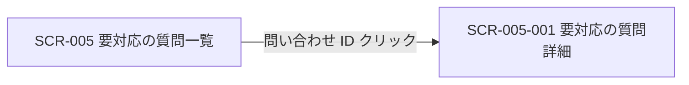

<!-- portal-top -->
[設計ポータル](../README.md) ／ [基本設計](index.md) ／ [画面設計](01_screen-design.md) ／ **SCR-005 要対応の質問一覧**
<!-- /portal-top -->

# SCR-005 要対応の質問一覧

> **このページは、AI が回答できなかった未解決質問を一覧表示し、絞り込み・CSV エクスポートと詳細画面への導線を提供する画面 SCR-005 を定義します。** 画面概要 / 画面遷移図 / 画面レイアウト / 画面項目定義 / 入出力一覧 / 画面イベント一覧 の 6 セクションで記述します。

*版数 v1.0 ・ 更新 2026-06-17 ・ 承認済*

## 1. 画面概要

AI が回答できなかった未解決質問を一覧で確認し、絞り込み・CSV エクスポートと詳細画面への導線を提供する画面です。

| 画面 ID | 画面名 | 機能概要 |
|----|----|----|
| `SCR-005` | 要対応の質問一覧 | 未解決質問の一覧表示・絞り込み・CSV エクスポートを行う |

| 関連     | 内容                                               |
|----------|----------------------------------------------------|
| FR / BR  | FR-070〜FR-077 / BR-019, BR-020                    |
| 関連画面 | [`SCR-005-001` 要対応の質問詳細](SCR-005-001.md) |

| ステークホルダ              | 対象 |
|-----------------------------|------|
| オーナー                    | ◯    |
| プロジェクト管理者(`admin`) | ◯    |
| メンバー(`member`)          | ◯    |

> [!NOTE]
> **補足** 各ステークホルダとも当該プロジェクトへの割当が前提です。割当のないプロジェクトの未解決質問は参照不可(URL 直アクセスは権限不足表示)。

## 2. 画面遷移図

本画面からの画面遷移を、画面 ID・画面名とイベント(操作)で示します。

## 3. 画面レイアウト

## 4. 画面項目定義

本画面の入出力項目(一覧の絞り込み・列・件数表示・空状態を含む)を定義します。項目の正本は本表です。一覧表に「操作」列は設けず、詳細遷移は問い合わせ ID 列のリンクに集約します(遷移リンクは ID 列に付与する全画面共通方針)。

| 項目 ID | 項目 | 説明 | 種類 | 表示条件 | 表示 |
|----|----|----|----|----|----|
| `IT-01` | 状況フィルタ | 状況で一覧を絞り込む | チェックボックス | — | 「対応中」/「対応済み」 |
| `IT-02` | 期間フィルタ | 更新日時の期間で一覧を絞り込む | テキストボックス(日付範囲) | — | 開始日 〜 終了日(例「2026-05-01 〜 2026-05-11」) |
| `IT-03` | 問い合わせ ID | 未解決質問の ID を表示し、詳細画面への導線を兼ねる | リンク | — | 問い合わせ ID(例「INQ-7K9N4」) |
| `IT-04` | 状況 | 未解決質問の対応状況を表示する | バッジ | — | 「対応中」/「対応済み」 |
| `IT-05` | 質問 | 質問本文の冒頭(先頭 60 文字)を抜粋表示する | ラベル | — | 質問本文の先頭 60 文字(例「料金プランの変更方法について教えてください」) |
| `IT-06` | 未解決理由 | AI が回答できなかった理由を表示する | ラベル | — | 「未解決理由: 該当 FAQ なし / FAQ 間で矛盾 / 信頼度しきい値未達 / 利用者が未解決と回答」等 |
| `IT-07` | 日時 | 未解決質問の最終更新日時を表示する | ラベル | — | 相対表記(例「3 分前」「2 時間前」)+ ツールチップに絶対日時 |
| `IT-08` | 件数表示 | 一覧の表示範囲と総件数を表示する | ラベル | 1 件以上ある時 | 「1-50 / 全 248 件」形式 |
| `IT-09` | 空状態 | 未解決質問が 0 件の場合に正常状態である旨を案内する | 空状態表示 | 0 件時(空状態) | 「未解決質問はありません。ウィジェットを設置済みなら正常な状態です。」+「ウィジェット設定を見る」 |

## 5. 入出力一覧

本画面が読み書きするテーブル・ファイルと、呼び出す API の一覧です。テーブルの正本は [03_テーブル設計](03_database-design.md)、API の正本は [02_API設計 §5.6](02_api-design.md#API-INQ-001) です。

<table>
<thead>
<tr>
<th rowspan="2">入出力名</th>
<th rowspan="2">説明</th>
<th rowspan="2">種別</th>
<th rowspan="2">I/O</th>
<th colspan="4">アクセス種別(CRUD)</th>
<th rowspan="2">備考</th>
</tr>
<tr>
<th>C</th>
<th>R</th>
<th>U</th>
<th>D</th>
</tr>
</thead>
<tbody>
<tr>
<td>未解決質問</td>
<td>未解決質問の一覧を取得する</td>
<td>テーブル</td>
<td>入力</td>
<td>—</td>
<td>◯</td>
<td>—</td>
<td>—</td>
<td><code>T_INQUIRIES</code>(<a href="03_database-design.md#TBL-T-005">テーブル設計 3.14</a>)</td>
</tr>
<tr>
<td>質問ログ</td>
<td>未解決理由(<code>result_reason_code</code>)を取得する</td>
<td>テーブル</td>
<td>入力</td>
<td>—</td>
<td>◯</td>
<td>—</td>
<td>—</td>
<td><code>H_QUESTION_LOGS</code>(<a href="03_database-design.md">テーブル設計</a>)</td>
</tr>
<tr>
<td>未解決質問一覧取得</td>
<td>条件付きで未解決質問一覧を取得する API を呼び出す</td>
<td>API</td>
<td>入力</td>
<td>—</td>
<td>—</td>
<td>—</td>
<td>—</td>
<td><code>GET /inquiries</code>(<code>status</code> / <code>projectId</code> / <code>cursor</code>)(<a href="02_api-design.md#API-INQ-001">API 設計 5.6.1</a>)</td>
</tr>
<tr>
<td>未解決質問 CSV</td>
<td>フィルタ適用結果を CSV でダウンロードする</td>
<td>ファイル</td>
<td>出力</td>
<td>—</td>
<td>—</td>
<td>—</td>
<td>—</td>
<td>—</td>
</tr>
</tbody>
</table>

## 6. 画面イベント一覧

本画面で発生するイベントと発生タイミング・概要の一覧です。

<table>
<colgroup>
<col style="width: 20%" />
<col style="width: 20%" />
<col style="width: 20%" />
<col style="width: 20%" />
<col style="width: 20%" />
</colgroup>
<thead>
<tr>
<th>イベント ID</th>
<th>イベント</th>
<th>トリガー</th>
<th>処理</th>
<th>関連項目</th>
</tr>
</thead>
<tbody>
<tr>
<td><code>EV-01</code></td>
<td>一覧初期表示</td>
<td>画面遷移・リロード時</td>
<td><ul>
<li><code>GET /inquiries</code> で一覧を取得し表示</li>
<li>0 件時は EmptyState</li>
</ul></td>
<td><a href="#IT-03">IT-03</a>, <a href="#IT-04">IT-04</a>, <a href="#IT-05">IT-05</a>, <a href="#IT-06">IT-06</a>, <a href="#IT-07">IT-07</a>, <a href="#IT-08">IT-08</a>, <a href="#IT-09">IT-09</a></td>
</tr>
<tr>
<td><code>EV-02</code></td>
<td>フィルタ適用</td>
<td>状況 / 期間フィルタ変更時</td>
<td>条件を付与して <code>GET /inquiries</code> を再取得し一覧を更新</td>
<td><a href="#IT-01">IT-01</a>, <a href="#IT-02">IT-02</a>, <a href="#IT-08">IT-08</a></td>
</tr>
<tr>
<td><code>EV-03</code></td>
<td>CSV エクスポート</td>
<td>「CSV エクスポート」押下時</td>
<td>フィルタ適用結果を CSV でダウンロード</td>
<td>—</td>
</tr>
<tr>
<td><code>EV-04</code></td>
<td>詳細遷移</td>
<td>問い合わせ ID リンク押下時</td>
<td>詳細画面(<code>SCR-005-001</code>)へ遷移</td>
<td><a href="#IT-03">IT-03</a></td>
</tr>
</tbody>
</table>

---

---

---

<!-- portal-bottom -->
[← 画面設計](01_screen-design.md) ・ [基本設計](index.md) ・ [↑ 設計ポータル](../README.md)
<!-- /portal-bottom -->
