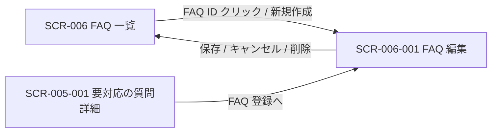

<!-- portal-top -->
[設計ポータル](../README.md) ／ [基本設計](index.md) ／ [画面設計](01_screen-design.md) ／ **SCR-006-001 FAQ 編集**
<!-- /portal-top -->

# SCR-006-001 FAQ 編集

> **このページは、FAQ の質問・回答・カテゴリ・状態を 1 ペインで作成・編集し、自動保存・改訂履歴・論理削除を提供する画面 SCR-006-001 を定義します。** 画面概要 / 画面遷移図 / 画面レイアウト / 画面項目定義 / 入出力一覧 / 画面イベント一覧 の 6 セクションで記述します。

*版数 v1.0 ・ 更新 2026-06-17 ・ 承認済*

## <span id="1-画面概要"></span>1. 画面概要

FAQ の質問・回答・カテゴリ・状態を 1 ペインで作成・編集し、保存・削除を行う画面です。新規作成と既存編集の双方を扱います。

| 画面 ID | 画面名 | 機能概要 |
|----|----|----|
| <span id="SCR-006-001"></span>`SCR-006-001` | FAQ 編集 | FAQ の質問・回答・カテゴリ・状態を編集し保存・削除する |

| 関連 | 内容 |
|----|----|
| FR / BR | FR-040〜FR-048, FR-100〜FR-103, FR-105, FR-106 / BR-055 |
| 関連画面 | [`SCR-006` FAQ 一覧](SCR-006.md) / [`SCR-005-001` 要対応の質問詳細](SCR-005-001.md) |

| ステークホルダ              | 対象 |
|-----------------------------|------|
| オーナー                    | ◯    |
| プロジェクト管理者(`admin`) | ◯    |
| メンバー(`member`)          | ◯    |

> [!NOTE]
> **補足** 各ステークホルダとも当該プロジェクトへの割当(FAQ 管理権限)が前提です。割当のないプロジェクトの FAQ は編集不可(URL 直アクセスは権限不足表示)。状態(下書き / 公開中 / 非公開)の切替は独立ボタンを設けず「状態」ラジオの選択 + 「保存」で一元化します(専用の公開 API・状態遷移ガードなし)。`published` を選択して保存する操作が「公開前の管理者確認」(FR-045)を兼ねます。

## <span id="2-画面遷移図"></span>2. 画面遷移図

本画面への流入と本画面からの遷移を、画面 ID・画面名とイベント(操作)で示します。



## <span id="3-画面レイアウト"></span>3. 画面レイアウト


<details>
<summary>画面モック HTML（ソース）</summary>

```html
<div style="background:#f5f6f8;padding:24px;border-radius:12px;font-family:'Noto Sans JP',-apple-system,BlinkMacSystemFont,'Hiragino Kaku Gothic ProN',Meiryo,sans-serif;color:#3a3f46;-webkit-font-smoothing:antialiased;--accent:#5e6ad2">
<div style="max-width:1180px;margin:0 auto;display:flex;flex-direction:column;gap:40px">
  <section>
    <div style="display:flex;align-items:center;gap:10px;margin-bottom:13px">
      <span style="font-size:11px;font-weight:700;color:var(--accent,#5e6ad2);background:color-mix(in srgb,var(--accent,#5e6ad2) 10%,#fff);border-radius:6px;padding:3px 8px">状態 1</span>
      <span style="font-size:13.5px;font-weight:600;color:#16191d">編集中 — 自動保存</span>
    </div>
    <div style="background:#fff;border:1px solid #e6e8eb;border-radius:14px;box-shadow:0 1px 2px rgba(16,24,40,.04),0 6px 20px rgba(16,24,40,.05);overflow:hidden">
      <div style="display:flex;align-items:center;justify-content:space-between;height:54px;padding:0 16px;border-bottom:1px solid #eef0f2;background:#fff">
        <div style="display:flex;align-items:center;gap:12px">
          <span style="display:inline-flex;align-items:center;gap:8px;font-weight:700;font-size:15px;color:#16191d"><span style="width:23px;height:23px;border-radius:7px;background:var(--accent,#5e6ad2);display:inline-flex;align-items:center;justify-content:center;color:#fff;font-size:13px;font-weight:800">o</span>open-faq</span>
          <span style="width:1px;height:22px;background:#eef0f2"></span>
          <button style="display:inline-flex;align-items:center;gap:7px;padding:6px 11px;border:1px solid #e6e8eb;border-radius:8px;background:#fff;font-size:13px;color:#3a3f46;cursor:pointer;font-family:inherit"><svg width="15" height="15" viewBox="0 0 24 24" fill="none" stroke="#71767e" stroke-width="1.8" stroke-linecap="round" stroke-linejoin="round"><path d="M4 5h5l2 2.5h9A1.5 1.5 0 0 1 21.5 9v9A1.5 1.5 0 0 1 20 19.5H4A1.5 1.5 0 0 1 2.5 18V6.5A1.5 1.5 0 0 1 4 5z"></path></svg>サポートサイト<svg width="14" height="14" viewBox="0 0 24 24" fill="none" stroke="#9aa0a8" stroke-width="1.9" stroke-linecap="round" stroke-linejoin="round"><path d="m6 9 6 6 6-6"></path></svg></button>
        </div>
        <div style="display:flex;align-items:center;gap:8px">
          <span style="display:inline-flex;align-items:center;gap:6px;font-size:11.5px;color:#1a7f37;margin-right:4px"><span style="width:7px;height:7px;border-radius:999px;background:#2da44e"></span>30 秒前に保存しました</span>
          <button style="display:inline-flex;align-items:center;gap:8px;padding:4px 10px 4px 4px;border:1px solid #e6e8eb;border-radius:999px;background:#fff;cursor:pointer;font-family:inherit"><span style="width:26px;height:26px;border-radius:999px;background:color-mix(in srgb,var(--accent,#5e6ad2) 18%,#fff);color:var(--accent,#5e6ad2);font-weight:700;font-size:12px;display:flex;align-items:center;justify-content:center">A</span><svg width="14" height="14" viewBox="0 0 24 24" fill="none" stroke="#9aa0a8" stroke-width="1.9" stroke-linecap="round" stroke-linejoin="round"><path d="m6 9 6 6 6-6"></path></svg></button>
        </div>
      </div>
      <div style="display:flex;min-height:560px">
        <aside style="width:240px;flex:none;background:#fbfbfc;border-right:1px solid #eef0f2;padding:12px 12px 16px;display:flex;flex-direction:column">
          <a style="display:flex;align-items:center;gap:10px;padding:9px 10px;border-radius:8px;color:#3a3f46;font-size:13.5px;text-decoration:none"><svg width="17" height="17" viewBox="0 0 24 24" fill="none" stroke="#71767e" stroke-width="1.7" stroke-linecap="round" stroke-linejoin="round"><path d="M3 10.5 12 3l9 7.5"></path><path d="M5 9.5V20a1 1 0 0 0 1 1h12a1 1 0 0 0 1-1V9.5"></path><path d="M9.5 21v-6h5v6"></path></svg>概要</a>
          <div style="font-size:10.5px;font-weight:700;letter-spacing:.04em;color:#9aa0a8;padding:14px 10px 6px">対応</div>
          <a style="display:flex;align-items:center;gap:10px;padding:9px 10px;border-radius:8px;color:#3a3f46;font-size:13.5px;text-decoration:none"><svg width="17" height="17" viewBox="0 0 24 24" fill="none" stroke="#71767e" stroke-width="1.7" stroke-linecap="round" stroke-linejoin="round"><path d="M22 12h-6l-2 3h-4l-2-3H2"></path><path d="M5.5 5.1 2 12v6a2 2 0 0 0 2 2h16a2 2 0 0 0 2-2v-6l-3.5-6.9A2 2 0 0 0 16.8 4H7.2a2 2 0 0 0-1.7 1.1z"></path></svg>要対応の質問<span style="margin-left:auto;font-size:11px;font-weight:600;background:#eef0f2;color:#6b7280;border-radius:999px;padding:1px 7px">12</span></a>
          <div style="font-size:10.5px;font-weight:700;letter-spacing:.04em;color:#9aa0a8;padding:14px 10px 6px">コンテンツ</div>
          <a style="display:flex;align-items:center;gap:10px;padding:9px 10px;border-radius:8px;background:color-mix(in srgb,var(--accent,#5e6ad2) 12%,#fff);color:var(--accent,#5e6ad2);font-weight:600;font-size:13.5px;text-decoration:none"><svg width="17" height="17" viewBox="0 0 24 24" fill="none" stroke="currentColor" stroke-width="1.8" stroke-linecap="round" stroke-linejoin="round"><path d="M12 7v13"></path><path d="M3 18a1 1 0 0 1-1-1V5a1 1 0 0 1 1-1h5a4 4 0 0 1 4 4 4 4 0 0 1 4-4h5a1 1 0 0 1 1 1v12a1 1 0 0 1-1 1h-6a3 3 0 0 0-3 3 3 3 0 0 0-3-3z"></path></svg>FAQ</a>
          <a style="display:flex;align-items:center;gap:10px;padding:9px 10px;border-radius:8px;color:#3a3f46;font-size:13.5px;text-decoration:none"><svg width="17" height="17" viewBox="0 0 24 24" fill="none" stroke="#71767e" stroke-width="1.7" stroke-linecap="round" stroke-linejoin="round"><rect x="3" y="3" width="7" height="7" rx="1.5"></rect><rect x="14" y="3" width="7" height="7" rx="1.5"></rect><rect x="14" y="14" width="7" height="7" rx="1.5"></rect><rect x="3" y="14" width="7" height="7" rx="1.5"></rect></svg>ウィジェット</a>
          <div style="font-size:10.5px;font-weight:700;letter-spacing:.04em;color:#9aa0a8;padding:14px 10px 6px">プロジェクト</div>
          <a style="display:flex;align-items:center;gap:10px;padding:9px 10px;border-radius:8px;color:#3a3f46;font-size:13.5px;text-decoration:none"><svg width="17" height="17" viewBox="0 0 24 24" fill="none" stroke="#71767e" stroke-width="1.7" stroke-linecap="round" stroke-linejoin="round"><path d="M16 21v-2a4 4 0 0 0-4-4H6a4 4 0 0 0-4 4v2"></path><circle cx="9" cy="7" r="4"></circle><path d="M22 21v-2a4 4 0 0 0-3-3.87"></path><path d="M16 3.1a4 4 0 0 1 0 7.75"></path></svg>メンバー</a>
          <a style="display:flex;align-items:center;gap:10px;padding:9px 10px;border-radius:8px;color:#3a3f46;font-size:13.5px;text-decoration:none"><svg width="17" height="17" viewBox="0 0 24 24" fill="none" stroke="#71767e" stroke-width="1.7" stroke-linecap="round" stroke-linejoin="round"><path d="m12 14 4-4"></path><path d="M3.34 19a10 10 0 1 1 17.32 0"></path></svg>利用量と上限</a>
        </aside>
        <main style="flex:1;min-width:0;background:#fff;padding:18px 22px 24px;display:flex;flex-direction:column;gap:16px;max-width:780px">
          <nav style="display:flex;align-items:center;gap:7px;font-size:12px;color:#9aa0a8"><span style="cursor:pointer">FAQ</span><span>/</span><span style="color:#3a3f46">FAQ を編集</span></nav>
          <div style="display:flex;align-items:flex-start;justify-content:space-between;gap:16px">
            <h1 style="margin:0;font-size:20px;font-weight:700;color:#16191d;letter-spacing:-.01em">FAQ を編集</h1>
            <div style="display:flex;align-items:center;gap:10px">
              <span style="font-size:12px;color:#71767e">公開</span>
              <span style="width:40px;height:23px;border-radius:999px;background:var(--accent,#5e6ad2);position:relative;cursor:pointer"><span style="position:absolute;top:2px;right:2px;width:19px;height:19px;border-radius:999px;background:#fff;box-shadow:0 1px 2px rgba(0,0,0,.2)"></span></span>
              <button style="padding:8px 16px;border:none;border-radius:8px;background:var(--accent,#5e6ad2);color:#fff;font-size:13px;font-weight:600;cursor:pointer;box-shadow:0 1px 2px rgba(16,24,40,.12);font-family:inherit">保存して公開</button>
            </div>
          </div>
          <div>
            <label style="display:block;font-size:12.5px;font-weight:600;color:#3a3f46;margin-bottom:7px">質問<span style="color:#e5484d;margin-left:3px">●</span></label>
            <div style="min-height:42px;border:1px solid #e6e8eb;border-radius:8px;background:#fff;padding:11px 12px;font-size:13.5px;color:#16191d;line-height:1.5">料金プランの変更方法を教えてください</div>
          </div>
          <div>
            <label style="display:block;font-size:12.5px;font-weight:600;color:#3a3f46;margin-bottom:7px">回答<span style="color:#e5484d;margin-left:3px">●</span></label>
            <div style="border:1px solid #e6e8eb;border-radius:8px;background:#fff;overflow:hidden">
              <div style="display:flex;gap:2px;padding:7px 10px;border-bottom:1px solid #eef0f2;background:#fbfbfc">
                <span style="width:28px;height:28px;border-radius:6px;display:flex;align-items:center;justify-content:center;color:#71767e;font-weight:700;font-size:13px;cursor:pointer">B</span>
                <span style="width:28px;height:28px;border-radius:6px;display:flex;align-items:center;justify-content:center;color:#71767e;font-style:italic;font-size:13px;cursor:pointer">I</span>
                <span style="width:28px;height:28px;border-radius:6px;display:flex;align-items:center;justify-content:center;color:#71767e;cursor:pointer"><svg width="15" height="15" viewBox="0 0 24 24" fill="none" stroke="currentColor" stroke-width="1.8" stroke-linecap="round" stroke-linejoin="round"><line x1="8" y1="6" x2="21" y2="6"></line><line x1="8" y1="12" x2="21" y2="12"></line><line x1="8" y1="18" x2="21" y2="18"></line><line x1="3" y1="6" x2="3.01" y2="6"></line><line x1="3" y1="12" x2="3.01" y2="12"></line><line x1="3" y1="18" x2="3.01" y2="18"></line></svg></span>
                <span style="width:28px;height:28px;border-radius:6px;display:flex;align-items:center;justify-content:center;color:#71767e;cursor:pointer"><svg width="15" height="15" viewBox="0 0 24 24" fill="none" stroke="currentColor" stroke-width="1.8" stroke-linecap="round" stroke-linejoin="round"><path d="M10 13a5 5 0 0 0 7.5.5l3-3a5 5 0 0 0-7-7l-1.5 1.5"></path><path d="M14 11a5 5 0 0 0-7.5-.5l-3 3a5 5 0 0 0 7 7l1.5-1.5"></path></svg></span>
              </div>
              <div style="padding:12px;font-size:13px;color:#16191d;line-height:1.8;min-height:120px">プランの変更は、管理画面の「請求」→「プランを変更」から行えます。変更内容は次回請求日から適用されます。<br><br>ダウングレードの場合、現在のプランの上限を超えるデータがあると変更できないことがあります。</div>
            </div>
          </div>
          <div style="display:grid;grid-template-columns:1fr 1fr;gap:14px">
            <div>
              <label style="display:block;font-size:12.5px;font-weight:600;color:#3a3f46;margin-bottom:7px">カテゴリ</label>
              <div style="height:40px;border:1px solid #e6e8eb;border-radius:8px;background:#fff;display:flex;align-items:center;justify-content:space-between;padding:0 12px;font-size:13px;color:#16191d">料金・支払い<svg width="14" height="14" viewBox="0 0 24 24" fill="none" stroke="#9aa0a8" stroke-width="1.9" stroke-linecap="round" stroke-linejoin="round"><path d="m6 9 6 6 6-6"></path></svg></div>
            </div>
            <div>
              <label style="display:block;font-size:12.5px;font-weight:600;color:#3a3f46;margin-bottom:7px">表示順</label>
              <div style="height:40px;border:1px solid #e6e8eb;border-radius:8px;background:#fff;display:flex;align-items:center;padding:0 12px;font-size:13px;color:#16191d">3</div>
            </div>
          </div>
        </main><aside class="rightbar"><div class="rb-title">このページ</div><nav class="toc"><a class="back" href="01_screen-design.md" style="font-weight:600;color:var(--accent)">← 画面一覧へ戻る</a><a href="#1-画面概要">1. 画面概要</a><a href="#2-画面遷移図">2. 画面遷移図</a><a href="#3-画面レイアウト">3. 画面レイアウト</a><a href="#4-画面項目定義">4. 画面項目定義</a><a href="#5-入出力一覧">5. 入出力一覧</a><a href="#6-画面イベント一覧">6. 画面イベント一覧</a></nav></aside>
      </div>
    </div>
  </section>
</div>
</div>
```

</details>

## <span id="4-画面項目定義"></span>4. 画面項目定義

本画面の入出力項目(入力フォーム・バリデーション・操作ボタン・状態表示)を定義します。項目の正本は本表です。

| 項目 ID | 項目 | 説明 | 種類 | 表示条件 | 表示 |
|----|----|----|----|----|----|
| <span id="IT-01"></span>`IT-01` | ページタイトル | 編集対象の FAQ ID を見出しに表示する | 見出し | — | 「{FAQ番号} 編集」。新規時は「新規」 |
| <span id="IT-02"></span>`IT-02` | 自動保存インジケータ | 自動保存の状態(保存済み / 保存中 / 失敗)を表示する | ラベル | — | 「30 秒前に保存しました」/「保存中…」/「保存できませんでした」 |
| <span id="IT-03"></span>`IT-03` | 質問 | FAQ の質問文を入力する。必須・1〜500 文字 | テキストエリア | — | 入力値 + 文字数カウンタ「142 / 500」形式 |
| <span id="IT-04"></span>`IT-04` | 回答 | FAQ の回答文を入力する(簡易ツールバー付き)。必須・1〜5,000 文字 | テキストエリア | — | 入力値 + 文字数カウンタ「482 / 5,000」形式 |
| <span id="IT-05"></span>`IT-05` | カテゴリ | FAQ のカテゴリを選択または新規入力する。任意・100 文字以内 | テキストボックス | — | 既存カテゴリのサジェスト + 入力値 |
| <span id="IT-06"></span>`IT-06` | 状態 | FAQ の公開状態を選択する(相互に自由遷移・状態遷移ガードなし) | ラジオ | — | 選択肢「下書き」「公開中」「非公開」 |
| <span id="IT-07"></span>`IT-07` | 登録元未解決質問 | 当該 FAQ の登録元となった未解決質問へのリンクを表示する | リンク | 登録元未解決質問が存在する場合のみ表示 | 登録元の未解決質問名へのリンク |
| <span id="IT-08"></span>`IT-08` | 改訂履歴 | 改訂履歴モーダルを開き、差分確認とロールバックを行う(直近 50 件・差分表示・任意版へのロールバック) | リンク | — | 「改訂履歴」 |
| <span id="IT-09"></span>`IT-09` | キャンセル | 編集を破棄して一覧へ戻る | ボタン | — | 「キャンセル」 |
| <span id="IT-10"></span>`IT-10` | 保存 | 入力内容を選択中の状態で保存する | ボタン | — | 「保存」 |
| <span id="IT-11"></span>`IT-11` | 削除 | 確認ダイアログ後に当該 FAQ を論理削除する | ボタン | 既存 FAQ 編集時のみ表示(新規時非表示) | 「削除」 |
| <span id="IT-12"></span>`IT-12` | 楽観ロック衝突 | 他者の更新と版が一致しない場合に衝突エラーを表示する | アラート | FAQ のバージョンが他者の更新と一致しない場合のみ表示(楽観ロック衝突時) | 衝突エラーメッセージ |

## <span id="5-入出力一覧"></span>5. 入出力一覧

本画面が読み書きするテーブルと、呼び出す API の一覧です。テーブルの正本は [03_テーブル設計](03_database-design.md)、API の正本は [02_API設計 §5.4.2](02_api-design.md#API-FAQ-002) です。

<table>
<thead>
<tr>
<th rowspan="2">入出力名</th>
<th rowspan="2">説明</th>
<th rowspan="2">種別</th>
<th rowspan="2">I/O</th>
<th colspan="4">アクセス種別(CRUD)</th>
<th rowspan="2">備考</th>
</tr>
<tr>
<th>C</th>
<th>R</th>
<th>U</th>
<th>D</th>
</tr>
</thead>
<tbody>
<tr>
<td>FAQ</td>
<td>FAQ を取得・新規作成・更新・論理削除する</td>
<td>テーブル</td>
<td>入力 / 出力</td>
<td>◯</td>
<td>◯</td>
<td>◯</td>
<td>◯</td>
<td><code>M_FAQS</code>(<a href="03_database-design.md#TBL-M-006">テーブル設計 3.9</a>)</td>
</tr>
<tr>
<td>未解決質問</td>
<td>登録元の未解決質問を参照する</td>
<td>テーブル</td>
<td>入力</td>
<td>—</td>
<td>◯</td>
<td>—</td>
<td>—</td>
<td><code>T_INQUIRIES</code>(<a href="03_database-design.md#TBL-T-005">テーブル設計 3.14</a>)</td>
</tr>
<tr>
<td>FAQ 作成</td>
<td>新規 FAQ を作成する</td>
<td>API</td>
<td>出力</td>
<td>—</td>
<td>—</td>
<td>—</td>
<td>—</td>
<td><code>POST /faqs</code>(<a href="02_api-design.md#API-FAQ-002">API 設計 5.4.2</a>)</td>
</tr>
<tr>
<td>FAQ 取得</td>
<td>編集対象 FAQ の現値をロードする</td>
<td>API</td>
<td>入力</td>
<td>—</td>
<td>—</td>
<td>—</td>
<td>—</td>
<td><code>GET /faqs/{id}</code>(<a href="02_api-design.md#API-FAQ-002">API 設計 5.4.2</a>)</td>
</tr>
<tr>
<td>FAQ 更新</td>
<td>FAQ を更新する(状態保存・自動保存を含む)</td>
<td>API</td>
<td>出力</td>
<td>—</td>
<td>—</td>
<td>—</td>
<td>—</td>
<td><code>PATCH /faqs/{id}</code>(<a href="02_api-design.md#API-FAQ-002">API 設計 5.4.2</a>)</td>
</tr>
<tr>
<td>FAQ 削除</td>
<td>FAQ を論理削除する</td>
<td>API</td>
<td>出力</td>
<td>—</td>
<td>—</td>
<td>—</td>
<td>—</td>
<td><code>DELETE /faqs/{id}</code>(<a href="02_api-design.md#API-FAQ-002">API 設計 5.4.2</a>)</td>
</tr>
<tr>
<td>FAQ 改訂履歴取得</td>
<td>改訂履歴(直近 50 件)を取得し差分表示・ロールバックに用いる</td>
<td>API</td>
<td>入力</td>
<td>—</td>
<td>—</td>
<td>—</td>
<td>—</td>
<td>正本は <a href="02_api-design.md">API 設計 §5.4</a>(IT-08 / EV-06 対応)</td>
</tr>
<tr>
<td>FAQ 改訂履歴</td>
<td>FAQ の版を管理する(改訂履歴・ロールバック)</td>
<td>テーブル</td>
<td>入力</td>
<td>—</td>
<td>◯</td>
<td>—</td>
<td>—</td>
<td>物理名・スキーマの正本は <a href="03_database-design.md">テーブル設計</a>(IT-08 / EV-06 対応)</td>
</tr>
</tbody>
</table>

## <span id="6-画面イベント一覧"></span>6. 画面イベント一覧

本画面で発生するイベントと発生タイミング・概要の一覧です。

<table>
<colgroup>
<col style="width: 20%" />
<col style="width: 20%" />
<col style="width: 20%" />
<col style="width: 20%" />
<col style="width: 20%" />
</colgroup>
<thead>
<tr>
<th>イベント ID</th>
<th>イベント</th>
<th>トリガー</th>
<th>処理</th>
<th>関連項目</th>
</tr>
</thead>
<tbody>
<tr>
<td><code>EV-01</code></td>
<td>編集初期表示</td>
<td>画面遷移・リロード時</td>
<td><ul>
<li>既存編集は <code>GET /faqs/{id}</code> で現値をロードし各欄へ展開</li>
<li>新規は空フォーム</li>
</ul></td>
<td><a href="#IT-01">IT-01</a>, <a href="#IT-03">IT-03</a>, <a href="#IT-04">IT-04</a>, <a href="#IT-05">IT-05</a>, <a href="#IT-06">IT-06</a>, <a href="#IT-07">IT-07</a></td>
</tr>
<tr>
<td><code>EV-02</code></td>
<td>入力バリデーション</td>
<td>各入力欄のフォーカスアウト時</td>
<td>質問 1〜500 文字・回答 1〜5,000 文字・カテゴリ 100 文字以内を検証しエラーを表示</td>
<td><a href="#IT-03">IT-03</a>, <a href="#IT-04">IT-04</a>, <a href="#IT-05">IT-05</a></td>
</tr>
<tr>
<td><code>EV-03</code></td>
<td>自動保存</td>
<td>編集中 30 秒ごと</td>
<td>下書きを自動保存しインジケータを更新</td>
<td><a href="#IT-02">IT-02</a></td>
</tr>
<tr>
<td><code>EV-04</code></td>
<td>保存</td>
<td>「保存」押下時</td>
<td><ul>
<li>「状態」ラジオの値で <code>POST /faqs</code>(新規)/ <code>PATCH /faqs/{id}</code>(更新)</li>
<li><code>published</code> 選択時は公開確認ダイアログ</li>
<li><code>M_FAQS.version</code> 不一致時は楽観ロックエラー</li>
</ul></td>
<td><a href="#IT-06">IT-06</a>, <a href="#IT-10">IT-10</a>, <a href="#IT-12">IT-12</a></td>
</tr>
<tr>
<td><code>EV-05</code></td>
<td>削除</td>
<td>「削除」押下時</td>
<td><ul>
<li>確認ダイアログ後 <code>DELETE /faqs/{id}</code> で論理削除</li>
<li>一覧へ戻る</li>
</ul></td>
<td><a href="#IT-11">IT-11</a></td>
</tr>
<tr>
<td><code>EV-06</code></td>
<td>改訂履歴表示</td>
<td>「改訂履歴」押下時</td>
<td>直近 50 件の差分モーダルを表示。任意版へロールバック</td>
<td><a href="#IT-08">IT-08</a></td>
</tr>
<tr>
<td><code>EV-07</code></td>
<td>キャンセル</td>
<td>「キャンセル」押下時</td>
<td><ul>
<li>編集を破棄して一覧へ戻る</li>
<li>未保存変更時は確認ダイアログ</li>
</ul></td>
<td><a href="#IT-09">IT-09</a></td>
</tr>
</tbody>
</table>

---

---

---

<!-- portal-bottom -->
[← 画面設計](01_screen-design.md) ・ [基本設計](index.md) ・ [↑ 設計ポータル](../README.md)
<!-- /portal-bottom -->
