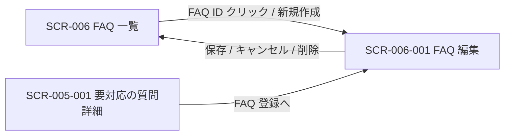

<!-- portal-top -->
[設計ポータル](../README.md) ／ [基本設計](index.md) ／ [画面設計](01_screen-design.md) ／ **SCR-006-001 FAQ 編集**
<!-- /portal-top -->

# SCR-006-001 FAQ 編集

> **このページは、FAQ の質問・回答・カテゴリ・状態を 1 ペインで作成・編集し、自動保存・論理削除を提供する画面 SCR-006-001 を定義します。** 画面概要 / 画面遷移図 / 画面レイアウト / 画面項目定義 / 入出力一覧 / 画面イベント一覧 の 6 セクションで記述します。

*版数 v1.0 ・ 更新 2026-06-17 ・ 承認済*

## 1. 画面概要

FAQ の質問・回答・カテゴリ・状態を 1 ペインで作成・編集し、保存・削除を行う画面です。新規作成と既存編集の双方を扱います。

| 画面 ID | 画面名 | 機能概要 |
|----|----|----|
| `SCR-006-001` | FAQ 編集 | FAQ の質問・回答・カテゴリ・状態を編集し保存・削除する |

| 関連 | 内容 |
|----|----|
| FR / BR | FR-040〜FR-048, FR-100〜FR-103, FR-105, FR-106 / BR-055 |
| 関連画面 | [`SCR-006` FAQ 一覧](SCR-006.md) / [`SCR-005-001` 要対応の質問詳細](SCR-005-001.md) |

| ステークホルダ | 対象 |
|----------------|------|
| オーナー       | ◯    |
| メンバー       | ◯    |

> [!NOTE]
> **補足** 各ステークホルダとも当該プロジェクトへの割当(FAQ 管理権限)が前提です。割当のないプロジェクトの FAQ は編集不可(URL 直アクセスは権限不足表示)。状態(下書き / 公開中 / 非公開)の切替は独立ボタンを設けず「状態」ラジオの選択 + 「保存」で一元化します(専用の公開 API・状態遷移ガードなし)。`published` を選択して保存する操作が「公開前のメンバー確認」(FR-045)を兼ねます。

## 2. 画面遷移図

本画面への流入と本画面からの遷移を、画面 ID・画面名とイベント(操作)で示します。

## 3. 画面レイアウト

## 4. 画面項目定義

本画面の入出力項目(入力フォーム・バリデーション・操作ボタン・状態表示)を定義します。項目の正本は本表です。

| 項目 ID | 項目 | 説明 | 種類 | 表示条件 | 表示 |
|----|----|----|----|----|----|
| `IT-01` | ページタイトル | 編集対象の FAQ ID を見出しに表示する | 見出し | — | 「{FAQ番号} 編集」。新規時は「新規」 |
| `IT-02` | 自動保存インジケータ | 自動保存の状態(保存済み / 保存中 / 失敗)を表示する | ラベル | — | 「30 秒前に保存しました」/「保存中…」/「保存できませんでした」 |
| `IT-03` | 質問 | FAQ の質問文を入力する。必須・1〜500 文字 | テキストエリア | — | 入力値 + 文字数カウンタ「142 / 500」形式 |
| `IT-04` | 回答 | FAQ の回答文を入力する(簡易ツールバー付き)。必須・1〜5,000 文字 | テキストエリア | — | 入力値 + 文字数カウンタ「482 / 5,000」形式 |
| `IT-05` | カテゴリ | FAQ のカテゴリを選択または新規入力する。任意・100 文字以内 | テキストボックス | — | 既存カテゴリのサジェスト + 入力値 |
| `IT-06` | 状態 | FAQ の公開状態を選択する(相互に自由遷移・状態遷移ガードなし) | ラジオ | — | 選択肢「下書き」「公開中」「非公開」 |
| `IT-07` | 登録元未解決質問 | 当該 FAQ の登録元となった未解決質問へのリンクを表示する | リンク | 登録元未解決質問が存在する場合のみ表示 | 登録元の未解決質問名へのリンク |
| `IT-08` | キャンセル | 編集を破棄して一覧へ戻る | ボタン | — | 「キャンセル」 |
| `IT-09` | 保存 | 入力内容を選択中の状態で保存する | ボタン | — | 「保存」 |
| `IT-10` | 削除 | 確認ダイアログ後に当該 FAQ を論理削除する | ボタン | 既存 FAQ 編集時のみ表示(新規時非表示) | 「削除」 |
| `IT-11` | 楽観ロック衝突 | 他者の更新と版が一致しない場合に衝突エラーを表示する | アラート | FAQ のバージョンが他者の更新と一致しない場合のみ表示(楽観ロック衝突時) | 衝突エラーメッセージ |

## 5. 入出力一覧

本画面が読み書きするテーブルと、呼び出す API の一覧です。テーブルの正本は [03_テーブル設計](03_database-design.md)、API の正本は [02_API設計 §5.4.2](02_api-design.md#API-FAQ-002) です。

<table>
<thead>
<tr>
<th rowspan="2">入出力名</th>
<th rowspan="2">説明</th>
<th rowspan="2">種別</th>
<th rowspan="2">I/O</th>
<th colspan="4">アクセス種別(CRUD)</th>
<th rowspan="2">備考</th>
</tr>
<tr>
<th>C</th>
<th>R</th>
<th>U</th>
<th>D</th>
</tr>
</thead>
<tbody>
<tr>
<td>FAQ</td>
<td>FAQ を取得・新規作成・更新・論理削除する</td>
<td>テーブル</td>
<td>入力 / 出力</td>
<td>◯</td>
<td>◯</td>
<td>◯</td>
<td>◯</td>
<td><code>M_FAQS</code>(<a href="03_database-design.md#TBL-M-006">テーブル設計 3.9</a>)</td>
</tr>
<tr>
<td>未解決質問</td>
<td>登録元の未解決質問を参照する</td>
<td>テーブル</td>
<td>入力</td>
<td>—</td>
<td>◯</td>
<td>—</td>
<td>—</td>
<td><code>T_INQUIRIES</code>(<a href="03_database-design.md#TBL-T-005">テーブル設計 3.14</a>)</td>
</tr>
<tr>
<td>FAQ 作成</td>
<td>新規 FAQ を作成する</td>
<td>API</td>
<td>出力</td>
<td>—</td>
<td>—</td>
<td>—</td>
<td>—</td>
<td><code>POST /faqs</code>(<a href="02_api-design.md#API-FAQ-002">API 設計 5.4.2</a>)</td>
</tr>
<tr>
<td>FAQ 取得</td>
<td>編集対象 FAQ の現値をロードする</td>
<td>API</td>
<td>入力</td>
<td>—</td>
<td>—</td>
<td>—</td>
<td>—</td>
<td><code>GET /faqs/{id}</code>(<a href="02_api-design.md#API-FAQ-002">API 設計 5.4.2</a>)</td>
</tr>
<tr>
<td>FAQ 更新</td>
<td>FAQ を更新する(状態保存・自動保存を含む)</td>
<td>API</td>
<td>出力</td>
<td>—</td>
<td>—</td>
<td>—</td>
<td>—</td>
<td><code>PATCH /faqs/{id}</code>(<a href="02_api-design.md#API-FAQ-002">API 設計 5.4.2</a>)</td>
</tr>
<tr>
<td>FAQ 削除</td>
<td>FAQ を論理削除する</td>
<td>API</td>
<td>出力</td>
<td>—</td>
<td>—</td>
<td>—</td>
<td>—</td>
<td><code>DELETE /faqs/{id}</code>(<a href="02_api-design.md#API-FAQ-002">API 設計 5.4.2</a>)</td>
</tr>
</tbody>
</table>

## 6. 画面イベント一覧

本画面のイベント(初期表示・各操作)ごとに、対象の項目 ID と処理内容を定義します。

<table>
<colgroup>
<col style="width: 12%" />
<col style="width: 12%" />
<col style="width: 30%" />
<col style="width: 46%" />
</colgroup>
<thead>
<tr>
<th>イベント ID</th>
<th>項目 ID</th>
<th>イベント</th>
<th>処理</th>
</tr>
</thead>
<tbody>
<tr>
<td><code>EV-01</code></td>
<td>—</td>
<td>初期表示</td>
<td><ul>
<li>既存編集: <a href="API-faq.md#API-FAQ-002">FAQ 作成・更新・削除</a> API で現値をロードし各欄へ展開</li>
<li>新規: 空フォーム</li>
</ul></td>
</tr>
<tr>
<td><code>EV-02</code></td>
<td><a href="#IT-03">IT-03</a></td>
<td>質問を入力</td>
<td>1〜500 文字を検証しエラーを表示</td>
</tr>
<tr>
<td><code>EV-03</code></td>
<td><a href="#IT-04">IT-04</a></td>
<td>回答を入力</td>
<td>1〜5,000 文字を検証しエラーを表示</td>
</tr>
<tr>
<td><code>EV-04</code></td>
<td><a href="#IT-05">IT-05</a></td>
<td>カテゴリを入力</td>
<td>100 文字以内を検証しエラーを表示</td>
</tr>
<tr>
<td><code>EV-05</code></td>
<td><a href="#IT-02">IT-02</a></td>
<td>自動保存(30 秒ごと)</td>
<td>下書きを自動保存しインジケータを更新</td>
</tr>
<tr>
<td><code>EV-06</code></td>
<td><a href="#IT-09">IT-09</a></td>
<td>「保存」を押下</td>
<td><ul>
<li>「状態」ラジオの値で <a href="API-faq.md#API-FAQ-002">FAQ 作成・更新・削除</a> API(新規)/ <a href="API-faq.md#API-FAQ-002">FAQ 作成・更新・削除</a> API(更新)</li>
<li>published 選択時: 公開確認ダイアログ</li>
<li><code>M_FAQS.version</code> 不一致時: 楽観ロックエラー(<a href="#IT-11">IT-11</a>)</li>
</ul></td>
</tr>
<tr>
<td><code>EV-07</code></td>
<td><a href="#IT-10">IT-10</a></td>
<td>「削除」を押下</td>
<td>確認ダイアログ後 <a href="API-faq.md#API-FAQ-002">FAQ 作成・更新・削除</a> API で論理削除し一覧へ戻る</td>
</tr>
<tr>
<td><code>EV-08</code></td>
<td><a href="#IT-08">IT-08</a></td>
<td>「キャンセル」を押下</td>
<td>編集を破棄して一覧へ戻る(未保存変更時は確認ダイアログ)</td>
</tr>
</tbody>
</table>

---

<!-- portal-bottom -->
[← 画面設計](01_screen-design.md) ・ [基本設計](index.md) ・ [↑ 設計ポータル](../README.md)
<!-- /portal-bottom -->
