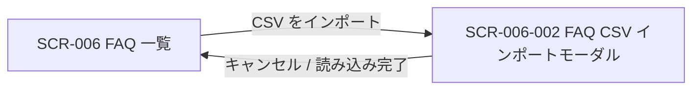

<!-- portal-top -->
[設計ポータル](../README.md) ／ [基本設計](index.md) ／ [画面設計](01_screen-design.md) ／ **SCR-006-002 FAQ CSV インポートモーダル**
<!-- /portal-top -->

# SCR-006-002 FAQ CSV インポートモーダル

> **このページは、SCR-006 から開き、CSV ファイルで FAQ を一括取り込みする(FAQ ID 判定による新規 / 上書き・部分失敗確認・進捗表示)モーダル画面 SCR-006-002 を定義します。** 画面概要 / 画面遷移図 / 画面レイアウト / 画面項目定義 / 入出力一覧 / 画面イベント一覧 の 6 セクションで記述します。

*版数 v1.0 ・ 更新 2026-06-17 ・ 承認済*

## 1. 画面概要

FAQ を CSV ファイルから一括インポートする全画面割込みモーダルです。FAQ ID 列で新規 / 上書きを判定し、部分失敗を画面上で確認します。

| 画面 ID | 画面名 | 機能概要 |
|----|----|----|
| `SCR-006-002` | FAQ CSV インポートモーダル | CSV ファイルで FAQ を一括取り込みする(新規 / 上書き・部分失敗確認・進捗表示) |

| 関連     | 内容                                       |
|----------|--------------------------------------------|
| FR / BR  | FR-310 / BR-147                            |
| 関連画面 | [`SCR-006` FAQ 一覧](SCR-006.md)(呼出元) |

| ステークホルダ | 対象 |
|----------------|------|
| オーナー       | ◯    |
| メンバー       | ◯    |

> [!NOTE]
> **補足** 各ステークホルダとも当該プロジェクトへの割当(FAQ 管理権限)が前提です。FAQ 一覧の「CSV をインポート」ボタンから開きます。`status`(状態)列は持たず、新規行は一律 `draft`、上書き行は既存状態を維持します。

## 2. 画面遷移図

本モーダルの開閉(呼出元との関係)を、画面 ID・画面名とイベント(操作)で示します。

## 3. 画面レイアウト

## 4. 画面項目定義

本モーダルの入出力項目(ファイル選択・CSV 列構成・進捗結果・操作ボタン・バリデーション)を定義します。項目の正本は本表です。

| 項目 ID | 項目 | 説明 | 種類 | 表示条件 | 表示 |
|----|----|----|----|----|----|
| `IT-01` | テンプレートをダウンロード | ヘッダ行のみのテンプレート CSV をダウンロードする | リンク | — | 「テンプレートをダウンロード」 |
| `IT-02` | ファイル選択 | 取り込む CSV をドラッグ&ドロップまたは選択する。必須・`.csv` のみ・1 ファイル最大 1000 件(1 行 = 1 FAQ)・ヘッダ行必須 | ドロップゾーン | — | 「CSV ファイルをここにドラッグ&ドロップ」/「クリックして選択」 |
| `IT-03` | CSV 列構成 / FAQ ID 判定 | CSV の列構成と FAQ ID による新規 / 上書き / 失敗の判定規則を案内する | ラベル | — | 列「FAQ ID, 質問, 回答, カテゴリ」。FAQ ID 空欄=新規(下書き)/ 既存 ID 一致=上書き(状態維持)/ 無効 ID=当該行を失敗 |
| `IT-04` | 文字コードエラー | UTF-8 以外のファイル選択時にアップロードせず即エラーを表示する(検出文字コード名を併記) | アラート | UTF-8(BOM 許容)以外を選択時のみ表示 | 「このファイルは UTF-8 ではありません(検出: {文字コード名})。UTF-8 で保存し直してください」 |
| `IT-05` | 進捗バー | 取り込みの進捗(処理済み / 全件)を表示する。100 件超は非同期ジョブ化・24h タイムアウト | プログレスバー | 取込処理中 | 「処理中…({完了件数} / {総件数} 件)」 |
| `IT-06` | エラー一覧 | 取り込みに失敗した行を行番号とエラー理由で一覧表示する(CSV ダウンロードは行わない) | テーブル | 失敗行が 1 件以上ある時のみ表示 | 「失敗した行: {件数} 件」見出し +「行番号 / エラー理由」の 2 列 |
| `IT-07` | キャンセル | モーダルを閉じる(処理中は中断確認) | ボタン | — | 「キャンセル」 |
| `IT-08` | 読み込みを開始 | 取り込み処理を開始する | ボタン | バリデーション通過時のみ活性 | 「読み込みを開始」 |

## 5. 入出力一覧

本モーダルが読み書きするテーブル・ファイルと、呼び出す API の一覧です。テーブルの正本は [03_テーブル設計](03_database-design.md)、API の正本は [02_API設計 §5.4.3](02_api-design.md#API-FAQ-004) です。

<table>
<thead>
<tr>
<th rowspan="2">入出力名</th>
<th rowspan="2">説明</th>
<th rowspan="2">種別</th>
<th rowspan="2">I/O</th>
<th colspan="4">アクセス種別(CRUD)</th>
<th rowspan="2">備考</th>
</tr>
<tr>
<th>C</th>
<th>R</th>
<th>U</th>
<th>D</th>
</tr>
</thead>
<tbody>
<tr>
<td>FAQ</td>
<td>FAQ ID の存在確認、新規登録(<code>draft</code>)・上書き更新を行う</td>
<td>テーブル</td>
<td>入力 / 出力</td>
<td>◯</td>
<td>◯</td>
<td>◯</td>
<td>—</td>
<td><code>M_FAQS</code>(<a href="03_database-design.md#TBL-M-006">テーブル設計 3.9</a>)</td>
</tr>
<tr>
<td>FAQ CSV インポート</td>
<td>CSV を一括取り込みする(202 + jobId)</td>
<td>API</td>
<td>入力 / 出力</td>
<td>—</td>
<td>—</td>
<td>—</td>
<td>—</td>
<td><code>POST /faqs/import</code>(<a href="02_api-design.md#API-FAQ-004">API 設計 5.4.3</a>)</td>
</tr>
<tr>
<td>FAQ インポートテンプレート取得</td>
<td>ヘッダ行のみのテンプレート CSV を取得する</td>
<td>API</td>
<td>入力</td>
<td>—</td>
<td>—</td>
<td>—</td>
<td>—</td>
<td><code>GET /faqs/import/template</code>(<a href="02_api-design.md#API-FAQ-005">API 設計 5.4.4</a>)</td>
</tr>
<tr>
<td>インポート CSV</td>
<td>取り込み対象としてアップロードする CSV</td>
<td>ファイル</td>
<td>入力</td>
<td>—</td>
<td>—</td>
<td>—</td>
<td>—</td>
<td>UTF-8 / BOM 許容、最大 1000 行</td>
</tr>
<tr>
<td>テンプレート CSV</td>
<td>ダウンロードされるテンプレート CSV</td>
<td>ファイル</td>
<td>出力</td>
<td>—</td>
<td>—</td>
<td>—</td>
<td>—</td>
<td>ヘッダ行のみ</td>
</tr>
</tbody>
</table>

## 6. 画面イベント一覧

本モーダルのイベント(初期表示・各操作)ごとに、対象の項目 ID と処理内容を定義します。

<table>
<colgroup>
<col style="width: 12%" />
<col style="width: 12%" />
<col style="width: 30%" />
<col style="width: 46%" />
</colgroup>
<thead>
<tr>
<th>イベント ID</th>
<th>項目 ID</th>
<th>イベント</th>
<th>処理</th>
</tr>
</thead>
<tbody>
<tr>
<td><code>EV-01</code></td>
<td><a href="#IT-01">IT-01</a></td>
<td>「テンプレートをダウンロード」を押下</td>
<td><a href="API-faq.md#API-FAQ-005">FAQ インポートテンプレート</a> API でヘッダ行のみの CSV を取得</td>
</tr>
<tr>
<td><code>EV-02</code></td>
<td><a href="#IT-02">IT-02</a></td>
<td>ファイルを選択</td>
<td><ul>
<li>拡張子・文字コードをクライアント側で判定</li>
<li>UTF-8 以外: 即エラー(<a href="#IT-04">IT-04</a>)</li>
</ul></td>
</tr>
<tr>
<td><code>EV-03</code></td>
<td><a href="#IT-08">IT-08</a></td>
<td>「読み込みを開始」を押下</td>
<td><ul>
<li><a href="API-faq.md#API-FAQ-004">FAQ CSV インポート</a> API(202 + jobId)で取り込みを開始</li>
<li>FAQ ID 判定で新規 / 上書き / 行エラー</li>
</ul></td>
</tr>
<tr>
<td><code>EV-04</code></td>
<td><a href="#IT-05">IT-05</a></td>
<td>取り込み中・完了</td>
<td>進捗バーと失敗行(行番号 + 理由)を画面表示</td>
</tr>
<tr>
<td><code>EV-05</code></td>
<td><a href="#IT-07">IT-07</a></td>
<td>「キャンセル」を押下</td>
<td>モーダルを閉じる(処理中は中断確認ダイアログ)</td>
</tr>
</tbody>
</table>

---

<!-- portal-bottom -->
[← 画面設計](01_screen-design.md) ・ [基本設計](index.md) ・ [↑ 設計ポータル](../README.md)
<!-- /portal-bottom -->
