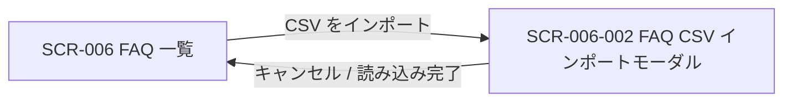

<!-- portal-top -->
[設計ポータル](../README.md) ／ [基本設計](index.md) ／ [画面設計](01_screen-design.md) ／ **SCR-006-002 FAQ CSV インポートモーダル**
<!-- /portal-top -->

# SCR-006-002 FAQ CSV インポートモーダル

> **このページは、SCR-006 から開き、CSV ファイルで FAQ を一括取り込みする(FAQ ID 判定による新規 / 上書き・部分失敗確認・進捗表示)モーダル画面 SCR-006-002 を定義します。** 画面概要 / 画面遷移図 / 画面レイアウト / 画面項目定義 / 入出力一覧 / 画面イベント一覧 の 6 セクションで記述します。

*版数 v1.0 ・ 更新 2026-06-17 ・ 承認済*

## <span id="1-画面概要"></span>1. 画面概要

FAQ を CSV ファイルから一括インポートする全画面割込みモーダルです。FAQ ID 列で新規 / 上書きを判定し、部分失敗を画面上で確認します。

| 画面 ID | 画面名 | 機能概要 |
|----|----|----|
| <span id="SCR-006-002"></span>`SCR-006-002` | FAQ CSV インポートモーダル | CSV ファイルで FAQ を一括取り込みする(新規 / 上書き・部分失敗確認・進捗表示) |

| 関連     | 内容                                       |
|----------|--------------------------------------------|
| FR / BR  | FR-310 / BR-147                            |
| 関連画面 | [`SCR-006` FAQ 一覧](SCR-006.md)(呼出元) |

| ステークホルダ              | 対象 |
|-----------------------------|------|
| オーナー                    | ◯    |
| プロジェクト管理者(`admin`) | ◯    |
| メンバー(`member`)          | ◯    |

> [!NOTE]
> **補足** 各ステークホルダとも当該プロジェクトへの割当(FAQ 管理権限)が前提です。FAQ 一覧の「CSV をインポート」ボタンから開きます。`status`(状態)列は持たず、新規行は一律 `draft`、上書き行は既存状態を維持します。

## <span id="2-画面遷移図"></span>2. 画面遷移図

本モーダルの開閉(呼出元との関係)を、画面 ID・画面名とイベント(操作)で示します。



## <span id="3-画面レイアウト"></span>3. 画面レイアウト


<details>
<summary>画面モック HTML（ソース）</summary>

```html
<div style="background:#f5f6f8;padding:24px;border-radius:12px;font-family:'Noto Sans JP',-apple-system,BlinkMacSystemFont,'Hiragino Kaku Gothic ProN',Meiryo,sans-serif;color:#3a3f46;--accent:#5e6ad2;--row-pad:14px"><div style="max-width:1180px;margin:0 auto;display:flex;flex-direction:column;gap:28px"><section style="flex:none;width:368px">
      <div style="display:flex;align-items:center;gap:9px;margin-bottom:12px"><span style="font-size:11px;font-weight:700;color:var(--accent,#5e6ad2);background:color-mix(in srgb,var(--accent,#5e6ad2) 10%,#fff);border-radius:6px;padding:3px 8px">006-002</span><span style="font-size:13px;font-weight:600;color:#16191d">CSV インポート</span></div>
      <div style="height:500px;background:rgba(22,25,29,.42);border:1px solid #e6e8eb;border-radius:14px;box-shadow:0 1px 2px rgba(16,24,40,.04),0 6px 20px rgba(16,24,40,.05);display:flex;align-items:center;justify-content:center;padding:20px;overflow:hidden">
        <div style="width:320px;background:#fff;border-radius:14px;box-shadow:0 20px 50px rgba(16,24,40,.3);overflow:hidden">
          <div style="display:flex;align-items:center;justify-content:space-between;padding:16px 18px;border-bottom:1px solid #eef0f2"><span style="font-size:15px;font-weight:700;color:#16191d">FAQ を CSV インポート</span><span style="width:26px;height:26px;border-radius:7px;display:flex;align-items:center;justify-content:center;color:#9aa0a8;cursor:pointer"><svg width="16" height="16" viewBox="0 0 24 24" fill="none" stroke="currentColor" stroke-width="2" stroke-linecap="round" stroke-linejoin="round"><path d="M18 6 6 18M6 6l12 12"></path></svg></span></div>
          <div style="padding:18px;display:flex;flex-direction:column;gap:14px">
            <div style="border:1.5px dashed #cdd2da;border-radius:12px;background:#fbfbfc;padding:26px 16px;display:flex;flex-direction:column;align-items:center;gap:8px;text-align:center">
              <div style="width:42px;height:42px;border-radius:999px;background:color-mix(in srgb,var(--accent,#5e6ad2) 10%,#fff);color:var(--accent,#5e6ad2);display:flex;align-items:center;justify-content:center"><svg width="20" height="20" viewBox="0 0 24 24" fill="none" stroke="currentColor" stroke-width="1.8" stroke-linecap="round" stroke-linejoin="round"><path d="M12 15V3"></path><path d="m7 8 5-5 5 5"></path><path d="M5 21h14"></path></svg></div>
              <div style="font-size:12.5px;color:#3a3f46;font-weight:600">CSV ファイルをドラッグ&amp;ドロップ</div>
              <div style="font-size:11px;color:#9aa0a8">または<span style="color:var(--accent,#5e6ad2);font-weight:600">ファイルを選択</span></div>
            </div>
            <div style="display:flex;align-items:center;gap:10px;padding:10px 12px;border:1px solid #eef0f2;border-radius:8px;background:#fff"><svg width="18" height="18" viewBox="0 0 24 24" fill="none" stroke="#1a7f37" stroke-width="1.8" stroke-linecap="round" stroke-linejoin="round"><path d="M14 3v5h5"></path><path d="M19 8v11a2 2 0 0 1-2 2H7a2 2 0 0 1-2-2V5a2 2 0 0 1 2-2h7z"></path></svg><div style="flex:1;min-width:0"><div style="font-size:12px;font-weight:600;color:#16191d">faq_export.csv</div><div style="font-size:10.5px;color:#9aa0a8">128 件 ・ 列マッピング OK</div></div><span style="font-size:11px;color:#1a7f37;font-weight:600">検証済</span></div>
          </div>
          <div style="display:flex;justify-content:flex-end;gap:8px;padding:14px 18px;border-top:1px solid #eef0f2;background:#fbfbfc"><button style="padding:8px 14px;border:1px solid #e6e8eb;border-radius:8px;background:#fff;font-size:12.5px;font-weight:600;color:#3a3f46;cursor:pointer;font-family:inherit">キャンセル</button><button style="padding:8px 16px;border:none;border-radius:8px;background:var(--accent,#5e6ad2);color:#fff;font-size:12.5px;font-weight:600;cursor:pointer;font-family:inherit">128 件を取込む</button></div>
        </div>
      </div>
    </section></div></div>
```

</details>

## <span id="4-画面項目定義"></span>4. 画面項目定義

本モーダルの入出力項目(ファイル選択・CSV 列構成・進捗結果・操作ボタン・バリデーション)を定義します。項目の正本は本表です。

| 項目 ID | 項目 | 説明 | 種類 | 表示条件 | 表示 |
|----|----|----|----|----|----|
| <span id="IT-01"></span>`IT-01` | テンプレートをダウンロード | ヘッダ行のみのテンプレート CSV をダウンロードする | リンク | — | 「テンプレートをダウンロード」 |
| <span id="IT-02"></span>`IT-02` | ファイル選択 | 取り込む CSV をドラッグ&ドロップまたは選択する。必須・`.csv` のみ・1 ファイル最大 1000 件(1 行 = 1 FAQ)・ヘッダ行必須 | ドロップゾーン | — | 「CSV ファイルをここにドラッグ&ドロップ」/「クリックして選択」 |
| <span id="IT-03"></span>`IT-03` | CSV 列構成 / FAQ ID 判定 | CSV の列構成と FAQ ID による新規 / 上書き / 失敗の判定規則を案内する | ラベル | — | 列「FAQ ID, 質問, 回答, カテゴリ」。FAQ ID 空欄=新規(下書き)/ 既存 ID 一致=上書き(状態維持)/ 無効 ID=当該行を失敗 |
| <span id="IT-04"></span>`IT-04` | 文字コードエラー | UTF-8 以外のファイル選択時にアップロードせず即エラーを表示する(検出文字コード名を併記) | アラート | UTF-8(BOM 許容)以外を選択時のみ表示 | 「このファイルは UTF-8 ではありません(検出: {文字コード名})。UTF-8 で保存し直してください」 |
| <span id="IT-05"></span>`IT-05` | 進捗バー | 取り込みの進捗(処理済み / 全件)を表示する。100 件超は非同期ジョブ化・24h タイムアウト | プログレスバー | 取込処理中 | 「処理中…({完了件数} / {総件数} 件)」 |
| <span id="IT-06"></span>`IT-06` | エラー一覧 | 取り込みに失敗した行を行番号とエラー理由で一覧表示する(CSV ダウンロードは行わない) | テーブル | 失敗行が 1 件以上ある時のみ表示 | 「失敗した行: {件数} 件」見出し +「行番号 / エラー理由」の 2 列 |
| <span id="IT-07"></span>`IT-07` | キャンセル | モーダルを閉じる(処理中は中断確認) | ボタン | — | 「キャンセル」 |
| <span id="IT-08"></span>`IT-08` | 読み込みを開始 | 取り込み処理を開始する | ボタン | バリデーション通過時のみ活性 | 「読み込みを開始」 |

## <span id="5-入出力一覧"></span>5. 入出力一覧

本モーダルが読み書きするテーブル・ファイルと、呼び出す API の一覧です。テーブルの正本は [03_テーブル設計](03_database-design.md)、API の正本は [02_API設計 §5.4.3](02_api-design.md#API-FAQ-004) です。

<table>
<thead>
<tr>
<th rowspan="2">入出力名</th>
<th rowspan="2">説明</th>
<th rowspan="2">種別</th>
<th rowspan="2">I/O</th>
<th colspan="4">アクセス種別(CRUD)</th>
<th rowspan="2">備考</th>
</tr>
<tr>
<th>C</th>
<th>R</th>
<th>U</th>
<th>D</th>
</tr>
</thead>
<tbody>
<tr>
<td>FAQ</td>
<td>FAQ ID の存在確認、新規登録(<code>draft</code>)・上書き更新を行う</td>
<td>テーブル</td>
<td>入力 / 出力</td>
<td>◯</td>
<td>◯</td>
<td>◯</td>
<td>—</td>
<td><code>M_FAQS</code>(<a href="03_database-design.md#TBL-M-006">テーブル設計 3.9</a>)</td>
</tr>
<tr>
<td>FAQ CSV インポート</td>
<td>CSV を一括取り込みする(202 + jobId)</td>
<td>API</td>
<td>入力 / 出力</td>
<td>—</td>
<td>—</td>
<td>—</td>
<td>—</td>
<td><code>POST /faqs/import</code>(<a href="02_api-design.md#API-FAQ-004">API 設計 5.4.3</a>)</td>
</tr>
<tr>
<td>FAQ インポートテンプレート取得</td>
<td>ヘッダ行のみのテンプレート CSV を取得する</td>
<td>API</td>
<td>入力</td>
<td>—</td>
<td>—</td>
<td>—</td>
<td>—</td>
<td><code>GET /faqs/import/template</code>(<a href="02_api-design.md#API-FAQ-005">API 設計 5.4.4</a>)</td>
</tr>
<tr>
<td>インポート CSV</td>
<td>取り込み対象としてアップロードする CSV</td>
<td>ファイル</td>
<td>入力</td>
<td>—</td>
<td>—</td>
<td>—</td>
<td>—</td>
<td>UTF-8 / BOM 許容、最大 1000 行</td>
</tr>
<tr>
<td>テンプレート CSV</td>
<td>ダウンロードされるテンプレート CSV</td>
<td>ファイル</td>
<td>出力</td>
<td>—</td>
<td>—</td>
<td>—</td>
<td>—</td>
<td>ヘッダ行のみ</td>
</tr>
</tbody>
</table>

## <span id="6-画面イベント一覧"></span>6. 画面イベント一覧

本モーダルで発生するイベントと発生タイミング・概要の一覧です。

<table>
<colgroup>
<col style="width: 20%" />
<col style="width: 20%" />
<col style="width: 20%" />
<col style="width: 20%" />
<col style="width: 20%" />
</colgroup>
<thead>
<tr>
<th>イベント ID</th>
<th>イベント</th>
<th>トリガー</th>
<th>処理</th>
<th>関連項目</th>
</tr>
</thead>
<tbody>
<tr>
<td><code>EV-01</code></td>
<td>テンプレートダウンロード</td>
<td>「テンプレートをダウンロード」押下時</td>
<td><code>GET /faqs/import/template</code> でヘッダ行のみの CSV を取得</td>
<td><a href="#IT-01">IT-01</a></td>
</tr>
<tr>
<td><code>EV-02</code></td>
<td>ファイル選択 / 文字コード判定</td>
<td>D&amp;D / ファイル選択時</td>
<td><ul>
<li>拡張子・文字コードをクライアント側で判定</li>
<li>UTF-8 以外は即エラー</li>
</ul></td>
<td><a href="#IT-02">IT-02</a>, <a href="#IT-04">IT-04</a></td>
</tr>
<tr>
<td><code>EV-03</code></td>
<td>読み込み開始</td>
<td>「読み込みを開始」押下時</td>
<td><ul>
<li><code>POST /faqs/import</code>(202 + jobId)で取り込みを開始</li>
<li>FAQ ID 判定で新規 / 上書き / 行エラー</li>
</ul></td>
<td><a href="#IT-03">IT-03</a>, <a href="#IT-08">IT-08</a></td>
</tr>
<tr>
<td><code>EV-04</code></td>
<td>進捗・結果表示</td>
<td>取り込み処理中・完了時</td>
<td>進捗バーと失敗行(行番号 + 理由)を画面表示</td>
<td><a href="#IT-05">IT-05</a>, <a href="#IT-06">IT-06</a></td>
</tr>
<tr>
<td><code>EV-05</code></td>
<td>キャンセル</td>
<td>「キャンセル」押下時</td>
<td><ul>
<li>モーダルを閉じる</li>
<li>処理中は中断確認ダイアログ</li>
</ul></td>
<td><a href="#IT-07">IT-07</a></td>
</tr>
</tbody>
</table>

---

---

---

<!-- portal-bottom -->
[← 画面設計](01_screen-design.md) ・ [基本設計](index.md) ・ [↑ 設計ポータル](../README.md)
<!-- /portal-bottom -->
