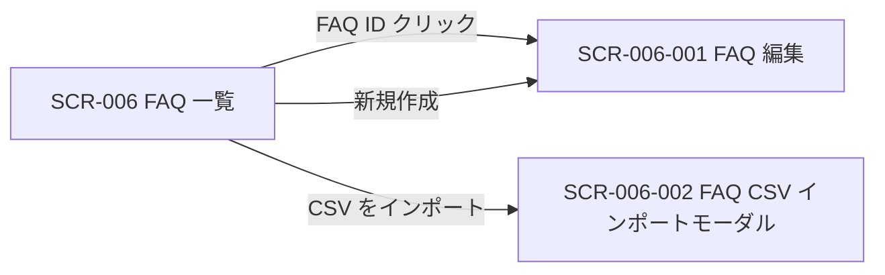
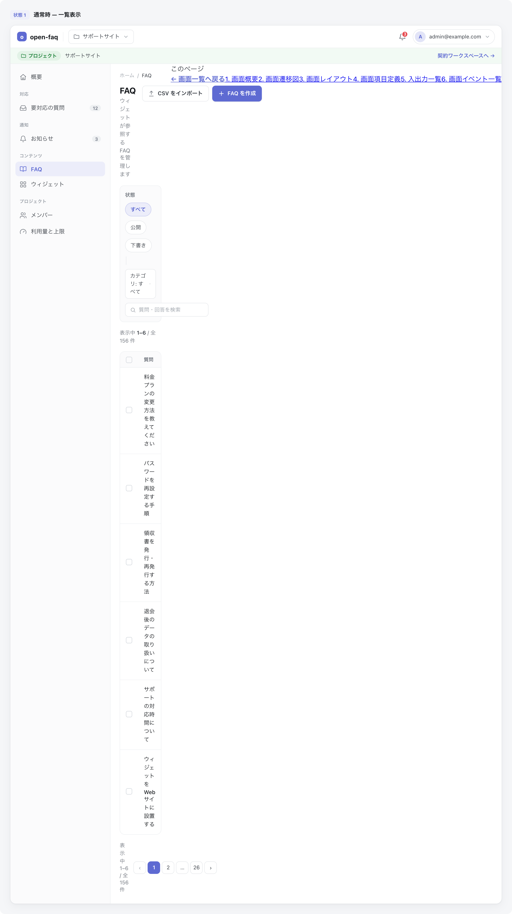

<!-- portal-top -->
[設計ポータル](../README.md) ／ [基本設計](index.md) ／ [画面設計](01_screen-design.md) ／ **SCR-006 FAQ 一覧**
<!-- /portal-top -->

# SCR-006 FAQ 一覧

> **このページは、プロジェクトの FAQ を一覧表示し、検索・絞り込み・並び替え・一括操作・CSV エクスポートと編集・新規作成・CSV インポートへの導線を提供する画面 SCR-006 を定義します。** 画面概要 / 画面遷移図 / 画面レイアウト / 画面項目定義 / 入出力一覧 / 画面イベント一覧 の 6 セクションで記述します。

*版数 v1.0 ・ 更新 2026-06-17 ・ 承認済*

## <span id="1-画面概要"></span>1. 画面概要

プロジェクトの FAQ を一覧で確認し、検索・絞り込み・並び替え・一括操作・CSV エクスポートと、編集・新規作成・CSV インポートへの導線を提供する画面です。

| 画面 ID | 画面名 | 機能概要 |
|----|----|----|
| <span id="SCR-006"></span>`SCR-006` | FAQ 一覧 | FAQ の一覧表示・検索・絞り込み・一括操作・CSV エクスポートを行う |

| 関連 | 内容 |
|----|----|
| FR / BR | FR-040〜FR-048, FR-100〜FR-103, FR-105, FR-106, FR-320〜FR-323 / BR-055 |
| 関連画面 | [`SCR-006-001` FAQ 編集](SCR-006-001.md) / [`SCR-006-002` FAQ CSV インポートモーダル](SCR-006-002.md) / [`SCR-005-001` 要対応の質問詳細](SCR-005-001.md) |

| ステークホルダ              | 対象 |
|-----------------------------|------|
| オーナー                    | ◯    |
| プロジェクト管理者(`admin`) | ◯    |
| メンバー(`member`)          | ◯    |

> [!NOTE]
> **補足** 各ステークホルダとも当該プロジェクトへの割当が前提です。割当のないプロジェクトの FAQ は参照不可(URL 直アクセスは権限不足表示)。一覧表に行内の「操作」列は設けず、編集遷移は FAQ ID 列のリンクに集約します(遷移リンクは ID 列に付与する全画面共通方針)。状態切替・削除は編集画面(SCR-006-001)、複数 FAQ への一括処理は一括操作バーで行います。

## <span id="2-画面遷移図"></span>2. 画面遷移図

本画面からの画面遷移を、画面 ID・画面名とイベント(操作)で示します。



## <span id="3-画面レイアウト"></span>3. 画面レイアウト



<details>
<summary>画面モック HTML（ソース）</summary>

```html
<div style="background:#f5f6f8;padding:24px;border-radius:12px;font-family:'Noto Sans JP',-apple-system,BlinkMacSystemFont,'Hiragino Kaku Gothic ProN',Meiryo,sans-serif;color:#3a3f46;-webkit-font-smoothing:antialiased;--accent:#5e6ad2">
<div style="max-width:1180px;margin:0 auto;display:flex;flex-direction:column;gap:40px">
  <section>
    <div style="display:flex;align-items:center;gap:10px;margin-bottom:13px">
      <span style="font-size:11px;font-weight:700;color:var(--accent,#5e6ad2);background:color-mix(in srgb,var(--accent,#5e6ad2) 10%,#fff);border-radius:6px;padding:3px 8px">状態 1</span>
      <span style="font-size:13.5px;font-weight:600;color:#16191d">通常時 — 一覧表示</span>
    </div>
    <div style="background:#fff;border:1px solid #e6e8eb;border-radius:14px;box-shadow:0 1px 2px rgba(16,24,40,.04),0 6px 20px rgba(16,24,40,.05);overflow:hidden">
      <div style="display:flex;align-items:center;justify-content:space-between;height:54px;padding:0 16px;border-bottom:1px solid #eef0f2;background:#fff">
        <div style="display:flex;align-items:center;gap:12px">
          <span style="display:inline-flex;align-items:center;gap:8px;font-weight:700;font-size:15px;color:#16191d"><span style="width:23px;height:23px;border-radius:7px;background:var(--accent,#5e6ad2);display:inline-flex;align-items:center;justify-content:center;color:#fff;font-size:13px;font-weight:800">o</span>open-faq</span>
          <span style="width:1px;height:22px;background:#eef0f2"></span>
          <button style="display:inline-flex;align-items:center;gap:7px;padding:6px 11px;border:1px solid #e6e8eb;border-radius:8px;background:#fff;font-size:13px;color:#3a3f46;cursor:pointer;font-family:inherit"><svg width="15" height="15" viewBox="0 0 24 24" fill="none" stroke="#71767e" stroke-width="1.8" stroke-linecap="round" stroke-linejoin="round"><path d="M4 5h5l2 2.5h9A1.5 1.5 0 0 1 21.5 9v9A1.5 1.5 0 0 1 20 19.5H4A1.5 1.5 0 0 1 2.5 18V6.5A1.5 1.5 0 0 1 4 5z"></path></svg>サポートサイト<svg width="14" height="14" viewBox="0 0 24 24" fill="none" stroke="#9aa0a8" stroke-width="1.9" stroke-linecap="round" stroke-linejoin="round"><path d="m6 9 6 6 6-6"></path></svg></button>
        </div>
        <div style="display:flex;align-items:center;gap:8px">
          <button style="position:relative;width:34px;height:34px;border-radius:8px;border:none;background:transparent;display:inline-flex;align-items:center;justify-content:center;color:#5b616a;cursor:pointer"><svg width="18" height="18" viewBox="0 0 24 24" fill="none" stroke="currentColor" stroke-width="1.8" stroke-linecap="round" stroke-linejoin="round"><path d="M6 8a6 6 0 0 1 12 0c0 7 3 9 3 9H3s3-2 3-9z"></path><path d="M10.3 21a1.94 1.94 0 0 0 3.4 0"></path></svg><span style="position:absolute;top:3px;right:3px;min-width:16px;height:16px;padding:0 3px;border-radius:999px;background:#e5484d;color:#fff;font-size:10px;font-weight:700;display:flex;align-items:center;justify-content:center;border:2px solid #fff">3</span></button>
          <button style="display:inline-flex;align-items:center;gap:8px;padding:4px 10px 4px 4px;border:1px solid #e6e8eb;border-radius:999px;background:#fff;cursor:pointer;font-family:inherit"><span style="width:26px;height:26px;border-radius:999px;background:color-mix(in srgb,var(--accent,#5e6ad2) 18%,#fff);color:var(--accent,#5e6ad2);font-weight:700;font-size:12px;display:flex;align-items:center;justify-content:center">A</span><span style="font-size:12.5px;color:#3a3f46">admin@example.com</span><svg width="14" height="14" viewBox="0 0 24 24" fill="none" stroke="#9aa0a8" stroke-width="1.9" stroke-linecap="round" stroke-linejoin="round"><path d="m6 9 6 6 6-6"></path></svg></button>
        </div>
      </div>
      <div style="display:flex;align-items:center;gap:10px;height:38px;padding:0 16px;background:color-mix(in srgb,#2da44e 6%,#fff);border-bottom:1px solid #eef0f2;font-size:12.5px;color:#71767e">
        <span style="display:inline-flex;align-items:center;gap:5px;padding:3px 9px;border-radius:999px;background:color-mix(in srgb,#2da44e 14%,#fff);color:#1a7f37;font-weight:600;font-size:11.5px"><svg width="13" height="13" viewBox="0 0 24 24" fill="none" stroke="currentColor" stroke-width="1.9" stroke-linecap="round" stroke-linejoin="round"><path d="M4 5h5l2 2.5h9A1.5 1.5 0 0 1 21.5 9v9A1.5 1.5 0 0 1 20 19.5H4A1.5 1.5 0 0 1 2.5 18V6.5A1.5 1.5 0 0 1 4 5z"></path></svg>プロジェクト</span>
        <span style="color:#3a3f46;font-weight:500">サポートサイト</span>
        <span style="margin-left:auto;color:var(--accent,#5e6ad2);font-weight:600;cursor:pointer">契約ワークスペースへ →</span>
      </div>
      <div style="display:flex;min-height:560px">
        <aside style="width:240px;flex:none;background:#fbfbfc;border-right:1px solid #eef0f2;padding:12px 12px 16px;display:flex;flex-direction:column">
          <a style="display:flex;align-items:center;gap:10px;padding:9px 10px;border-radius:8px;color:#3a3f46;font-size:13.5px;text-decoration:none"><svg width="17" height="17" viewBox="0 0 24 24" fill="none" stroke="#71767e" stroke-width="1.7" stroke-linecap="round" stroke-linejoin="round"><path d="M3 10.5 12 3l9 7.5"></path><path d="M5 9.5V20a1 1 0 0 0 1 1h12a1 1 0 0 0 1-1V9.5"></path><path d="M9.5 21v-6h5v6"></path></svg>概要</a>
          <div style="font-size:10.5px;font-weight:700;letter-spacing:.04em;color:#9aa0a8;padding:14px 10px 6px">対応</div>
          <a style="display:flex;align-items:center;gap:10px;padding:9px 10px;border-radius:8px;color:#3a3f46;font-size:13.5px;text-decoration:none"><svg width="17" height="17" viewBox="0 0 24 24" fill="none" stroke="#71767e" stroke-width="1.7" stroke-linecap="round" stroke-linejoin="round"><path d="M22 12h-6l-2 3h-4l-2-3H2"></path><path d="M5.5 5.1 2 12v6a2 2 0 0 0 2 2h16a2 2 0 0 0 2-2v-6l-3.5-6.9A2 2 0 0 0 16.8 4H7.2a2 2 0 0 0-1.7 1.1z"></path></svg>要対応の質問<span style="margin-left:auto;font-size:11px;font-weight:600;background:#eef0f2;color:#6b7280;border-radius:999px;padding:1px 7px">12</span></a>
          <div style="font-size:10.5px;font-weight:700;letter-spacing:.04em;color:#9aa0a8;padding:14px 10px 6px">通知</div>
          <a style="display:flex;align-items:center;gap:10px;padding:9px 10px;border-radius:8px;color:#3a3f46;font-size:13.5px;text-decoration:none"><svg width="17" height="17" viewBox="0 0 24 24" fill="none" stroke="#71767e" stroke-width="1.7" stroke-linecap="round" stroke-linejoin="round"><path d="M6 8a6 6 0 0 1 12 0c0 7 3 9 3 9H3s3-2 3-9z"></path><path d="M10.3 21a1.94 1.94 0 0 0 3.4 0"></path></svg>お知らせ<span style="margin-left:auto;font-size:11px;font-weight:600;background:#eef0f2;color:#6b7280;border-radius:999px;padding:1px 7px">3</span></a>
          <div style="font-size:10.5px;font-weight:700;letter-spacing:.04em;color:#9aa0a8;padding:14px 10px 6px">コンテンツ</div>
          <a style="display:flex;align-items:center;gap:10px;padding:9px 10px;border-radius:8px;background:color-mix(in srgb,var(--accent,#5e6ad2) 12%,#fff);color:var(--accent,#5e6ad2);font-weight:600;font-size:13.5px;text-decoration:none"><svg width="17" height="17" viewBox="0 0 24 24" fill="none" stroke="currentColor" stroke-width="1.8" stroke-linecap="round" stroke-linejoin="round"><path d="M12 7v13"></path><path d="M3 18a1 1 0 0 1-1-1V5a1 1 0 0 1 1-1h5a4 4 0 0 1 4 4 4 4 0 0 1 4-4h5a1 1 0 0 1 1 1v12a1 1 0 0 1-1 1h-6a3 3 0 0 0-3 3 3 3 0 0 0-3-3z"></path></svg>FAQ</a>
          <a style="display:flex;align-items:center;gap:10px;padding:9px 10px;border-radius:8px;color:#3a3f46;font-size:13.5px;text-decoration:none"><svg width="17" height="17" viewBox="0 0 24 24" fill="none" stroke="#71767e" stroke-width="1.7" stroke-linecap="round" stroke-linejoin="round"><rect x="3" y="3" width="7" height="7" rx="1.5"></rect><rect x="14" y="3" width="7" height="7" rx="1.5"></rect><rect x="14" y="14" width="7" height="7" rx="1.5"></rect><rect x="3" y="14" width="7" height="7" rx="1.5"></rect></svg>ウィジェット</a>
          <div style="font-size:10.5px;font-weight:700;letter-spacing:.04em;color:#9aa0a8;padding:14px 10px 6px">プロジェクト</div>
          <a style="display:flex;align-items:center;gap:10px;padding:9px 10px;border-radius:8px;color:#3a3f46;font-size:13.5px;text-decoration:none"><svg width="17" height="17" viewBox="0 0 24 24" fill="none" stroke="#71767e" stroke-width="1.7" stroke-linecap="round" stroke-linejoin="round"><path d="M16 21v-2a4 4 0 0 0-4-4H6a4 4 0 0 0-4 4v2"></path><circle cx="9" cy="7" r="4"></circle><path d="M22 21v-2a4 4 0 0 0-3-3.87"></path><path d="M16 3.1a4 4 0 0 1 0 7.75"></path></svg>メンバー</a>
          <a style="display:flex;align-items:center;gap:10px;padding:9px 10px;border-radius:8px;color:#3a3f46;font-size:13.5px;text-decoration:none"><svg width="17" height="17" viewBox="0 0 24 24" fill="none" stroke="#71767e" stroke-width="1.7" stroke-linecap="round" stroke-linejoin="round"><path d="m12 14 4-4"></path><path d="M3.34 19a10 10 0 1 1 17.32 0"></path></svg>利用量と上限</a>
        </aside>
        <main style="flex:1;min-width:0;background:#fff;padding:18px 22px 24px;display:flex;flex-direction:column;gap:16px">
          <nav style="display:flex;align-items:center;gap:7px;font-size:12px;color:#9aa0a8"><span>ホーム</span><span>/</span><span style="color:#3a3f46">FAQ</span></nav>
          <div style="display:flex;align-items:flex-start;justify-content:space-between;gap:16px">
            <div>
              <h1 style="margin:0 0 4px;font-size:20px;font-weight:700;color:#16191d;letter-spacing:-.01em">FAQ</h1>
              <p style="margin:0;font-size:13px;color:#71767e">ウィジェットが参照する FAQ を管理します</p>
            </div>
            <div style="display:flex;gap:8px">
              <button style="display:inline-flex;align-items:center;gap:7px;padding:8px 13px;border:1px solid #e6e8eb;border-radius:8px;background:#fff;font-size:13px;font-weight:600;color:#3a3f46;cursor:pointer;white-space:nowrap;font-family:inherit"><svg width="16" height="16" viewBox="0 0 24 24" fill="none" stroke="#71767e" stroke-width="1.8" stroke-linecap="round" stroke-linejoin="round"><path d="M12 15V3"></path><path d="m7 8 5-5 5 5"></path><path d="M5 21h14"></path></svg>CSV をインポート</button>
              <button style="display:inline-flex;align-items:center;gap:7px;padding:8px 14px;border:none;border-radius:8px;background:var(--accent,#5e6ad2);color:#fff;font-size:13px;font-weight:600;cursor:pointer;white-space:nowrap;box-shadow:0 1px 2px rgba(16,24,40,.12);font-family:inherit"><svg width="16" height="16" viewBox="0 0 24 24" fill="none" stroke="currentColor" stroke-width="2" stroke-linecap="round" stroke-linejoin="round"><path d="M12 5v14"></path><path d="M5 12h14"></path></svg>FAQ を作成</button>
            </div>
          </div>
          <div style="display:flex;align-items:center;gap:10px;flex-wrap:wrap;padding:12px;background:#fbfbfc;border:1px solid #eef0f2;border-radius:10px">
            <span style="font-size:12px;font-weight:600;color:#71767e">状態</span>
            <button style="padding:6px 12px;border:1px solid color-mix(in srgb,var(--accent,#5e6ad2) 35%,#fff);border-radius:999px;background:color-mix(in srgb,var(--accent,#5e6ad2) 12%,#fff);font-size:12.5px;color:var(--accent,#5e6ad2);font-weight:600;cursor:pointer;font-family:inherit">すべて</button>
            <button style="padding:6px 12px;border:1px solid #e6e8eb;border-radius:999px;background:#fff;font-size:12.5px;color:#3a3f46;cursor:pointer;font-family:inherit">公開</button>
            <button style="padding:6px 12px;border:1px solid #e6e8eb;border-radius:999px;background:#fff;font-size:12.5px;color:#3a3f46;cursor:pointer;font-family:inherit">下書き</button>
            <span style="width:1px;height:20px;background:#e6e8eb;margin:0 2px"></span>
            <span style="display:inline-flex;align-items:center;gap:7px;padding:6px 11px;border:1px solid #e6e8eb;border-radius:8px;background:#fff;font-size:12.5px;color:#3a3f46">カテゴリ: すべて<svg width="13" height="13" viewBox="0 0 24 24" fill="none" stroke="#9aa0a8" stroke-width="1.9" stroke-linecap="round" stroke-linejoin="round"><path d="m6 9 6 6 6-6"></path></svg></span>
            <span style="display:inline-flex;align-items:center;gap:7px;padding:6px 11px;border:1px solid #e6e8eb;border-radius:8px;background:#fff;font-size:12.5px;color:#9aa0a8;margin-left:auto;min-width:200px"><svg width="14" height="14" viewBox="0 0 24 24" fill="none" stroke="#9aa0a8" stroke-width="1.8" stroke-linecap="round" stroke-linejoin="round"><circle cx="11" cy="11" r="7"></circle><path d="m21 21-4.3-4.3"></path></svg>質問・回答を検索</span>
          </div>
          <div style="font-size:12.5px;color:#71767e">表示中 <b style="color:#3a3f46;font-weight:600">1–6</b> / 全 156 件</div>
          <div style="border:1px solid #eef0f2;border-radius:12px;overflow:hidden">
            <table style="width:100%;border-collapse:collapse;font-size:13px">
              <thead>
                <tr style="background:#fbfbfc">
                  <th style="text-align:left;padding:10px 14px;border-bottom:1px solid #eef0f2;width:34px"><span style="display:inline-block;width:15px;height:15px;border:1.5px solid #cfd4da;border-radius:4px;vertical-align:middle"></span></th>
                  <th style="text-align:left;padding:10px 14px;border-bottom:1px solid #eef0f2;color:#71767e;font-weight:600;font-size:11.5px">質問</th>
                  <th style="text-align:left;padding:10px 14px;border-bottom:1px solid #eef0f2;color:#71767e;font-weight:600;font-size:11.5px;white-space:nowrap">カテゴリ</th>
                  <th style="text-align:left;padding:10px 14px;border-bottom:1px solid #eef0f2;color:#71767e;font-weight:600;font-size:11.5px;white-space:nowrap">状態</th>
                  <th style="text-align:right;padding:10px 14px;border-bottom:1px solid #eef0f2;color:#71767e;font-weight:600;font-size:11.5px;white-space:nowrap">更新日時</th>
                </tr>
              </thead>
              <tbody>
                <tr>
                  <td style="padding:13px 14px;border-bottom:1px solid #f1f3f5"><span style="display:inline-block;width:15px;height:15px;border:1.5px solid #cfd4da;border-radius:4px"></span></td>
                  <td style="padding:13px 14px;border-bottom:1px solid #f1f3f5"><a style="color:#16191d;font-weight:500;text-decoration:none;cursor:pointer">料金プランの変更方法を教えてください</a></td>
                  <td style="padding:13px 14px;border-bottom:1px solid #f1f3f5"><span style="font-size:12px;color:#71767e">料金・支払い</span></td>
                  <td style="padding:13px 14px;border-bottom:1px solid #f1f3f5"><span style="display:inline-flex;align-items:center;gap:5px;padding:2px 9px;border-radius:999px;background:#e7f6ec;color:#1a7f37;font-size:11.5px;font-weight:600"><span style="width:6px;height:6px;border-radius:999px;background:#2da44e"></span>公開</span></td>
                  <td style="padding:13px 14px;border-bottom:1px solid #f1f3f5;text-align:right;color:#71767e;white-space:nowrap">2 時間前</td>
                </tr>
                <tr>
                  <td style="padding:13px 14px;border-bottom:1px solid #f1f3f5"><span style="display:inline-block;width:15px;height:15px;border:1.5px solid #cfd4da;border-radius:4px"></span></td>
                  <td style="padding:13px 14px;border-bottom:1px solid #f1f3f5"><a style="color:#16191d;font-weight:500;text-decoration:none;cursor:pointer">パスワードを再設定する手順</a></td>
                  <td style="padding:13px 14px;border-bottom:1px solid #f1f3f5"><span style="font-size:12px;color:#71767e">アカウント</span></td>
                  <td style="padding:13px 14px;border-bottom:1px solid #f1f3f5"><span style="display:inline-flex;align-items:center;gap:5px;padding:2px 9px;border-radius:999px;background:#e7f6ec;color:#1a7f37;font-size:11.5px;font-weight:600"><span style="width:6px;height:6px;border-radius:999px;background:#2da44e"></span>公開</span></td>
                  <td style="padding:13px 14px;border-bottom:1px solid #f1f3f5;text-align:right;color:#71767e;white-space:nowrap">1 日前</td>
                </tr>
                <tr>
                  <td style="padding:13px 14px;border-bottom:1px solid #f1f3f5"><span style="display:inline-block;width:15px;height:15px;border:1.5px solid #cfd4da;border-radius:4px"></span></td>
                  <td style="padding:13px 14px;border-bottom:1px solid #f1f3f5"><a style="color:#16191d;font-weight:500;text-decoration:none;cursor:pointer">領収書を発行・再発行する方法</a></td>
                  <td style="padding:13px 14px;border-bottom:1px solid #f1f3f5"><span style="font-size:12px;color:#71767e">料金・支払い</span></td>
                  <td style="padding:13px 14px;border-bottom:1px solid #f1f3f5"><span style="display:inline-flex;align-items:center;gap:5px;padding:2px 9px;border-radius:999px;background:#eef0f2;color:#6b7280;font-size:11.5px;font-weight:600"><span style="width:6px;height:6px;border-radius:999px;background:#a4abb3"></span>下書き</span></td>
                  <td style="padding:13px 14px;border-bottom:1px solid #f1f3f5;text-align:right;color:#71767e;white-space:nowrap">3 日前</td>
                </tr>
                <tr>
                  <td style="padding:13px 14px;border-bottom:1px solid #f1f3f5"><span style="display:inline-block;width:15px;height:15px;border:1.5px solid #cfd4da;border-radius:4px"></span></td>
                  <td style="padding:13px 14px;border-bottom:1px solid #f1f3f5"><a style="color:#16191d;font-weight:500;text-decoration:none;cursor:pointer">退会後のデータの取り扱いについて</a></td>
                  <td style="padding:13px 14px;border-bottom:1px solid #f1f3f5"><span style="font-size:12px;color:#71767e">アカウント</span></td>
                  <td style="padding:13px 14px;border-bottom:1px solid #f1f3f5"><span style="display:inline-flex;align-items:center;gap:5px;padding:2px 9px;border-radius:999px;background:#e7f6ec;color:#1a7f37;font-size:11.5px;font-weight:600"><span style="width:6px;height:6px;border-radius:999px;background:#2da44e"></span>公開</span></td>
                  <td style="padding:13px 14px;border-bottom:1px solid #f1f3f5;text-align:right;color:#71767e;white-space:nowrap">5 日前</td>
                </tr>
                <tr>
                  <td style="padding:13px 14px;border-bottom:1px solid #f1f3f5"><span style="display:inline-block;width:15px;height:15px;border:1.5px solid #cfd4da;border-radius:4px"></span></td>
                  <td style="padding:13px 14px;border-bottom:1px solid #f1f3f5"><a style="color:#16191d;font-weight:500;text-decoration:none;cursor:pointer">サポートの対応時間について</a></td>
                  <td style="padding:13px 14px;border-bottom:1px solid #f1f3f5"><span style="font-size:12px;color:#71767e">サポート</span></td>
                  <td style="padding:13px 14px;border-bottom:1px solid #f1f3f5"><span style="display:inline-flex;align-items:center;gap:5px;padding:2px 9px;border-radius:999px;background:#e7f6ec;color:#1a7f37;font-size:11.5px;font-weight:600"><span style="width:6px;height:6px;border-radius:999px;background:#2da44e"></span>公開</span></td>
                  <td style="padding:13px 14px;border-bottom:1px solid #f1f3f5;text-align:right;color:#71767e;white-space:nowrap">1 週間前</td>
                </tr>
                <tr>
                  <td style="padding:13px 14px"><span style="display:inline-block;width:15px;height:15px;border:1.5px solid #cfd4da;border-radius:4px"></span></td>
                  <td style="padding:13px 14px"><a style="color:#16191d;font-weight:500;text-decoration:none;cursor:pointer">ウィジェットを Web サイトに設置する</a></td>
                  <td style="padding:13px 14px"><span style="font-size:12px;color:#71767e">導入・設定</span></td>
                  <td style="padding:13px 14px"><span style="display:inline-flex;align-items:center;gap:5px;padding:2px 9px;border-radius:999px;background:#eef0f2;color:#6b7280;font-size:11.5px;font-weight:600"><span style="width:6px;height:6px;border-radius:999px;background:#a4abb3"></span>下書き</span></td>
                  <td style="padding:13px 14px;text-align:right;color:#71767e;white-space:nowrap">2 週間前</td>
                </tr>
              </tbody>
            </table>
          </div>
          <div style="display:flex;align-items:center;justify-content:space-between;gap:12px">
            <span style="font-size:12.5px;color:#71767e">表示中 1–6 / 全 156 件</span>
            <div style="display:flex;gap:4px">
              <button style="min-width:30px;height:30px;border:1px solid #e6e8eb;border-radius:8px;background:#fff;font-size:13px;color:#9aa0a8;cursor:pointer;font-family:inherit">‹</button>
              <button style="min-width:30px;height:30px;border:1px solid var(--accent,#5e6ad2);border-radius:8px;background:var(--accent,#5e6ad2);font-size:12.5px;color:#fff;font-weight:600;cursor:pointer;font-family:inherit">1</button>
              <button style="min-width:30px;height:30px;border:1px solid #e6e8eb;border-radius:8px;background:#fff;font-size:12.5px;color:#3a3f46;cursor:pointer;font-family:inherit">2</button>
              <button style="min-width:30px;height:30px;border:1px solid #e6e8eb;border-radius:8px;background:#fff;font-size:12.5px;color:#3a3f46;cursor:pointer;font-family:inherit">…</button>
              <button style="min-width:30px;height:30px;border:1px solid #e6e8eb;border-radius:8px;background:#fff;font-size:12.5px;color:#3a3f46;cursor:pointer;font-family:inherit">26</button>
              <button style="min-width:30px;height:30px;border:1px solid #e6e8eb;border-radius:8px;background:#fff;font-size:13px;color:#3a3f46;cursor:pointer;font-family:inherit">›</button>
            </div>
          </div>
        </main><aside class="rightbar"><div class="rb-title">このページ</div><nav class="toc"><a class="back" href="01_screen-design.md" style="font-weight:600;color:var(--accent)">← 画面一覧へ戻る</a><a href="#1-画面概要">1. 画面概要</a><a href="#2-画面遷移図">2. 画面遷移図</a><a href="#3-画面レイアウト">3. 画面レイアウト</a><a href="#4-画面項目定義">4. 画面項目定義</a><a href="#5-入出力一覧">5. 入出力一覧</a><a href="#6-画面イベント一覧">6. 画面イベント一覧</a></nav></aside>
      </div>
    </div>
  </section>
</div>
</div>
```

</details>

## <span id="4-画面項目定義"></span>4. 画面項目定義

本画面の入出力項目(検索・絞り込み・並び替え・一覧の列・件数表示・一括操作・空状態を含む)を定義します。項目の正本は本表です。一覧表に「操作」列は設けず、編集遷移は FAQ ID 列のリンクに集約します(遷移リンクは ID 列に付与する全画面共通方針)。

| 項目 ID | 項目 | 説明 | 種類 | 表示条件 | 表示 |
|----|----|----|----|----|----|
| <span id="IT-01"></span>`IT-01` | キーワード検索 | 質問・回答を全文検索して一覧を絞り込む | テキストボックス | — | プレースホルダ「質問・回答を全文検索」 |
| <span id="IT-02"></span>`IT-02` | カテゴリフィルタ | プロジェクト内のカテゴリで一覧を絞り込む | ドロップダウン | — | 「すべて」+ 各カテゴリ名 |
| <span id="IT-03"></span>`IT-03` | 並び順 | 一覧の並び順を切り替える(関連度 / 更新日時 / 作成日時) | ドロップダウン | — | 選択肢「関連度」/「更新日時」/「作成日時」 |
| <span id="IT-04"></span>`IT-04` | FAQ ID | 各 FAQ の ID を一覧先頭列に表示し、押下で編集画面へ遷移する | リンク | — | FAQ ID(`faq_…` 形式)のリンク |
| <span id="IT-05"></span>`IT-05` | 質問 | FAQ の質問文を先頭 60 文字で表示する(クリック不可) | ラベル | — | 質問文(先頭 60 文字) |
| <span id="IT-06"></span>`IT-06` | カテゴリ | FAQ のカテゴリを表示する | ラベル | — | カテゴリ名 |
| <span id="IT-07"></span>`IT-07` | 状態バッジ | FAQ の公開状態を色とラベルで表示する(色のみ依存禁止) | バッジ | — | 「下書き」/「公開中」/「非公開」 |
| <span id="IT-08"></span>`IT-08` | 更新日時 | FAQ の最終更新日時を相対表記で表示する(ツールチップに絶対日時) | ラベル | — | 相対表記(例「3 時間前」「1 日前」) |
| <span id="IT-09"></span>`IT-09` | 件数表示 | 表示中の件数と全件数を表示する | ラベル | — | 「1-50 / 全 124 件」形式 |
| <span id="IT-10"></span>`IT-10` | 行選択チェックボックス | 一括操作の対象 FAQ を選択する(最大 50 件) | チェックボックス | — | — |
| <span id="IT-11"></span>`IT-11` | 新規作成 | FAQ 編集画面を新規モードで開く | ボタン | — | 「+ 新規作成」 |
| <span id="IT-12"></span>`IT-12` | 一括操作バー | 選択中の FAQ を一括で公開 / 非公開化 / 削除する(チェックボックス選択への一括処理) | ツールバー | 1 件以上選択時に下部固定 | 「{件数} 件選択中」+「公開する」/「非公開化する」/「削除する」/「選択を解除」 |
| <span id="IT-13"></span>`IT-13` | CSV をインポート | CSV インポートモーダル(SCR-006-002)を開く | ボタン | — | 「CSV をインポート」 |
| <span id="IT-14"></span>`IT-14` | CSV をエクスポート | フィルタ適用結果を CSV でダウンロードする | ボタン | — | 「CSV をエクスポート」 |
| <span id="IT-15"></span>`IT-15` | 空状態 | FAQ が 0 件のとき作成を促す EmptyState を表示する | 空状態表示 | FAQ 0 件時のみ表示 | 「FAQ がまだありません。最初の FAQ を作成しましょう。」+「+ 新規作成」 |

## <span id="5-入出力一覧"></span>5. 入出力一覧

本画面が読み書きするテーブル・ファイルと、呼び出す API の一覧です。テーブルの正本は [03_テーブル設計](03_database-design.md)、API の正本は [02_API設計 §5.4](02_api-design.md#API-FAQ-001) です。

<table>
<thead>
<tr>
<th rowspan="2">入出力名</th>
<th rowspan="2">説明</th>
<th rowspan="2">種別</th>
<th rowspan="2">I/O</th>
<th colspan="4">アクセス種別(CRUD)</th>
<th rowspan="2">備考</th>
</tr>
<tr>
<th>C</th>
<th>R</th>
<th>U</th>
<th>D</th>
</tr>
</thead>
<tbody>
<tr>
<td>FAQ</td>
<td>一覧を取得し、一括の状態変更・論理削除を行う</td>
<td>テーブル</td>
<td>入力 / 出力</td>
<td>—</td>
<td>◯</td>
<td>◯</td>
<td>◯</td>
<td><code>M_FAQS</code>(<a href="03_database-design.md#TBL-M-006">テーブル設計 3.9</a>)</td>
</tr>
<tr>
<td>FAQ 一覧取得</td>
<td>条件付きで FAQ 一覧を取得する</td>
<td>API</td>
<td>入力</td>
<td>—</td>
<td>—</td>
<td>—</td>
<td>—</td>
<td><code>GET /faqs</code>(<code>status</code> / <code>projectId</code> / <code>keyword</code> / <code>cursor</code>)(<a href="02_api-design.md#API-FAQ-001">API 設計 5.4.1</a>)</td>
</tr>
<tr>
<td>FAQ 一括状態変更</td>
<td>選択中の FAQ を一括で公開 / 非公開化する</td>
<td>API</td>
<td>出力</td>
<td>—</td>
<td>—</td>
<td>—</td>
<td>—</td>
<td><code>POST /faqs/bulk-status</code>(<a href="02_api-design.md">API 設計 5.4.2a</a>)</td>
</tr>
<tr>
<td>FAQ エクスポート</td>
<td>フィルタ適用結果を CSV として取得する</td>
<td>API</td>
<td>入力</td>
<td>—</td>
<td>—</td>
<td>—</td>
<td>—</td>
<td><code>GET /faqs/export</code>(<a href="02_api-design.md#API-FAQ-006">API 設計 5.4.5</a>)</td>
</tr>
<tr>
<td>FAQ CSV</td>
<td>エクスポート結果をダウンロードする</td>
<td>ファイル</td>
<td>出力</td>
<td>—</td>
<td>—</td>
<td>—</td>
<td>—</td>
<td>CSV UTF-8 / ダウンロード</td>
</tr>
</tbody>
</table>

## <span id="6-画面イベント一覧"></span>6. 画面イベント一覧

本画面で発生するイベントと発生タイミング・概要の一覧です。

<table>
<colgroup>
<col style="width: 20%" />
<col style="width: 20%" />
<col style="width: 20%" />
<col style="width: 20%" />
<col style="width: 20%" />
</colgroup>
<thead>
<tr>
<th>イベント ID</th>
<th>イベント</th>
<th>トリガー</th>
<th>処理</th>
<th>関連項目</th>
</tr>
</thead>
<tbody>
<tr>
<td><code>EV-01</code></td>
<td>一覧初期表示</td>
<td>画面遷移・リロード時</td>
<td><ul>
<li><code>GET /faqs</code> で一覧を取得し表示</li>
<li>0 件時は EmptyState</li>
</ul></td>
<td><a href="#IT-04">IT-04</a>, <a href="#IT-05">IT-05</a>, <a href="#IT-06">IT-06</a>, <a href="#IT-07">IT-07</a>, <a href="#IT-08">IT-08</a>, <a href="#IT-09">IT-09</a>, <a href="#IT-15">IT-15</a></td>
</tr>
<tr>
<td><code>EV-02</code></td>
<td>検索</td>
<td>キーワード検索の入力時</td>
<td>キーワードを付与して <code>GET /faqs</code> を再取得し一覧を更新</td>
<td><a href="#IT-01">IT-01</a>, <a href="#IT-09">IT-09</a></td>
</tr>
<tr>
<td><code>EV-03</code></td>
<td>絞り込み</td>
<td>カテゴリフィルタの変更時</td>
<td>カテゴリ条件を付与して <code>GET /faqs</code> を再取得し一覧を更新</td>
<td><a href="#IT-02">IT-02</a>, <a href="#IT-09">IT-09</a></td>
</tr>
<tr>
<td><code>EV-04</code></td>
<td>並び替え</td>
<td>並び順の変更時</td>
<td>指定した並び順で <code>GET /faqs</code> を再取得し一覧を更新</td>
<td><a href="#IT-03">IT-03</a>, <a href="#IT-09">IT-09</a></td>
</tr>
<tr>
<td><code>EV-05</code></td>
<td>新規作成へ遷移</td>
<td>「+ 新規作成」押下時</td>
<td>編集画面(SCR-006-001)を新規モードで開く</td>
<td><a href="#IT-11">IT-11</a></td>
</tr>
<tr>
<td><code>EV-06</code></td>
<td>編集へ遷移</td>
<td>FAQ ID リンク押下時</td>
<td>編集画面(SCR-006-001)へ遷移</td>
<td><a href="#IT-04">IT-04</a></td>
</tr>
<tr>
<td><code>EV-07</code></td>
<td>一括操作</td>
<td>1 件以上選択 → 一括操作バーのボタン押下時</td>
<td><ul>
<li>選択中 FAQ を <code>POST /faqs/bulk-status</code> で一括公開 / 非公開化</li>
<li>または一括削除(確認ダイアログ)</li>
</ul></td>
<td><a href="#IT-10">IT-10</a>, <a href="#IT-12">IT-12</a></td>
</tr>
<tr>
<td><code>EV-08</code></td>
<td>CSV インポート起動</td>
<td>「CSV をインポート」押下時</td>
<td>SCR-006-002 モーダルを開く</td>
<td><a href="#IT-13">IT-13</a></td>
</tr>
<tr>
<td><code>EV-09</code></td>
<td>CSV エクスポート</td>
<td>「CSV をエクスポート」押下時</td>
<td>フィルタ適用結果を <code>GET /faqs/export</code> で CSV ダウンロード</td>
<td><a href="#IT-14">IT-14</a></td>
</tr>
</tbody>
</table>

---

---

---

<!-- portal-bottom -->
[← 画面設計](01_screen-design.md) ・ [基本設計](index.md) ・ [↑ 設計ポータル](../README.md)
<!-- /portal-bottom -->
