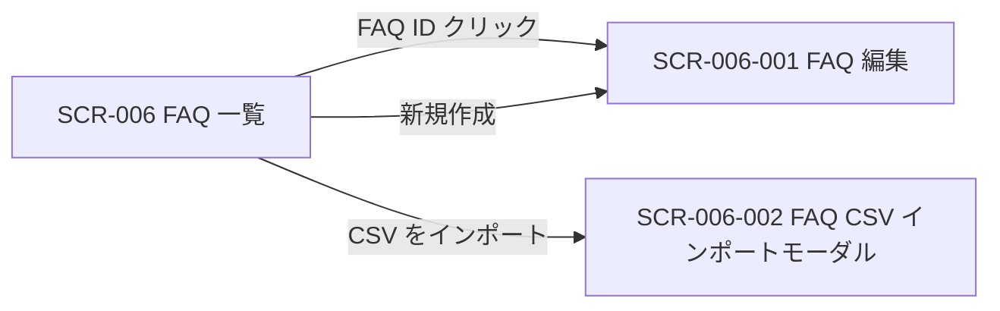

<!-- portal-top -->
[設計ポータル](../README.md) ／ [基本設計](index.md) ／ [画面設計](01_screen-design.md) ／ **SCR-006 FAQ 一覧**
<!-- /portal-top -->

# SCR-006 FAQ 一覧

> **このページは、プロジェクトの FAQ を一覧表示し、検索・絞り込み・並び替え・一括操作・CSV エクスポートと編集・新規作成・CSV インポートへの導線を提供する画面 SCR-006 を定義します。** 画面概要 / 画面遷移図 / 画面レイアウト / 画面項目定義 / 入出力一覧 / 画面イベント一覧 の 6 セクションで記述します。

*版数 v1.0 ・ 更新 2026-06-17 ・ 承認済*

## 1. 画面概要

プロジェクトの FAQ を一覧で確認し、検索・絞り込み・並び替え・一括操作・CSV エクスポートと、編集・新規作成・CSV インポートへの導線を提供する画面です。

| 画面 ID | 画面名 | 機能概要 |
|----|----|----|
| `SCR-006` | FAQ 一覧 | FAQ の一覧表示・検索・絞り込み・一括操作・CSV エクスポートを行う |

| 関連 | 内容 |
|----|----|
| FR / BR | FR-025〜FR-033, FR-053〜FR-056, FR-057, FR-058, FR-132〜FR-134 / BR-028 |
| 関連画面 | [`SCR-006-001` FAQ 編集](SCR-006-001.md) / [`SCR-006-002` FAQ CSV インポートモーダル](SCR-006-002.md) / [`SCR-005-001` 要対応の質問詳細](SCR-005-001.md) |

| ステークホルダ | 対象 |
|----------------|------|
| オーナー       | ◯    |
| メンバー       | ◯    |

> [!NOTE]
> **補足** 各ステークホルダとも当該プロジェクトへの割当が前提です。割当のないプロジェクトの FAQ は参照不可(URL 直アクセスは権限不足表示)。一覧表に行内の「操作」列は設けず、編集遷移は FAQ ID 列のリンクに集約します(遷移リンクは ID 列に付与する全画面共通方針)。状態切替・削除は編集画面(SCR-006-001)、複数 FAQ への一括処理は一括操作バーで行います。

## 2. 画面遷移図

本画面からの画面遷移を、画面 ID・画面名とイベント(操作)で示します。

## 3. 画面レイアウト

## 4. 画面項目定義

本画面の入出力項目(検索・絞り込み・並び替え・一覧の列・件数表示・一括操作・空状態を含む)を定義します。項目の正本は本表です。一覧表に「操作」列は設けず、編集遷移は FAQ ID 列のリンクに集約します(遷移リンクは ID 列に付与する全画面共通方針)。

| 項目 ID | 項目 | 説明 | 種類 | 表示条件 | 表示 |
|----|----|----|----|----|----|
| `IT-01` | キーワード検索 | 質問・回答を全文検索して一覧を絞り込む | テキストボックス | — | プレースホルダ「質問・回答を全文検索」 |
| `IT-02` | カテゴリフィルタ | プロジェクト内のカテゴリで一覧を絞り込む | ドロップダウン | — | 「すべて」+ 各カテゴリ名 |
| `IT-03` | 並び順 | 一覧の並び順を切り替える(関連度 / 更新日時 / 作成日時) | ドロップダウン | — | 選択肢「関連度」/「更新日時」/「作成日時」 |
| `IT-04` | FAQ ID | 各 FAQ の ID を一覧先頭列に表示し、押下で編集画面へ遷移する | リンク | — | FAQ ID(`faq_…` 形式)のリンク |
| `IT-05` | 質問 | FAQ の質問文を先頭 60 文字で表示する(クリック不可) | ラベル | — | 質問文(先頭 60 文字) |
| `IT-06` | カテゴリ | FAQ のカテゴリを表示する | ラベル | — | カテゴリ名 |
| `IT-07` | 状態バッジ | FAQ の公開状態を色とラベルで表示する(色のみ依存禁止) | バッジ | — | 「下書き」/「公開中」/「非公開」 |
| `IT-08` | 更新日時 | FAQ の最終更新日時を相対表記で表示する(ツールチップに絶対日時) | ラベル | — | 相対表記(例「3 時間前」「1 日前」) |
| `IT-09` | 件数表示 | 表示中の件数と全件数を表示する | ラベル | — | 「1-50 / 全 124 件」形式 |
| `IT-10` | 行選択チェックボックス | 一括操作の対象 FAQ を選択する(最大 50 件) | チェックボックス | — | — |
| `IT-11` | 新規作成 | FAQ 編集画面を新規モードで開く | ボタン | — | 「+ 新規作成」 |
| `IT-12` | 一括操作バー | 選択中の FAQ を一括で公開 / 非公開化 / 削除する(チェックボックス選択への一括処理) | ツールバー | 1 件以上選択時に下部固定 | 「{件数} 件選択中」+「公開する」/「非公開化する」/「削除する」/「選択を解除」 |
| `IT-13` | CSV をインポート | CSV インポートモーダル(SCR-006-002)を開く | ボタン | — | 「CSV をインポート」 |
| `IT-14` | CSV をエクスポート | フィルタ適用結果を CSV でダウンロードする | ボタン | — | 「CSV をエクスポート」 |
| `IT-15` | 空状態 | FAQ が 0 件のとき作成を促す EmptyState を表示する | 空状態表示 | FAQ 0 件時のみ表示 | 「FAQ がまだありません。最初の FAQ を作成しましょう。」+「+ 新規作成」 |

## 5. 入出力一覧

本画面が読み書きするテーブル・ファイルと、呼び出す API の一覧です。テーブルの正本は [データベース設計](03_database-design.md)、API の正本は [API設計](02_api-design.md#API-FAQ-001) です。

<table>
<thead>
<tr>
<th rowspan="2">入出力名</th>
<th rowspan="2">説明</th>
<th rowspan="2">種別</th>
<th rowspan="2">I/O</th>
<th colspan="4">アクセス種別(CRUD)</th>
<th rowspan="2">備考</th>
</tr>
<tr>
<th>C</th>
<th>R</th>
<th>U</th>
<th>D</th>
</tr>
</thead>
<tbody>
<tr>
<td>FAQ</td>
<td>一覧を取得し、一括の状態変更・論理削除を行う</td>
<td>テーブル</td>
<td>入力 / 出力</td>
<td>—</td>
<td>◯</td>
<td>◯</td>
<td>◯</td>
<td><code>M_FAQS</code>(<a href="03_database-design.md#TBL-M-006">テーブル設計 3.9</a>)</td>
</tr>
<tr>
<td>FAQ 一覧取得</td>
<td>条件付きで FAQ 一覧を取得する</td>
<td>API</td>
<td>入力</td>
<td>—</td>
<td>—</td>
<td>—</td>
<td>—</td>
<td><code>GET /faqs</code>(<code>status</code> / <code>projectId</code> / <code>keyword</code> / <code>cursor</code>)(<a href="API-faq.md#API-FAQ-001">FAQ 一覧</a>)</td>
</tr>
<tr>
<td>FAQ 作成・更新・削除</td>
<td>選択中の FAQ を論理削除する</td>
<td>API</td>
<td>出力</td>
<td>—</td>
<td>—</td>
<td>—</td>
<td>◯</td>
<td><code>DELETE /faqs/{id}</code>(<a href="API-faq.md#API-FAQ-002">FAQ 作成・更新・削除</a>)</td>
</tr>
<tr>
<td>FAQ 一括状態変更</td>
<td>選択中の FAQ を一括で公開 / 非公開化する</td>
<td>API</td>
<td>出力</td>
<td>—</td>
<td>—</td>
<td>—</td>
<td>—</td>
<td><code>POST /faqs/bulk-status</code>(<a href="API-faq.md#API-FAQ-003">FAQ 一括状態変更</a>)</td>
</tr>
<tr>
<td>FAQ エクスポート</td>
<td>フィルタ適用結果を CSV として取得する</td>
<td>API</td>
<td>入力</td>
<td>—</td>
<td>—</td>
<td>—</td>
<td>—</td>
<td><code>GET /faqs/export</code>(<a href="02_api-design.md#API-FAQ-006">API 設計 5.4.5</a>)</td>
</tr>
<tr>
<td>FAQ CSV</td>
<td>エクスポート結果をダウンロードする</td>
<td>ファイル</td>
<td>出力</td>
<td>—</td>
<td>—</td>
<td>—</td>
<td>—</td>
<td>CSV UTF-8 / ダウンロード</td>
</tr>
</tbody>
</table>

## 6. 画面イベント一覧

本画面のイベント(初期表示・各操作)ごとに、対象の項目 ID と処理内容を定義します。

<table>
<colgroup>
<col style="width: 12%" />
<col style="width: 12%" />
<col style="width: 30%" />
<col style="width: 46%" />
</colgroup>
<thead>
<tr>
<th>イベント ID</th>
<th>項目 ID</th>
<th>イベント</th>
<th>処理</th>
</tr>
</thead>
<tbody>
<tr>
<td><code>EV-01</code></td>
<td>—</td>
<td>初期表示</td>
<td><ul>
<li><a href="API-faq.md#API-FAQ-001">FAQ 一覧</a> API で一覧を取得し表示</li>
<li>0 件時: IT-15 の EmptyState を表示</li>
</ul></td>
</tr>
<tr>
<td><code>EV-02</code></td>
<td><a href="#IT-01">IT-01</a></td>
<td>キーワードを入力</td>
<td>キーワードを付与して <a href="API-faq.md#API-FAQ-001">FAQ 一覧</a> API を再取得し一覧を更新</td>
</tr>
<tr>
<td><code>EV-03</code></td>
<td><a href="#IT-02">IT-02</a></td>
<td>カテゴリを選択</td>
<td>カテゴリ条件を付与して <a href="API-faq.md#API-FAQ-001">FAQ 一覧</a> API を再取得し一覧を更新</td>
</tr>
<tr>
<td><code>EV-04</code></td>
<td><a href="#IT-03">IT-03</a></td>
<td>並び順を変更</td>
<td>指定した並び順で <a href="API-faq.md#API-FAQ-001">FAQ 一覧</a> API を再取得し一覧を更新</td>
</tr>
<tr>
<td><code>EV-05</code></td>
<td><a href="#IT-10">IT-10</a></td>
<td>行を選択</td>
<td><ul>
<li>チェックを入れると対象 FAQ を選択状態にし、1 件以上選択時に IT-12 の一括操作バーを下部に表示する</li>
<li>チェックを外すと選択を解除し、0 件になった時は一括操作バーを非表示にする</li>
<li>最大 50 件まで選択可(FR-134)</li>
</ul></td>
</tr>
<tr>
<td><code>EV-06</code></td>
<td><a href="#IT-11">IT-11</a></td>
<td>「+ 新規作成」を押下</td>
<td>編集画面(SCR-006-001)を新規モードで開く</td>
</tr>
<tr>
<td><code>EV-07</code></td>
<td><a href="#IT-04">IT-04</a></td>
<td>FAQ ID リンクを押下</td>
<td>編集画面(SCR-006-001)を編集モードで開く</td>
</tr>
<tr>
<td><code>EV-08</code></td>
<td><a href="#IT-12">IT-12</a></td>
<td>「公開する」を押下</td>
<td><ul>
<li>選択中 FAQ を <a href="API-faq.md#API-FAQ-003">FAQ 一括状態変更</a> API で一括公開(status=published)する</li>
<li>成功: 一覧を再取得して表示を更新し、選択を解除する</li>
<li>失敗行あり: 失敗件数と理由をトースト通知で表示する</li>
</ul></td>
</tr>
<tr>
<td><code>EV-09</code></td>
<td><a href="#IT-12">IT-12</a></td>
<td>「非公開化する」を押下</td>
<td><ul>
<li>選択中 FAQ を <a href="API-faq.md#API-FAQ-003">FAQ 一括状態変更</a> API で一括非公開化(status=hidden)する</li>
<li>成功: 一覧を再取得して表示を更新し、選択を解除する</li>
<li>失敗行あり: 失敗件数と理由をトースト通知で表示する</li>
</ul></td>
</tr>
<tr>
<td><code>EV-10</code></td>
<td><a href="#IT-12">IT-12</a></td>
<td>「削除する」を押下</td>
<td><ul>
<li>確認ダイアログを表示し、削除対象件数と「削除すると復元できません」の警告を示す(FR-135)</li>
<li>ダイアログで確認 OK: 選択中 FAQ を論理削除する(一括削除 API 未定義のため、各 FAQ ID に対して <a href="API-faq.md#API-FAQ-002">FAQ 作成・更新・削除</a> API の DELETE を順次実行する)</li>
<li>成功: 一覧を再取得して表示を更新し、選択を解除する</li>
<li>失敗: エラートーストを表示する</li>
</ul></td>
</tr>
<tr>
<td><code>EV-11</code></td>
<td><a href="#IT-12">IT-12</a></td>
<td>「選択を解除」を押下</td>
<td>全選択を解除し、一括操作バーを非表示にする</td>
</tr>
<tr>
<td><code>EV-12</code></td>
<td><a href="#IT-13">IT-13</a></td>
<td>「CSV をインポート」を押下</td>
<td>CSV インポートモーダル(SCR-006-002)を開く</td>
</tr>
<tr>
<td><code>EV-13</code></td>
<td><a href="#IT-14">IT-14</a></td>
<td>「CSV をエクスポート」を押下</td>
<td><ul>
<li><a href="API-faq.md#API-FAQ-006">FAQ CSV エクスポート</a> API でフィルタ適用結果を CSV として取得しダウンロードする</li>
<li>失敗: エラートーストを表示する</li>
</ul></td>
</tr>
<tr>
<td><code>EV-14</code></td>
<td><a href="#IT-15">IT-15</a></td>
<td>空状態の「+ 新規作成」を押下</td>
<td>編集画面(SCR-006-001)を新規モードで開く(EV-06 と同処理。IT-15 の EmptyState から起動)</td>
</tr>
</tbody>
</table>

---

<!-- portal-bottom -->
[← 画面設計](01_screen-design.md) ・ [基本設計](index.md) ・ [↑ 設計ポータル](../README.md)
<!-- /portal-bottom -->
