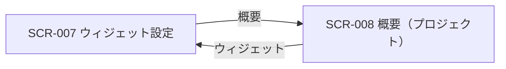
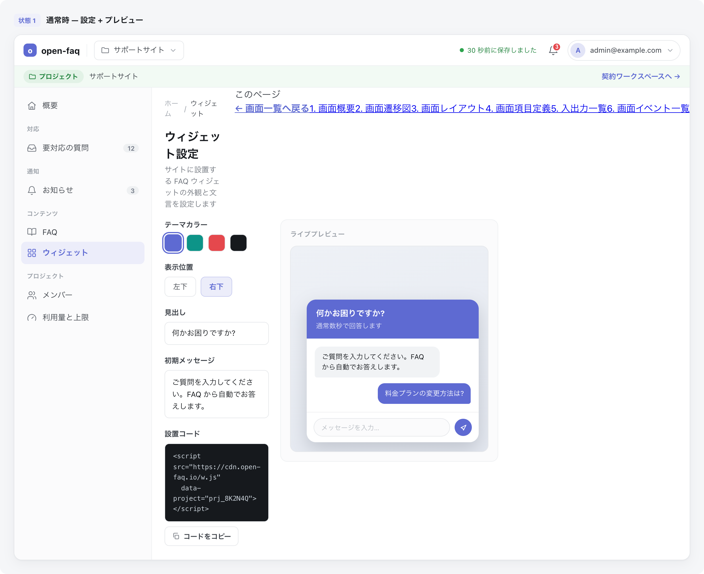

<!-- portal-top -->
[設計ポータル](../README.md) ／ [基本設計](index.md) ／ [画面設計](01_screen-design.md) ／ **SCR-007 ウィジェット設定**
<!-- /portal-top -->

# SCR-007 ウィジェット設定

> **このページは、プロジェクト単位のウィジェット公開キー・埋め込みコード・見た目(主色)を設定し、プレビューで確認する画面 SCR-007 を定義します。** 画面概要 / 画面遷移図 / 画面レイアウト / 画面項目定義 / 入出力一覧 / 画面イベント一覧 の 6 セクションで記述します。

*版数 v1.0 ・ 更新 2026-06-17 ・ 承認済*

## <span id="1-画面概要"></span>1. 画面概要

プロジェクト単位のウィジェット公開キー・埋め込みコード・見た目(主色)を 1 画面で設定し、左に設定パネル・右にプレビューを固定配置する画面です。

| 画面 ID | 画面名 | 機能概要 |
|----|----|----|
| <span id="SCR-007"></span>`SCR-007` | ウィジェット設定 | 公開キー管理・埋め込みコード・見た目(主色)設定とプレビューを行う |

| 関連     | 内容                                            |
|----------|-------------------------------------------------|
| FR / BR  | FR-031, FR-150〜FR-156, FR-193, FR-194 / BR-114 |
| 関連画面 | [`SCR-008` 概要(プロジェクト)](SCR-008.md)    |

| ステークホルダ              | 対象 |
|-----------------------------|------|
| オーナー                    | ◯    |
| プロジェクト管理者(`admin`) | ◯    |
| メンバー(`member`)          | ◯    |

> [!WARNING]
> **権限の制約** メンバー(`member`)は**閲覧 + 埋め込みコードのコピーのみ**可能です。公開キー再発行・見た目の編集・設定保存は当該プロジェクトの `admin` 以上に限られます。公開キーはプロジェクトごとに 1 セット(契約共通ではない)です。公開キー再発行は L3(対象プロジェクト名タイプ + 再認証)で保護します。

## <span id="2-画面遷移図"></span>2. 画面遷移図

本画面からの画面遷移を、画面 ID・画面名とイベント(操作)で示します。



## <span id="3-画面レイアウト"></span>3. 画面レイアウト



<details>
<summary>画面モック HTML（ソース）</summary>

```html
<div style="background:#f5f6f8;padding:24px;border-radius:12px;font-family:'Noto Sans JP',-apple-system,BlinkMacSystemFont,'Hiragino Kaku Gothic ProN',Meiryo,sans-serif;color:#3a3f46;-webkit-font-smoothing:antialiased;--accent:#5e6ad2">
<div style="max-width:1180px;margin:0 auto;display:flex;flex-direction:column;gap:40px">
  <section>
    <div style="display:flex;align-items:center;gap:10px;margin-bottom:13px">
      <span style="font-size:11px;font-weight:700;color:var(--accent,#5e6ad2);background:color-mix(in srgb,var(--accent,#5e6ad2) 10%,#fff);border-radius:6px;padding:3px 8px">状態 1</span>
      <span style="font-size:13.5px;font-weight:600;color:#16191d">通常時 — 設定 + プレビュー</span>
    </div>
    <div style="background:#fff;border:1px solid #e6e8eb;border-radius:14px;box-shadow:0 1px 2px rgba(16,24,40,.04),0 6px 20px rgba(16,24,40,.05);overflow:hidden">
      <div style="display:flex;align-items:center;justify-content:space-between;height:54px;padding:0 16px;border-bottom:1px solid #eef0f2;background:#fff">
        <div style="display:flex;align-items:center;gap:12px">
          <span style="display:inline-flex;align-items:center;gap:8px;font-weight:700;font-size:15px;color:#16191d"><span style="width:23px;height:23px;border-radius:7px;background:var(--accent,#5e6ad2);display:inline-flex;align-items:center;justify-content:center;color:#fff;font-size:13px;font-weight:800">o</span>open-faq</span>
          <span style="width:1px;height:22px;background:#eef0f2"></span>
          <button style="display:inline-flex;align-items:center;gap:7px;padding:6px 11px;border:1px solid #e6e8eb;border-radius:8px;background:#fff;font-size:13px;color:#3a3f46;cursor:pointer;font-family:inherit"><svg width="15" height="15" viewBox="0 0 24 24" fill="none" stroke="#71767e" stroke-width="1.8" stroke-linecap="round" stroke-linejoin="round"><path d="M4 5h5l2 2.5h9A1.5 1.5 0 0 1 21.5 9v9A1.5 1.5 0 0 1 20 19.5H4A1.5 1.5 0 0 1 2.5 18V6.5A1.5 1.5 0 0 1 4 5z"></path></svg>サポートサイト<svg width="14" height="14" viewBox="0 0 24 24" fill="none" stroke="#9aa0a8" stroke-width="1.9" stroke-linecap="round" stroke-linejoin="round"><path d="m6 9 6 6 6-6"></path></svg></button>
        </div>
        <div style="display:flex;align-items:center;gap:8px">
          <span style="display:inline-flex;align-items:center;gap:6px;font-size:11.5px;color:#1a7f37;margin-right:4px"><span style="width:7px;height:7px;border-radius:999px;background:#2da44e"></span>30 秒前に保存しました</span>
          <button style="position:relative;width:34px;height:34px;border-radius:8px;border:none;background:transparent;display:inline-flex;align-items:center;justify-content:center;color:#5b616a;cursor:pointer"><svg width="18" height="18" viewBox="0 0 24 24" fill="none" stroke="currentColor" stroke-width="1.8" stroke-linecap="round" stroke-linejoin="round"><path d="M6 8a6 6 0 0 1 12 0c0 7 3 9 3 9H3s3-2 3-9z"></path><path d="M10.3 21a1.94 1.94 0 0 0 3.4 0"></path></svg><span style="position:absolute;top:3px;right:3px;min-width:16px;height:16px;padding:0 3px;border-radius:999px;background:#e5484d;color:#fff;font-size:10px;font-weight:700;display:flex;align-items:center;justify-content:center;border:2px solid #fff">3</span></button>
          <button style="display:inline-flex;align-items:center;gap:8px;padding:4px 10px 4px 4px;border:1px solid #e6e8eb;border-radius:999px;background:#fff;cursor:pointer;font-family:inherit"><span style="width:26px;height:26px;border-radius:999px;background:color-mix(in srgb,var(--accent,#5e6ad2) 18%,#fff);color:var(--accent,#5e6ad2);font-weight:700;font-size:12px;display:flex;align-items:center;justify-content:center">A</span><span style="font-size:12.5px;color:#3a3f46">admin@example.com</span><svg width="14" height="14" viewBox="0 0 24 24" fill="none" stroke="#9aa0a8" stroke-width="1.9" stroke-linecap="round" stroke-linejoin="round"><path d="m6 9 6 6 6-6"></path></svg></button>
        </div>
      </div>
      <div style="display:flex;align-items:center;gap:10px;height:38px;padding:0 16px;background:color-mix(in srgb,#2da44e 6%,#fff);border-bottom:1px solid #eef0f2;font-size:12.5px;color:#71767e">
        <span style="display:inline-flex;align-items:center;gap:5px;padding:3px 9px;border-radius:999px;background:color-mix(in srgb,#2da44e 14%,#fff);color:#1a7f37;font-weight:600;font-size:11.5px"><svg width="13" height="13" viewBox="0 0 24 24" fill="none" stroke="currentColor" stroke-width="1.9" stroke-linecap="round" stroke-linejoin="round"><path d="M4 5h5l2 2.5h9A1.5 1.5 0 0 1 21.5 9v9A1.5 1.5 0 0 1 20 19.5H4A1.5 1.5 0 0 1 2.5 18V6.5A1.5 1.5 0 0 1 4 5z"></path></svg>プロジェクト</span>
        <span style="color:#3a3f46;font-weight:500">サポートサイト</span>
        <span style="margin-left:auto;color:var(--accent,#5e6ad2);font-weight:600;cursor:pointer">契約ワークスペースへ →</span>
      </div>
      <div style="display:flex;min-height:600px">
        <aside style="width:240px;flex:none;background:#fbfbfc;border-right:1px solid #eef0f2;padding:12px 12px 16px;display:flex;flex-direction:column">
          <a style="display:flex;align-items:center;gap:10px;padding:9px 10px;border-radius:8px;color:#3a3f46;font-size:13.5px;text-decoration:none"><svg width="17" height="17" viewBox="0 0 24 24" fill="none" stroke="#71767e" stroke-width="1.7" stroke-linecap="round" stroke-linejoin="round"><path d="M3 10.5 12 3l9 7.5"></path><path d="M5 9.5V20a1 1 0 0 0 1 1h12a1 1 0 0 0 1-1V9.5"></path><path d="M9.5 21v-6h5v6"></path></svg>概要</a>
          <div style="font-size:10.5px;font-weight:700;letter-spacing:.04em;color:#9aa0a8;padding:14px 10px 6px">対応</div>
          <a style="display:flex;align-items:center;gap:10px;padding:9px 10px;border-radius:8px;color:#3a3f46;font-size:13.5px;text-decoration:none"><svg width="17" height="17" viewBox="0 0 24 24" fill="none" stroke="#71767e" stroke-width="1.7" stroke-linecap="round" stroke-linejoin="round"><path d="M22 12h-6l-2 3h-4l-2-3H2"></path><path d="M5.5 5.1 2 12v6a2 2 0 0 0 2 2h16a2 2 0 0 0 2-2v-6l-3.5-6.9A2 2 0 0 0 16.8 4H7.2a2 2 0 0 0-1.7 1.1z"></path></svg>要対応の質問<span style="margin-left:auto;font-size:11px;font-weight:600;background:#eef0f2;color:#6b7280;border-radius:999px;padding:1px 7px">12</span></a>
          <div style="font-size:10.5px;font-weight:700;letter-spacing:.04em;color:#9aa0a8;padding:14px 10px 6px">通知</div>
          <a style="display:flex;align-items:center;gap:10px;padding:9px 10px;border-radius:8px;color:#3a3f46;font-size:13.5px;text-decoration:none"><svg width="17" height="17" viewBox="0 0 24 24" fill="none" stroke="#71767e" stroke-width="1.7" stroke-linecap="round" stroke-linejoin="round"><path d="M6 8a6 6 0 0 1 12 0c0 7 3 9 3 9H3s3-2 3-9z"></path><path d="M10.3 21a1.94 1.94 0 0 0 3.4 0"></path></svg>お知らせ<span style="margin-left:auto;font-size:11px;font-weight:600;background:#eef0f2;color:#6b7280;border-radius:999px;padding:1px 7px">3</span></a>
          <div style="font-size:10.5px;font-weight:700;letter-spacing:.04em;color:#9aa0a8;padding:14px 10px 6px">コンテンツ</div>
          <a style="display:flex;align-items:center;gap:10px;padding:9px 10px;border-radius:8px;color:#3a3f46;font-size:13.5px;text-decoration:none"><svg width="17" height="17" viewBox="0 0 24 24" fill="none" stroke="#71767e" stroke-width="1.7" stroke-linecap="round" stroke-linejoin="round"><path d="M12 7v13"></path><path d="M3 18a1 1 0 0 1-1-1V5a1 1 0 0 1 1-1h5a4 4 0 0 1 4 4 4 4 0 0 1 4-4h5a1 1 0 0 1 1 1v12a1 1 0 0 1-1 1h-6a3 3 0 0 0-3 3 3 3 0 0 0-3-3z"></path></svg>FAQ</a>
          <a style="display:flex;align-items:center;gap:10px;padding:9px 10px;border-radius:8px;background:color-mix(in srgb,var(--accent,#5e6ad2) 12%,#fff);color:var(--accent,#5e6ad2);font-weight:600;font-size:13.5px;text-decoration:none"><svg width="17" height="17" viewBox="0 0 24 24" fill="none" stroke="currentColor" stroke-width="1.8" stroke-linecap="round" stroke-linejoin="round"><rect x="3" y="3" width="7" height="7" rx="1.5"></rect><rect x="14" y="3" width="7" height="7" rx="1.5"></rect><rect x="14" y="14" width="7" height="7" rx="1.5"></rect><rect x="3" y="14" width="7" height="7" rx="1.5"></rect></svg>ウィジェット</a>
          <div style="font-size:10.5px;font-weight:700;letter-spacing:.04em;color:#9aa0a8;padding:14px 10px 6px">プロジェクト</div>
          <a style="display:flex;align-items:center;gap:10px;padding:9px 10px;border-radius:8px;color:#3a3f46;font-size:13.5px;text-decoration:none"><svg width="17" height="17" viewBox="0 0 24 24" fill="none" stroke="#71767e" stroke-width="1.7" stroke-linecap="round" stroke-linejoin="round"><path d="M16 21v-2a4 4 0 0 0-4-4H6a4 4 0 0 0-4 4v2"></path><circle cx="9" cy="7" r="4"></circle><path d="M22 21v-2a4 4 0 0 0-3-3.87"></path><path d="M16 3.1a4 4 0 0 1 0 7.75"></path></svg>メンバー</a>
          <a style="display:flex;align-items:center;gap:10px;padding:9px 10px;border-radius:8px;color:#3a3f46;font-size:13.5px;text-decoration:none"><svg width="17" height="17" viewBox="0 0 24 24" fill="none" stroke="#71767e" stroke-width="1.7" stroke-linecap="round" stroke-linejoin="round"><path d="m12 14 4-4"></path><path d="M3.34 19a10 10 0 1 1 17.32 0"></path></svg>利用量と上限</a>
        </aside>
        <main style="flex:1;min-width:0;background:#fff;padding:18px 22px 24px;display:flex;flex-direction:column;gap:16px">
          <nav style="display:flex;align-items:center;gap:7px;font-size:12px;color:#9aa0a8"><span>ホーム</span><span>/</span><span style="color:#3a3f46">ウィジェット</span></nav>
          <div>
            <h1 style="margin:0 0 4px;font-size:20px;font-weight:700;color:#16191d;letter-spacing:-.01em">ウィジェット設定</h1>
            <p style="margin:0;font-size:13px;color:#71767e">サイトに設置する FAQ ウィジェットの外観と文言を設定します</p>
          </div>
          <div style="display:grid;grid-template-columns:1fr 380px;gap:20px;align-items:start">
            <!-- form -->
            <div style="display:flex;flex-direction:column;gap:18px">
              <div>
                <label style="display:block;font-size:12.5px;font-weight:600;color:#3a3f46;margin-bottom:7px">テーマカラー</label>
                <div style="display:flex;gap:8px">
                  <span style="width:30px;height:30px;border-radius:8px;background:var(--accent,#5e6ad2);box-shadow:0 0 0 2px #fff,0 0 0 4px var(--accent,#5e6ad2);cursor:pointer"></span>
                  <span style="width:30px;height:30px;border-radius:8px;background:#0d9488;border:1px solid #e6e8eb;cursor:pointer"></span>
                  <span style="width:30px;height:30px;border-radius:8px;background:#e5484d;border:1px solid #e6e8eb;cursor:pointer"></span>
                  <span style="width:30px;height:30px;border-radius:8px;background:#16191d;border:1px solid #e6e8eb;cursor:pointer"></span>
                </div>
              </div>
              <div>
                <label style="display:block;font-size:12.5px;font-weight:600;color:#3a3f46;margin-bottom:7px">表示位置</label>
                <div style="display:flex;gap:8px">
                  <button style="padding:7px 14px;border:1px solid #e6e8eb;border-radius:8px;background:#fff;font-size:12.5px;color:#3a3f46;cursor:pointer;font-family:inherit">左下</button>
                  <button style="padding:7px 14px;border:1px solid color-mix(in srgb,var(--accent,#5e6ad2) 35%,#fff);border-radius:8px;background:color-mix(in srgb,var(--accent,#5e6ad2) 12%,#fff);font-size:12.5px;color:var(--accent,#5e6ad2);font-weight:600;cursor:pointer;font-family:inherit">右下</button>
                </div>
              </div>
              <div>
                <label style="display:block;font-size:12.5px;font-weight:600;color:#3a3f46;margin-bottom:7px">見出し</label>
                <div style="height:40px;border:1px solid #e6e8eb;border-radius:8px;background:#fff;display:flex;align-items:center;padding:0 12px;font-size:13px;color:#16191d">何かお困りですか?</div>
              </div>
              <div>
                <label style="display:block;font-size:12.5px;font-weight:600;color:#3a3f46;margin-bottom:7px">初期メッセージ</label>
                <div style="min-height:64px;border:1px solid #e6e8eb;border-radius:8px;background:#fff;padding:10px 12px;font-size:13px;color:#16191d;line-height:1.6">ご質問を入力してください。FAQ から自動でお答えします。</div>
              </div>
              <div>
                <label style="display:block;font-size:12.5px;font-weight:600;color:#3a3f46;margin-bottom:7px">設置コード</label>
                <div style="border:1px solid #eef0f2;border-radius:8px;background:#16191d;padding:12px 14px;font-family:ui-monospace,Menlo,monospace;font-size:11.5px;color:#c9d1d9;line-height:1.6;overflow:auto">&lt;script src="https://cdn.open-faq.io/w.js"<br>&nbsp;&nbsp;data-project="prj_8K2N4Q"&gt;&lt;/script&gt;</div>
                <button style="margin-top:8px;display:inline-flex;align-items:center;gap:6px;padding:7px 12px;border:1px solid #e6e8eb;border-radius:8px;background:#fff;font-size:12px;font-weight:600;color:#3a3f46;cursor:pointer;font-family:inherit"><svg width="14" height="14" viewBox="0 0 24 24" fill="none" stroke="#71767e" stroke-width="1.8" stroke-linecap="round" stroke-linejoin="round"><rect x="9" y="9" width="11" height="11" rx="2"></rect><path d="M5 15V5a2 2 0 0 1 2-2h10"></path></svg>コードをコピー</button>
              </div>
            </div>
            <!-- preview -->
            <div style="border:1px solid #eef0f2;border-radius:12px;background:#fbfbfc;padding:16px;position:sticky;top:16px">
              <div style="font-size:11.5px;font-weight:700;color:#9aa0a8;letter-spacing:.04em;margin-bottom:12px">ライブプレビュー</div>
              <div style="border-radius:12px;background:linear-gradient(160deg,#eef1f6,#e4e8f0);height:360px;position:relative;overflow:hidden;border:1px solid #e6e8eb">
                <div style="position:absolute;right:16px;bottom:16px;width:300px;background:#fff;border-radius:16px;box-shadow:0 12px 32px rgba(16,24,40,.18);overflow:hidden">
                  <div style="background:var(--accent,#5e6ad2);padding:14px 16px;color:#fff"><div style="font-size:14px;font-weight:700">何かお困りですか?</div><div style="font-size:11.5px;opacity:.85;margin-top:2px">通常数秒で回答します</div></div>
                  <div style="padding:14px;display:flex;flex-direction:column;gap:10px">
                    <div style="align-self:flex-start;max-width:80%;background:#f1f3f5;border-radius:12px 12px 12px 4px;padding:9px 12px;font-size:12px;color:#16191d;line-height:1.5">ご質問を入力してください。FAQ から自動でお答えします。</div>
                    <div style="align-self:flex-end;max-width:80%;background:var(--accent,#5e6ad2);color:#fff;border-radius:12px 12px 4px 12px;padding:9px 12px;font-size:12px;line-height:1.5">料金プランの変更方法は?</div>
                  </div>
                  <div style="border-top:1px solid #eef0f2;padding:10px 12px;display:flex;align-items:center;gap:8px"><div style="flex:1;height:32px;border:1px solid #e6e8eb;border-radius:999px;background:#fbfbfc;display:flex;align-items:center;padding:0 12px;font-size:11.5px;color:#b5bac0">メッセージを入力…</div><span style="width:30px;height:30px;border-radius:999px;background:var(--accent,#5e6ad2);display:flex;align-items:center;justify-content:center;flex:none"><svg width="15" height="15" viewBox="0 0 24 24" fill="none" stroke="#fff" stroke-width="2" stroke-linecap="round" stroke-linejoin="round"><path d="m5 12 14-7-7 14-2-5z"></path></svg></span></div>
                </div>
              </div>
            </div>
          </div>
        </main><aside class="rightbar"><div class="rb-title">このページ</div><nav class="toc"><a class="back" href="01_screen-design.md" style="font-weight:600;color:var(--accent)">← 画面一覧へ戻る</a><a href="#1-画面概要">1. 画面概要</a><a href="#2-画面遷移図">2. 画面遷移図</a><a href="#3-画面レイアウト">3. 画面レイアウト</a><a href="#4-画面項目定義">4. 画面項目定義</a><a href="#5-入出力一覧">5. 入出力一覧</a><a href="#6-画面イベント一覧">6. 画面イベント一覧</a></nav></aside>
      </div>
    </div>
  </section>
</div>
</div>
```

</details>

## <span id="4-画面項目定義"></span>4. 画面項目定義

本画面の入出力項目(公開キー管理・見た目・プレビュー・埋め込みコードの各セクション)を定義します。項目の正本は本表です。

| 項目 ID | 項目 | 説明 | 種類 | 表示条件 | 表示 |
|----|----|----|----|----|----|
| <span id="IT-01"></span>`IT-01` | スコープ注記 | 公開キーが本プロジェクト専用である旨を案内する | ラベル | — | 「この公開キーは本プロジェクト専用です。他プロジェクトのウィジェットとは共有されません」 |
| <span id="IT-02"></span>`IT-02` | ウィジェット公開キー | 現在の公開キーを参照表示し、コピーできる。参照のみ・無期限のため有効期限 UI なし | テキストボックス + ボタン | —(コピーはメンバーも可) | 公開キー(`pk_live_` + 32 文字)+「コピー」 |
| <span id="IT-03"></span>`IT-03` | 旧キー使用中バッジ | ローテーション猶予中に旧キーの使用を検知した旨を警告する | バッジ + 注意文 | ローテーション猶予 24 時間中に旧キー使用検知時のみ表示 | 「旧公開キーがまだ使われています。{件数} 件のアクセスを検知(最終 {時刻})。旧キーは再発行から 24 時間で失効します」 |
| <span id="IT-04"></span>`IT-04` | 公開キーを再発行(ローテーション) | 公開キーを再発行し、旧キーを 24 時間猶予で失効させる(L3 保護)。確認文に「既存の埋め込みコードは旧キー失効後に動作しなくなります」を必須表示 | ボタン | ロールがプロジェクト管理者以上(オーナーを含む)の場合のみ操作可(メンバーは非活性) | 「公開キーを再発行する」 |
| <span id="IT-05"></span>`IT-05` | 主色(プライマリカラー) | ウィジェットの主色を HEX で指定する | カラーピッカー | ロールがプロジェクト管理者以上(オーナーを含む)の場合のみ編集可(メンバーは非活性) | HEX 値(例「#3366CC」)+ 色見本 +「ピッカー」 |
| <span id="IT-06"></span>`IT-06` | プレビュー | 設定を反映したウィジェットの見た目を確認する | カード | — | 起動前の丸型ランチャーバッジと展開後のチャット UI |
| <span id="IT-07"></span>`IT-07` | 「Powered by」表示 | ウィジェットに「Powered by open-faq」を必須表示する | ラベル | — | 「Powered by open-faq」 |
| <span id="IT-08"></span>`IT-08` | 埋め込みコード | サイトへ貼り付ける埋め込みコードを表示し、コピーできる | テキストエリア + アイコンボタン | —(コピーはメンバーも可) | 埋め込み用 `<script>` タグ全文 + コピーアイコン(コード右上) |
| <span id="IT-09"></span>`IT-09` | 設定の保存 | 見た目等のウィジェット設定を保存する | ボタン | ロールがプロジェクト管理者以上(オーナーを含む)の場合のみ操作可(メンバーは非活性) | 「設定を保存」 |

## <span id="5-入出力一覧"></span>5. 入出力一覧

本画面が読み書きするテーブルと、呼び出す API の一覧です。テーブルの正本は [03_テーブル設計](03_database-design.md)、API の正本は [02_API設計 §5.3](02_api-design.md#API-PRJ-003) です。ウィジェット公開キー・見た目設定は `M_PROJECTS` テーブルに保持します。

<table>
<thead>
<tr>
<th rowspan="2">入出力名</th>
<th rowspan="2">説明</th>
<th rowspan="2">種別</th>
<th rowspan="2">I/O</th>
<th colspan="4">アクセス種別(CRUD)</th>
<th rowspan="2">備考</th>
</tr>
<tr>
<th>C</th>
<th>R</th>
<th>U</th>
<th>D</th>
</tr>
</thead>
<tbody>
<tr>
<td>プロジェクト</td>
<td>公開キー・ウィジェット設定 JSON を取得・更新する</td>
<td>テーブル</td>
<td>入力 / 出力</td>
<td>—</td>
<td>◯</td>
<td>◯</td>
<td>—</td>
<td><code>M_PROJECTS</code>(<code>widget_public_key</code> / ウィジェット設定 JSON)(<a href="03_database-design.md#TBL-M-004">テーブル設計 3.6</a>)</td>
</tr>
<tr>
<td>レガシー公開キー</td>
<td>ローテーション時に旧キーを 24 時間保持する</td>
<td>テーブル</td>
<td>出力</td>
<td>◯</td>
<td>—</td>
<td>—</td>
<td>—</td>
<td><code>T_PRJ_LEGACY_KEYS</code>(<a href="03_database-design.md#TBL-T-003">テーブル設計 3.7</a>)</td>
</tr>
<tr>
<td>プロジェクト更新</td>
<td>ウィジェット設定(主色等)を取得・保存する</td>
<td>API</td>
<td>入力 / 出力</td>
<td>—</td>
<td>—</td>
<td>—</td>
<td>—</td>
<td><code>PATCH /projects/{id}</code>(<a href="02_api-design.md#API-PRJ-003">API 設計 5.3.3</a>)</td>
</tr>
<tr>
<td>ウィジェット鍵ローテーション</td>
<td>公開キーを再発行する(旧キー 24h 猶予)</td>
<td>API</td>
<td>出力</td>
<td>—</td>
<td>—</td>
<td>—</td>
<td>—</td>
<td><code>POST /projects/{id}/widget-key/rotate</code>(<a href="02_api-design.md">API 設計 5.3.4</a>)</td>
</tr>
</tbody>
</table>

## <span id="6-画面イベント一覧"></span>6. 画面イベント一覧

本画面で発生するイベントと発生タイミング・概要の一覧です。

<table>
<colgroup>
<col style="width: 20%" />
<col style="width: 20%" />
<col style="width: 20%" />
<col style="width: 20%" />
<col style="width: 20%" />
</colgroup>
<thead>
<tr>
<th>イベント ID</th>
<th>イベント</th>
<th>トリガー</th>
<th>処理</th>
<th>関連項目</th>
</tr>
</thead>
<tbody>
<tr>
<td><code>EV-01</code></td>
<td>初期表示</td>
<td>画面遷移・リロード時</td>
<td><ul>
<li>公開キー・ウィジェット設定・埋め込みコードを取得し各セクションへ表示</li>
<li>旧キー使用検知時はバッジ表示</li>
</ul></td>
<td><a href="#IT-02">IT-02</a>, <a href="#IT-03">IT-03</a>, <a href="#IT-08">IT-08</a></td>
</tr>
<tr>
<td><code>EV-02</code></td>
<td>公開キーコピー</td>
<td>公開キーのコピーボタン押下時</td>
<td><ul>
<li>公開キーをクリップボードへコピー</li>
<li>成功時に緑チェック + トースト</li>
</ul></td>
<td><a href="#IT-02">IT-02</a></td>
</tr>
<tr>
<td><code>EV-03</code></td>
<td>埋め込みコードコピー</td>
<td>埋め込みコードのコピーアイコン押下時</td>
<td>コード全文をコピー(成功時 MSG-SCR-007-TOAST-002)。メンバーも実行可</td>
<td><a href="#IT-08">IT-08</a></td>
</tr>
<tr>
<td><code>EV-04</code></td>
<td>主色変更</td>
<td>カラーピッカー変更時(<code>admin</code> 以上)</td>
<td>プレビューにリアルタイム反映</td>
<td><a href="#IT-05">IT-05</a>, <a href="#IT-06">IT-06</a></td>
</tr>
<tr>
<td><code>EV-05</code></td>
<td>公開キー再発行</td>
<td>「公開キーを再発行する」押下時(<code>admin</code> 以上)</td>
<td><ul>
<li>L3 確認(プロジェクト名タイプ + 再認証)後 <code>POST /projects/{id}/widget-key/rotate</code></li>
<li>旧キーは 24 時間猶予で失効予告</li>
</ul></td>
<td><a href="#IT-04">IT-04</a></td>
</tr>
<tr>
<td><code>EV-06</code></td>
<td>設定の保存</td>
<td>「設定を保存」押下時(<code>admin</code> 以上)</td>
<td><ul>
<li><code>PATCH /projects/{id}</code> で設定更新</li>
<li>KV キャッシュ無効化</li>
</ul></td>
<td><a href="#IT-09">IT-09</a></td>
</tr>
</tbody>
</table>

---

---

---

<!-- portal-bottom -->
[← 画面設計](01_screen-design.md) ・ [基本設計](index.md) ・ [↑ 設計ポータル](../README.md)
<!-- /portal-bottom -->
