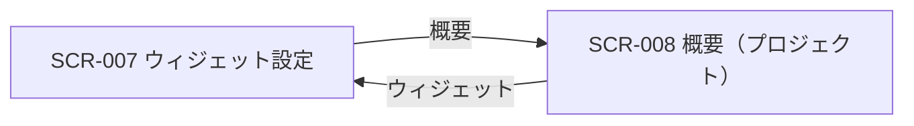
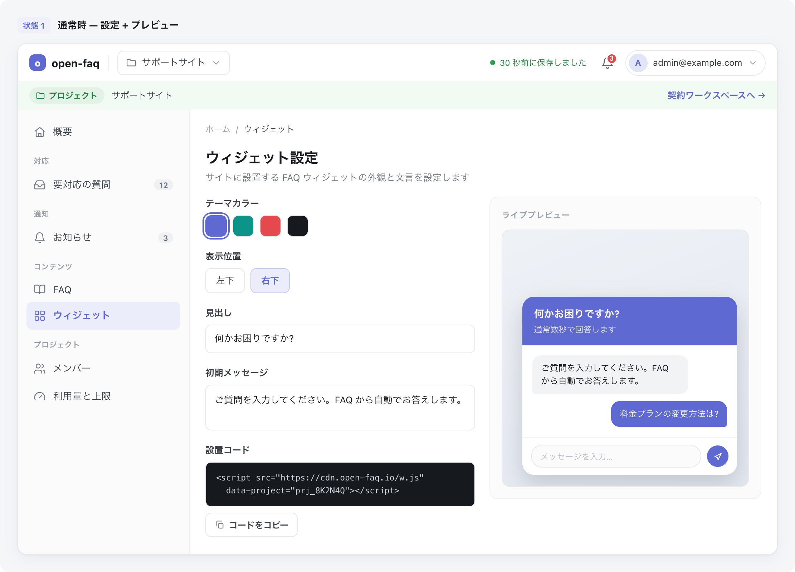

<!-- portal-top -->
[設計ポータル](../README.md) ／ [基本設計](index.md) ／ [画面設計](01_screen-design.md) ／ **SCR-007 ウィジェット設定**
<!-- /portal-top -->

# SCR-007 ウィジェット設定

> **このページは、プロジェクト単位のウィジェット公開キー・埋め込みコード・見た目(主色)を設定し、プレビューで確認する画面 SCR-007 を定義します。** 画面概要 / 画面遷移図 / 画面レイアウト / 画面項目定義 / 入出力一覧 / 画面イベント一覧 の 6 セクションで記述します。

*版数 v1.0 ・ 更新 2026-06-17 ・ 承認済*

## 1. 画面概要

プロジェクト単位のウィジェット公開キー・埋め込みコード・見た目(主色)を 1 画面で設定し、左に設定パネル・右にプレビューを固定配置する画面です。

| 画面 ID | 画面名 | 機能概要 |
|----|----|----|
| `SCR-007` | ウィジェット設定 | 公開キー管理・埋め込みコード・見た目(主色)設定とプレビューを行う |

| 関連     | 内容                                            |
|----------|-------------------------------------------------|
| FR / BR  | FR-020, FR-092〜FR-098, FR-113, FR-114 / BR-087 |
| 関連画面 | [`SCR-008` 概要(プロジェクト)](SCR-008.md)    |

| ステークホルダ | 対象 |
|----------------|------|
| オーナー       | ◯    |
| メンバー       | ◯    |

> [!NOTE]
> **権限** 当該プロジェクトのメンバー(オーナーを含む)は閲覧・埋め込みコードのコピーに加え、公開キー再発行・見た目の編集・設定保存を操作できます。公開キーはプロジェクトごとに 1 セット(契約共通ではない)です。公開キー再発行は L3(対象プロジェクト名タイプ + 再認証)で保護します。

## 2. 画面遷移図

本画面からの画面遷移を、画面 ID・画面名とイベント(操作)で示します。

## 3. 画面レイアウト

## 4. 画面項目定義

本画面の入出力項目(公開キー管理・見た目・プレビュー・埋め込みコードの各セクション)を定義します。項目の正本は本表です。

| 項目 ID | 項目 | 説明 | 種類 | 表示条件 | 表示 |
|----|----|----|----|----|----|
| `IT-01` | スコープ注記 | 公開キーが本プロジェクト専用である旨を案内する | ラベル | — | 「この公開キーは本プロジェクト専用です。他プロジェクトのウィジェットとは共有されません」 |
| `IT-02` | ウィジェット公開キー | 現在の公開キーを参照表示し、コピーできる。参照のみ・無期限のため有効期限 UI なし | テキストボックス + ボタン | —(コピーはメンバーも可) | 公開キー(`pk_live_` + 32 文字)+「コピー」 |
| `IT-03` | 旧キー使用中バッジ | ローテーション猶予中に旧キーの使用を検知した旨を警告する | バッジ + 注意文 | ローテーション猶予 24 時間中に旧キー使用検知時のみ表示 | 「旧公開キーがまだ使われています。{件数} 件のアクセスを検知(最終 {時刻})。旧キーは再発行から 24 時間で失効します」 |
| `IT-04` | 公開キーを再発行(ローテーション) | 公開キーを再発行し、旧キーを 24 時間猶予で失効させる(L3 保護)。確認文に「既存の埋め込みコードは旧キー失効後に動作しなくなります」を必須表示 | ボタン | 当該プロジェクトのメンバー(オーナーを含む)が操作可 | 「公開キーを再発行する」 |
| `IT-05` | 主色(プライマリカラー) | ウィジェットの主色をプリセット色スウォッチのクリック選択または任意 HEX 値の直接入力で指定する | スウォッチ選択 + テキストボックス | 当該プロジェクトのメンバー(オーナーを含む)が編集可 | プリセット色スウォッチ(複数)+ HEX 値テキストボックス(例「#5E6AD2」) |
| `IT-06` | プレビュー | 設定を反映したウィジェットの見た目を確認する | カード | — | 起動前の丸型ランチャーバッジと展開後のチャット UI |
| `IT-07` | 「Powered by」表示 | ウィジェットに「Powered by open-faq」を必須表示する | ラベル | — | 「Powered by open-faq」 |
| `IT-08` | 埋め込みコード | サイトへ貼り付ける埋め込みコードを表示し、コピーできる | テキストエリア + アイコンボタン | —(コピーはメンバーも可) | 埋め込み用 `<script>` タグ全文 + コピーアイコン(コード右上) |
| `IT-09` | 設定の保存 | 見た目等のウィジェット設定を保存する | ボタン | 当該プロジェクトのメンバー(オーナーを含む)が操作可 | 「設定を保存」 |
| `IT-10` | 表示位置 | ウィジェットを画面の左下または右下に表示する位置を選択する | トグルボタン(左下 / 右下) | 当該プロジェクトのメンバー(オーナーを含む)が編集可 | 「左下」「右下」の 2 択ボタン(選択中強調) |
| `IT-11` | 見出し | ウィジェット展開時のヘッダーに表示するタイトル文言を入力する | テキストボックス | 当該プロジェクトのメンバー(オーナーを含む)が編集可 | テキストボックス(例「何かお困りですか?」) |
| `IT-12` | 初期メッセージ | ウィジェットを開いたときにボットが最初に送るメッセージを入力する | テキストエリア | 当該プロジェクトのメンバー(オーナーを含む)が編集可 | テキストエリア(例「ご質問を入力してください。FAQ から自動でお答えします。」) |

## 5. 入出力一覧

本画面が読み書きするテーブルと、呼び出す API の一覧です。テーブルの正本は [データベース設計](03_database-design.md)、API の正本は [API設計](02_api-design.md#API-PRJ-003) です。ウィジェット公開キー・見た目設定は `M_PROJECTS` テーブルに保持します。

<table>
<thead>
<tr>
<th rowspan="2">入出力名</th>
<th rowspan="2">説明</th>
<th rowspan="2">種別</th>
<th rowspan="2">I/O</th>
<th colspan="4">アクセス種別(CRUD)</th>
<th rowspan="2">備考</th>
</tr>
<tr>
<th>C</th>
<th>R</th>
<th>U</th>
<th>D</th>
</tr>
</thead>
<tbody>
<tr>
<td>プロジェクト</td>
<td>公開キー・ウィジェット設定 JSON を取得・更新する</td>
<td>テーブル</td>
<td>入力 / 出力</td>
<td>—</td>
<td>◯</td>
<td>◯</td>
<td>—</td>
<td><code>M_PROJECTS</code>(<code>widget_public_key</code> / ウィジェット設定 JSON)(<a href="03_database-design.md#TBL-M-004">テーブル設計 3.6</a>)</td>
</tr>
<tr>
<td>レガシー公開キー</td>
<td>ローテーション時に旧キーを 24 時間保持する</td>
<td>テーブル</td>
<td>出力</td>
<td>◯</td>
<td>—</td>
<td>—</td>
<td>—</td>
<td><code>T_PRJ_LEGACY_KEYS</code>(<a href="03_database-design.md#TBL-T-003">テーブル設計 3.7</a>)</td>
</tr>
<tr>
<td>プロジェクト更新</td>
<td>ウィジェット設定(主色等)を取得・保存する</td>
<td>API</td>
<td>入力 / 出力</td>
<td>—</td>
<td>◯</td>
<td>◯</td>
<td>—</td>
<td><code>PATCH /projects/{id}</code>(<a href="API-project.md#API-PRJ-003">API-PRJ-003</a>)</td>
</tr>
<tr>
<td>ウィジェット鍵ローテーション</td>
<td>公開キーを再発行する(旧キー 24h 猶予)</td>
<td>API</td>
<td>出力</td>
<td>—</td>
<td>—</td>
<td>◯</td>
<td>—</td>
<td><code>POST /projects/{id}/widget-key/rotate</code>(<a href="API-project.md#API-PRJ-004">API-PRJ-004</a>)</td>
</tr>
</tbody>
</table>

## 6. 画面イベント一覧

本画面のイベント(初期表示・各操作)ごとに、対象の項目 ID と処理内容を定義します。

<table>
<colgroup>
<col style="width: 12%" />
<col style="width: 12%" />
<col style="width: 30%" />
<col style="width: 46%" />
</colgroup>
<thead>
<tr>
<th>イベント ID</th>
<th>項目 ID</th>
<th>イベント</th>
<th>処理</th>
</tr>
</thead>
<tbody>
<tr>
<td><code>EV-01</code></td>
<td>—</td>
<td>初期表示</td>
<td><ul>
<li>当該プロジェクトの公開キー・ウィジェット設定(主色・表示位置・見出し・初期メッセージ等)・埋め込みコードを取得し、各セクション(<a href="#IT-02">IT-02</a> / <a href="#IT-05">IT-05</a> / <a href="#IT-08">IT-08</a> / <a href="#IT-10">IT-10</a> / <a href="#IT-11">IT-11</a> / <a href="#IT-12">IT-12</a>)へ表示する</li>
<li>ローテーション猶予中に旧キー使用を検知している場合は旧キー使用中バッジ(<a href="#IT-03">IT-03</a>)を表示する</li>
</ul></td>
</tr>
<tr>
<td><code>EV-02</code></td>
<td><a href="#IT-02">IT-02</a></td>
<td>「コピー」を押下(公開キー)</td>
<td><ul>
<li>成功時: 公開キーをクリップボードへコピーし、緑チェック + トーストを表示する</li>
<li>失敗時: コピー失敗のトーストを表示する</li>
</ul></td>
</tr>
<tr>
<td><code>EV-03</code></td>
<td><a href="#IT-08">IT-08</a></td>
<td>「コードをコピー」を押下(埋め込みコード)</td>
<td><ul>
<li>成功時: 埋め込みコード全文をクリップボードへコピーし、成功トーストを表示する</li>
<li>失敗時: コピー失敗のトーストを表示する</li>
</ul></td>
</tr>
<tr>
<td><code>EV-04</code></td>
<td><a href="#IT-05">IT-05</a></td>
<td>テーマカラーを選択</td>
<td>プリセット色スウォッチをクリックして主色を選択し、プレビュー(<a href="#IT-06">IT-06</a>)にリアルタイム反映する</td>
</tr>
<tr>
<td><code>EV-05</code></td>
<td><a href="#IT-05">IT-05</a></td>
<td>主色(HEX)を入力</td>
<td>HEX 値テキストボックスに直接入力した値をプレビュー(<a href="#IT-06">IT-06</a>)にリアルタイム反映する</td>
</tr>
<tr>
<td><code>EV-06</code></td>
<td><a href="#IT-10">IT-10</a></td>
<td>表示位置を選択</td>
<td>「左下」または「右下」ボタンを押下して表示位置を選択し、プレビュー(<a href="#IT-06">IT-06</a>)にリアルタイム反映する</td>
</tr>
<tr>
<td><code>EV-07</code></td>
<td><a href="#IT-11">IT-11</a></td>
<td>見出しを入力</td>
<td>見出しテキストボックスに入力した文言をプレビュー(<a href="#IT-06">IT-06</a>)にリアルタイム反映する</td>
</tr>
<tr>
<td><code>EV-08</code></td>
<td><a href="#IT-12">IT-12</a></td>
<td>初期メッセージを入力</td>
<td>初期メッセージテキストエリアに入力した文言をプレビュー(<a href="#IT-06">IT-06</a>)にリアルタイム反映する</td>
</tr>
<tr>
<td><code>EV-09</code></td>
<td><a href="#IT-04">IT-04</a></td>
<td>「公開キーを再発行する」を押下</td>
<td><ul>
<li>L3 確認(プロジェクト名タイプ + 再認証)ダイアログを表示する</li>
<li>確認完了後: <a href="API-project.md#API-PRJ-004">ウィジェット鍵ローテーション</a> API を呼び出し、新キーを発行して旧キーを 24 時間猶予で失効予告する。画面を再読み込みして新キーを表示する</li>
<li>確認キャンセル時: ダイアログを閉じ、何もしない</li>
<li>API エラー時: エラートーストを表示し、キーは変更しない</li>
</ul></td>
</tr>
<tr>
<td><code>EV-10</code></td>
<td><a href="#IT-09">IT-09</a></td>
<td>「設定を保存」を押下</td>
<td><ul>
<li>成功時: <a href="API-project.md#API-PRJ-003">プロジェクト更新(PATCH)</a> API でウィジェット設定(主色・表示位置・見出し・初期メッセージ等)を更新し、KV キャッシュを無効化する。成功トーストを表示する</li>
<li>失敗時: エラートーストを表示し、設定は保存されない</li>
</ul></td>
</tr>
<tr>
<td><code>EV-11</code></td>
<td>—</td>
<td>「概要」を押下</td>
<td><a href="SCR-008.md">SCR-008 概要(プロジェクト)</a> へ遷移する</td>
</tr>
</tbody>
</table>

---

<!-- portal-bottom -->
[← 画面設計](01_screen-design.md) ・ [基本設計](index.md) ・ [↑ 設計ポータル](../README.md)
<!-- /portal-bottom -->
