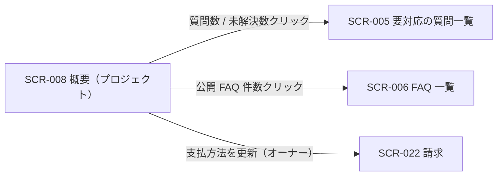

<!-- portal-top -->
[設計ポータル](../README.md) ／ [基本設計](index.md) ／ [画面設計](01_screen-design.md) ／ **SCR-008 概要(プロジェクト)**
<!-- /portal-top -->

# SCR-008 概要(プロジェクト)

> **このページは、選択中プロジェクトの質問数・未解決数・公開 FAQ 件数を確認し、各ワークスペース画面への導線を提供するダッシュボード画面 SCR-008 を定義します。** 画面概要 / 画面遷移図 / 画面レイアウト / 画面項目定義 / 入出力一覧 / 画面イベント一覧 の 6 セクションで記述します。

*版数 v1.0 ・ 更新 2026-06-17 ・ 承認済*

## 1. 画面概要

選択中プロジェクトの質問数・未解決数・公開 FAQ 件数を白背景モノクロの 4 カードで確認し、数値クリックで関連画面へ遷移するプロジェクト概要画面です。

| 画面 ID | 画面名 | 機能概要 |
|----|----|----|
| `SCR-008` | 概要(プロジェクト) | 選択中プロジェクトの質問数・未解決数・公開 FAQ 件数を確認する |

| 関連 | 内容 |
|----|----|
| FR / BR | FR-130〜FR-135h, FR-191 / BR-096 |
| 関連画面 | [`SCR-005` 要対応の質問一覧](SCR-005.md) / [`SCR-006` FAQ 一覧](SCR-006.md) / [`SCR-016` 利用状況](SCR-016.md)(本画面からの直接遷移はなくサイドメニュー経由) / [`SCR-022` 請求](SCR-022.md) |

| ステークホルダ              | 対象 |
|-----------------------------|------|
| オーナー                    | ◯    |
| プロジェクト管理者(`admin`) | ◯    |
| メンバー(`member`)          | ◯    |

> [!NOTE]
> **補足** 各ステークホルダとも当該プロジェクトへの割当が前提です。本画面はプロジェクト概要のみを扱い、変更・削除操作は置きません。契約全体の利用状況は SCR-016、請求は SCR-022、プロジェクト編集・削除は SCR-004 / SCR-004-001 に分離します。表示ルール(数値・期間・最終更新・色語彙・状態表現)は 画面設計 §1.5 ダッシュボード / KPI 共通表示ルール に正本化します。

## 2. 画面遷移図

本画面からの画面遷移を、画面 ID・画面名とイベント(操作)で示します。

## 3. 画面レイアウト

  <!-- STATE 1: 通常時 -->
  <section>
    

      状態 1
      通常時 — 利用枠超過バナー付き
      IT-08 / IT-09 / EV-01
    

    

      

        

          oopen-faq
          
          <button style="display:inline-flex;align-items:center;gap:7px;padding:6px 11px;border:1px solid #e6e8eb;border-radius:8px;background:#fff;font-size:13px;color:#3a3f46;cursor:pointer;font-family:inherit"><svg width="15" height="15" viewBox="0 0 24 24" fill="none" stroke="#71767e" stroke-width="1.8" stroke-linecap="round" stroke-linejoin="round"><path d="M4 5h5l2 2.5h9A1.5 1.5 0 0 1 21.5 9v9A1.5 1.5 0 0 1 20 19.5H4A1.5 1.5 0 0 1 2.5 18V6.5A1.5 1.5 0 0 1 4 5z"></path></svg>サポートサイト<svg width="14" height="14" viewBox="0 0 24 24" fill="none" stroke="#9aa0a8" stroke-width="1.9" stroke-linecap="round" stroke-linejoin="round"><path d="m6 9 6 6 6-6"></path></svg></button>
        

        

          <button style="position:relative;width:34px;height:34px;border-radius:8px;border:none;background:transparent;display:inline-flex;align-items:center;justify-content:center;color:#5b616a;cursor:pointer"><svg width="18" height="18" viewBox="0 0 24 24" fill="none" stroke="currentColor" stroke-width="1.8" stroke-linecap="round" stroke-linejoin="round"><path d="M6 8a6 6 0 0 1 12 0c0 7 3 9 3 9H3s3-2 3-9z"></path><path d="M10.3 21a1.94 1.94 0 0 0 3.4 0"></path></svg>3</button>
          <button style="display:inline-flex;align-items:center;gap:8px;padding:4px 10px 4px 4px;border:1px solid #e6e8eb;border-radius:999px;background:#fff;cursor:pointer;font-family:inherit">Aadmin@example.com<svg width="14" height="14" viewBox="0 0 24 24" fill="none" stroke="#9aa0a8" stroke-width="1.9" stroke-linecap="round" stroke-linejoin="round"><path d="m6 9 6 6 6-6"></path></svg></button>
        

      

      

        <svg width="13" height="13" viewBox="0 0 24 24" fill="none" stroke="currentColor" stroke-width="1.9" stroke-linecap="round" stroke-linejoin="round"><path d="M4 5h5l2 2.5h9A1.5 1.5 0 0 1 21.5 9v9A1.5 1.5 0 0 1 20 19.5H4A1.5 1.5 0 0 1 2.5 18V6.5A1.5 1.5 0 0 1 4 5z"></path></svg>プロジェクト
        サポートサイト
        契約ワークスペースへ →
      

      

        <aside style="width:240px;flex:none;background:#fbfbfc;border-right:1px solid #eef0f2;padding:12px 12px 16px;display:flex;flex-direction:column">
          <a style="display:flex;align-items:center;gap:10px;padding:9px 10px;border-radius:8px;background:color-mix(in srgb,var(--accent,#5e6ad2) 12%,#fff);color:var(--accent,#5e6ad2);font-weight:600;font-size:13.5px;text-decoration:none"><svg width="17" height="17" viewBox="0 0 24 24" fill="none" stroke="currentColor" stroke-width="1.8" stroke-linecap="round" stroke-linejoin="round"><path d="M3 10.5 12 3l9 7.5"></path><path d="M5 9.5V20a1 1 0 0 0 1 1h12a1 1 0 0 0 1-1V9.5"></path><path d="M9.5 21v-6h5v6"></path></svg>概要</a>
          
対応

          <a style="display:flex;align-items:center;gap:10px;padding:9px 10px;border-radius:8px;color:#3a3f46;font-size:13.5px;text-decoration:none"><svg width="17" height="17" viewBox="0 0 24 24" fill="none" stroke="#71767e" stroke-width="1.7" stroke-linecap="round" stroke-linejoin="round"><path d="M22 12h-6l-2 3h-4l-2-3H2"></path><path d="M5.5 5.1 2 12v6a2 2 0 0 0 2 2h16a2 2 0 0 0 2-2v-6l-3.5-6.9A2 2 0 0 0 16.8 4H7.2a2 2 0 0 0-1.7 1.1z"></path></svg>要対応の質問12</a>
          
通知

          <a style="display:flex;align-items:center;gap:10px;padding:9px 10px;border-radius:8px;color:#3a3f46;font-size:13.5px;text-decoration:none"><svg width="17" height="17" viewBox="0 0 24 24" fill="none" stroke="#71767e" stroke-width="1.7" stroke-linecap="round" stroke-linejoin="round"><path d="M6 8a6 6 0 0 1 12 0c0 7 3 9 3 9H3s3-2 3-9z"></path><path d="M10.3 21a1.94 1.94 0 0 0 3.4 0"></path></svg>お知らせ3</a>
          
コンテンツ

          <a style="display:flex;align-items:center;gap:10px;padding:9px 10px;border-radius:8px;color:#3a3f46;font-size:13.5px;text-decoration:none"><svg width="17" height="17" viewBox="0 0 24 24" fill="none" stroke="#71767e" stroke-width="1.7" stroke-linecap="round" stroke-linejoin="round"><path d="M12 7v13"></path><path d="M3 18a1 1 0 0 1-1-1V5a1 1 0 0 1 1-1h5a4 4 0 0 1 4 4 4 4 0 0 1 4-4h5a1 1 0 0 1 1 1v12a1 1 0 0 1-1 1h-6a3 3 0 0 0-3 3 3 3 0 0 0-3-3z"></path></svg>FAQ</a>
          <a style="display:flex;align-items:center;gap:10px;padding:9px 10px;border-radius:8px;color:#3a3f46;font-size:13.5px;text-decoration:none"><svg width="17" height="17" viewBox="0 0 24 24" fill="none" stroke="#71767e" stroke-width="1.7" stroke-linecap="round" stroke-linejoin="round"><rect x="3" y="3" width="7" height="7" rx="1.5"></rect><rect x="14" y="3" width="7" height="7" rx="1.5"></rect><rect x="14" y="14" width="7" height="7" rx="1.5"></rect><rect x="3" y="14" width="7" height="7" rx="1.5"></rect></svg>ウィジェット</a>
          
プロジェクト

          <a style="display:flex;align-items:center;gap:10px;padding:9px 10px;border-radius:8px;color:#3a3f46;font-size:13.5px;text-decoration:none"><svg width="17" height="17" viewBox="0 0 24 24" fill="none" stroke="#71767e" stroke-width="1.7" stroke-linecap="round" stroke-linejoin="round"><path d="M16 21v-2a4 4 0 0 0-4-4H6a4 4 0 0 0-4 4v2"></path><circle cx="9" cy="7" r="4"></circle><path d="M22 21v-2a4 4 0 0 0-3-3.87"></path><path d="M16 3.1a4 4 0 0 1 0 7.75"></path></svg>メンバー</a>
          <a style="display:flex;align-items:center;gap:10px;padding:9px 10px;border-radius:8px;color:#3a3f46;font-size:13.5px;text-decoration:none"><svg width="17" height="17" viewBox="0 0 24 24" fill="none" stroke="#71767e" stroke-width="1.7" stroke-linecap="round" stroke-linejoin="round"><path d="m12 14 4-4"></path><path d="M3.34 19a10 10 0 1 1 17.32 0"></path></svg>利用量と上限</a>
        </aside>
        <main style="flex:1;min-width:0;background:#fff;padding:18px 22px 24px;display:flex;flex-direction:column;gap:14px">
          <nav style="display:flex;align-items:center;gap:7px;font-size:12px;color:#9aa0a8">ホーム/概要</nav>
          

            

              <h1 style="margin:0 0 4px;font-size:20px;font-weight:700;color:#16191d;letter-spacing:-.01em">概要</h1>
              
このプロジェクトの利用状況を確認できます

            

            <button style="display:inline-flex;align-items:center;gap:8px;padding:7px 12px;border:1px solid #e6e8eb;border-radius:8px;background:#fff;font-size:12.5px;color:#3a3f46;cursor:pointer;font-family:inherit">期間: <b style="font-weight:600">当月</b><svg width="13" height="13" viewBox="0 0 24 24" fill="none" stroke="#9aa0a8" stroke-width="1.9" stroke-linecap="round" stroke-linejoin="round"><path d="m6 9 6 6 6-6"></path></svg></button>
          

          
<svg width="17" height="17" viewBox="0 0 24 24" fill="none" stroke="#d99409" stroke-width="1.9" stroke-linecap="round" stroke-linejoin="round" style="flex:none"><path d="M10.3 4 2.5 18a1.7 1.7 0 0 0 1.5 2.6h16a1.7 1.7 0 0 0 1.5-2.6L13.7 4a1.7 1.7 0 0 0-3 0z"></path><path d="M12 9v4"></path><path d="M12 17h.01"></path></svg><b style="font-weight:700">無料利用枠を超過しました</b> — お支払い方法が未登録のため、ウィジェットは現在制限中です。支払い方法を登録 →

          
最終更新: 2026-06-19 09:12(JST)

          

            
利用状況

            

              <a style="display:block;text-decoration:none;border:1px solid #eef0f2;border-radius:12px;padding:16px;background:#fbfbfc;cursor:pointer">
                
質問数<svg width="15" height="15" viewBox="0 0 24 24" fill="none" stroke="#c4c8cd" stroke-width="2" stroke-linecap="round" stroke-linejoin="round"><path d="m9 18 6-6-6-6"></path></svg>

                
1,247件

              </a>
              <a style="display:block;text-decoration:none;border:1px solid #eef0f2;border-radius:12px;padding:16px;background:#fbfbfc;cursor:pointer">
                
未解決数<svg width="15" height="15" viewBox="0 0 24 24" fill="none" stroke="#c4c8cd" stroke-width="2" stroke-linecap="round" stroke-linejoin="round"><path d="m9 18 6-6-6-6"></path></svg>

                
139件

              </a>
              <a style="display:block;text-decoration:none;border:1px solid #eef0f2;border-radius:12px;padding:16px;background:#fbfbfc;cursor:pointer">
                
公開 FAQ 件数<svg width="15" height="15" viewBox="0 0 24 24" fill="none" stroke="#c4c8cd" stroke-width="2" stroke-linecap="round" stroke-linejoin="round"><path d="m9 18 6-6-6-6"></path></svg>

                
156件

              </a>
            

          

          

            

              
質問数の推移(過去 14 日)日次

              

                

                

                

                

                

                

                

                

                

                

                

                

                

                

              

            

            

              
要対応の質問一覧へ →

              

                
料金プランの変更方法について3 分前

                
パスワードを忘れた場合の手順26 分前

                
サポート時間外の問い合わせ対応2 時間前

              

            

          

        </main><aside class="rightbar">
このページ
<nav class="toc"><a class="back" href="01_screen-design.md" style="font-weight:600;color:var(--accent)">← 画面一覧へ戻る</a><a href="#1-画面概要">1. 画面概要</a><a href="#2-画面遷移図">2. 画面遷移図</a><a href="#3-画面レイアウト">3. 画面レイアウト</a><a href="#4-画面項目定義">4. 画面項目定義</a><a href="#5-入出力一覧">5. 入出力一覧</a><a href="#6-画面イベント一覧">6. 画面イベント一覧</a></nav></aside>
      

    

  </section>

## 4. 画面項目定義

本画面の入出力項目(ヘッダ・期間選択・状態アラート・KPI カード)を定義します。項目の正本は本表です。各カードは項目名と件数のみを表示し、前月比・コメント・ゲージは表示しません。0 件 / 集計中 / 取得失敗時のクリック非活性ルールは 画面設計 §1.5 に従います。

| 項目 ID | 項目 | 説明 | 種類 | 表示条件 | 表示 |
|----|----|----|----|----|----|
| `IT-01` | PageHeader | 画面タイトル「概要」を表示する(プロジェクト名は付加せず WorkspaceSwitcher で確認) | 見出し | — | 「概要」 |
| `IT-02` | 期間選択 | 集計対象の期間を選択する | ドロップダウン | — | 選択肢「当月」/「前月」/「任意期間」(最大 13 ヶ月) |
| `IT-03` | 最終更新タイムスタンプ | 集計値の最終更新時刻を表示する | ラベル | — | 「最終更新: YYYY-MM-DD HH:MM(JST)」。5 分以上前は「集計遅延」黄表記 |
| `IT-04` | サスペンション中の表示 | 契約停止中であることと再開導線をアラート表示する | アラート | 契約状態が停止中(サスペンション)の場合のみ表示 | 「現在ご利用いただけません」+ オーナー連絡導線(non-owner)/「支払方法を更新する(請求)」リンク(オーナー向け) |
| `IT-05` | 質問数 | 期間内の質問総数を表示する | カード | — | 「質問数」+ 件数(例「1,247 件」) |
| `IT-06` | 未解決数 | 期間内の未解決質問数を表示する | カード | — | 「未解決数」+ 件数(例「139 件」) |
| `IT-07` | 公開 FAQ 件数 | 当該プロジェクトの公開 FAQ 件数を表示する | カード | — | 「公開 FAQ 件数」+ 件数(例「156 件」) |
| `IT-08` | 無料利用枠超過バナー | 無料利用枠超過と支払方法登録の導線を表示する | バナー | 無料利用枠を超過した場合のみ表示 | 「無料利用枠を超過しました」+ 支払方法未登録時はウィジェット制限中の旨と「支払い方法を登録」導線(オーナー向け) |
| `IT-09` | 質問数上限到達バナー | 質問数の上限到達と利用量画面への導線を表示する | バナー | 質問数が月次上限に到達した場合のみ表示 | 「質問数が上限に達しました」+ ウィジェット制限中の旨と「利用量と上限へ」導線(SCR-021) |

## 5. 入出力一覧

本画面が読み書きするテーブルと、呼び出す API の一覧です。テーブルの正本は [03_テーブル設計](03_database-design.md)、API の正本は [02_API設計 §5.8a.1](02_api-design.md#API-DASH-001) です。本画面は集計取得のみで永続更新は行いません。

<table>
<thead>
<tr>
<th rowspan="2">入出力名</th>
<th rowspan="2">説明</th>
<th rowspan="2">種別</th>
<th rowspan="2">I/O</th>
<th colspan="4">アクセス種別(CRUD)</th>
<th rowspan="2">備考</th>
</tr>
<tr>
<th>C</th>
<th>R</th>
<th>U</th>
<th>D</th>
</tr>
</thead>
<tbody>
<tr>
<td>利用量計測</td>
<td>質問数・未解決数を集計取得する</td>
<td>テーブル</td>
<td>入力</td>
<td>—</td>
<td>◯</td>
<td>—</td>
<td>—</td>
<td><code>T_USAGE_METER</code>(<a href="03_database-design.md#TBL-T-008">テーブル設計 3.22</a>)</td>
</tr>
<tr>
<td>FAQ</td>
<td>公開 FAQ 件数を集計取得する</td>
<td>テーブル</td>
<td>入力</td>
<td>—</td>
<td>◯</td>
<td>—</td>
<td>—</td>
<td><code>M_FAQS</code>(<a href="03_database-design.md#TBL-M-006">テーブル設計 3.9</a>)</td>
</tr>
<tr>
<td>ダッシュボード集計取得</td>
<td>期間・プロジェクト別の KPI 集計を取得する</td>
<td>API</td>
<td>入力</td>
<td>—</td>
<td>—</td>
<td>—</td>
<td>—</td>
<td><code>GET /dashboard/summary</code>(<code>period</code> / <code>projectId</code>)(<a href="02_api-design.md#API-DASH-001">API 設計 5.8a.1</a>)</td>
</tr>
</tbody>
</table>

## 6. 画面イベント一覧

本画面で発生するイベントと発生タイミング・概要の一覧です。

<table>
<colgroup>
<col style="width: 20%" />
<col style="width: 20%" />
<col style="width: 20%" />
<col style="width: 20%" />
<col style="width: 20%" />
</colgroup>
<thead>
<tr>
<th>イベント ID</th>
<th>イベント</th>
<th>トリガー</th>
<th>処理</th>
<th>関連項目</th>
</tr>
</thead>
<tbody>
<tr>
<td><code>EV-01</code></td>
<td>概要初期表示</td>
<td>画面遷移・リロード時</td>
<td><ul>
<li><code>GET /dashboard/summary</code> で質問数・未解決数・公開 FAQ 件数を取得し KPI カードへ表示</li>
<li><code>suspended</code> 時はアラート表示</li>
</ul></td>
<td><a href="#IT-03">IT-03</a>, <a href="#IT-04">IT-04</a>, <a href="#IT-05">IT-05</a>, <a href="#IT-06">IT-06</a>, <a href="#IT-07">IT-07</a></td>
</tr>
<tr>
<td><code>EV-02</code></td>
<td>期間変更</td>
<td>期間選択の変更時</td>
<td>選択期間で <code>GET /dashboard/summary</code> を再取得し KPI を更新</td>
<td><a href="#IT-02">IT-02</a></td>
</tr>
<tr>
<td><code>EV-03</code></td>
<td>質問数 / 未解決数クリック</td>
<td>KPI カードの数値クリック時</td>
<td>SCR-005 へ遷移(質問数は status 絞り込みなし、未解決数は <code>status=open</code>)</td>
<td><a href="#IT-05">IT-05</a>, <a href="#IT-06">IT-06</a></td>
</tr>
<tr>
<td><code>EV-04</code></td>
<td>公開 FAQ 件数クリック</td>
<td>KPI カードの数値クリック時</td>
<td>SCR-006 FAQ 一覧へ遷移</td>
<td><a href="#IT-07">IT-07</a></td>
</tr>
<tr>
<td><code>EV-05</code></td>
<td>支払方法更新へ遷移</td>
<td>サスペンションアラートの「支払方法を更新」押下時(オーナーのみ)</td>
<td>SCR-022 へ遷移</td>
<td><a href="#IT-04">IT-04</a></td>
</tr>
<tr>
<td><code>EV-06</code></td>
<td>支払方法登録へ遷移</td>
<td>無料利用枠超過バナーの「支払い方法を登録」押下時(オーナーのみ)</td>
<td>SCR-022 へ遷移</td>
<td><a href="#IT-08">IT-08</a></td>
</tr>
</tbody>
</table>

---

---

<!-- portal-bottom -->
[← 画面設計](01_screen-design.md) ・ [基本設計](index.md) ・ [↑ 設計ポータル](../README.md)
<!-- /portal-bottom -->
