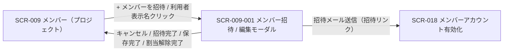
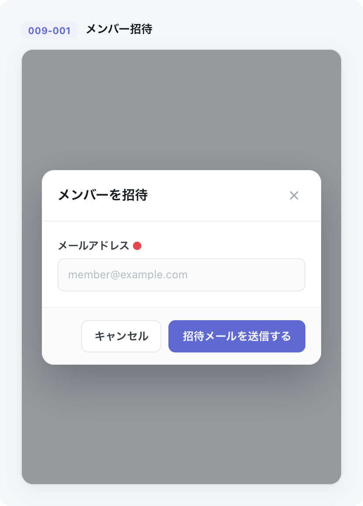

<!-- portal-top -->
[設計ポータル](../README.md) ／ [基本設計](index.md) ／ [画面設計](01_screen-design.md) ／ **SCR-009-001 メンバー招待 / 編集モーダル(プロジェクト単位)**
<!-- /portal-top -->

# SCR-009-001 メンバー招待 / 編集モーダル(プロジェクト単位)

> **このページは、SCR-009 から開くメンバーの招待・ロール編集・割当解除を行うモーダル SCR-009-001 を定義します。** 画面概要 / 画面遷移図 / 画面レイアウト / 画面項目定義 / 入出力一覧 / 画面イベント一覧 の 6 セクションで記述します。

*版数 v1.0 ・ 更新 2026-06-17 ・ 承認済*

## 1. 画面概要

SCR-009 から開く、メンバー招待(新規)とロール編集・招待再送・割当解除(既存)を全画面割込みモーダルで行う画面です。現在開いているプロジェクトの 1 件の割当のみを操作対象とします。

| 画面 ID | 画面名 | 機能概要 |
|----|----|----|
| `SCR-009-001` | メンバー招待 / 編集モーダル(プロジェクト単位) | 当該プロジェクトのメンバー招待・ロール変更・招待再送・割当解除を全画面割込みモーダルで実施する |

| 関連 | 内容 |
|----|----|
| FR / BR | FR-015, FR-015b, FR-016〜FR-016e, FR-018, FR-018a〜FR-018c, FR-019a, FR-021c, FR-333〜FR-339 / BR-038, BR-039 |
| 関連画面 | [`SCR-009` メンバー(プロジェクト)](SCR-009.md)(呼出元) / [`SCR-018` メンバーアカウント有効化](SCR-018.md)(招待リンク着地点) |

| ステークホルダ              | 対象 |
|-----------------------------|------|
| オーナー                    | ◯    |
| プロジェクト管理者(`admin`) | ◯    |
| メンバー(`member`)          | —    |

> [!IMPORTANT]
> **重要** 必要権限は当該プロジェクトに対する `admin`(オーナーは暗黙 `admin` として含む)です。招待モードでは氏名フィールドを表示しません(管理者は他人の氏名を事前入力できない。氏名は招待された本人が [SCR-018](SCR-018.md) で入力。FR-016d 個人情報原則)。最後の有効割当を解除した場合のみアカウントを自動論理削除(`users.valid=0`)します。

## 2. 画面遷移図

本モーダルの呼出元・遷移先を、画面 ID・画面名とイベント(操作)で示します。

## 3. 画面レイアウト

## 4. 画面項目定義

本モーダルの表示・入力項目・操作ボタンと各バリデーション・ガードを定義します。項目の正本は本表です。招待モード / 編集モードでのみ表示する項目は備考に明記します。

| 項目 ID | 項目 | 説明 | 種類 | 表示条件 | 表示 |
|----|----|----|----|----|----|
| `IT-01` | モード見出し | 招待 / 編集のモードと対象を示すモーダル見出しを表示する | 見出し | — | 招待「{プロジェクト名} へメンバーを招待」/ 編集「{プロジェクト名} のメンバー編集 — {表示名}」 |
| `IT-02` | モーダル閉じる(×) | 変更を破棄してモーダルを閉じる | アイコンボタン | — | 「×」 |
| `IT-03` | 自己編集警告帯 | 自分自身を編集する際の操作制限を警告帯で知らせる | アラート | 編集モードかつ自分自身編集時のみ | 「このプロジェクトのロールは変更できません / 自分のアカウントは削除できません」 |
| `IT-04` | メールアドレス | 招待先メールアドレスを入力する(招待モードのみ必須・編集可、編集モードでは表示のみ) | テキストボックス | 編集モードでは表示のみ | プレースホルダ「member@example.com」 |
| `IT-05` | 表示名(氏名) | 対象メンバーの氏名を読み取り専用で表示する | ラベル | 編集モードのみ表示(招待モードでは表示しない / 個人情報原則) | 対象メンバーの氏名。未入力時は「未設定」 |
| `IT-06` | 招待モード氏名注記 | 氏名は本人が有効化時に入力する旨を案内する | ラベル | 招待モードのみ | 「氏名(表示名)は招待されたご本人がメンバーアカウント有効化ページで入力します」 |
| `IT-07` | このプロジェクトでのロール | 当該プロジェクトでのロールを選択する(2 値必須) | ラジオ | — | 「プロジェクトメンバー — FAQ / 要対応質問 / ログ参照」/「プロジェクト管理者 — プロジェクトメンバーが可能な操作に加え、招待・ロール変更ができます」。末尾にロール説明のヘルプアイコン |
| `IT-08` | 招待状態 | 対象者が招待中(本人未有効化)であることをバッジで示す(残日数併記なし) | バッジ | 編集モードで、かつ対象者が招待中(本人未有効化)の場合のみ(有効化済みでは非表示) | 「招待中」 |
| `IT-09` | 招待メールを再送 | 招待メールを再送し、旧リンク失効・新リンクを発行する | ボタン | 編集モードで、かつ対象者が招待中(本人未有効化)の場合のみ | 「招待メールを再送する」 |
| `IT-10` | プロジェクトから外す | 当該 PJ の割当を解除する(最後の有効割当時はアカウントも論理削除。L1 確認) | ボタン | 編集モードのみ(自分・オーナーには非表示) | 「プロジェクトから外す」 |
| `IT-11` | 招待メールを送信 | 招待先へ招待メールを送信し有効化トークンを発行する(再認証) | ボタン | 招待モードのみ | 「招待メールを送信する」 |
| `IT-12` | 変更を保存 | 当該 PJ のロール変更を保存する(再認証) | ボタン | 編集モードのみ | 「変更を保存する」 |
| `IT-13` | 最後の管理者保護ガード | 管理者が 0 人になる操作を抑止する(UI 非活性・確認・拒否) | ツールチップ | 自分が唯一のプロジェクト管理者の場合 / 他メンバーの降格でプロジェクト管理者が 0 人になる場合 | 「あなたはこのプロジェクトで唯一の管理者です。メンバーへの降格はできません(最後の管理者保護)。」(唯一の管理者時は「プロジェクトメンバー」選択を非活性) |

> [!WARNING]
> **注意** バリデーション: メールアドレスは必須(招待モードのみ編集可)、ロールは `member` / `admin` の 2 値必須。「プロジェクトから外す」は L1 確認、最後の有効割当解除時は確認ダイアログに「このメンバーのアカウントも利用停止になります」を追記します。プロジェクト管理者降格は L2 確認 + 最後の管理者保護を行います。ロール定義は 04_権限設計 を正本とします(`member` = FAQ 管理 / 要対応質問の状況管理 / ログ参照、`admin` = それに加えメンバー招待・ロール変更・割当解除)。

## 5. 入出力一覧

本モーダルが読み書きするテーブルと、呼び出す API の一覧です。テーブルの正本は [03_テーブル設計](03_database-design.md)、API の正本は [02_API設計 §5.2.2](02_api-design.md) / [§5.2.3](02_api-design.md) / [§5.2.4](02_api-design.md) です。

<table>
<thead>
<tr>
<th rowspan="2">入出力名</th>
<th rowspan="2">説明</th>
<th rowspan="2">種別</th>
<th rowspan="2">I/O</th>
<th colspan="4">アクセス種別(CRUD)</th>
<th rowspan="2">備考</th>
</tr>
<tr>
<th>C</th>
<th>R</th>
<th>U</th>
<th>D</th>
</tr>
</thead>
<tbody>
<tr>
<td>プロジェクト割当</td>
<td>招待時の予約割当作成・ロール更新・割当解除(論理削除 <code>valid=0</code>)を行う</td>
<td>テーブル</td>
<td>入力 / 出力</td>
<td>◯</td>
<td>◯</td>
<td>◯</td>
<td>—</td>
<td><code>M_PRJ_USERS</code>(<a href="03_database-design.md#TBL-M-003">テーブル設計 3.3</a>)</td>
</tr>
<tr>
<td>プロジェクトユーザー</td>
<td>招待時の予約ユーザー作成・現値読込・最後の割当解除時の論理削除(<code>valid=0</code>)を行う</td>
<td>テーブル</td>
<td>入力 / 出力</td>
<td>◯</td>
<td>◯</td>
<td>◯</td>
<td>—</td>
<td><code>M_PRJ_USERS</code>(<a href="03_database-design.md#TBL-M-003">テーブル設計 3.1</a>)</td>
</tr>
<tr>
<td>アクセストークン</td>
<td>招待・再送時に有効化トークンを発行し旧リンクを失効する</td>
<td>テーブル</td>
<td>出力</td>
<td>◯</td>
<td>—</td>
<td>◯</td>
<td>—</td>
<td><code>purpose='activation'</code>(7 日)。<code>T_ACCESS_TOKENS</code>(<a href="03_database-design.md#TBL-T-002">テーブル設計 3.5</a>)</td>
</tr>
<tr>
<td>メンバー招待</td>
<td>当該プロジェクトへメンバーを招待する</td>
<td>API</td>
<td>入力 / 出力</td>
<td>—</td>
<td>—</td>
<td>—</td>
<td>—</td>
<td><code>POST /projects/{id}/members</code>(<a href="02_api-design.md">API 設計 5.2.2</a>)</td>
</tr>
<tr>
<td>ロール変更・割当解除</td>
<td>当該 PJ のロール変更・割当解除を行う</td>
<td>API</td>
<td>入力 / 出力</td>
<td>—</td>
<td>—</td>
<td>—</td>
<td>—</td>
<td>ロール変更 <code>PATCH /projects/{id}/members/{userId}</code> / 割当解除 <code>DELETE /projects/{id}/members/{userId}</code>(<a href="02_api-design.md">API 設計 5.2.3</a> / <a href="02_api-design.md">5.2.4</a>)</td>
</tr>
<tr>
<td>招待メール再送</td>
<td>招待中メンバーへ招待メールを再送する</td>
<td>API</td>
<td>入力 / 出力</td>
<td>—</td>
<td>—</td>
<td>—</td>
<td>—</td>
<td><code>POST /members/{id}/resend-invitation</code>(<a href="02_api-design.md">API 設計 5.2.5</a>)</td>
</tr>
</tbody>
</table>

## 6. 画面イベント一覧

本モーダルのイベント(初期表示・各操作)ごとに、対象の項目 ID と処理内容を定義します。

<table>
<colgroup>
<col style="width: 12%" />
<col style="width: 12%" />
<col style="width: 30%" />
<col style="width: 46%" />
</colgroup>
<thead>
<tr>
<th>イベント ID</th>
<th>項目 ID</th>
<th>イベント</th>
<th>処理</th>
</tr>
</thead>
<tbody>
<tr>
<td><code>EV-01</code></td>
<td>—</td>
<td>初期表示(編集モード)</td>
<td><ul>
<li>対象メンバーの表示名・メール・ロール・招待状態を取得し初期表示</li>
<li>自分自身編集時: 自己編集警告帯を表示(<a href="#IT-03">IT-03</a>)</li>
</ul></td>
</tr>
<tr>
<td><code>EV-02</code></td>
<td><a href="#IT-11">IT-11</a></td>
<td>「招待メールを送信」を押下(再認証)</td>
<td><a href="API-member.md#API-MBR-002">メンバー招待</a> API で予約行作成、<code>T_ACCESS_TOKENS.purpose='activation'</code> 発行、招待メール送信</td>
</tr>
<tr>
<td><code>EV-03</code></td>
<td><a href="#IT-12">IT-12</a></td>
<td>「変更を保存」を押下(再認証)</td>
<td><a href="API-member.md#API-MBR-003">メンバーロール変更</a> API で当該 PJ の role を更新(最後の管理者保護を適用)</td>
</tr>
<tr>
<td><code>EV-04</code></td>
<td><a href="#IT-09">IT-09</a></td>
<td>「招待メールを再送」を押下(再認証)</td>
<td><a href="API-member.md#API-MBR-005">招待メール再送</a> API で旧リンク失効・新リンク発行</td>
</tr>
<tr>
<td><code>EV-05</code></td>
<td><a href="#IT-10">IT-10</a></td>
<td>「プロジェクトから外す」を押下(L1 確認)</td>
<td><ul>
<li><a href="API-member.md#API-MBR-004">プロジェクト割当解除</a> API で割当を valid=0</li>
<li>最後の有効割当時: アカウントも論理削除</li>
</ul></td>
</tr>
<tr>
<td><code>EV-06</code></td>
<td><a href="#IT-02">IT-02</a></td>
<td>モーダルを閉じる</td>
<td>変更を破棄して閉じる(未保存変更があれば UnsavedChangesGuard で警告)</td>
</tr>
</tbody>
</table>

---

---

---

<!-- portal-bottom -->
[← 画面設計](01_screen-design.md) ・ [基本設計](index.md) ・ [↑ 設計ポータル](../README.md)
<!-- /portal-bottom -->
