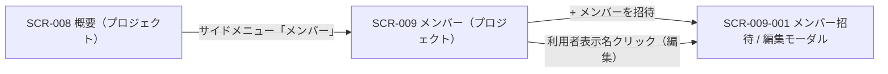
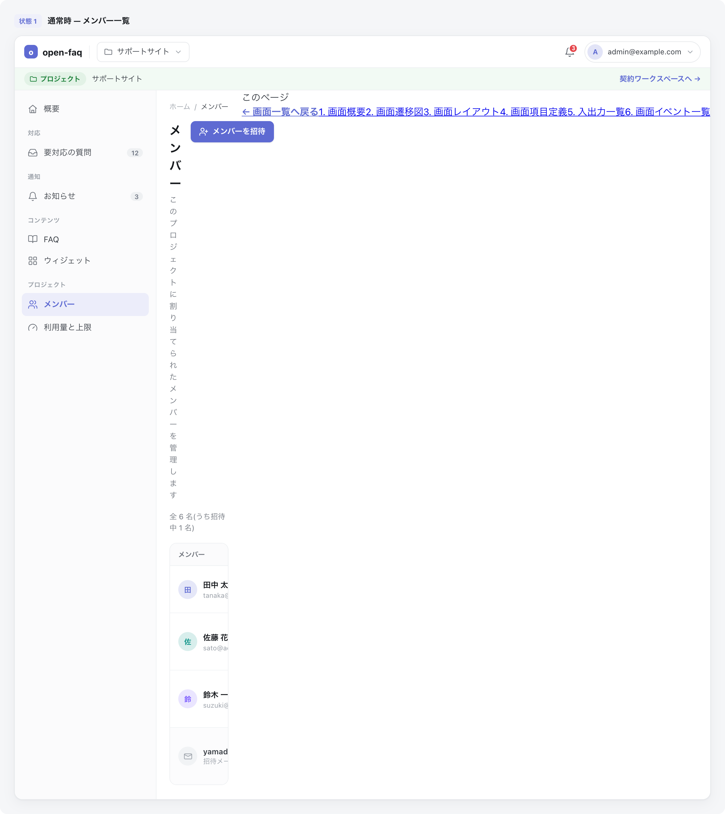

<!-- portal-top -->
[設計ポータル](../README.md) ／ [基本設計](index.md) ／ [画面設計](01_screen-design.md) ／ **SCR-009 メンバー(プロジェクト)**
<!-- /portal-top -->

# SCR-009 メンバー(プロジェクト)

> **このページは、当該プロジェクトに割り当てたメンバーを一覧表示し、招待・ロール変更・割当解除モーダルへの導線を提供する画面 SCR-009 を定義します。** 画面概要 / 画面遷移図 / 画面レイアウト / 画面項目定義 / 入出力一覧 / 画面イベント一覧 の 6 セクションで記述します。

*版数 v1.0 ・ 更新 2026-06-17 ・ 承認済*

## 1. 画面概要

当該プロジェクトに割当のあるメンバーを一覧表示し、招待・ロール変更・割当解除モーダル(SCR-009-001)への導線を提供する画面です。表示範囲は常に当該プロジェクト 1 件で、契約横断のメンバー管理は持ちません。

| 画面 ID | 画面名 | 機能概要 |
|----|----|----|
| `SCR-009` | メンバー(プロジェクト) | 当該プロジェクトのメンバー一覧表示・絞り込みと、招待 / 編集モーダルへの導線を提供する |

| 関連 | 内容 |
|----|----|
| FR / BR | FR-017, FR-018a〜FR-018c, FR-019a, FR-021a〜FR-021c, FR-333 / BR-038, BR-039 |
| 関連画面 | [`SCR-009-001` メンバー招待 / 編集モーダル](SCR-009-001.md) / [`SCR-008` 概要(プロジェクト)](SCR-008.md) |

| ステークホルダ              | 対象 |
|-----------------------------|------|
| オーナー                    | ◯    |
| プロジェクト管理者(`admin`) | ◯    |
| メンバー(`member`)          | —    |

> [!NOTE]
> **補足** オーナー(`M_CONTRACT` 行存在)は `isOwner` 判定により全プロジェクトを全権操作でき、割当(`M_PRJ_USERS`)を持たずに対象にできます。プロジェクト管理者(`M_PRJ_USERS.role='admin'`)の対象範囲は当該プロジェクトのみです。当該プロジェクトに `admin` ロールを持たないプロジェクトユーザー(`member` 含む)の URL 直アクセスは 403 → ダッシュボードへリダイレクトします。

## 2. 画面遷移図

本画面からの画面遷移を、画面 ID・画面名とイベント(操作)で示します。

## 3. 画面レイアウト

## 4. 画面項目定義

本画面の入出力項目(絞り込み・一覧の列・件数表示・空状態を含む)を定義します。項目の正本は本表です。一覧表に「操作」列は設けず、編集遷移は利用者表示名のリンクに集約します(遷移リンクは名称列に付与する全画面共通方針)。一覧のバッジ表記のみ短縮形「管理者」を用い、編集モーダル・FR の正式呼称「プロジェクト管理者」とは表記レベルで分離します。

| 項目 ID | 項目 | 説明 | 種類 | 表示条件 | 表示 |
|----|----|----|----|----|----|
| `IT-01` | 検索 | 表示名・メールアドレスの部分一致でメンバーを絞り込む | テキストボックス | — | — |
| `IT-02` | 招待状態フィルタ | 招待状態でメンバーを絞り込む | ドロップダウン | — | 「すべて」/「招待中のみ」/「アクティベーション済み」 |
| `IT-03` | 件数表示 | 一覧の表示範囲と総件数を表示する | ラベル | — | 「1-50 / 全 N 件」形式 |
| `IT-04` | 利用者表示名 | メンバーの表示名を示し、編集モーダルへの遷移リンクとなる | リンク | オーナー行・自分の行はテキスト表示のみ(リンク化しない) | メンバーの表示名。招待中は名前隣に「招待中」バッジ |
| `IT-05` | メールアドレス | メンバーのメールアドレスを表示する | ラベル | — | メンバーのメールアドレス |
| `IT-06` | このプロジェクトでのロール | 当該プロジェクトでのロールをバッジで表示する | バッジ | — | 「オーナー」(青)/「管理者」(緑)/「メンバー」(灰) |
| `IT-07` | ステータス | アカウントの有効化状態をバッジで表示する(残日数は併記しない) | バッジ | — | 「利用中」/「招待中」 |
| `IT-08` | 招待中行強調 | 招待中(本人未有効化)の行を背景色で強調し視認性を確保する | 行ハイライト | 対象者が招待中(本人未有効化)の行のみ黄色背景 | — |
| `IT-09` | \+ メンバーを招待 | 招待モーダル(SCR-009-001)を招待モードで開く | ボタン | — | 「+ メンバーを招待」 |
| `IT-10` | 空状態 | 割当メンバーが 0 件のときに案内文と招待導線を表示する | 空状態表示 | 割当メンバーが 0 件のとき | 「このプロジェクトにはまだメンバーが割当されていません。」+「+ メンバーを招待」 |
| `IT-11` | 権限不足ガード | 権限を持たないユーザーの直アクセス時に権限不足を表示する | 空状態表示 | 当該プロジェクトのプロジェクト管理者権限を持たないユーザーが URL に直接アクセスした場合 | 「このページを表示する権限がありません。」(403)+「ダッシュボードへ戻る」 |

## 5. 入出力一覧

本画面が読み書きするテーブルと、呼び出す API の一覧です。テーブルの正本は [03_テーブル設計](03_database-design.md)、API の正本は [02_API設計 §5.2.1](02_api-design.md#API-MBR-001) です。

<table>
<thead>
<tr>
<th rowspan="2">入出力名</th>
<th rowspan="2">説明</th>
<th rowspan="2">種別</th>
<th rowspan="2">I/O</th>
<th colspan="4">アクセス種別(CRUD)</th>
<th rowspan="2">備考</th>
</tr>
<tr>
<th>C</th>
<th>R</th>
<th>U</th>
<th>D</th>
</tr>
</thead>
<tbody>
<tr>
<td>プロジェクト割当</td>
<td>当該プロジェクトの割当一覧(ロール)を取得する</td>
<td>テーブル</td>
<td>入力</td>
<td>—</td>
<td>◯</td>
<td>—</td>
<td>—</td>
<td><code>M_PRJ_USERS</code>(<a href="03_database-design.md#TBL-M-003">テーブル設計 3.3</a>)</td>
</tr>
<tr>
<td>プロジェクトユーザー</td>
<td>表示名・メール・有効化状態を取得する</td>
<td>テーブル</td>
<td>入力</td>
<td>—</td>
<td>◯</td>
<td>—</td>
<td>—</td>
<td><code>M_PRJ_USERS</code>(<a href="03_database-design.md#TBL-M-003">テーブル設計 3.1</a>)</td>
</tr>
<tr>
<td>メンバー一覧取得</td>
<td>当該プロジェクトのメンバー一覧を取得する</td>
<td>API</td>
<td>入力</td>
<td>—</td>
<td>—</td>
<td>—</td>
<td>—</td>
<td><code>GET /projects/{id}/members</code>(<a href="02_api-design.md#API-MBR-001">API 設計 5.2.1</a>)</td>
</tr>
</tbody>
</table>

## 6. 画面イベント一覧

本画面で発生するイベントと発生タイミング・概要の一覧です。

<table>
<colgroup>
<col style="width: 20%" />
<col style="width: 20%" />
<col style="width: 20%" />
<col style="width: 20%" />
<col style="width: 20%" />
</colgroup>
<thead>
<tr>
<th>イベント ID</th>
<th>イベント</th>
<th>トリガー</th>
<th>処理</th>
<th>関連項目</th>
</tr>
</thead>
<tbody>
<tr>
<td><code>EV-01</code></td>
<td>一覧初期表示</td>
<td>画面遷移・リロード時</td>
<td><ul>
<li><code>GET /projects/{id}/members</code> で当該プロジェクトのメンバー一覧を取得し表示</li>
<li>0 件時は EmptyState</li>
</ul></td>
<td><a href="#IT-04">IT-04</a>, <a href="#IT-05">IT-05</a>, <a href="#IT-06">IT-06</a>, <a href="#IT-07">IT-07</a>, <a href="#IT-08">IT-08</a>, <a href="#IT-10">IT-10</a></td>
</tr>
<tr>
<td><code>EV-02</code></td>
<td>検索</td>
<td>検索キーワードの入力時</td>
<td>キーワードを付与して一覧を再取得し件数表示も更新</td>
<td><a href="#IT-01">IT-01</a>, <a href="#IT-03">IT-03</a></td>
</tr>
<tr>
<td><code>EV-03</code></td>
<td>絞り込み</td>
<td>招待状態フィルタの変更時</td>
<td>フィルタ条件を付与して一覧を再取得し件数表示も更新</td>
<td><a href="#IT-02">IT-02</a>, <a href="#IT-03">IT-03</a></td>
</tr>
<tr>
<td><code>EV-04</code></td>
<td>招待モーダル起動</td>
<td>「+ メンバーを招待」押下時</td>
<td>SCR-009-001 を招待モードで開く</td>
<td><a href="#IT-09">IT-09</a></td>
</tr>
<tr>
<td><code>EV-05</code></td>
<td>編集モーダル起動</td>
<td>利用者表示名リンク押下時</td>
<td>SCR-009-001 を編集モードで開く(オーナー行・自分の行は非リンク)</td>
<td><a href="#IT-04">IT-04</a></td>
</tr>
<tr>
<td><code>EV-06</code></td>
<td>権限不足リダイレクト</td>
<td>当該 PJ の admin 権限を持たないユーザーの URL 直アクセス時</td>
<td>403 とし、ダッシュボードへリダイレクトする</td>
<td><a href="#IT-11">IT-11</a></td>
</tr>
</tbody>
</table>

---

---

---

<!-- portal-bottom -->
[← 画面設計](01_screen-design.md) ・ [基本設計](index.md) ・ [↑ 設計ポータル](../README.md)
<!-- /portal-bottom -->
