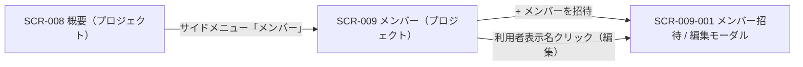

<!-- portal-top -->
[設計ポータル](../README.md) ／ [基本設計](index.md) ／ [画面設計](01_screen-design.md) ／ **SCR-009 メンバー(プロジェクト)**
<!-- /portal-top -->

# SCR-009 メンバー(プロジェクト)

> **このページは、当該プロジェクトに割り当てたメンバーを一覧表示し、招待・ロール変更・割当解除モーダルへの導線を提供する画面 SCR-009 を定義します。** 画面概要 / 画面遷移図 / 画面レイアウト / 画面項目定義 / 入出力一覧 / 画面イベント一覧 の 6 セクションで記述します。

*版数 v1.0 ・ 更新 2026-06-17 ・ 承認済*

## 1. 画面概要

当該プロジェクトに割当のあるメンバーを一覧表示し、招待・ロール変更・割当解除モーダル(SCR-009-001)への導線を提供する画面です。表示範囲は常に当該プロジェクト 1 件で、契約横断のメンバー管理は持ちません。

| 画面 ID | 画面名 | 機能概要 |
|----|----|----|
| `SCR-009` | メンバー(プロジェクト) | 当該プロジェクトのメンバー一覧表示・絞り込みと、招待 / 編集モーダルへの導線を提供する |

| 関連 | 内容 |
|----|----|
| FR / BR | FR-017, FR-018a〜FR-018c, FR-019a, FR-021a〜FR-021c, FR-333 / BR-038, BR-039 |
| 関連画面 | [`SCR-009-001` メンバー招待 / 編集モーダル](SCR-009-001.md) / [`SCR-008` 概要(プロジェクト)](SCR-008.md) |

| ステークホルダ              | 対象 |
|-----------------------------|------|
| オーナー                    | ◯    |
| プロジェクト管理者(`admin`) | ◯    |
| メンバー(`member`)          | —    |

> [!NOTE]
> **補足** オーナー(`M_CONTRACT` 行存在)は `isOwner` 判定により全プロジェクトを全権操作でき、割当(`M_PRJ_USERS`)を持たずに対象にできます。プロジェクト管理者(`M_PRJ_USERS.role='admin'`)の対象範囲は当該プロジェクトのみです。当該プロジェクトに `admin` ロールを持たないプロジェクトユーザー(`member` 含む)の URL 直アクセスは 403 → ダッシュボードへリダイレクトします。

## 2. 画面遷移図

本画面からの画面遷移を、画面 ID・画面名とイベント(操作)で示します。

## 3. 画面レイアウト

  

  <section>
    

      状態 1
      通常時 — メンバー一覧
    

    

      

        

          oopen-faq
          
          <button style="display:inline-flex;align-items:center;gap:7px;padding:6px 11px;border:1px solid #e6e8eb;border-radius:8px;background:#fff;font-size:13px;color:#3a3f46;cursor:pointer;font-family:inherit"><svg width="15" height="15" viewBox="0 0 24 24" fill="none" stroke="#71767e" stroke-width="1.8" stroke-linecap="round" stroke-linejoin="round"><path d="M4 5h5l2 2.5h9A1.5 1.5 0 0 1 21.5 9v9A1.5 1.5 0 0 1 20 19.5H4A1.5 1.5 0 0 1 2.5 18V6.5A1.5 1.5 0 0 1 4 5z"></path></svg>サポートサイト<svg width="14" height="14" viewBox="0 0 24 24" fill="none" stroke="#9aa0a8" stroke-width="1.9" stroke-linecap="round" stroke-linejoin="round"><path d="m6 9 6 6 6-6"></path></svg></button>
        

        

          <button style="position:relative;width:34px;height:34px;border-radius:8px;border:none;background:transparent;display:inline-flex;align-items:center;justify-content:center;color:#5b616a;cursor:pointer"><svg width="18" height="18" viewBox="0 0 24 24" fill="none" stroke="currentColor" stroke-width="1.8" stroke-linecap="round" stroke-linejoin="round"><path d="M6 8a6 6 0 0 1 12 0c0 7 3 9 3 9H3s3-2 3-9z"></path><path d="M10.3 21a1.94 1.94 0 0 0 3.4 0"></path></svg>3</button>
          <button style="display:inline-flex;align-items:center;gap:8px;padding:4px 10px 4px 4px;border:1px solid #e6e8eb;border-radius:999px;background:#fff;cursor:pointer;font-family:inherit">Aadmin@example.com<svg width="14" height="14" viewBox="0 0 24 24" fill="none" stroke="#9aa0a8" stroke-width="1.9" stroke-linecap="round" stroke-linejoin="round"><path d="m6 9 6 6 6-6"></path></svg></button>
        

      

      
      

        <svg width="13" height="13" viewBox="0 0 24 24" fill="none" stroke="currentColor" stroke-width="1.9" stroke-linecap="round" stroke-linejoin="round"><path d="M4 5h5l2 2.5h9A1.5 1.5 0 0 1 21.5 9v9A1.5 1.5 0 0 1 20 19.5H4A1.5 1.5 0 0 1 2.5 18V6.5A1.5 1.5 0 0 1 4 5z"></path></svg>プロジェクト
        サポートサイト
        契約ワークスペースへ →
      

      
      

        <aside style="width:240px;flex:none;background:#fbfbfc;border-right:1px solid #eef0f2;padding:12px 12px 16px;display:flex;flex-direction:column">
          <a style="display:flex;align-items:center;gap:10px;padding:9px 10px;border-radius:8px;color:#3a3f46;font-size:13.5px;text-decoration:none"><svg width="17" height="17" viewBox="0 0 24 24" fill="none" stroke="#71767e" stroke-width="1.7" stroke-linecap="round" stroke-linejoin="round"><path d="M3 10.5 12 3l9 7.5"></path><path d="M5 9.5V20a1 1 0 0 0 1 1h12a1 1 0 0 0 1-1V9.5"></path><path d="M9.5 21v-6h5v6"></path></svg>概要</a>
          
対応

          <a style="display:flex;align-items:center;gap:10px;padding:9px 10px;border-radius:8px;color:#3a3f46;font-size:13.5px;text-decoration:none"><svg width="17" height="17" viewBox="0 0 24 24" fill="none" stroke="#71767e" stroke-width="1.7" stroke-linecap="round" stroke-linejoin="round"><path d="M22 12h-6l-2 3h-4l-2-3H2"></path><path d="M5.5 5.1 2 12v6a2 2 0 0 0 2 2h16a2 2 0 0 0 2-2v-6l-3.5-6.9A2 2 0 0 0 16.8 4H7.2a2 2 0 0 0-1.7 1.1z"></path></svg>要対応の質問12</a>
          
通知

          <a style="display:flex;align-items:center;gap:10px;padding:9px 10px;border-radius:8px;color:#3a3f46;font-size:13.5px;text-decoration:none"><svg width="17" height="17" viewBox="0 0 24 24" fill="none" stroke="#71767e" stroke-width="1.7" stroke-linecap="round" stroke-linejoin="round"><path d="M6 8a6 6 0 0 1 12 0c0 7 3 9 3 9H3s3-2 3-9z"></path><path d="M10.3 21a1.94 1.94 0 0 0 3.4 0"></path></svg>お知らせ3</a>
          
コンテンツ

          <a style="display:flex;align-items:center;gap:10px;padding:9px 10px;border-radius:8px;color:#3a3f46;font-size:13.5px;text-decoration:none"><svg width="17" height="17" viewBox="0 0 24 24" fill="none" stroke="#71767e" stroke-width="1.7" stroke-linecap="round" stroke-linejoin="round"><path d="M12 7v13"></path><path d="M3 18a1 1 0 0 1-1-1V5a1 1 0 0 1 1-1h5a4 4 0 0 1 4 4 4 4 0 0 1 4-4h5a1 1 0 0 1 1 1v12a1 1 0 0 1-1 1h-6a3 3 0 0 0-3 3 3 3 0 0 0-3-3z"></path></svg>FAQ</a>
          <a style="display:flex;align-items:center;gap:10px;padding:9px 10px;border-radius:8px;color:#3a3f46;font-size:13.5px;text-decoration:none"><svg width="17" height="17" viewBox="0 0 24 24" fill="none" stroke="#71767e" stroke-width="1.7" stroke-linecap="round" stroke-linejoin="round"><rect x="3" y="3" width="7" height="7" rx="1.5"></rect><rect x="14" y="3" width="7" height="7" rx="1.5"></rect><rect x="14" y="14" width="7" height="7" rx="1.5"></rect><rect x="3" y="14" width="7" height="7" rx="1.5"></rect></svg>ウィジェット</a>
          
プロジェクト

          <a style="display:flex;align-items:center;gap:10px;padding:9px 10px;border-radius:8px;background:color-mix(in srgb,var(--accent,#5e6ad2) 12%,#fff);color:var(--accent,#5e6ad2);font-weight:600;font-size:13.5px;text-decoration:none"><svg width="17" height="17" viewBox="0 0 24 24" fill="none" stroke="currentColor" stroke-width="1.8" stroke-linecap="round" stroke-linejoin="round"><path d="M16 21v-2a4 4 0 0 0-4-4H6a4 4 0 0 0-4 4v2"></path><circle cx="9" cy="7" r="4"></circle><path d="M22 21v-2a4 4 0 0 0-3-3.87"></path><path d="M16 3.1a4 4 0 0 1 0 7.75"></path></svg>メンバー</a>
          <a style="display:flex;align-items:center;gap:10px;padding:9px 10px;border-radius:8px;color:#3a3f46;font-size:13.5px;text-decoration:none"><svg width="17" height="17" viewBox="0 0 24 24" fill="none" stroke="#71767e" stroke-width="1.7" stroke-linecap="round" stroke-linejoin="round"><path d="m12 14 4-4"></path><path d="M3.34 19a10 10 0 1 1 17.32 0"></path></svg>利用量と上限</a>
        </aside>
        <main style="flex:1;min-width:0;background:#fff;padding:18px 22px 24px;display:flex;flex-direction:column;gap:16px">
          <nav style="display:flex;align-items:center;gap:7px;font-size:12px;color:#9aa0a8">ホーム/メンバー</nav>
          

            

              <h1 style="margin:0 0 4px;font-size:20px;font-weight:700;color:#16191d;letter-spacing:-.01em">メンバー</h1>
              
このプロジェクトに割り当てられたメンバーを管理します

            

            <button style="display:inline-flex;align-items:center;gap:7px;padding:8px 14px;border:none;border-radius:8px;background:var(--accent,#5e6ad2);color:#fff;font-size:13px;font-weight:600;cursor:pointer;white-space:nowrap;box-shadow:0 1px 2px rgba(16,24,40,.12);font-family:inherit"><svg width="16" height="16" viewBox="0 0 24 24" fill="none" stroke="currentColor" stroke-width="2" stroke-linecap="round" stroke-linejoin="round"><path d="M16 21v-2a4 4 0 0 0-4-4H6a4 4 0 0 0-4 4v2"></path><circle cx="9" cy="7" r="4"></circle><path d="M19 8v6"></path><path d="M22 11h-6"></path></svg>メンバーを招待</button>
          

          
全 6 名(うち招待中 1 名)

          

            <table style="width:100%;border-collapse:collapse;font-size:13px">
              <thead>
                <tr style="background:#fbfbfc">
                  <th style="text-align:left;padding:10px 14px;border-bottom:1px solid #eef0f2;color:#71767e;font-weight:600;font-size:11.5px">メンバー</th>
                  <th style="text-align:left;padding:10px 14px;border-bottom:1px solid #eef0f2;color:#71767e;font-weight:600;font-size:11.5px;white-space:nowrap">ロール</th>
                  <th style="text-align:left;padding:10px 14px;border-bottom:1px solid #eef0f2;color:#71767e;font-weight:600;font-size:11.5px;white-space:nowrap">状態</th>
                  <th style="text-align:right;padding:10px 14px;border-bottom:1px solid #eef0f2;color:#71767e;font-weight:600;font-size:11.5px;white-space:nowrap">参加日</th>
                  <th style="padding:10px 14px;border-bottom:1px solid #eef0f2;width:40px"></th>
                </tr>
              </thead>
              <tbody>
                <tr>
                  <td style="padding:12px 14px;border-bottom:1px solid #f1f3f5">
田

田中 太郎

tanaka@acme.com

</td>
                  <td style="padding:12px 14px;border-bottom:1px solid #f1f3f5">管理者</td>
                  <td style="padding:12px 14px;border-bottom:1px solid #f1f3f5">有効</td>
                  <td style="padding:12px 14px;border-bottom:1px solid #f1f3f5;text-align:right;color:#71767e;white-space:nowrap">2025-11-02</td>
                  <td style="padding:12px 14px;border-bottom:1px solid #f1f3f5;text-align:center;color:#c4c8cd;cursor:pointer">⋯</td>
                </tr>
                <tr>
                  <td style="padding:12px 14px;border-bottom:1px solid #f1f3f5">
佐

佐藤 花子

sato@acme.com

</td>
                  <td style="padding:12px 14px;border-bottom:1px solid #f1f3f5">メンバー</td>
                  <td style="padding:12px 14px;border-bottom:1px solid #f1f3f5">有効</td>
                  <td style="padding:12px 14px;border-bottom:1px solid #f1f3f5;text-align:right;color:#71767e;white-space:nowrap">2025-12-15</td>
                  <td style="padding:12px 14px;border-bottom:1px solid #f1f3f5;text-align:center;color:#c4c8cd;cursor:pointer">⋯</td>
                </tr>
                <tr>
                  <td style="padding:12px 14px;border-bottom:1px solid #f1f3f5">
鈴

鈴木 一郎

suzuki@acme.com

</td>
                  <td style="padding:12px 14px;border-bottom:1px solid #f1f3f5">メンバー</td>
                  <td style="padding:12px 14px;border-bottom:1px solid #f1f3f5">有効</td>
                  <td style="padding:12px 14px;border-bottom:1px solid #f1f3f5;text-align:right;color:#71767e;white-space:nowrap">2026-01-08</td>
                  <td style="padding:12px 14px;border-bottom:1px solid #f1f3f5;text-align:center;color:#c4c8cd;cursor:pointer">⋯</td>
                </tr>
                <tr style="background:#fcfcfd">
                  <td style="padding:12px 14px">
<svg width="15" height="15" viewBox="0 0 24 24" fill="none" stroke="currentColor" stroke-width="1.8" stroke-linecap="round" stroke-linejoin="round"><path d="M4 4h16v16H4z" opacity="0"></path><path d="m22 7-10 5L2 7"></path><rect x="2" y="5" width="20" height="14" rx="2"></rect></svg>

yamada@acme.com

招待メール送信済み

</td>
                  <td style="padding:12px 14px">メンバー</td>
                  <td style="padding:12px 14px"><svg width="11" height="11" viewBox="0 0 24 24" fill="none" stroke="currentColor" stroke-width="2.2" stroke-linecap="round" stroke-linejoin="round"><circle cx="12" cy="12" r="9"></circle><path d="M12 7v5l3 2"></path></svg>招待中</td>
                  <td style="padding:12px 14px;text-align:right;color:#9aa0a8;white-space:nowrap">—</td>
                  <td style="padding:12px 14px;text-align:center;color:#c4c8cd;cursor:pointer">⋯</td>
                </tr>
              </tbody>
            </table>
          

        </main><aside class="rightbar">
このページ
<nav class="toc"><a class="back" href="01_screen-design.md" style="font-weight:600;color:var(--accent)">← 画面一覧へ戻る</a><a href="#1-画面概要">1. 画面概要</a><a href="#2-画面遷移図">2. 画面遷移図</a><a href="#3-画面レイアウト">3. 画面レイアウト</a><a href="#4-画面項目定義">4. 画面項目定義</a><a href="#5-入出力一覧">5. 入出力一覧</a><a href="#6-画面イベント一覧">6. 画面イベント一覧</a></nav></aside>
      

    

  </section>

## 4. 画面項目定義

本画面の入出力項目(絞り込み・一覧の列・件数表示・空状態を含む)を定義します。項目の正本は本表です。一覧表に「操作」列は設けず、編集遷移は利用者表示名のリンクに集約します(遷移リンクは名称列に付与する全画面共通方針)。一覧のバッジ表記のみ短縮形「管理者」を用い、編集モーダル・FR の正式呼称「プロジェクト管理者」とは表記レベルで分離します。

| 項目 ID | 項目 | 説明 | 種類 | 表示条件 | 表示 |
|----|----|----|----|----|----|
| `IT-01` | 検索 | 表示名・メールアドレスの部分一致でメンバーを絞り込む | テキストボックス | — | — |
| `IT-02` | 招待状態フィルタ | 招待状態でメンバーを絞り込む | ドロップダウン | — | 「すべて」/「招待中のみ」/「アクティベーション済み」 |
| `IT-03` | 件数表示 | 一覧の表示範囲と総件数を表示する | ラベル | — | 「1-50 / 全 N 件」形式 |
| `IT-04` | 利用者表示名 | メンバーの表示名を示し、編集モーダルへの遷移リンクとなる | リンク | オーナー行・自分の行はテキスト表示のみ(リンク化しない) | メンバーの表示名。招待中は名前隣に「招待中」バッジ |
| `IT-05` | メールアドレス | メンバーのメールアドレスを表示する | ラベル | — | メンバーのメールアドレス |
| `IT-06` | このプロジェクトでのロール | 当該プロジェクトでのロールをバッジで表示する | バッジ | — | 「オーナー」(青)/「管理者」(緑)/「メンバー」(灰) |
| `IT-07` | ステータス | アカウントの有効化状態をバッジで表示する(残日数は併記しない) | バッジ | — | 「利用中」/「招待中」 |
| `IT-08` | 招待中行強調 | 招待中(本人未有効化)の行を背景色で強調し視認性を確保する | 行ハイライト | 対象者が招待中(本人未有効化)の行のみ黄色背景 | — |
| `IT-09` | \+ メンバーを招待 | 招待モーダル(SCR-009-001)を招待モードで開く | ボタン | — | 「+ メンバーを招待」 |
| `IT-10` | 空状態 | 割当メンバーが 0 件のときに案内文と招待導線を表示する | 空状態表示 | 割当メンバーが 0 件のとき | 「このプロジェクトにはまだメンバーが割当されていません。」+「+ メンバーを招待」 |
| `IT-11` | 権限不足ガード | 権限を持たないユーザーの直アクセス時に権限不足を表示する | 空状態表示 | 当該プロジェクトのプロジェクト管理者権限を持たないユーザーが URL に直接アクセスした場合 | 「このページを表示する権限がありません。」(403)+「ダッシュボードへ戻る」 |

## 5. 入出力一覧

本画面が読み書きするテーブルと、呼び出す API の一覧です。テーブルの正本は [03_テーブル設計](03_database-design.md)、API の正本は [02_API設計 §5.2.1](02_api-design.md#API-MBR-001) です。

<table>
<thead>
<tr>
<th rowspan="2">入出力名</th>
<th rowspan="2">説明</th>
<th rowspan="2">種別</th>
<th rowspan="2">I/O</th>
<th colspan="4">アクセス種別(CRUD)</th>
<th rowspan="2">備考</th>
</tr>
<tr>
<th>C</th>
<th>R</th>
<th>U</th>
<th>D</th>
</tr>
</thead>
<tbody>
<tr>
<td>プロジェクト割当</td>
<td>当該プロジェクトの割当一覧(ロール)を取得する</td>
<td>テーブル</td>
<td>入力</td>
<td>—</td>
<td>◯</td>
<td>—</td>
<td>—</td>
<td><code>M_PRJ_USERS</code>(<a href="03_database-design.md#TBL-M-003">テーブル設計 3.3</a>)</td>
</tr>
<tr>
<td>プロジェクトユーザー</td>
<td>表示名・メール・有効化状態を取得する</td>
<td>テーブル</td>
<td>入力</td>
<td>—</td>
<td>◯</td>
<td>—</td>
<td>—</td>
<td><code>M_PRJ_USERS</code>(<a href="03_database-design.md#TBL-M-003">テーブル設計 3.1</a>)</td>
</tr>
<tr>
<td>メンバー一覧取得</td>
<td>当該プロジェクトのメンバー一覧を取得する</td>
<td>API</td>
<td>入力</td>
<td>—</td>
<td>—</td>
<td>—</td>
<td>—</td>
<td><code>GET /projects/{id}/members</code>(<a href="02_api-design.md#API-MBR-001">API 設計 5.2.1</a>)</td>
</tr>
</tbody>
</table>

## 6. 画面イベント一覧

本画面で発生するイベントと発生タイミング・概要の一覧です。

<table>
<colgroup>
<col style="width: 20%" />
<col style="width: 20%" />
<col style="width: 20%" />
<col style="width: 20%" />
<col style="width: 20%" />
</colgroup>
<thead>
<tr>
<th>イベント ID</th>
<th>イベント</th>
<th>トリガー</th>
<th>処理</th>
<th>関連項目</th>
</tr>
</thead>
<tbody>
<tr>
<td><code>EV-01</code></td>
<td>一覧初期表示</td>
<td>画面遷移・リロード時</td>
<td><ul>
<li><code>GET /projects/{id}/members</code> で当該プロジェクトのメンバー一覧を取得し表示</li>
<li>0 件時は EmptyState</li>
</ul></td>
<td><a href="#IT-04">IT-04</a>, <a href="#IT-05">IT-05</a>, <a href="#IT-06">IT-06</a>, <a href="#IT-07">IT-07</a>, <a href="#IT-08">IT-08</a>, <a href="#IT-10">IT-10</a></td>
</tr>
<tr>
<td><code>EV-02</code></td>
<td>検索</td>
<td>検索キーワードの入力時</td>
<td>キーワードを付与して一覧を再取得し件数表示も更新</td>
<td><a href="#IT-01">IT-01</a>, <a href="#IT-03">IT-03</a></td>
</tr>
<tr>
<td><code>EV-03</code></td>
<td>絞り込み</td>
<td>招待状態フィルタの変更時</td>
<td>フィルタ条件を付与して一覧を再取得し件数表示も更新</td>
<td><a href="#IT-02">IT-02</a>, <a href="#IT-03">IT-03</a></td>
</tr>
<tr>
<td><code>EV-04</code></td>
<td>招待モーダル起動</td>
<td>「+ メンバーを招待」押下時</td>
<td>SCR-009-001 を招待モードで開く</td>
<td><a href="#IT-09">IT-09</a></td>
</tr>
<tr>
<td><code>EV-05</code></td>
<td>編集モーダル起動</td>
<td>利用者表示名リンク押下時</td>
<td>SCR-009-001 を編集モードで開く(オーナー行・自分の行は非リンク)</td>
<td><a href="#IT-04">IT-04</a></td>
</tr>
<tr>
<td><code>EV-06</code></td>
<td>権限不足リダイレクト</td>
<td>当該 PJ の admin 権限を持たないユーザーの URL 直アクセス時</td>
<td>403 とし、ダッシュボードへリダイレクトする</td>
<td><a href="#IT-11">IT-11</a></td>
</tr>
</tbody>
</table>

---

---

<!-- portal-bottom -->
[← 画面設計](01_screen-design.md) ・ [基本設計](index.md) ・ [↑ 設計ポータル](../README.md)
<!-- /portal-bottom -->
