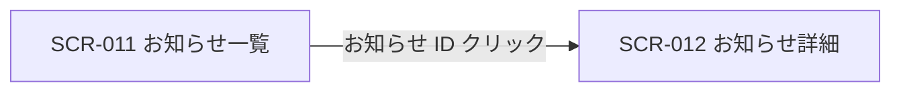
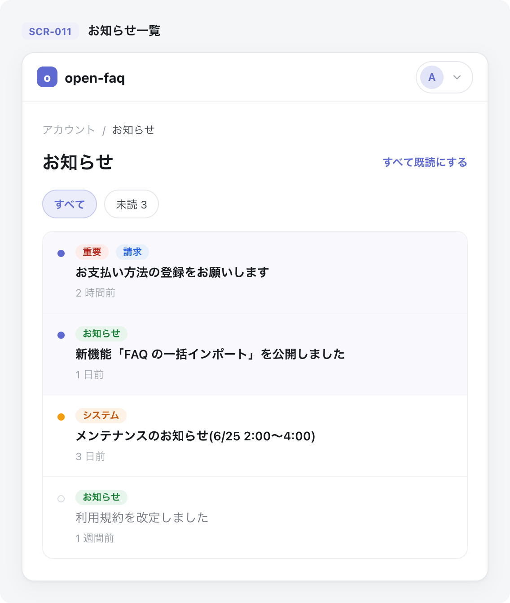

<!-- portal-top -->
[設計ポータル](../README.md) ／ [基本設計](index.md) ／ [画面設計](01_screen-design.md) ／ **SCR-011 お知らせ一覧**
<!-- /portal-top -->

# SCR-011 お知らせ一覧

> **このページは、お知らせを一覧表示し、絞り込み・既読化と詳細画面への導線を提供する画面 SCR-011 を定義します。** 画面概要 / 画面遷移図 / 画面レイアウト / 画面項目定義 / 入出力一覧 / 画面イベント一覧 の 6 セクションで記述します。

*版数 v1.0 ・ 更新 2026-06-17 ・ 承認済*

## 1. 画面概要

配信されたお知らせを一覧で確認し、絞り込み・既読化と詳細画面への導線を提供する画面です。

| 画面 ID | 画面名 | 機能概要 |
|----|----|----|
| `SCR-011` | お知らせ一覧 | お知らせの一覧表示・絞り込み・既読化と詳細画面への導線を提供する |

| 関連     | 内容                                   |
|----------|----------------------------------------|
| FR / BR  | FR-180〜FR-183, FR-323 / BR-134        |
| 関連画面 | [`SCR-012` お知らせ詳細](SCR-012.md) |

| ステークホルダ | 対象 |
|----------------|------|
| オーナー       | ◯    |
| メンバー       | ◯    |

> [!NOTE]
> **補足** FR-180 はアカウント利用者全体に閲覧資格を定義し、本画面ではオーナーと当該スコープのメンバーがお知らせを閲覧できます。オーナー(`M_CONTRACT` 行存在)は `isOwner` で全権のため割当を持たずに受信できます(根拠は 04_権限設計)。

## 2. 画面遷移図

本画面からの画面遷移を、画面 ID・画面名とイベント(操作)で示します。

## 3. 画面レイアウト

## 4. 画面項目定義

本画面の入出力項目(クイックフィルタ・詳細フィルタ・一覧の列・件数表示・空状態を含む)を定義します。項目の正本は本表です。一覧表に「操作」列は設けず、詳細遷移はお知らせ ID 列のリンクに集約します(遷移リンクは ID 列に付与する全画面共通方針)。

| 項目 ID | 項目 | 説明 | 種類 | 表示条件 | 表示 |
|----|----|----|----|----|----|
| `IT-01` | クイックフィルタチップ | 未読・重要・種別などの定型条件でワンタップ絞り込みする | タブ | — | 「未読のみ」(デフォルト選択)/「重要のみ」/「課金」/「お知らせ」/「システム」/「すべて」(各件数併記) |
| `IT-02` | 適用済フィルタチップ | 現在適用中の絞り込み条件を表示し一括解除する | バッジ | — | 適用条件 +「すべてクリア」 |
| `IT-03` | 詳細フィルタ | 期間・キーワードで一覧を絞り込む(折り畳まず常時表示) | カード | 折り畳まず常時表示 | 「期間」(開始 〜 終了)/「タイトル検索」 |
| `IT-04` | 件数表示 | 一覧の表示範囲・総件数・未読件数を表示する | ラベル | — | 「1-50 / 全 24 件(未読 5 件)」形式 |
| `IT-05` | 未読行強調 | 未読行を背景色・ドット・太字で強調する | 行ハイライト | 未読行のみ(薄い水色背景 + 行頭ドット、未読タイトルは bold) | 行頭に未読ドット(●) |
| `IT-06` | 種別バッジ | お知らせの種別をバッジで表示する | バッジ | — | 「お知らせ」/「請求」/「システム」 |
| `IT-07` | 重要度 | お知らせの重要度をバッジで表示する | バッジ | — | 「重要(critical)」/「重要(high)」/「通常(normal)」/「淡色(low)」 |
| `IT-08` | お知らせ ID | お知らせ ID を示し、詳細画面への遷移リンクとなる | リンク | — | お知らせ ID(`ann_…` 形式) |
| `IT-09` | タイトル | お知らせのタイトルを表示する(クリック不可) | ラベル | — | お知らせのタイトル。未読は bold |
| `IT-10` | 配信日時 | お知らせの配信日時を表示する | ラベル | — | 相対表記(例「3 日前」)+ ツールチップに絶対日時 |
| `IT-11` | 選択チェックボックス | 一括操作の対象行を選択する(最大 100 件) | チェックボックス | — | — |
| `IT-12` | 一括操作バー | 選択件数と一括操作ボタンを画面下部に固定表示する | バナー | 1 件以上選択時に表示 | 「N 件選択中」+「既読化する」+「選択を解除」 |
| `IT-13` | 一括既読化 | 選択した行をまとめて既読化する | ボタン | 1 件以上選択時に表示 | 「既読化する」 |
| `IT-14` | 表示中の未読をすべて既読化 | 現在のフィルタで表示中の未読のみを既読化する | ボタン | — | 「表示中の未読を既読化」 |
| `IT-15` | すべての未読を既読化 | フィルタを無視して全未読を既読化する(確認ダイアログあり) | リンク | — | 「すべての未読を既読化」 |
| `IT-16` | ページング | カーソル方式で次ページを読み込む | ボタン | — | — |
| `IT-17` | 空状態 | 対象お知らせが 0 件のとき案内文を表示する | 空状態表示 | 対象お知らせが 0 件のとき | 「お知らせはまだありません」/「未読のお知らせはありません」 |

## 5. 入出力一覧

本画面が読み書きするテーブルと、呼び出す API の一覧です。テーブルの正本は [03_テーブル設計](03_database-design.md)、API の正本は [02_API設計 §5.8](02_api-design.md) です。

<table>
<thead>
<tr>
<th rowspan="2">入出力名</th>
<th rowspan="2">説明</th>
<th rowspan="2">種別</th>
<th rowspan="2">I/O</th>
<th colspan="4">アクセス種別(CRUD)</th>
<th rowspan="2">備考</th>
</tr>
<tr>
<th>C</th>
<th>R</th>
<th>U</th>
<th>D</th>
</tr>
</thead>
<tbody>
<tr>
<td>お知らせ</td>
<td>お知らせ本体を取得する</td>
<td>テーブル</td>
<td>入力</td>
<td>—</td>
<td>◯</td>
<td>—</td>
<td>—</td>
<td><code>M_SERVICE_ANNOUNCE</code>(<a href="03_database-design.md#TBL-M-010">テーブル設計 3.25</a>)</td>
</tr>
<tr>
<td>お知らせ受信状態</td>
<td>未読 / 既読状態を取得・更新する(<code>read_at</code>)</td>
<td>テーブル</td>
<td>入力 / 出力</td>
<td>—</td>
<td>◯</td>
<td>◯</td>
<td>—</td>
<td><code>T_ANNOUNCE_RCPT</code>(<a href="03_database-design.md#TBL-T-009">テーブル設計 3.27</a>)</td>
</tr>
<tr>
<td>お知らせ一覧取得</td>
<td>お知らせ一覧をカーソル方式で取得する</td>
<td>API</td>
<td>入力</td>
<td>—</td>
<td>—</td>
<td>—</td>
<td>—</td>
<td><code>GET /me/announcements</code>(<code>cursor</code>)(<a href="02_api-design.md#API-ANN-001">API 設計 5.8.1</a>)</td>
</tr>
<tr>
<td>お知らせ個別既読化</td>
<td>個別のお知らせを既読化する</td>
<td>API</td>
<td>出力</td>
<td>—</td>
<td>—</td>
<td>—</td>
<td>—</td>
<td><code>POST /me/announcements/{id}/read</code>(<a href="02_api-design.md#API-ANN-002">API 設計 5.8.2</a>)</td>
</tr>
<tr>
<td>お知らせ一括既読化</td>
<td>選択した複数のお知らせをまとめて既読化する</td>
<td>API</td>
<td>出力</td>
<td>—</td>
<td>—</td>
<td>—</td>
<td>—</td>
<td><code>POST /me/announcements/read</code>(<a href="02_api-design.md">API 設計 5.8.2a</a>)</td>
</tr>
<tr>
<td>未読件数取得</td>
<td>未読件数サマリを取得する</td>
<td>API</td>
<td>入力</td>
<td>—</td>
<td>—</td>
<td>—</td>
<td>—</td>
<td><code>GET /me/announcements/unread-summary</code>(<a href="02_api-design.md#API-ANN-004">API 設計 5.8.3</a>)</td>
</tr>
</tbody>
</table>

## 6. 画面イベント一覧

本画面のイベント(初期表示・各操作)ごとに、対象の項目 ID と処理内容を定義します。

<table>
<colgroup>
<col style="width: 12%" />
<col style="width: 12%" />
<col style="width: 30%" />
<col style="width: 46%" />
</colgroup>
<thead>
<tr>
<th>イベント ID</th>
<th>項目 ID</th>
<th>イベント</th>
<th>処理</th>
</tr>
</thead>
<tbody>
<tr>
<td><code>EV-01</code></td>
<td>—</td>
<td>初期表示</td>
<td><ul>
<li><a href="API-inbox.md#API-ANN-001">お知らせ一覧</a> API で一覧を取得し表示(「未読のみ」を既定で適用)</li>
<li>0 件時: EmptyState</li>
</ul></td>
</tr>
<tr>
<td><code>EV-02</code></td>
<td><a href="#IT-01">IT-01</a></td>
<td>クイックフィルタを変更</td>
<td>条件を付与して <a href="API-inbox.md#API-ANN-001">お知らせ一覧</a> API を再取得し一覧を更新</td>
</tr>
<tr>
<td><code>EV-03</code></td>
<td><a href="#IT-03">IT-03</a></td>
<td>詳細フィルタを変更</td>
<td>条件を付与して <a href="API-inbox.md#API-ANN-001">お知らせ一覧</a> API を再取得し一覧を更新</td>
</tr>
<tr>
<td><code>EV-04</code></td>
<td><a href="#IT-08">IT-08</a></td>
<td>お知らせ ID リンクを押下</td>
<td>詳細画面(SCR-012)へ遷移し、同時に該当行を既読化(<a href="API-inbox.md#API-ANN-002">お知らせ個別既読</a> API)</td>
</tr>
<tr>
<td><code>EV-05</code></td>
<td><a href="#IT-13">IT-13</a></td>
<td>「既読化する」を押下</td>
<td>選択行を <a href="API-inbox.md#API-ANN-003">お知らせ一括既読</a> API で既読化</td>
</tr>
<tr>
<td><code>EV-06</code></td>
<td><a href="#IT-14">IT-14</a></td>
<td>「表示中の未読を既読化」を押下</td>
<td>現在のフィルタで表示中の未読のみを既読化</td>
</tr>
<tr>
<td><code>EV-07</code></td>
<td><a href="#IT-15">IT-15</a></td>
<td>「すべての未読を既読化」を押下</td>
<td>確認ダイアログ後、フィルタ無視で全未読を既読化</td>
</tr>
</tbody>
</table>

---

<!-- portal-bottom -->
[← 画面設計](01_screen-design.md) ・ [基本設計](index.md) ・ [↑ 設計ポータル](../README.md)
<!-- /portal-bottom -->
