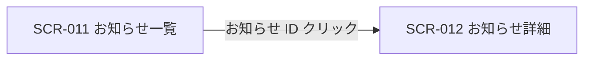

<!-- portal-top -->
[設計ポータル](../README.md) ／ [基本設計](index.md) ／ [画面設計](01_screen-design.md) ／ **SCR-011 お知らせ一覧**
<!-- /portal-top -->

# SCR-011 お知らせ一覧

> **このページは、お知らせを一覧表示し、絞り込み・既読化と詳細画面への導線を提供する画面 SCR-011 を定義します。** 画面概要 / 画面遷移図 / 画面レイアウト / 画面項目定義 / 入出力一覧 / 画面イベント一覧 の 6 セクションで記述します。

*版数 v1.0 ・ 更新 2026-06-17 ・ 承認済*

## <span id="1-画面概要"></span>1. 画面概要

配信されたお知らせを一覧で確認し、絞り込み・既読化と詳細画面への導線を提供する画面です。

| 画面 ID | 画面名 | 機能概要 |
|----|----|----|
| <span id="SCR-011"></span>`SCR-011` | お知らせ一覧 | お知らせの一覧表示・絞り込み・既読化と詳細画面への導線を提供する |

| 関連     | 内容                                   |
|----------|----------------------------------------|
| FR / BR  | FR-180〜FR-183, FR-323 / BR-134        |
| 関連画面 | [`SCR-012` お知らせ詳細](SCR-012.md) |

| ステークホルダ              | 対象 |
|-----------------------------|------|
| オーナー                    | ◯    |
| プロジェクト管理者(`admin`) | ◯    |
| メンバー(`member`)          | —    |

> [!NOTE]
> **補足** FR-180 はアカウント利用者全体に閲覧資格を定義しますが、本画面ではそのうちお知らせ閲覧を `admin` 以上に限定します。オーナー(`M_CONTRACT` 行存在)は `isOwner` で全権のため割当を持たずに受信できます(根拠は 04_権限設計)。`member` ロールのみのプロジェクトユーザーは対象外です(ステークホルダ表の `member`=— と整合)。

## <span id="2-画面遷移図"></span>2. 画面遷移図

本画面からの画面遷移を、画面 ID・画面名とイベント(操作)で示します。



## <span id="3-画面レイアウト"></span>3. 画面レイアウト


<details>
<summary>画面モック HTML（ソース）</summary>

```html
<div style="background:#f5f6f8;padding:24px;border-radius:12px;font-family:'Noto Sans JP',-apple-system,BlinkMacSystemFont,'Hiragino Kaku Gothic ProN',Meiryo,sans-serif;color:#3a3f46;--accent:#5e6ad2;--row-pad:14px"><div style="max-width:1180px;margin:0 auto;display:flex;flex-direction:column;gap:28px"><section style="flex:1;min-width:520px">
      <div style="display:flex;align-items:center;gap:10px;margin-bottom:13px">
        <span style="font-size:11px;font-weight:700;color:var(--accent,#5e6ad2);background:color-mix(in srgb,var(--accent,#5e6ad2) 10%,#fff);border-radius:6px;padding:3px 8px">SCR-011</span>
        <span style="font-size:13.5px;font-weight:600;color:#16191d">お知らせ一覧</span>
      </div>
      <div style="background:#fff;border:1px solid #e6e8eb;border-radius:14px;box-shadow:0 1px 2px rgba(16,24,40,.04),0 6px 20px rgba(16,24,40,.05);overflow:hidden">
        <div style="display:flex;align-items:center;justify-content:space-between;height:54px;padding:0 16px;border-bottom:1px solid #eef0f2"><span style="display:inline-flex;align-items:center;gap:8px;font-weight:700;font-size:15px;color:#16191d"><span style="width:23px;height:23px;border-radius:7px;background:var(--accent,#5e6ad2);display:inline-flex;align-items:center;justify-content:center;color:#fff;font-size:13px;font-weight:800">o</span>open-faq</span><button style="display:inline-flex;align-items:center;gap:8px;padding:4px 10px 4px 4px;border:1px solid #e6e8eb;border-radius:999px;background:#fff;cursor:pointer;font-family:inherit"><span style="width:26px;height:26px;border-radius:999px;background:color-mix(in srgb,var(--accent,#5e6ad2) 18%,#fff);color:var(--accent,#5e6ad2);font-weight:700;font-size:12px;display:flex;align-items:center;justify-content:center">A</span><svg width="14" height="14" viewBox="0 0 24 24" fill="none" stroke="#9aa0a8" stroke-width="1.9" stroke-linecap="round" stroke-linejoin="round"><path d="m6 9 6 6 6-6"></path></svg></button></div>
        <div style="padding:22px 22px 24px">
          <nav style="display:flex;align-items:center;gap:7px;font-size:12px;color:#9aa0a8;margin-bottom:12px"><span>アカウント</span><span>/</span><span style="color:#3a3f46">お知らせ</span></nav>
          <div style="display:flex;align-items:center;justify-content:space-between;margin-bottom:16px"><h1 style="margin:0;font-size:20px;font-weight:700;color:#16191d;letter-spacing:-.01em">お知らせ</h1><span style="font-size:12px;color:var(--accent,#5e6ad2);font-weight:600;cursor:pointer">すべて既読にする</span></div>
          <div style="display:flex;gap:8px;margin-bottom:14px">
            <button style="padding:6px 12px;border:1px solid color-mix(in srgb,var(--accent,#5e6ad2) 35%,#fff);border-radius:999px;background:color-mix(in srgb,var(--accent,#5e6ad2) 12%,#fff);font-size:12px;color:var(--accent,#5e6ad2);font-weight:600;cursor:pointer;font-family:inherit">すべて</button>
            <button style="padding:6px 12px;border:1px solid #e6e8eb;border-radius:999px;background:#fff;font-size:12px;color:#3a3f46;cursor:pointer;font-family:inherit">未読 3</button>
          </div>
          <div style="border:1px solid #eef0f2;border-radius:12px;overflow:hidden">
            <div style="display:flex;align-items:flex-start;gap:12px;padding:14px 16px;border-bottom:1px solid #f1f3f5;background:color-mix(in srgb,var(--accent,#5e6ad2) 4%,#fff);cursor:pointer">
              <span style="width:8px;height:8px;border-radius:999px;background:var(--accent,#5e6ad2);margin-top:6px;flex:none"></span>
              <div style="flex:1;min-width:0">
                <div style="display:flex;align-items:center;gap:8px;margin-bottom:4px"><span style="display:inline-flex;align-items:center;padding:1px 8px;border-radius:999px;background:#fdecea;color:#b42318;font-size:10.5px;font-weight:700">重要</span><span style="display:inline-flex;align-items:center;padding:1px 8px;border-radius:999px;background:#e7f0fb;color:#2563eb;font-size:10.5px;font-weight:600">請求</span></div>
                <div style="font-size:13.5px;font-weight:600;color:#16191d">お支払い方法の登録をお願いします</div>
                <div style="font-size:11.5px;color:#9aa0a8;margin-top:3px">2 時間前</div>
              </div>
            </div>
            <div style="display:flex;align-items:flex-start;gap:12px;padding:14px 16px;border-bottom:1px solid #f1f3f5;background:color-mix(in srgb,var(--accent,#5e6ad2) 4%,#fff);cursor:pointer">
              <span style="width:8px;height:8px;border-radius:999px;background:var(--accent,#5e6ad2);margin-top:6px;flex:none"></span>
              <div style="flex:1;min-width:0">
                <div style="display:flex;align-items:center;gap:8px;margin-bottom:4px"><span style="display:inline-flex;align-items:center;padding:1px 8px;border-radius:999px;background:#e8f5ec;color:#1a7f37;font-size:10.5px;font-weight:600">お知らせ</span></div>
                <div style="font-size:13.5px;font-weight:600;color:#16191d">新機能「FAQ の一括インポート」を公開しました</div>
                <div style="font-size:11.5px;color:#9aa0a8;margin-top:3px">1 日前</div>
              </div>
            </div>
            <div style="display:flex;align-items:flex-start;gap:12px;padding:14px 16px;border-bottom:1px solid #f1f3f5;cursor:pointer">
              <span style="width:8px;height:8px;border-radius:999px;background:#f59e0b;margin-top:6px;flex:none"></span>
              <div style="flex:1;min-width:0">
                <div style="display:flex;align-items:center;gap:8px;margin-bottom:4px"><span style="display:inline-flex;align-items:center;padding:1px 8px;border-radius:999px;background:#fdf2e6;color:#c2560a;font-size:10.5px;font-weight:600">システム</span></div>
                <div style="font-size:13.5px;font-weight:600;color:#16191d">メンテナンスのお知らせ(6/25 2:00〜4:00)</div>
                <div style="font-size:11.5px;color:#9aa0a8;margin-top:3px">3 日前</div>
              </div>
            </div>
            <div style="display:flex;align-items:flex-start;gap:12px;padding:14px 16px;cursor:pointer">
              <span style="width:8px;height:8px;border-radius:999px;background:transparent;border:1.5px solid #d8dbdf;margin-top:6px;flex:none"></span>
              <div style="flex:1;min-width:0">
                <div style="display:flex;align-items:center;gap:8px;margin-bottom:4px"><span style="display:inline-flex;align-items:center;padding:1px 8px;border-radius:999px;background:#e8f5ec;color:#1a7f37;font-size:10.5px;font-weight:600">お知らせ</span></div>
                <div style="font-size:13.5px;font-weight:500;color:#71767e">利用規約を改定しました</div>
                <div style="font-size:11.5px;color:#9aa0a8;margin-top:3px">1 週間前</div>
              </div>
            </div>
          </div>
        </div>
      </div>
    </section></div></div>
```

</details>

## <span id="4-画面項目定義"></span>4. 画面項目定義

本画面の入出力項目(クイックフィルタ・詳細フィルタ・一覧の列・件数表示・空状態を含む)を定義します。項目の正本は本表です。一覧表に「操作」列は設けず、詳細遷移はお知らせ ID 列のリンクに集約します(遷移リンクは ID 列に付与する全画面共通方針)。

| 項目 ID | 項目 | 説明 | 種類 | 表示条件 | 表示 |
|----|----|----|----|----|----|
| <span id="IT-01"></span>`IT-01` | クイックフィルタチップ | 未読・重要・種別などの定型条件でワンタップ絞り込みする | タブ | — | 「未読のみ」(デフォルト選択)/「重要のみ」/「課金」/「お知らせ」/「システム」/「すべて」(各件数併記) |
| <span id="IT-02"></span>`IT-02` | 適用済フィルタチップ | 現在適用中の絞り込み条件を表示し一括解除する | バッジ | — | 適用条件 +「すべてクリア」 |
| <span id="IT-03"></span>`IT-03` | 詳細フィルタ | 期間・キーワードで一覧を絞り込む(折り畳まず常時表示) | カード | 折り畳まず常時表示 | 「期間」(開始 〜 終了)/「タイトル検索」 |
| <span id="IT-04"></span>`IT-04` | 件数表示 | 一覧の表示範囲・総件数・未読件数を表示する | ラベル | — | 「1-50 / 全 24 件(未読 5 件)」形式 |
| <span id="IT-05"></span>`IT-05` | 未読行強調 | 未読行を背景色・ドット・太字で強調する | 行ハイライト | 未読行のみ(薄い水色背景 + 行頭ドット、未読タイトルは bold) | 行頭に未読ドット(●) |
| <span id="IT-06"></span>`IT-06` | 種別バッジ | お知らせの種別をバッジで表示する | バッジ | — | 「お知らせ」/「請求」/「システム」 |
| <span id="IT-07"></span>`IT-07` | 重要度 | お知らせの重要度をバッジで表示する | バッジ | — | 「重要(critical)」/「重要(high)」/「通常(normal)」/「淡色(low)」 |
| <span id="IT-08"></span>`IT-08` | お知らせ ID | お知らせ ID を示し、詳細画面への遷移リンクとなる | リンク | — | お知らせ ID(`ann_…` 形式) |
| <span id="IT-09"></span>`IT-09` | タイトル | お知らせのタイトルを表示する(クリック不可) | ラベル | — | お知らせのタイトル。未読は bold |
| <span id="IT-10"></span>`IT-10` | 配信日時 | お知らせの配信日時を表示する | ラベル | — | 相対表記(例「3 日前」)+ ツールチップに絶対日時 |
| <span id="IT-11"></span>`IT-11` | 選択チェックボックス | 一括操作の対象行を選択する(最大 100 件) | チェックボックス | — | — |
| <span id="IT-12"></span>`IT-12` | 一括操作バー | 選択件数と一括操作ボタンを画面下部に固定表示する | バナー | 1 件以上選択時に表示 | 「N 件選択中」+「既読化する」+「選択を解除」 |
| <span id="IT-13"></span>`IT-13` | 一括既読化 | 選択した行をまとめて既読化する | ボタン | 1 件以上選択時に表示 | 「既読化する」 |
| <span id="IT-14"></span>`IT-14` | 表示中の未読をすべて既読化 | 現在のフィルタで表示中の未読のみを既読化する | ボタン | — | 「表示中の未読を既読化」 |
| <span id="IT-15"></span>`IT-15` | すべての未読を既読化 | フィルタを無視して全未読を既読化する(確認ダイアログあり) | リンク | — | 「すべての未読を既読化」 |
| <span id="IT-16"></span>`IT-16` | ページング | カーソル方式で次ページを読み込む | ボタン | — | — |
| <span id="IT-17"></span>`IT-17` | 空状態 | 対象お知らせが 0 件のとき案内文を表示する | 空状態表示 | 対象お知らせが 0 件のとき | 「お知らせはまだありません」/「未読のお知らせはありません」 |

## <span id="5-入出力一覧"></span>5. 入出力一覧

本画面が読み書きするテーブルと、呼び出す API の一覧です。テーブルの正本は [03_テーブル設計](03_database-design.md)、API の正本は [02_API設計 §5.8](02_api-design.md) です。

<table>
<thead>
<tr>
<th rowspan="2">入出力名</th>
<th rowspan="2">説明</th>
<th rowspan="2">種別</th>
<th rowspan="2">I/O</th>
<th colspan="4">アクセス種別(CRUD)</th>
<th rowspan="2">備考</th>
</tr>
<tr>
<th>C</th>
<th>R</th>
<th>U</th>
<th>D</th>
</tr>
</thead>
<tbody>
<tr>
<td>お知らせ</td>
<td>お知らせ本体を取得する</td>
<td>テーブル</td>
<td>入力</td>
<td>—</td>
<td>◯</td>
<td>—</td>
<td>—</td>
<td><code>M_SERVICE_ANNOUNCE</code>(<a href="03_database-design.md#TBL-M-010">テーブル設計 3.25</a>)</td>
</tr>
<tr>
<td>お知らせ受信状態</td>
<td>未読 / 既読状態を取得・更新する(<code>read_at</code>)</td>
<td>テーブル</td>
<td>入力 / 出力</td>
<td>—</td>
<td>◯</td>
<td>◯</td>
<td>—</td>
<td><code>T_ANNOUNCE_RCPT</code>(<a href="03_database-design.md#TBL-T-009">テーブル設計 3.27</a>)</td>
</tr>
<tr>
<td>お知らせ一覧取得</td>
<td>お知らせ一覧をカーソル方式で取得する</td>
<td>API</td>
<td>入力</td>
<td>—</td>
<td>—</td>
<td>—</td>
<td>—</td>
<td><code>GET /me/announcements</code>(<code>cursor</code>)(<a href="02_api-design.md#API-ANN-001">API 設計 5.8.1</a>)</td>
</tr>
<tr>
<td>お知らせ個別既読化</td>
<td>個別のお知らせを既読化する</td>
<td>API</td>
<td>出力</td>
<td>—</td>
<td>—</td>
<td>—</td>
<td>—</td>
<td><code>POST /me/announcements/{id}/read</code>(<a href="02_api-design.md#API-ANN-002">API 設計 5.8.2</a>)</td>
</tr>
<tr>
<td>お知らせ一括既読化</td>
<td>選択した複数のお知らせをまとめて既読化する</td>
<td>API</td>
<td>出力</td>
<td>—</td>
<td>—</td>
<td>—</td>
<td>—</td>
<td><code>POST /me/announcements/read</code>(<a href="02_api-design.md">API 設計 5.8.2a</a>)</td>
</tr>
<tr>
<td>未読件数取得</td>
<td>未読件数サマリを取得する</td>
<td>API</td>
<td>入力</td>
<td>—</td>
<td>—</td>
<td>—</td>
<td>—</td>
<td><code>GET /me/announcements/unread-summary</code>(<a href="02_api-design.md#API-ANN-004">API 設計 5.8.3</a>)</td>
</tr>
</tbody>
</table>

## <span id="6-画面イベント一覧"></span>6. 画面イベント一覧

本画面で発生するイベントと発生タイミング・概要の一覧です。

<table>
<colgroup>
<col style="width: 20%" />
<col style="width: 20%" />
<col style="width: 20%" />
<col style="width: 20%" />
<col style="width: 20%" />
</colgroup>
<thead>
<tr>
<th>イベント ID</th>
<th>イベント</th>
<th>トリガー</th>
<th>処理</th>
<th>関連項目</th>
</tr>
</thead>
<tbody>
<tr>
<td><code>EV-01</code></td>
<td>一覧初期表示</td>
<td>画面遷移・リロード時</td>
<td><ul>
<li><code>GET /me/announcements</code> で一覧を取得し表示</li>
<li>「未読のみ」を既定で適用</li>
<li>0 件時は EmptyState</li>
</ul></td>
<td><a href="#IT-04">IT-04</a>, <a href="#IT-04">IT-04</a>, <a href="#IT-05">IT-05</a>, <a href="#IT-05">IT-05</a>, <a href="#IT-06">IT-06</a>, <a href="#IT-06">IT-06</a>, <a href="#IT-07">IT-07</a>, <a href="#IT-07">IT-07</a>, <a href="#IT-08">IT-08</a>, <a href="#IT-08">IT-08</a>, <a href="#IT-09">IT-09</a>, <a href="#IT-09">IT-09</a>, <a href="#IT-10">IT-10</a>, <a href="#IT-10">IT-10</a>, <a href="#IT-17">IT-17</a>, <a href="#IT-17">IT-17</a></td>
</tr>
<tr>
<td><code>EV-02</code></td>
<td>フィルタ適用</td>
<td>クイック / 詳細フィルタ変更時</td>
<td>条件を付与して <code>GET /me/announcements</code> を再取得し一覧を更新</td>
<td><a href="#IT-01">IT-01</a>, <a href="#IT-01">IT-01</a>, <a href="#IT-02">IT-02</a>, <a href="#IT-02">IT-02</a>, <a href="#IT-03">IT-03</a>, <a href="#IT-03">IT-03</a>, <a href="#IT-04">IT-04</a>, <a href="#IT-04">IT-04</a></td>
</tr>
<tr>
<td><code>EV-03</code></td>
<td>詳細遷移</td>
<td>お知らせ ID リンク押下時</td>
<td><ul>
<li>詳細画面(<code>SCR-012</code>)へ遷移</li>
<li>同時に該当行を既読化(<code>POST /me/announcements/{id}/read</code>)</li>
</ul></td>
<td><a href="#IT-08">IT-08</a>, <a href="#IT-08">IT-08</a></td>
</tr>
<tr>
<td><code>EV-04</code></td>
<td>一括既読化</td>
<td>BulkActionBar の「既読化する」押下時</td>
<td>選択行を <code>POST /me/announcements/read</code> で既読化</td>
<td><a href="#IT-11">IT-11</a>, <a href="#IT-11">IT-11</a>, <a href="#IT-12">IT-12</a>, <a href="#IT-12">IT-12</a>, <a href="#IT-13">IT-13</a>, <a href="#IT-13">IT-13</a></td>
</tr>
<tr>
<td><code>EV-05</code></td>
<td>表示中の未読を既読化</td>
<td>「表示中の未読を既読化」押下時</td>
<td>現在のフィルタで表示中の未読のみを既読化</td>
<td><a href="#IT-14">IT-14</a>, <a href="#IT-14">IT-14</a></td>
</tr>
<tr>
<td><code>EV-06</code></td>
<td>すべての未読を既読化</td>
<td>「すべての未読を既読化」押下時</td>
<td>確認ダイアログ後、フィルタ無視で全未読を既読化</td>
<td><a href="#IT-15">IT-15</a>, <a href="#IT-15">IT-15</a></td>
</tr>
</tbody>
</table>

---

---

---

<!-- portal-bottom -->
[← 画面設計](01_screen-design.md) ・ [基本設計](index.md) ・ [↑ 設計ポータル](../README.md)
<!-- /portal-bottom -->
