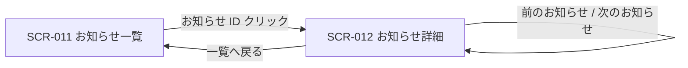
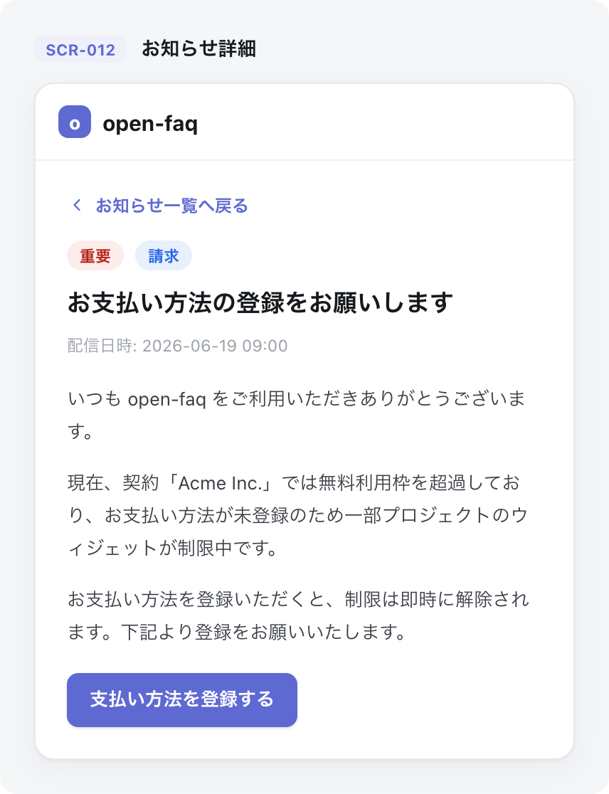

<!-- portal-top -->
[設計ポータル](../README.md) ／ [基本設計](index.md) ／ [画面設計](01_screen-design.md) ／ **SCR-012 お知らせ詳細**
<!-- /portal-top -->

# SCR-012 お知らせ詳細

> **このページは、一覧(SCR-011)から選択した個別のお知らせ本文を表示し、開封時に自動既読とする画面 SCR-012 を定義します。** 画面概要 / 画面遷移図 / 画面レイアウト / 画面項目定義 / 入出力一覧 / 画面イベント一覧 の 6 セクションで記述します。

*版数 v1.0 ・ 更新 2026-06-17 ・ 承認済*

## 1. 画面概要

一覧から選択した個別のお知らせ本文を表示し、表示時に自動既読とする画面です。種別・重要度・配信日時のメタ情報と前後ナビを提供します。

| 画面 ID | 画面名 | 機能概要 |
|----|----|----|
| `SCR-012` | お知らせ詳細 | 個別のお知らせ本文を表示し、開封時に自動既読化する |

| 関連     | 内容                                   |
|----------|----------------------------------------|
| FR / BR  | FR-117, FR-118 / BR-107                |
| 関連画面 | [`SCR-011` お知らせ一覧](SCR-011.md) |

| ステークホルダ | 対象 |
|----------------|------|
| オーナー       | ◯    |
| メンバー       | ◯    |

> [!NOTE]
> **補足** FR-116 はアカウント利用者全体に閲覧資格を定義し、本画面ではオーナーと当該スコープのメンバーがお知らせを閲覧できます。オーナー(`M_CONTRACT` 行存在)は `isOwner` で全権のため割当を持たずに受信できます(根拠は 認証・認可設計)。

## 2. 画面遷移図

本画面への流入と本画面からの遷移を、画面 ID・画面名とイベント(操作)で示します。

## 3. 画面レイアウト

## 4. 画面項目定義

本画面の入出力項目を定義します。項目の正本は本表です。

| 項目 ID | 項目 | 説明 | 種類 | 表示条件 | 表示 |
|----|----|----|----|----|----|
| `IT-01` | メタ情報バー | 種別・重要度・配信日時・既読日時をまとめてタイトル直下に表示する | バッジ | — | 種別バッジ + 重要度バッジ + 配信日時 + 既読日時(あれば) |
| `IT-02` | 種別バッジ | お知らせの種別をバッジで表示する | バッジ | — | 「お知らせ」/「請求」/「システム」 |
| `IT-03` | 重要度バッジ | お知らせの重要度をバッジで表示する | バッジ | — | 「重要(critical)」/「重要(high)」/「通常(normal)」/「淡色(low)」 |
| `IT-04` | タイトル | お知らせのタイトルを見出しとして表示する | 見出し | — | お知らせのタイトル |
| `IT-05` | 配信日時 | お知らせの配信日時を表示する | ラベル | — | 絶対日時 + 相対日時(例「2026-05-14 09:00(3 日前)」) |
| `IT-06` | 既読日時 | 既読となった日時を表示する | ラベル | 既読の場合のみ表示 | 「既読 {既読日時}」 |
| `IT-07` | 本文 | お知らせ本文をサニタイズして表示する(二重サニタイズ・許可タグ / 属性ホワイトリスト) | ラベル | — | お知らせ本文(見出し・段落・箇条書き等) |
| `IT-08` | 一覧へ戻る | お知らせ一覧(SCR-011)へ戻る | リンク | — | 「← お知らせ一覧へ戻る」 |
| `IT-09` | 前のお知らせ / 次のお知らせ | 一覧の並び順で前後のお知らせ詳細へ遷移する | リンク | — | 「← 前のお知らせ」/「次のお知らせ →」 |

## 5. 入出力一覧

本画面が読み書きするテーブルと、呼び出す API の一覧です。テーブルの正本は [データベース設計](03_database-design.md)、API の正本は [API設計](02_api-design.md) です。

<table>
<thead>
<tr>
<th rowspan="2">入出力名</th>
<th rowspan="2">説明</th>
<th rowspan="2">種別</th>
<th rowspan="2">I/O</th>
<th colspan="4">アクセス種別(CRUD)</th>
<th rowspan="2">備考</th>
</tr>
<tr>
<th>C</th>
<th>R</th>
<th>U</th>
<th>D</th>
</tr>
</thead>
<tbody>
<tr>
<td>お知らせ</td>
<td>お知らせ本文・メタ情報を取得する</td>
<td>テーブル</td>
<td>入力</td>
<td>—</td>
<td>◯</td>
<td>—</td>
<td>—</td>
<td><code>M_SERVICE_ANNOUNCE</code>(<a href="03_database-design.md#TBL-M-010">テーブル設計 3.25</a>)</td>
</tr>
<tr>
<td>お知らせ受信状態</td>
<td>既読日時を取得し、表示時に自動既読化する(<code>read_at</code>)</td>
<td>テーブル</td>
<td>入力 / 出力</td>
<td>—</td>
<td>◯</td>
<td>◯</td>
<td>—</td>
<td><code>T_ANNOUNCE_RCPT</code>(<a href="03_database-design.md#TBL-T-009">テーブル設計 3.27</a>)</td>
</tr>
<tr>
<td>お知らせ一覧取得</td>
<td>お知らせ本文・メタ情報および前後ナビ用の並びを取得する</td>
<td>API</td>
<td>入力</td>
<td>—</td>
<td>◯</td>
<td>—</td>
<td>—</td>
<td><code>GET /me/announcements</code>(<a href="API-inbox.md#API-ANN-001">お知らせ一覧</a>)</td>
</tr>
<tr>
<td>お知らせ個別既読化</td>
<td>表示時に当該お知らせを自動既読化する</td>
<td>API</td>
<td>出力</td>
<td>—</td>
<td>—</td>
<td>◯</td>
<td>—</td>
<td><code>POST /me/announcements/{id}/read</code>(<a href="API-inbox.md#API-ANN-002">お知らせ個別既読</a>)</td>
</tr>
</tbody>
</table>

## 6. 画面イベント一覧

本画面のイベント(初期表示・各操作)ごとに、対象の項目 ID と処理内容を定義します。

<table>
<colgroup>
<col style="width: 12%" />
<col style="width: 12%" />
<col style="width: 30%" />
<col style="width: 46%" />
</colgroup>
<thead>
<tr>
<th>イベント ID</th>
<th>項目 ID</th>
<th>イベント</th>
<th>処理</th>
</tr>
</thead>
<tbody>
<tr>
<td><code>EV-01</code></td>
<td>—</td>
<td>初期表示</td>
<td>
<ul>
<li><a href="API-inbox.md#API-ANN-001">お知らせ一覧</a> API (お知らせ詳細取得を兼ねる)で対象お知らせの本文・メタ情報(種別・重要度・配信日時・既読日時)を取得し表示する</li>
<li>初回表示時(未読)の場合、<a href="API-inbox.md#API-ANN-002">お知らせ個別既読</a> API を呼び出して自動既読化し、IT-06 既読日時を更新表示する</li>
<li>既読済の場合、IT-06 既読日時をそのまま表示する</li>
</ul>
</td>
</tr>
<tr>
<td><code>EV-02</code></td>
<td><a href="#IT-08">IT-08</a></td>
<td>「一覧へ戻る」を押下</td>
<td>SCR-011 お知らせ一覧へ遷移する</td>
</tr>
<tr>
<td><code>EV-03</code></td>
<td><a href="#IT-09">IT-09</a></td>
<td>「前のお知らせ」を押下</td>
<td>
<ul>
<li>一覧の並び順に基づき、前のお知らせの SCR-012 へ遷移する</li>
<li>先頭のお知らせでは本リンクを非活性にする</li>
</ul>
</td>
</tr>
<tr>
<td><code>EV-04</code></td>
<td><a href="#IT-09">IT-09</a></td>
<td>「次のお知らせ」を押下</td>
<td>
<ul>
<li>一覧の並び順に基づき、次のお知らせの SCR-012 へ遷移する</li>
<li>末尾のお知らせでは本リンクを非活性にする</li>
</ul>
</td>
</tr>
</tbody>
</table>

---

<!-- portal-bottom -->
[← 画面設計](01_screen-design.md) ・ [基本設計](index.md) ・ [↑ 設計ポータル](../README.md)
<!-- /portal-bottom -->
