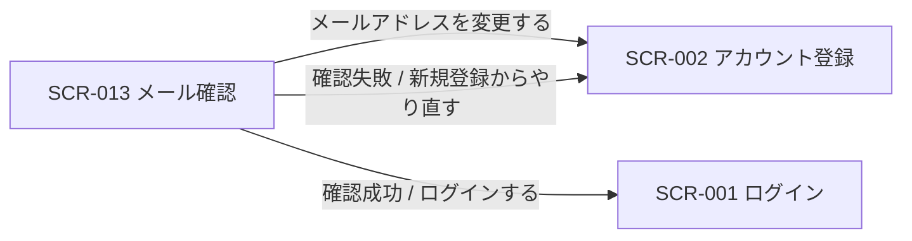

<!-- portal-top -->
[設計ポータル](../README.md) ／ [基本設計](index.md) ／ [画面設計](01_screen-design.md) ／ **SCR-013 メール確認**
<!-- /portal-top -->

# SCR-013 メール確認

> **このページは、新規登録後にメール内リンクから本人確認を完了する画面 SCR-013 を定義します。** 画面概要 / 画面遷移図 / 画面レイアウト / 画面項目定義 / 入出力一覧 / 画面イベント一覧 の 6 セクションで記述します。

*版数 v1.0 ・ 更新 2026-06-17 ・ 承認済*

## 1. 画面概要

新規登録後にメール内の確認リンクから本人確認を完了する画面です。送信済み・確認成功・確認失敗の 3 状態を持ち、メール再送とログインへの導線を提供します。

| 画面 ID | 画面名 | 機能概要 |
|----|----|----|
| `SCR-013` | メール確認 | 新規登録後にメール内リンクで本人確認を完了し、送信済み / 成功 / 失敗の各状態を表示する |

| 関連 | 内容 |
|----|----|
| FR / BR | FR-003 / — |
| 関連画面 | [`SCR-002` アカウント登録](SCR-002.md) / [`SCR-001` ログイン](SCR-001.md) |

| ステークホルダ                  | 対象 |
|---------------------------------|------|
| 対象ユーザー(認証前 / トークン) | ◯    |

> [!NOTE]
> **補足** 本画面は認証前(メール確認トークンによる本人確認)に表示されるため権限は不要です。確認リンクの有効期限は 24 時間で、期限切れ・使用済みの場合は確認失敗状態を表示し新規登録への復旧導線を出します。

## 2. 画面遷移図

本画面からの画面遷移を、画面 ID・画面名とイベント(操作)で示します。

## 3. 画面レイアウト

<section style="flex:none;width:360px">
      
SCR-013メール確認

      

        

          
<svg width="26" height="26" viewBox="0 0 24 24" fill="none" stroke="currentColor" stroke-width="1.7" stroke-linecap="round" stroke-linejoin="round"><rect x="2" y="5" width="20" height="14" rx="2"></rect><path d="m3 7 9 6 9-6"></path></svg>

          <h2 style="margin:0 0 10px;font-size:16px;font-weight:700;color:#16191d">確認メールを送信しました</h2>
          
<b style="color:#16191d">owner@example.com</b> 宛に確認リンクをお送りしました。メール内のリンクをクリックして登録を完了してください。

          
メールが届かない場合は <a style="color:var(--accent,#5e6ad2);text-decoration:none;cursor:pointer;font-weight:600">再送信</a>

        

      

    </section>

## 4. 画面項目定義

本画面の入出力項目(送信済み・確認成功・確認失敗の各状態の表示・操作)を定義します。項目の正本は本表です。

| 項目 ID | 項目 | 説明 | 種類 | 表示条件 | 表示 |
|----|----|----|----|----|----|
| `IT-01` | 状態タイムライン | 登録〜ログインの進捗をステップ表示する | タイムライン | 送信済み状態 | 「① 新規登録 → ② 確認メールのリンクをクリック → ③ ログイン」 |
| `IT-02` | 送信先メールアドレス | 確認メールの送信先アドレスを表示する | ラベル | 送信済み状態 | 確認メールの送信先アドレス |
| `IT-03` | 案内文 | 有効期限と迷惑メール確認の案内を表示する | アラート | 送信済み状態 | 「確認リンクは 24 時間有効です。メールが届かない場合は迷惑メールフォルダもご確認ください。」 |
| `IT-04` | メールを再送する | 確認メールを再送する(レート制限 5 分以内 1 回・カウントダウン併記) | ボタン | 送信済み状態 | 「メールを再送する」(制限中は「メールを再送する(あと N 分 N 秒)」で非活性) |
| `IT-05` | メールアドレスを変更する | アカウント登録(SCR-002)へ戻り入力をやり直す | リンク | 送信済み状態 | 「メールアドレスを変更する」 |
| `IT-06` | 確認成功 | 本人確認完了を伝えログインへ誘導する | アラート | 確認成功状態 | 「メールアドレスの確認が完了しました」+「ログインしてサービスをご利用ください」+「ログインする」 |
| `IT-07` | 確認失敗 | リンク期限切れ・使用済みを伝え復旧導線を出す | アラート | 確認失敗状態(リンク期限切れ・使用済み) | 「確認リンクが期限切れ、または使用済みです(有効期限 24 時間)」+「新規登録からやり直す」 |
| `IT-08` | ログインする | ログイン画面(SCR-001)へ遷移する | ボタン | 確認成功状態 | 「ログインする」 |

## 5. 入出力一覧

本画面が読み書きするテーブルと、呼び出す API の一覧です。テーブルの正本は [03_テーブル設計](03_database-design.md)、API の正本は [02_API設計 §5.1.6](02_api-design.md) です。

<table>
<thead>
<tr>
<th rowspan="2">入出力名</th>
<th rowspan="2">説明</th>
<th rowspan="2">種別</th>
<th rowspan="2">I/O</th>
<th colspan="4">アクセス種別(CRUD)</th>
<th rowspan="2">備考</th>
</tr>
<tr>
<th>C</th>
<th>R</th>
<th>U</th>
<th>D</th>
</tr>
</thead>
<tbody>
<tr>
<td>オーナー</td>
<td>メール確認状態を照合・更新する(新規登録は SCR-002 のオーナー登録フロー)</td>
<td>テーブル</td>
<td>入力 / 出力</td>
<td>—</td>
<td>◯</td>
<td>◯</td>
<td>—</td>
<td><code>M_CONTRACT</code>(<a href="03_database-design.md#TBL-M-001">テーブル設計 3.2</a>)</td>
</tr>
<tr>
<td>メール確認</td>
<td>確認トークンを検証し本人確認を完了する</td>
<td>API</td>
<td>入力 / 出力</td>
<td>—</td>
<td>—</td>
<td>—</td>
<td>—</td>
<td><code>POST /auth/email-verifications/{token}</code>(<a href="02_api-design.md">API 設計 5.1.6</a>)</td>
</tr>
<tr>
<td>確認メール再送</td>
<td>確認メールを再送する(レート制限あり)</td>
<td>API</td>
<td>入力 / 出力</td>
<td>—</td>
<td>—</td>
<td>—</td>
<td>—</td>
<td>新規登録フロー(<a href="02_api-design.md">API 設計 5.1.1</a>)経由</td>
</tr>
</tbody>
</table>

## 6. 画面イベント一覧

本画面で発生するイベントと発生タイミング・概要の一覧です。

<table>
<colgroup>
<col style="width: 20%" />
<col style="width: 20%" />
<col style="width: 20%" />
<col style="width: 20%" />
<col style="width: 20%" />
</colgroup>
<thead>
<tr>
<th>イベント ID</th>
<th>イベント</th>
<th>トリガー</th>
<th>処理</th>
<th>関連項目</th>
</tr>
</thead>
<tbody>
<tr>
<td><code>EV-01</code></td>
<td>送信済み表示</td>
<td>新規登録完了後の遷移時</td>
<td>送信先メールアドレスと案内文・状態タイムラインを表示</td>
<td><a href="#IT-01">IT-01</a>, <a href="#IT-02">IT-02</a>, <a href="#IT-03">IT-03</a></td>
</tr>
<tr>
<td><code>EV-02</code></td>
<td>確認実行</td>
<td>メール内リンクからの遷移時</td>
<td><ul>
<li><code>POST /auth/email-verifications/{token}</code> でトークンを検証</li>
<li>成功 / 失敗状態へ分岐</li>
</ul></td>
<td><a href="#IT-06">IT-06</a>, <a href="#IT-07">IT-07</a></td>
</tr>
<tr>
<td><code>EV-03</code></td>
<td>メール再送</td>
<td>「メールを再送する」押下時</td>
<td><ul>
<li>確認メールを再送</li>
<li>レート制限(5 分以内 1 回)中はボタンを非活性化しカウントダウン表示</li>
</ul></td>
<td><a href="#IT-04">IT-04</a></td>
</tr>
<tr>
<td><code>EV-04</code></td>
<td>メールアドレス変更へ遷移</td>
<td>「メールアドレスを変更する」押下時</td>
<td>SCR-002 アカウント登録へ戻る</td>
<td><a href="#IT-05">IT-05</a></td>
</tr>
<tr>
<td><code>EV-05</code></td>
<td>ログインへ遷移</td>
<td>確認成功後「ログインする」押下時</td>
<td>SCR-001 ログインへ遷移</td>
<td><a href="#IT-08">IT-08</a></td>
</tr>
</tbody>
</table>

---

---

<!-- portal-bottom -->
[← 画面設計](01_screen-design.md) ・ [基本設計](index.md) ・ [↑ 設計ポータル](../README.md)
<!-- /portal-bottom -->
