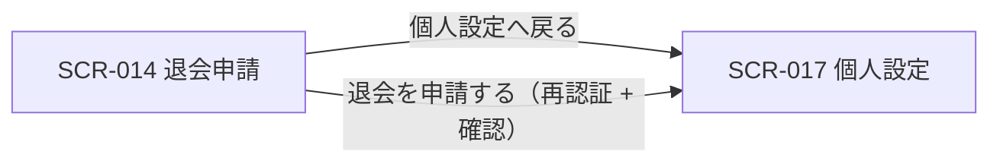
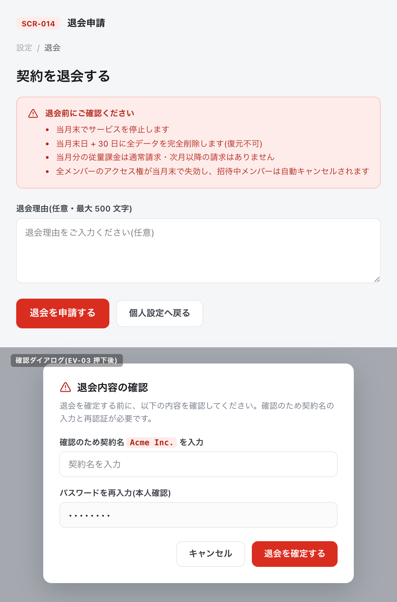

<!-- portal-top -->
[設計ポータル](../README.md) ／ [基本設計](index.md) ／ [画面設計](01_screen-design.md) ／ **SCR-014 退会申請**
<!-- /portal-top -->

# SCR-014 退会申請

> **このページは、オーナーが契約の退会を申請する画面 SCR-014 を定義します(オーナー専有)。** 画面概要 / 画面遷移図 / 画面レイアウト / 画面項目定義 / 入出力一覧 / 画面イベント一覧 の 6 セクションで記述します。

*版数 v1.0 ・ 更新 2026-06-17 ・ 承認済*

## 1. 画面概要

オーナーが契約の退会を申請する画面です。退会の影響(サービス停止・データ削除・請求・メンバー失効)を 1 パネルに集約して提示し、再認証付きで退会を申請します。

| 画面 ID | 画面名 | 機能概要 |
|----|----|----|
| `SCR-014` | 退会申請 | 退会時の影響を提示し、再認証付きで退会を申請する(オーナー専有) |

| 関連     | 内容                               |
|----------|------------------------------------|
| FR / BR  | FR-009 / —                         |
| 関連画面 | [`SCR-017` 個人設定](SCR-017.md) |

| ステークホルダ              | 対象 |
|-----------------------------|------|
| オーナー                    | ◯    |
| プロジェクト管理者(`admin`) | —    |
| メンバー(`member`)          | —    |

> [!NOTE]
> **補足** 退会はオーナー専有機能です。プロジェクト管理者・メンバーには本画面を提供せず、URL 直アクセスは権限不足表示となります。退会申請には確認ダイアログと再認証が必須です。退会フローのタイムライン表示・データエクスポート導線は設けません(データエクスポート機能は MVP 対象外、05_future 参照)。

## 2. 画面遷移図

本画面からの画面遷移を、画面 ID・画面名とイベント(操作)で示します。

## 3. 画面レイアウト

## 4. 画面項目定義

本画面の入出力項目(注意事項表示・退会理由入力・操作ボタン)を定義します。項目の正本は本表です。

| 項目 ID | 項目 | 説明 | 種類 | 表示条件 | 表示 |
|----|----|----|----|----|----|
| `IT-01` | 注意事項 | 退会時の影響を 1 セクションに集約して表示する | アラート | — | 「当月末でサービス停止」「当月末日 + 30 日に全データを完全削除(復元不可)」「当月分の従量課金は通常請求・次月以降の請求なし」「全メンバーのアクセス権が当月末で失効、招待中メンバーは自動キャンセル」 |
| `IT-02` | 退会理由(任意) | 退会理由を任意で入力する(最大 500 文字) | テキストエリア | — | — |
| `IT-03` | 個人設定へ戻る | 個人設定へ戻る | ボタン | — | 「個人設定へ戻る」 |
| `IT-04` | 退会を申請する | 再認証付きで退会を申請する(確認ダイアログ + 再認証) | ボタン | — | 「退会を申請する」 |

## 5. 入出力一覧

本画面が読み書きするテーブルと、呼び出す API の一覧です。テーブルの正本は [03_テーブル設計](03_database-design.md)、API の正本は [02_API設計 §5.9.3](02_api-design.md) です。

<table>
<thead>
<tr>
<th rowspan="2">入出力名</th>
<th rowspan="2">説明</th>
<th rowspan="2">種別</th>
<th rowspan="2">I/O</th>
<th colspan="4">アクセス種別(CRUD)</th>
<th rowspan="2">備考</th>
</tr>
<tr>
<th>C</th>
<th>R</th>
<th>U</th>
<th>D</th>
</tr>
</thead>
<tbody>
<tr>
<td>退会申請</td>
<td>退会申請を記録する</td>
<td>テーブル</td>
<td>出力</td>
<td>◯</td>
<td>—</td>
<td>—</td>
<td>—</td>
<td><code>T_WITHDRAW_REQ</code>(<a href="03_database-design.md#TBL-T-011">テーブル設計 3.29</a>)</td>
</tr>
<tr>
<td>オーナー</td>
<td>契約状態を <code>deleted_pending</code> へ更新する</td>
<td>テーブル</td>
<td>入力 / 出力</td>
<td>—</td>
<td>◯</td>
<td>◯</td>
<td>—</td>
<td><code>M_CONTRACT.status</code>。<code>M_CONTRACT</code>(<a href="03_database-design.md#TBL-M-001">テーブル設計 3.2</a>)</td>
</tr>
<tr>
<td>退会申請</td>
<td>再認証付きで退会を申請する</td>
<td>API</td>
<td>入力 / 出力</td>
<td>—</td>
<td>—</td>
<td>—</td>
<td>—</td>
<td><code>POST /withdrawal-requests</code>(<a href="02_api-design.md">API 設計 5.9.3</a>)</td>
</tr>
<tr>
<td>再認証</td>
<td>退会申請前に本人確認のため再認証する</td>
<td>API</td>
<td>入力 / 出力</td>
<td>—</td>
<td>—</td>
<td>—</td>
<td>—</td>
<td><code>POST /auth/re-auth</code>(<a href="02_api-design.md">API 設計 5.1.5</a>)</td>
</tr>
</tbody>
</table>

## 6. 画面イベント一覧

本画面のイベント(初期表示・各操作)ごとに、対象の項目 ID と処理内容を定義します。

<table>
<colgroup>
<col style="width: 12%" />
<col style="width: 12%" />
<col style="width: 30%" />
<col style="width: 46%" />
</colgroup>
<thead>
<tr>
<th>イベント ID</th>
<th>項目 ID</th>
<th>イベント</th>
<th>処理</th>
</tr>
</thead>
<tbody>
<tr>
<td><code>EV-01</code></td>
<td>—</td>
<td>初期表示</td>
<td>退会時の影響を集約した警告パネルを表示</td>
</tr>
<tr>
<td><code>EV-02</code></td>
<td><a href="#IT-02">IT-02</a></td>
<td>退会理由を入力</td>
<td>任意入力(最大 500 文字)。超過時はバリデーションエラーを表示</td>
</tr>
<tr>
<td><code>EV-03</code></td>
<td><a href="#IT-04">IT-04</a></td>
<td>「退会を申請する」を押下</td>
<td><ul>
<li>確認ダイアログ + 再認証(<code>POST /auth/re-auth</code>)</li>
<li>再認証後: <code>POST /withdrawal-requests</code> を実行し status=deleted_pending を設定</li>
</ul></td>
</tr>
<tr>
<td><code>EV-04</code></td>
<td><a href="#IT-03">IT-03</a></td>
<td>「個人設定へ戻る」を押下</td>
<td>SCR-017 個人設定へ遷移</td>
</tr>
</tbody>
</table>

---

---

---

<!-- portal-bottom -->
[← 画面設計](01_screen-design.md) ・ [基本設計](index.md) ・ [↑ 設計ポータル](../README.md)
<!-- /portal-bottom -->
