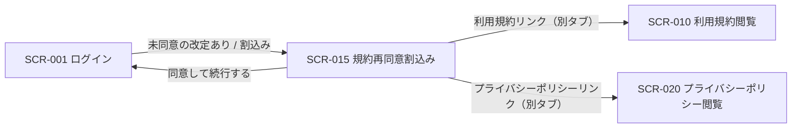

<!-- portal-top -->
[設計ポータル](../README.md) ／ [基本設計](index.md) ／ [画面設計](01_screen-design.md) ／ **SCR-015 規約再同意割込み**
<!-- /portal-top -->

# SCR-015 規約再同意割込み

> **このページは、規約・ポリシー改定時にログイン後へ割り込み、再同意を求める画面 SCR-015 を定義します。** 画面概要 / 画面遷移図 / 画面レイアウト / 画面項目定義 / 入出力一覧 / 画面イベント一覧 の 6 セクションで記述します。

*版数 v1.0 ・ 更新 2026-06-17 ・ 承認済*

## 1. 画面概要

利用規約・プライバシーポリシーの改定時に、ログイン後の操作へ全画面モーダルで割り込み、改定文書の主な変更点を提示して再同意を求める画面です。

| 画面 ID | 画面名 | 機能概要 |
|----|----|----|
| `SCR-015` | 規約再同意割込み | 改定された利用規約・プライバシーポリシーの主な変更点を提示し、最新版への再同意を求める全画面モーダル |

| 関連 | 内容 |
|----|----|
| FR / BR | FR-011, FR-164 / — |
| 関連画面 | [`SCR-001` ログイン](SCR-001.md) / [`SCR-010` 利用規約閲覧](SCR-010.md) / [`SCR-020` プライバシーポリシー閲覧](SCR-020.md) |

| ステークホルダ              | 対象 |
|-----------------------------|------|
| オーナー                    | ◯    |
| プロジェクト管理者(`admin`) | ◯    |
| メンバー(`member`)          | ◯    |

> [!NOTE]
> **補足** ログイン済みの全ロール利用者に対し、未同意の改定がある場合にログイン後の操作へ割り込んで表示します(SP / PC ともフルスクリーン)。改定された文書のみが対象の場合は、当該文書の変更点と同意チェックのみを表示します。

## 2. 画面遷移図

本画面からの画面遷移を、画面 ID・画面名とイベント(操作)で示します。

## 3. 画面レイアウト

両方改定(利用規約 + プライバシーポリシー)

 
 
利用規約への再同意案内(両方改定)
 
利用者: 利用者(オーナー / プロジェクト管理者 / メンバー)
 
 
 
 <h3 id="scr-015-modal-title">利用規約への再同意</h3> 
 
主な変更点
 
 
利用規約の主な変更点
 <ul style="margin: 4px 0; padding-left: 20px;"> <li>個人情報の取り扱いに関する説明をわかりやすく更新</li> <li>利用停止までの猶予期間を明記</li> </ul> 
プライバシーポリシーの主な変更点
 <ul style="margin: 4px 0; padding-left: 20px;"> <li>取得する利用データの項目と利用目的を追記</li> <li>第三者提供の範囲を明確化</li> </ul> 
 
 
<label class="checkbox"><input type="checkbox"> <a class="link">利用規約(リンク)</a>に同意します ●</label>
 
<label class="checkbox"><input type="checkbox"> <a class="link">プライバシーポリシー(リンク)</a>に同意します ●</label>
 
 <button class="btn primary">同意して続行する</button> 
 
 
 

 

利用規約のみ改定(改定文書のみ表示)

 
 
利用規約への再同意案内(利用規約のみ改定)
 
利用者: 利用者(オーナー / プロジェクト管理者 / メンバー)
 
 
 
 <h3 id="scr-015-terms-modal-title">利用規約への再同意</h3> 
 
主な変更点
 
 
利用規約の主な変更点
 <ul style="margin: 4px 0; padding-left: 20px;"> <li>個人情報の取り扱いに関する説明をわかりやすく更新</li> <li>利用停止までの猶予期間を明記</li> </ul> 
 
 
<label class="checkbox"><input type="checkbox"> <a class="link">利用規約(リンク)</a>に同意します ●</label>
 
 <button class="btn primary">同意して続行する</button> 
 
 
 

 

プライバシーポリシーのみ改定(改定文書のみ表示)

 
 
利用規約への再同意案内(プライバシーポリシーのみ改定)
 
利用者: 利用者(オーナー / プロジェクト管理者 / メンバー)
 
 
 
 <h3 id="scr-015-privacy-modal-title">プライバシーポリシーへの再同意</h3> 
 
主な変更点
 
 
プライバシーポリシーの主な変更点
 <ul style="margin: 4px 0; padding-left: 20px;"> <li>取得する利用データの項目と利用目的を追記</li> <li>第三者提供の範囲を明確化</li> </ul> 
 
 
<label class="checkbox"><input type="checkbox"> <a class="link">プライバシーポリシー(リンク)</a>に同意します ●</label>
 
 <button class="btn primary">同意して続行する</button> 
 
 
 

## 4. 画面項目定義

本画面の入出力項目(変更点表示・同意チェック・操作ボタン)を定義します。項目の正本は本表です。

| 項目 ID | 項目 | 説明 | 種類 | 表示条件 | 表示 |
|----|----|----|----|----|----|
| `IT-01` | 主な変更点 | 改定された利用規約 / プライバシーポリシーの主な変更点を見出しで区別して表示する | カード | 改定された文書のみ表示(利用規約 / プライバシーポリシーの該当文書) | 各文書の主な変更点(差分サマリー) |
| `IT-02` | 利用規約同意 | 利用規約最新版への同意をチェックする(必須。リンクで SCR-010 を参照) | チェックボックス | 利用規約が改定対象の場合に表示 | 「利用規約の最新版に同意します」 |
| `IT-03` | プライバシーポリシー同意 | プライバシーポリシー最新版への同意をチェックする(必須。リンクで SCR-020 を参照) | チェックボックス | プライバシーポリシーが改定対象の場合に表示 | 「プライバシーポリシーの最新版に同意します」 |
| `IT-04` | 同意して続行する | 同意を確定して元の操作へ戻る | ボタン | 両チェック充足時のみ活性化 | 「同意して続行する」 |

## 5. 入出力一覧

本画面が読み書きするテーブルと、呼び出す API の一覧です。テーブルの正本は [03_テーブル設計](03_database-design.md)、API の正本は [02_API設計 §5.9.2](02_api-design.md) です。

<table>
<thead>
<tr>
<th rowspan="2">入出力名</th>
<th rowspan="2">説明</th>
<th rowspan="2">種別</th>
<th rowspan="2">I/O</th>
<th colspan="4">アクセス種別(CRUD)</th>
<th rowspan="2">備考</th>
</tr>
<tr>
<th>C</th>
<th>R</th>
<th>U</th>
<th>D</th>
</tr>
</thead>
<tbody>
<tr>
<td>規約バージョン</td>
<td>差分サマリ・最新版を取得する</td>
<td>テーブル</td>
<td>入力</td>
<td>—</td>
<td>◯</td>
<td>—</td>
<td>—</td>
<td><code>M_TERMS_VER</code>(<a href="03_database-design.md#TBL-M-012">テーブル設計 3.30</a>)</td>
</tr>
<tr>
<td>規約同意</td>
<td><code>doc_type</code> 別で同意を記録する</td>
<td>テーブル</td>
<td>出力</td>
<td>◯</td>
<td>—</td>
<td>—</td>
<td>—</td>
<td><code>T_TERMS_AGREE</code>(<a href="03_database-design.md#TBL-T-012">テーブル設計 3.31</a>)</td>
</tr>
<tr>
<td>利用規約 最新版取得</td>
<td>利用規約の最新版・差分サマリを取得する</td>
<td>API</td>
<td>入力</td>
<td>—</td>
<td>—</td>
<td>—</td>
<td>—</td>
<td><code>GET /terms/current</code>(<a href="02_api-design.md">API 設計 5.9.1</a>)</td>
</tr>
<tr>
<td>プライバシーポリシー 最新版取得</td>
<td>プライバシーポリシーの最新版・差分サマリを取得する</td>
<td>API</td>
<td>入力</td>
<td>—</td>
<td>—</td>
<td>—</td>
<td>—</td>
<td><code>GET /privacy/current</code>(<a href="02_api-design.md">API 設計 5.9.1a</a>)</td>
</tr>
<tr>
<td>利用規約 同意</td>
<td>利用規約最新版への同意を送信する</td>
<td>API</td>
<td>出力</td>
<td>—</td>
<td>—</td>
<td>—</td>
<td>—</td>
<td><code>POST /terms/agree</code>(<a href="02_api-design.md">API 設計 5.9.2</a>)</td>
</tr>
<tr>
<td>プライバシーポリシー 同意</td>
<td>プライバシーポリシー最新版への同意を送信する</td>
<td>API</td>
<td>出力</td>
<td>—</td>
<td>—</td>
<td>—</td>
<td>—</td>
<td><code>POST /privacy/agree</code>(<a href="02_api-design.md">API 設計 5.9.2a</a>)</td>
</tr>
</tbody>
</table>

## 6. 画面イベント一覧

本画面で発生するイベントと発生タイミング・概要の一覧です。

<table>
<colgroup>
<col style="width: 20%" />
<col style="width: 20%" />
<col style="width: 20%" />
<col style="width: 20%" />
<col style="width: 20%" />
</colgroup>
<thead>
<tr>
<th>イベント ID</th>
<th>イベント</th>
<th>トリガー</th>
<th>処理</th>
<th>関連項目</th>
</tr>
</thead>
<tbody>
<tr>
<td><code>EV-01</code></td>
<td>割込み表示</td>
<td>ログイン後・未同意の改定がある場合</td>
<td><ul>
<li><code>GET /terms/current</code> / <code>GET /privacy/current</code> で差分サマリを取得</li>
<li>主な変更点を全画面モーダルで表示</li>
</ul></td>
<td><a href="#IT-01">IT-01</a></td>
</tr>
<tr>
<td><code>EV-02</code></td>
<td>同意チェック</td>
<td>各同意チェックボックス操作時</td>
<td>両チェックの充足状態を判定し「同意して続行する」の活性 / 非活性を切替</td>
<td><a href="#IT-02">IT-02</a>, <a href="#IT-03">IT-03</a>, <a href="#IT-04">IT-04</a></td>
</tr>
<tr>
<td><code>EV-03</code></td>
<td>同意して続行</td>
<td>「同意して続行する」押下時</td>
<td><ul>
<li><code>POST /terms/agree</code> と <code>POST /privacy/agree</code>(改定文書のみ)を実行し <code>T_TERMS_AGREE</code> に記録</li>
<li>完了後は元の操作へ戻る</li>
</ul></td>
<td><a href="#IT-04">IT-04</a></td>
</tr>
<tr>
<td><code>EV-04</code></td>
<td>規約 / ポリシー閲覧</td>
<td>文書リンク押下時</td>
<td>SCR-010 利用規約 / SCR-020 プライバシーポリシーを別タブで開く</td>
<td><a href="#IT-02">IT-02</a>, <a href="#IT-03">IT-03</a></td>
</tr>
</tbody>
</table>

---

---

<!-- portal-bottom -->
[← 画面設計](01_screen-design.md) ・ [基本設計](index.md) ・ [↑ 設計ポータル](../README.md)
<!-- /portal-bottom -->
