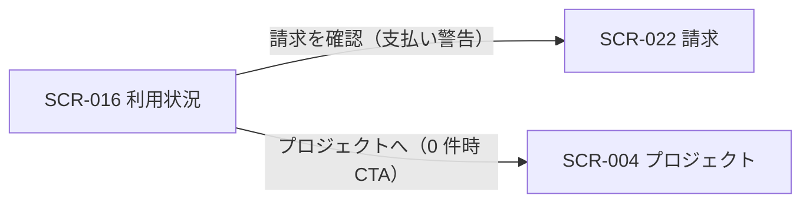

<!-- portal-top -->
[設計ポータル](../README.md) ／ [基本設計](index.md) ／ [画面設計](01_screen-design.md) ／ **SCR-016 利用状況**
<!-- /portal-top -->

# SCR-016 利用状況

> **このページは、オーナーが契約全体と各プロジェクトの利用状況を当月固定の読み取り専用スナップショットで把握する起点画面 SCR-016 を定義します。** 画面概要 / 画面遷移図 / 画面レイアウト / 画面項目定義 / 入出力一覧 / 画面イベント一覧 の 6 セクションで記述します。

*版数 v1.0 ・ 更新 2026-06-17 ・ 承認済*

## 1. 画面概要

契約ワークスペースのトップ画面で、契約全体の集計値とプロジェクト別の利用量を 1 画面に集約する読み取り専用画面です(オーナー専有)。請求金額・支払方法・請求履歴は SCR-022 へ分離します。

| 画面 ID | 画面名 | 機能概要 |
|----|----|----|
| `SCR-016` | 利用状況 | 契約全体の集計値とプロジェクト別利用量を当月固定で表示する起点画面 |

| 関連 | 内容 |
|----|----|
| FR / BR | FR-130〜FR-135h, FR-148, FR-326, FR-327 / BR-013f |
| 関連画面 | [`SCR-004` プロジェクト](SCR-004.md) / [`SCR-022` 請求](SCR-022.md) |

| ステークホルダ              | 対象 |
|-----------------------------|------|
| オーナー                    | ◯    |
| プロジェクト管理者(`admin`) | —    |
| メンバー(`member`)          | —    |

> [!NOTE]
> **補足** 本画面はオーナー専有です。当月固定の読み取り専用スナップショットとし、集計期間セレクト・最終更新タイムスタンプ・新規プロジェクト作成ボタンは置きません(プロジェクト作成・編集は SCR-004 / SCR-004-001 に集約)。表示ルール(数値・色語彙・状態表現)は 01_画面設計 §1.5 ダッシュボード / KPI 共通表示ルールに従います。

## 2. 画面遷移図

本画面からの画面遷移を、画面 ID・画面名とイベント(操作)で示します。

## 3. 画面レイアウト

## 4. 画面項目定義

本画面の表示項目(全体サマリー・支払い警告・プロジェクト別利用状況・空状態)を定義します。項目の正本は本表です。各セルはリンクを持たない読み取り専用表示で、プロジェクトを開く・作成・編集する操作は本画面では提供しません。

| 項目 ID | 項目 | 説明 | 種類 | 表示条件 | 表示 |
|----|----|----|----|----|----|
| `IT-01` | 全体サマリー | 契約全体の利用中プロジェクト数 / 質問数合計 / 公開 FAQ 数合計を表示する(各カードはクリック不可) | カード(3 枚) | — | 「利用中プロジェクト数」「質問数合計」「公開 FAQ 数合計」の各値 |
| `IT-02` | 支払い警告 | 支払い情報の確認を促すバナーを表示する | バナー | 支払方法未登録または支払い失敗時のみ表示 | 支払い情報の確認を促す警告文 +「請求を確認」ボタン |
| `IT-03` | プロジェクト別利用状況 | プロジェクトごとの利用量を読み取り専用で表示する: プロジェクト名 / 質問数(利用 / 上限 + 利用率・状態を同一セルに併記)/ 公開 FAQ 数 の 3 列。利用率の高い順を既定、同率はプロジェクト名昇順 | テーブル | — | プロジェクト名 / 質問数(利用 / 上限・利用率・状態)/ 公開 FAQ 数。上限 OFF は「上限なし」 |
| `IT-04` | 空状態(プロジェクト 0 件) | プロジェクトが無い旨と作成導線を表示する | 空状態表示 | プロジェクトが 0 件のときのみ表示 | 「プロジェクトがまだありません」+「プロジェクトへ」CTA |

## 5. 入出力一覧

本画面が読み取るテーブルと、呼び出す API の一覧です。テーブルの正本は [03_テーブル設計](03_database-design.md)、API の正本は [02_API設計 §5.7.1](02_api-design.md#API-BIL-001) です。

<table>
<thead>
<tr>
<th rowspan="2">入出力名</th>
<th rowspan="2">説明</th>
<th rowspan="2">種別</th>
<th rowspan="2">I/O</th>
<th colspan="4">アクセス種別(CRUD)</th>
<th rowspan="2">備考</th>
</tr>
<tr>
<th>C</th>
<th>R</th>
<th>U</th>
<th>D</th>
</tr>
</thead>
<tbody>
<tr>
<td>プロジェクト</td>
<td>プロジェクト名・件数を取得する</td>
<td>テーブル</td>
<td>入力</td>
<td>—</td>
<td>◯</td>
<td>—</td>
<td>—</td>
<td><code>M_PROJECTS</code>(<a href="03_database-design.md#TBL-M-004">テーブル設計 3.6</a>)</td>
</tr>
<tr>
<td>利用量計測</td>
<td>当月の質問数・利用率を取得する</td>
<td>テーブル</td>
<td>入力</td>
<td>—</td>
<td>◯</td>
<td>—</td>
<td>—</td>
<td><code>T_USAGE_METER</code>(<a href="03_database-design.md#TBL-T-008">テーブル設計 3.22</a>)</td>
</tr>
<tr>
<td>プロジェクト上限</td>
<td>プロジェクト別の月次上限・上限 OFF を判定する</td>
<td>テーブル</td>
<td>入力</td>
<td>—</td>
<td>◯</td>
<td>—</td>
<td>—</td>
<td><code>M_PRJ_QUOTA_LIMITS</code>(<a href="03_database-design.md#TBL-M-009">テーブル設計 3.24</a>)</td>
</tr>
<tr>
<td>契約サブスクリプション</td>
<td>支払方法未登録・支払い失敗を判定する</td>
<td>テーブル</td>
<td>入力</td>
<td>—</td>
<td>◯</td>
<td>—</td>
<td>—</td>
<td><code>T_BILL_SUBS</code>(<a href="03_database-design.md#TBL-T-006">テーブル設計 3.20</a>)</td>
</tr>
<tr>
<td>利用状況取得</td>
<td>契約全体サマリーと各プロジェクト別利用量の双方を取得する。契約横断の集計は <code>viewMode=contract</code>(または同等の集約パラメータ)を、プロジェクト別は <code>viewMode=project&amp;projectId={id}</code> を用いる(SCR-021 の単一プロジェクト表示と区別する)</td>
<td>API</td>
<td>入力</td>
<td>—</td>
<td>—</td>
<td>—</td>
<td>—</td>
<td>取得方式の正本は <a href="02_api-design.md#API-BIL-001">02_API設計 §5.7.1</a>。物理名 <code>GET /usage?period=current_month&amp;viewMode={contract|project}</code></td>
</tr>
</tbody>
</table>

## 6. 画面イベント一覧

本画面で発生するイベントと発生タイミング・概要の一覧です。

<table>
<colgroup>
<col style="width: 20%" />
<col style="width: 20%" />
<col style="width: 20%" />
<col style="width: 20%" />
<col style="width: 20%" />
</colgroup>
<thead>
<tr>
<th>イベント ID</th>
<th>イベント</th>
<th>トリガー</th>
<th>処理</th>
<th>関連項目</th>
</tr>
</thead>
<tbody>
<tr>
<td><code>EV-01</code></td>
<td>利用状況初期表示</td>
<td>画面遷移・リロード時</td>
<td><ul>
<li>当月の集計値とプロジェクト別利用量を取得し表示</li>
<li>プロジェクト 0 件時は EmptyState</li>
</ul></td>
<td><a href="#IT-01">IT-01</a>, <a href="#IT-03">IT-03</a>, <a href="#IT-04">IT-04</a></td>
</tr>
<tr>
<td><code>EV-02</code></td>
<td>支払い警告表示</td>
<td>支払方法未登録 / 支払い失敗時</td>
<td><ul>
<li>PaymentMethodBanner を表示</li>
<li>「請求を確認」で SCR-022 へ遷移</li>
</ul></td>
<td><a href="#IT-02">IT-02</a></td>
</tr>
<tr>
<td><code>EV-03</code></td>
<td>プロジェクトへ遷移</td>
<td>0 件時「プロジェクトへ」CTA 押下時</td>
<td>SCR-004 プロジェクトへ遷移</td>
<td><a href="#IT-04">IT-04</a></td>
</tr>
</tbody>
</table>

---

---

---

<!-- portal-bottom -->
[← 画面設計](01_screen-design.md) ・ [基本設計](index.md) ・ [↑ 設計ポータル](../README.md)
<!-- /portal-bottom -->
