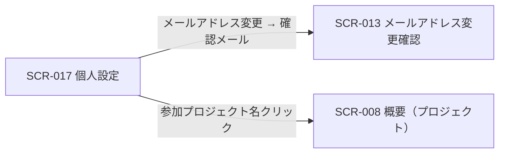

<!-- portal-top -->
[設計ポータル](../README.md) ／ [基本設計](index.md) ／ [画面設計](01_screen-design.md) ／ **SCR-017 個人設定**
<!-- /portal-top -->

# SCR-017 個人設定

> **このページは、認証済みの利用者が自身のプロフィール・セキュリティ・参加プロジェクトを編集する画面 SCR-017 を定義します。** 画面概要 / 画面遷移図 / 画面レイアウト / 画面項目定義 / 入出力一覧 / 画面イベント一覧 の 6 セクションで記述します。

*版数 v1.0 ・ 更新 2026-06-17 ・ 承認済*

## 1. 画面概要

ヘッダ右上のアカウントメニュー「個人設定」から開く全画面で、自分のプロフィール・セキュリティ・参加プロジェクトをタブで扱う画面です。契約連絡先と退会は SCR-023 設定へ分離します。

| 画面 ID | 画面名 | 機能概要 |
|----|----|----|
| `SCR-017` | 個人設定 | 自分のプロフィール・セキュリティ・参加プロジェクトを編集する |

| 関連 | 内容 |
|----|----|
| FR / BR | FR-001, FR-005, FR-006, FR-340 / — |
| 関連画面 | [`SCR-013` メールアドレス変更確認](SCR-013.md)(確認メール再利用) / [`SCR-023` 設定](SCR-023.md) |

| ステークホルダ              | 対象 |
|-----------------------------|------|
| オーナー                    | ◯    |
| プロジェクト管理者(`admin`) | ◯    |
| メンバー(`member`)          | ◯    |

> [!NOTE]
> **補足** 認証済みであれば全ロールが利用でき、自分の情報のみ編集可能です。誤操作防止としてパスワード変更は再認証(現パスワード再入力)を要し、メールアドレス変更は再認証 + 新メールアドレスの確認メールを要します(再認証の正本は 08_認証・認可設計 §2)。個人ごとの通知受信オプトアウトは本画面では扱わず、プロジェクト関連通知は常時 ON 固定です。

## 2. 画面遷移図

本画面からの画面遷移を、画面 ID・画面名とイベント(操作)で示します。

## 3. 画面レイアウト

## 4. 画面項目定義

本画面の入出力項目を、プロフィール・セキュリティ・参加プロジェクトの 3 タブに分けて定義します。項目の正本は本表です。

| 項目 ID | 項目 | 説明 | 種類 | 表示条件 | 表示 |
|----|----|----|----|----|----|
| `IT-01` | 表示名 | 自分の表示名を編集する(必須。1〜100 文字) | テキストボックス | プロフィールタブ | — |
| `IT-02` | メールアドレス | 自分のメールアドレスを編集する(必須。変更時は確認メールを送信) | テキストボックス(メールアドレス) | プロフィールタブ | — |
| `IT-03` | パスワードを変更する | 再認証(現パスワード再入力)を経てパスワード(旧 + 新 + 確認)を変更する | ボタン | セキュリティタブ | 「パスワードを変更する」 |
| `IT-04` | 参加プロジェクト一覧 | 自分が参加するプロジェクト名と適用ロールを一覧表示する(プロジェクト名はプロジェクトホームへのリンク) | テーブル | 参加プロジェクトタブ | プロジェクト名 / 適用ロール |

> [!NOTE]
> **補足** アクティブセッション一覧の表示と自己セッション終了は MVP 対象外です(05_future、FR-332 改訂)。複数デバイス同時ログインは可能です。

## 5. 入出力一覧

本画面が読み書きするテーブルと、呼び出す API の一覧です。テーブルの正本は [03_テーブル設計](03_database-design.md)、メール確認 API の正本は [02_API設計 §5.1.6](02_api-design.md) です。

<table>
<thead>
<tr>
<th rowspan="2">入出力名</th>
<th rowspan="2">説明</th>
<th rowspan="2">種別</th>
<th rowspan="2">I/O</th>
<th colspan="4">アクセス種別(CRUD)</th>
<th rowspan="2">備考</th>
</tr>
<tr>
<th>C</th>
<th>R</th>
<th>U</th>
<th>D</th>
</tr>
</thead>
<tbody>
<tr>
<td>オーナー / プロジェクトユーザー</td>
<td>自身の表示名・メールアドレス・パスワードを参照・更新する(対象マスタはログイン中の actor 種別で特定。両マスタは完全分離)</td>
<td>テーブル</td>
<td>入力 / 出力</td>
<td>—</td>
<td>◯</td>
<td>◯</td>
<td>—</td>
<td><code>M_CONTRACT</code>(<a href="03_database-design.md#TBL-M-001">テーブル設計 3.2</a>)/ <code>M_PRJ_USERS</code>(<a href="03_database-design.md#TBL-M-003">テーブル設計 3.1</a>)</td>
</tr>
<tr>
<td>プロジェクト割当</td>
<td>参加プロジェクト一覧・適用ロールを取得する</td>
<td>テーブル</td>
<td>入力</td>
<td>—</td>
<td>◯</td>
<td>—</td>
<td>—</td>
<td><code>M_PRJ_USERS</code>(<a href="03_database-design.md#TBL-M-003">テーブル設計 3.3</a>)</td>
</tr>
<tr>
<td>メールアドレス変更確認</td>
<td>確認トークンを検証してメールアドレス変更を確定する</td>
<td>API</td>
<td>入力 / 出力</td>
<td>—</td>
<td>—</td>
<td>—</td>
<td>—</td>
<td><code>POST /auth/email-verifications/{token}</code>(<a href="02_api-design.md">API 設計 5.1.6</a>)</td>
</tr>
</tbody>
</table>

## 6. 画面イベント一覧

本画面のイベント(初期表示・各操作)ごとに、対象の項目 ID と処理内容を定義します。

<table>
<colgroup>
<col style="width: 12%" />
<col style="width: 12%" />
<col style="width: 30%" />
<col style="width: 46%" />
</colgroup>
<thead>
<tr>
<th>イベント ID</th>
<th>項目 ID</th>
<th>イベント</th>
<th>処理</th>
</tr>
</thead>
<tbody>
<tr>
<td><code>EV-01</code></td>
<td>—</td>
<td>初期表示</td>
<td>自分のプロフィール・参加プロジェクト一覧を取得し各タブに表示</td>
</tr>
<tr>
<td><code>EV-02</code></td>
<td>—</td>
<td>「保存」を押下(プロフィール)</td>
<td><ul>
<li>表示名・メールアドレスを検証して更新</li>
<li>メールアドレス変更時: 再認証 + 新メールアドレスの確認メールを送信(SCR-013 再利用)</li>
</ul></td>
</tr>
<tr>
<td><code>EV-03</code></td>
<td><a href="#IT-03">IT-03</a></td>
<td>「パスワードを変更する」を押下</td>
<td>旧 / 新パスワード + 確認を入力し、再認証(現パスワード再入力)を経て更新</td>
</tr>
<tr>
<td><code>EV-04</code></td>
<td><a href="#IT-04">IT-04</a></td>
<td>参加プロジェクト名リンクを押下</td>
<td>該当プロジェクトの SCR-008 概要へ遷移</td>
</tr>
</tbody>
</table>

---

---

---

<!-- portal-bottom -->
[← 画面設計](01_screen-design.md) ・ [基本設計](index.md) ・ [↑ 設計ポータル](../README.md)
<!-- /portal-bottom -->
