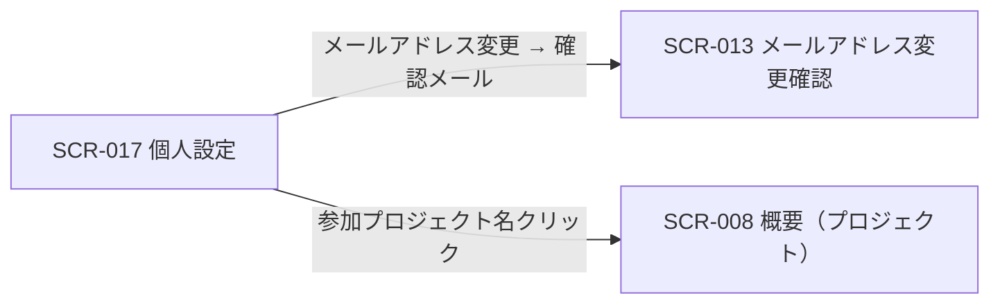
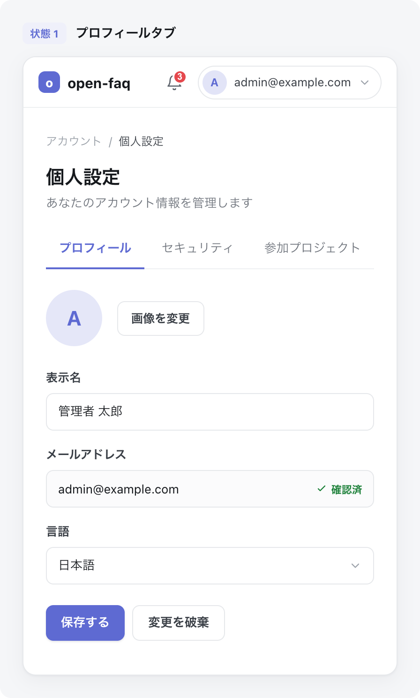

<!-- portal-top -->
[設計ポータル](../README.md) ／ [基本設計](index.md) ／ [画面設計](01_screen-design.md) ／ **SCR-017 個人設定**
<!-- /portal-top -->

# SCR-017 個人設定

> **このページは、認証済みの利用者が自身のプロフィール・セキュリティ・参加プロジェクトを編集する画面 SCR-017 を定義します。** 画面概要 / 画面遷移図 / 画面レイアウト / 画面項目定義 / 入出力一覧 / 画面イベント一覧 の 6 セクションで記述します。

*版数 v1.0 ・ 更新 2026-06-17 ・ 承認済*

## <span id="1-画面概要"></span>1. 画面概要

ヘッダ右上のアカウントメニュー「個人設定」から開く全画面で、自分のプロフィール・セキュリティ・参加プロジェクトをタブで扱う画面です。契約連絡先と退会は SCR-023 設定へ分離します。

| 画面 ID | 画面名 | 機能概要 |
|----|----|----|
| <span id="SCR-017"></span>`SCR-017` | 個人設定 | 自分のプロフィール・セキュリティ・参加プロジェクトを編集する |

| 関連 | 内容 |
|----|----|
| FR / BR | FR-001, FR-005, FR-006, FR-340 / — |
| 関連画面 | [`SCR-013` メールアドレス変更確認](SCR-013.md)(確認メール再利用) / [`SCR-023` 設定](SCR-023.md) |

| ステークホルダ              | 対象 |
|-----------------------------|------|
| オーナー                    | ◯    |
| プロジェクト管理者(`admin`) | ◯    |
| メンバー(`member`)          | ◯    |

> [!NOTE]
> **補足** 認証済みであれば全ロールが利用でき、自分の情報のみ編集可能です。誤操作防止としてパスワード変更は再認証(現パスワード再入力)を要し、メールアドレス変更は再認証 + 新メールアドレスの確認メールを要します(再認証の正本は 08_認証・認可設計 §2)。個人ごとの通知受信オプトアウトは本画面では扱わず、プロジェクト関連通知は常時 ON 固定です。

## <span id="2-画面遷移図"></span>2. 画面遷移図

本画面からの画面遷移を、画面 ID・画面名とイベント(操作)で示します。



## <span id="3-画面レイアウト"></span>3. 画面レイアウト



<details>
<summary>画面モック HTML（ソース）</summary>

```html
<div style="background:#f5f6f8;padding:24px;border-radius:12px;font-family:'Noto Sans JP',-apple-system,BlinkMacSystemFont,'Hiragino Kaku Gothic ProN',Meiryo,sans-serif;color:#3a3f46;-webkit-font-smoothing:antialiased;--accent:#5e6ad2">
<div style="max-width:1180px;margin:0 auto;display:flex;flex-direction:column;gap:40px">
  <section>
    <div style="display:flex;align-items:center;gap:10px;margin-bottom:13px">
      <span style="font-size:11px;font-weight:700;color:var(--accent,#5e6ad2);background:color-mix(in srgb,var(--accent,#5e6ad2) 10%,#fff);border-radius:6px;padding:3px 8px">状態 1</span>
      <span style="font-size:13.5px;font-weight:600;color:#16191d">プロフィールタブ</span>
    </div>
    <div style="background:#fff;border:1px solid #e6e8eb;border-radius:14px;box-shadow:0 1px 2px rgba(16,24,40,.04),0 6px 20px rgba(16,24,40,.05);overflow:hidden">
      <div style="display:flex;align-items:center;justify-content:space-between;height:54px;padding:0 16px;border-bottom:1px solid #eef0f2;background:#fff">
        <div style="display:flex;align-items:center;gap:12px">
          <span style="display:inline-flex;align-items:center;gap:8px;font-weight:700;font-size:15px;color:#16191d"><span style="width:23px;height:23px;border-radius:7px;background:var(--accent,#5e6ad2);display:inline-flex;align-items:center;justify-content:center;color:#fff;font-size:13px;font-weight:800">o</span>open-faq</span>
        </div>
        <div style="display:flex;align-items:center;gap:8px">
          <button style="position:relative;width:34px;height:34px;border-radius:8px;border:none;background:transparent;display:inline-flex;align-items:center;justify-content:center;color:#5b616a;cursor:pointer"><svg width="18" height="18" viewBox="0 0 24 24" fill="none" stroke="currentColor" stroke-width="1.8" stroke-linecap="round" stroke-linejoin="round"><path d="M6 8a6 6 0 0 1 12 0c0 7 3 9 3 9H3s3-2 3-9z"></path><path d="M10.3 21a1.94 1.94 0 0 0 3.4 0"></path></svg><span style="position:absolute;top:3px;right:3px;min-width:16px;height:16px;padding:0 3px;border-radius:999px;background:#e5484d;color:#fff;font-size:10px;font-weight:700;display:flex;align-items:center;justify-content:center;border:2px solid #fff">3</span></button>
          <button style="display:inline-flex;align-items:center;gap:8px;padding:4px 10px 4px 4px;border:1px solid #e6e8eb;border-radius:999px;background:#fff;cursor:pointer;font-family:inherit"><span style="width:26px;height:26px;border-radius:999px;background:color-mix(in srgb,var(--accent,#5e6ad2) 18%,#fff);color:var(--accent,#5e6ad2);font-weight:700;font-size:12px;display:flex;align-items:center;justify-content:center">A</span><span style="font-size:12.5px;color:#3a3f46">admin@example.com</span><svg width="14" height="14" viewBox="0 0 24 24" fill="none" stroke="#9aa0a8" stroke-width="1.9" stroke-linecap="round" stroke-linejoin="round"><path d="m6 9 6 6 6-6"></path></svg></button>
        </div>
      </div>
      <div style="max-width:780px;margin:0 auto;padding:26px 24px 36px">
        <nav style="display:flex;align-items:center;gap:7px;font-size:12px;color:#9aa0a8;margin-bottom:14px"><span>アカウント</span><span>/</span><span style="color:#3a3f46">個人設定</span></nav>
        <h1 style="margin:0 0 4px;font-size:20px;font-weight:700;color:#16191d;letter-spacing:-.01em">個人設定</h1>
        <p style="margin:0 0 18px;font-size:13px;color:#71767e">あなたのアカウント情報を管理します</p>
        <div style="display:flex;gap:4px;border-bottom:1px solid #eef0f2;margin-bottom:22px">
          <span style="padding:10px 14px;font-size:13px;font-weight:600;color:var(--accent,#5e6ad2);border-bottom:2px solid var(--accent,#5e6ad2);margin-bottom:-1px;cursor:pointer">プロフィール</span>
          <span style="padding:10px 14px;font-size:13px;color:#71767e;cursor:pointer">セキュリティ</span>
          <span style="padding:10px 14px;font-size:13px;color:#71767e;cursor:pointer">参加プロジェクト</span>
        </div>
        <div style="display:flex;align-items:center;gap:16px;margin-bottom:24px">
          <span style="width:60px;height:60px;border-radius:999px;background:color-mix(in srgb,var(--accent,#5e6ad2) 16%,#fff);color:var(--accent,#5e6ad2);display:flex;align-items:center;justify-content:center;font-weight:700;font-size:22px">A</span>
          <button style="padding:8px 14px;border:1px solid #e6e8eb;border-radius:8px;background:#fff;font-size:12.5px;font-weight:600;color:#3a3f46;cursor:pointer;font-family:inherit">画像を変更</button>
        </div>
        <div style="display:flex;flex-direction:column;gap:16px">
          <div>
            <label style="display:block;font-size:12.5px;font-weight:600;color:#3a3f46;margin-bottom:7px">表示名</label>
            <div style="height:40px;border:1px solid #e6e8eb;border-radius:8px;background:#fff;display:flex;align-items:center;padding:0 12px;font-size:13px;color:#16191d;max-width:420px">管理者 太郎</div>
          </div>
          <div>
            <label style="display:block;font-size:12.5px;font-weight:600;color:#3a3f46;margin-bottom:7px">メールアドレス</label>
            <div style="height:40px;border:1px solid #e6e8eb;border-radius:8px;background:#fbfbfc;display:flex;align-items:center;justify-content:space-between;padding:0 12px;font-size:13px;color:#16191d;max-width:420px">admin@example.com<span style="display:inline-flex;align-items:center;gap:4px;font-size:11px;color:#1a7f37;font-weight:600"><svg width="12" height="12" viewBox="0 0 24 24" fill="none" stroke="currentColor" stroke-width="2.4" stroke-linecap="round" stroke-linejoin="round"><path d="m5 12 4 4 10-10"></path></svg>確認済</span></div>
          </div>
          <div>
            <label style="display:block;font-size:12.5px;font-weight:600;color:#3a3f46;margin-bottom:7px">言語</label>
            <div style="height:40px;border:1px solid #e6e8eb;border-radius:8px;background:#fff;display:flex;align-items:center;justify-content:space-between;padding:0 12px;font-size:13px;color:#16191d;max-width:420px">日本語<svg width="14" height="14" viewBox="0 0 24 24" fill="none" stroke="#9aa0a8" stroke-width="1.9" stroke-linecap="round" stroke-linejoin="round"><path d="m6 9 6 6 6-6"></path></svg></div>
          </div>
          <div style="display:flex;gap:8px;padding-top:6px">
            <button style="padding:8px 16px;border:none;border-radius:8px;background:var(--accent,#5e6ad2);color:#fff;font-size:13px;font-weight:600;cursor:pointer;box-shadow:0 1px 2px rgba(16,24,40,.12);font-family:inherit">保存する</button>
            <button style="padding:8px 16px;border:1px solid #e6e8eb;border-radius:8px;background:#fff;font-size:13px;font-weight:600;color:#3a3f46;cursor:pointer;font-family:inherit">変更を破棄</button>
          </div>
        </div>
      </div>
    </div>
  </section>
</div>
</div>
```

</details>

## <span id="4-画面項目定義"></span>4. 画面項目定義

本画面の入出力項目を、プロフィール・セキュリティ・参加プロジェクトの 3 タブに分けて定義します。項目の正本は本表です。

| 項目 ID | 項目 | 説明 | 種類 | 表示条件 | 表示 |
|----|----|----|----|----|----|
| <span id="IT-01"></span>`IT-01` | 表示名 | 自分の表示名を編集する(必須。1〜100 文字) | テキストボックス | プロフィールタブ | — |
| <span id="IT-02"></span>`IT-02` | メールアドレス | 自分のメールアドレスを編集する(必須。変更時は確認メールを送信) | テキストボックス(メールアドレス) | プロフィールタブ | — |
| <span id="IT-03"></span>`IT-03` | パスワードを変更する | 再認証(現パスワード再入力)を経てパスワード(旧 + 新 + 確認)を変更する | ボタン | セキュリティタブ | 「パスワードを変更する」 |
| <span id="IT-04"></span>`IT-04` | 参加プロジェクト一覧 | 自分が参加するプロジェクト名と適用ロールを一覧表示する(プロジェクト名はプロジェクトホームへのリンク) | テーブル | 参加プロジェクトタブ | プロジェクト名 / 適用ロール |

> [!NOTE]
> **補足** アクティブセッション一覧の表示と自己セッション終了は MVP 対象外です(05_future、FR-332 改訂)。複数デバイス同時ログインは可能です。

## <span id="5-入出力一覧"></span>5. 入出力一覧

本画面が読み書きするテーブルと、呼び出す API の一覧です。テーブルの正本は [03_テーブル設計](03_database-design.md)、メール確認 API の正本は [02_API設計 §5.1.6](02_api-design.md) です。

<table>
<thead>
<tr>
<th rowspan="2">入出力名</th>
<th rowspan="2">説明</th>
<th rowspan="2">種別</th>
<th rowspan="2">I/O</th>
<th colspan="4">アクセス種別(CRUD)</th>
<th rowspan="2">備考</th>
</tr>
<tr>
<th>C</th>
<th>R</th>
<th>U</th>
<th>D</th>
</tr>
</thead>
<tbody>
<tr>
<td>オーナー / プロジェクトユーザー</td>
<td>自身の表示名・メールアドレス・パスワードを参照・更新する(対象マスタはログイン中の actor 種別で特定。両マスタは完全分離)</td>
<td>テーブル</td>
<td>入力 / 出力</td>
<td>—</td>
<td>◯</td>
<td>◯</td>
<td>—</td>
<td><code>M_CONTRACT</code>(<a href="03_database-design.md#TBL-M-001">テーブル設計 3.2</a>)/ <code>M_PRJ_USERS</code>(<a href="03_database-design.md#TBL-M-003">テーブル設計 3.1</a>)</td>
</tr>
<tr>
<td>プロジェクト割当</td>
<td>参加プロジェクト一覧・適用ロールを取得する</td>
<td>テーブル</td>
<td>入力</td>
<td>—</td>
<td>◯</td>
<td>—</td>
<td>—</td>
<td><code>M_PRJ_USERS</code>(<a href="03_database-design.md#TBL-M-003">テーブル設計 3.3</a>)</td>
</tr>
<tr>
<td>メールアドレス変更確認</td>
<td>確認トークンを検証してメールアドレス変更を確定する</td>
<td>API</td>
<td>入力 / 出力</td>
<td>—</td>
<td>—</td>
<td>—</td>
<td>—</td>
<td><code>POST /auth/email-verifications/{token}</code>(<a href="02_api-design.md">API 設計 5.1.6</a>)</td>
</tr>
</tbody>
</table>

## <span id="6-画面イベント一覧"></span>6. 画面イベント一覧

本画面で発生するイベントと発生タイミング・概要の一覧です。

<table>
<colgroup>
<col style="width: 20%" />
<col style="width: 20%" />
<col style="width: 20%" />
<col style="width: 20%" />
<col style="width: 20%" />
</colgroup>
<thead>
<tr>
<th>イベント ID</th>
<th>イベント</th>
<th>トリガー</th>
<th>処理</th>
<th>関連項目</th>
</tr>
</thead>
<tbody>
<tr>
<td><code>EV-01</code></td>
<td>個人設定初期表示</td>
<td>画面遷移・リロード時</td>
<td>自分のプロフィール・参加プロジェクト一覧を取得し各タブに表示</td>
<td><a href="#IT-01">IT-01</a>, <a href="#IT-02">IT-02</a>, <a href="#IT-04">IT-04</a></td>
</tr>
<tr>
<td><code>EV-02</code></td>
<td>プロフィール保存</td>
<td>「保存」押下時(プロフィールタブ)</td>
<td><ul>
<li>表示名・メールアドレスを検証して更新</li>
<li>メールアドレス変更時は再認証 + 新メールアドレスの確認メールを送信(SCR-013 再利用)</li>
</ul></td>
<td><a href="#IT-01">IT-01</a>, <a href="#IT-02">IT-02</a></td>
</tr>
<tr>
<td><code>EV-03</code></td>
<td>パスワード変更</td>
<td>「パスワードを変更する」押下時</td>
<td><ul>
<li>旧 / 新パスワード + 確認を入力</li>
<li>再認証(現パスワード再入力)を経て更新</li>
</ul></td>
<td><a href="#IT-03">IT-03</a></td>
</tr>
<tr>
<td><code>EV-04</code></td>
<td>プロジェクトへ遷移</td>
<td>参加プロジェクト名リンク押下時</td>
<td>該当プロジェクトの SCR-008 概要へ遷移</td>
<td><a href="#IT-04">IT-04</a></td>
</tr>
</tbody>
</table>

---

---

---

<!-- portal-bottom -->
[← 画面設計](01_screen-design.md) ・ [基本設計](index.md) ・ [↑ 設計ポータル](../README.md)
<!-- /portal-bottom -->
