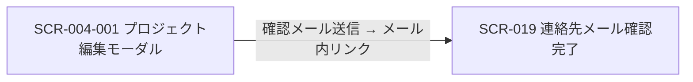
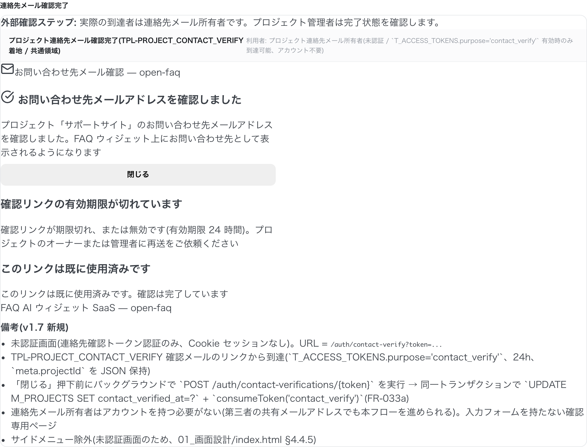

<!-- portal-top -->
[設計ポータル](../README.md) ／ [基本設計](index.md) ／ [画面設計](01_screen-design.md) ／ **SCR-019 プロジェクト連絡先メール確認完了**
<!-- /portal-top -->

# SCR-019 プロジェクト連絡先メール確認完了

> **このページは、プロジェクト連絡先メールの確認リンク(トークン)から到達する確認完了ページ SCR-019 を定義します。** 画面概要 / 画面遷移図 / 画面レイアウト / 画面項目定義 / 入出力一覧 / 画面イベント一覧 の 6 セクションで記述します。

*版数 v1.0 ・ 更新 2026-06-17 ・ 承認済*

## <span id="1-画面概要"></span>1. 画面概要

プロジェクト連絡先メールの確認リンクからトークン認証で到達する確認完了ページです。トークン検証成功時に連絡先メールアドレスの所有権を確定し、結果(完了 / 期限切れ / 既使用)を表示するのみで、入力フォームは持ちません。

| 画面 ID | 画面名 | 機能概要 |
|----|----|----|
| <span id="SCR-019"></span>`SCR-019` | プロジェクト連絡先メール確認完了 | 連絡先メールの確認トークンを検証し、完了 / 期限切れ / 既使用の結果を表示する |

| 関連 | 内容 |
|----|----|
| FR / BR | FR-033a, FR-033c, FR-150〜FR-156 / — |
| 関連画面 | [`SCR-004-001` プロジェクト作成 / 編集モーダル](SCR-004-001.md) |

| ステークホルダ         | 対象 |
|------------------------|------|
| 対象ユーザー(トークン) | ◯    |

> [!NOTE]
> **補足** 本画面は認証前(連絡先確認トークンによる本人確認)に表示されるため権限は不要です。到達者は連絡先メールアドレスの所有者であり、オーナーや管理者である必要はなく、第三者(共有メールアドレス担当者など)でも構いません。アカウント作成は不要で、未認証画面のためサイドメニューには表示しません。確認リンクの有効期限は 24 時間です。

## <span id="2-画面遷移図"></span>2. 画面遷移図

本画面への流入と本画面からの遷移を、画面 ID・画面名とイベント(操作)で示します。



## <span id="3-画面レイアウト"></span>3. 画面レイアウト



<details>
<summary>画面モック HTML（ソース）</summary>

```html
<div class="layout-embed">
<div class="le-cap">連絡先メール確認完了</div>
<div class="scr-mock"><div class="screen" id="scr-019" role="region" aria-labelledby="scr-019-title"><div class="role-screen-note"><strong>外部確認ステップ:</strong> 実際の到達者は連絡先メール所有者です。プロジェクト管理者は完了状態を確認します。</div>
<div class="screen-header"><div><span class="scr-name" id="scr-019-title">プロジェクト連絡先メール確認完了(TPL-PROJECT_CONTACT_VERIFY 着地 / 共通領域)</span></div><div class="scr-user">利用者: プロジェクト連絡先メール所有者(未認証 / `T_ACCESS_TOKENS.purpose='contact_verify'` 有効時のみ到達可能、アカウント不要)</div></div>
<div class="public-form-layout"> <div class="simple-header"><i data-lucide="mail"></i>お問い合わせ先メール確認 — open-faq</div> <div style="width: 480px;">
  <!-- (a) 完了状態 -->
  <div class="auth-card xwide" style="width: auto;">
    <h3><i data-lucide="check-circle"></i> お問い合わせ先メールアドレスを確認しました</h3>
    <div class="alert-bar success" role="status">プロジェクト「サポートサイト」のお問い合わせ先メールアドレスを確認しました。FAQ ウィジェット上にお問い合わせ先として表示されるようになります</div>
    <button class="btn" style="width: 100%; margin-top: 8px;">閉じる</button>
  </div>
  <!-- (b) トークン期限切れ -->
  <div class="auth-card xwide" style="width: auto; margin-top: 12px;">
    <h3>確認リンクの有効期限が切れています</h3>
    <div class="alert-bar danger" role="alert">確認リンクが期限切れ、または無効です(有効期限 24 時間)。プロジェクトのオーナーまたは管理者に再送をご依頼ください</div>
  </div>
  <!-- (c) 既使用 -->
  <div class="auth-card xwide" style="width: auto; margin-top: 12px;">
    <h3>このリンクは既に使用済みです</h3>
    <div class="alert-bar warn" role="status">このリンクは既に使用済みです。確認は完了しています</div>
  </div>
</div> <div class="simple-footer">FAQ AI ウィジェット SaaS — open-faq</div> </div>
<div class="note" style="margin-top: 10px;"><strong>備考(v1.7 新規)</strong><ul style="margin: 4px 0 0; padding-left: 18px;"><li>未認証画面(連絡先確認トークン認証のみ、Cookie セッションなし)。URL = <code>/auth/contact-verify?token=...</code></li><li>TPL-PROJECT_CONTACT_VERIFY 確認メールのリンクから到達(`T_ACCESS_TOKENS.purpose='contact_verify'`、24h、`meta.projectId` を JSON 保持)</li><li>「閉じる」押下前にバックグラウンドで `POST /auth/contact-verifications/{token}` を実行 → 同一トランザクションで `UPDATE M_PROJECTS SET contact_verified_at=?` + `consumeToken('contact_verify')`(FR-033a)</li><li>連絡先メール所有者はアカウントを持つ必要がない(第三者の共有メールアドレスでも本フローを進められる)。入力フォームを持たない確認専用ページ</li><li>サイドメニュー除外(未認証画面のため、01_画面設計/index.html §4.4.5)</li></ul></div>
</div></div>
</div>
```

</details>

## <span id="4-画面項目定義"></span>4. 画面項目定義

本画面の表示項目を定義します。項目の正本は本表です。確認専用ページのため入力フォームはなく、操作は「閉じる」のみです。

| 項目 ID | 項目 | 説明 | 種類 | 表示条件 | 表示 |
|----|----|----|----|----|----|
| <span id="IT-01"></span>`IT-01` | 確認完了画面 | 連絡先メール確認の完了をチェックマーク付きで表示する | 空状態表示 | トークン検証成功時に表示 | 「プロジェクト「{プロジェクト名}」のお問い合わせ先メールアドレスを確認しました。FAQ ウィジェット上にお問い合わせ先として表示されるようになります」 |
| <span id="IT-02"></span>`IT-02` | トークン期限切れ画面 | 確認リンクが期限切れ・無効の旨と再送依頼を表示する | 空状態表示 | 確認トークンが期限切れの場合に表示 | 「確認リンクが期限切れ、または無効です(有効期限 24 時間)。プロジェクトのオーナーまたは管理者に再送をご依頼ください」 |
| <span id="IT-03"></span>`IT-03` | 既使用画面 | 確認が既に完了済みである旨を表示する | 空状態表示 | 確認トークンが使用済みの場合に表示 | 「このリンクは既に使用済みです。確認は完了しています」 |
| <span id="IT-04"></span>`IT-04` | 閉じる | 確認完了画面を閉じる | ボタン | — | 「閉じる」 |

## <span id="5-入出力一覧"></span>5. 入出力一覧

本画面が更新するテーブルと、呼び出す API の一覧です。テーブルの正本は [03_テーブル設計](03_database-design.md)、API の正本は [02_API設計 §5.1.9](02_api-design.md) です。

<table>
<thead>
<tr>
<th rowspan="2">入出力名</th>
<th rowspan="2">説明</th>
<th rowspan="2">種別</th>
<th rowspan="2">I/O</th>
<th colspan="4">アクセス種別(CRUD)</th>
<th rowspan="2">備考</th>
</tr>
<tr>
<th>C</th>
<th>R</th>
<th>U</th>
<th>D</th>
</tr>
</thead>
<tbody>
<tr>
<td>プロジェクト</td>
<td>連絡先メール確認日時を設定する(<code>contact_verified_at</code>)</td>
<td>テーブル</td>
<td>出力</td>
<td>—</td>
<td>—</td>
<td>◯</td>
<td>—</td>
<td><code>M_PROJECTS</code>(<a href="03_database-design.md#TBL-M-004">テーブル設計 3.6</a>)</td>
</tr>
<tr>
<td>アクセストークン</td>
<td>確認トークンを検証・消費する(<code>purpose='contact_verify'</code>、<code>used_at</code> セット)</td>
<td>テーブル</td>
<td>入力 / 出力</td>
<td>—</td>
<td>◯</td>
<td>◯</td>
<td>—</td>
<td><code>T_ACCESS_TOKENS</code>(<a href="03_database-design.md#TBL-T-002">テーブル設計 3.5</a>)</td>
</tr>
<tr>
<td>連絡先メール確認</td>
<td>トークンを検証して連絡先メール確認日時をセットする</td>
<td>API</td>
<td>入力 / 出力</td>
<td>—</td>
<td>—</td>
<td>—</td>
<td>—</td>
<td><code>POST /auth/contact-verifications/{token}</code>(<a href="02_api-design.md">API 設計 5.1.9</a>)</td>
</tr>
</tbody>
</table>

## <span id="6-画面イベント一覧"></span>6. 画面イベント一覧

本画面で発生するイベントと発生タイミング・概要の一覧です。

<table>
<colgroup>
<col style="width: 20%" />
<col style="width: 20%" />
<col style="width: 20%" />
<col style="width: 20%" />
<col style="width: 20%" />
</colgroup>
<thead>
<tr>
<th>イベント ID</th>
<th>イベント</th>
<th>トリガー</th>
<th>処理</th>
<th>関連項目</th>
</tr>
</thead>
<tbody>
<tr>
<td><code>EV-01</code></td>
<td>確認実行</td>
<td>確認リンクからの URL 訪問時</td>
<td><ul>
<li><code>POST /auth/contact-verifications/{token}</code> でトークンを検証</li>
<li>200 で完了画面を表示</li>
<li>410(期限切れ / 既使用)で各エラー画面へ分岐</li>
</ul></td>
<td><a href="#IT-01">IT-01</a>, <a href="#IT-02">IT-02</a>, <a href="#IT-03">IT-03</a></td>
</tr>
<tr>
<td><code>EV-02</code></td>
<td>閉じる</td>
<td>「閉じる」押下時</td>
<td><code>window.close()</code> または静的なランディングメッセージを表示(認証コンソールへの遷移は行わない。未認証ユーザーは戻り先がないため)</td>
<td><a href="#IT-04">IT-04</a></td>
</tr>
</tbody>
</table>

> [!IMPORTANT]
> **サーバ側処理の正本** 確認 API は同一トランザクションで `verifyToken` → `UPDATE M_PROJECTS SET contact_verified_at=now()` → `consumeToken` → 監査記録(`project.contact_email_verified`)を行います。トークン検証の正本は 08_認証・認可設計 §4、メールテンプレート(TPL-PROJECT_CONTACT_VERIFY)の正本は 11_メール設計、メッセージ(MSG-SCR-019-\*)の正本は 06_メッセージ一覧。

---

---

---

<!-- portal-bottom -->
[← 画面設計](01_screen-design.md) ・ [基本設計](index.md) ・ [↑ 設計ポータル](../README.md)
<!-- /portal-bottom -->
