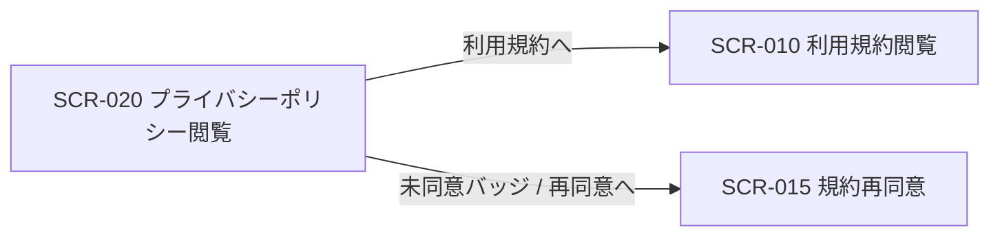

<!-- portal-top -->
[設計ポータル](../README.md) ／ [基本設計](index.md) ／ [画面設計](01_screen-design.md) ／ **SCR-020 プライバシーポリシー閲覧**
<!-- /portal-top -->

# SCR-020 プライバシーポリシー閲覧

> **このページは、プライバシーポリシーの最新版を 1 枚のページとして閲覧する静的閲覧画面 SCR-020 を定義します。** 画面概要 / 画面遷移図 / 画面レイアウト / 画面項目定義 / 入出力一覧 / 画面イベント一覧 の 6 セクションで記述します。

*版数 v1.0 ・ 更新 2026-06-17 ・ 承認済*

## 1. 画面概要

プライバシーポリシーの最新版のみを 1 枚のページとして表示する閲覧専用画面です。上部に同意状態バッジを置き、その下に全文を連続表示します。目次・章ナビ・過去バージョン履歴・差分表示は設けません。利用規約は SCR-010 に分離します。

| 画面 ID | 画面名 | 機能概要 |
|----|----|----|
| `SCR-020` | プライバシーポリシー閲覧 | プライバシーポリシーの最新版の全文表示と同意状態バッジ表示を行う |

| 関連 | 内容 |
|----|----|
| FR / BR | FR-160, FR-164, FR-168 / — |
| 関連画面 | [`SCR-010` 利用規約閲覧](SCR-010.md) / [`SCR-015` 規約再同意](SCR-015.md) |

| ステークホルダ     | 対象 |
|--------------------|------|
| 全利用者(認証前可) | ◯    |

> [!NOTE]
> **補足** 本画面は認証不要 URL を提供し、認証前でも閲覧できます(権限は不要)。同意状態バッジはログイン済みの場合のみ表示します。ウィジェット内には表示せず、ウィジェット利用者向けの画面図・導線には含めません。

## 2. 画面遷移図

本画面からの画面遷移を、画面 ID・画面名とイベント(操作)で示します。

## 3. 画面レイアウト

<section style="flex:1;min-width:520px">
      
SCR-010 / 020文書閲覧(利用規約 / プライバシー)

      

        
oopen-faq

        

          <aside style="width:200px;flex:none;border-right:1px solid #eef0f2;padding:18px 14px;background:#fbfbfc">
            
目次

            

              第 1 条 総則
              第 2 条 利用登録
              第 3 条 禁止事項
              第 4 条 料金・支払い
              第 5 条 免責事項
            

          </aside>
          <main style="flex:1;min-width:0;padding:26px 30px">
            
<h1 style="margin:0;font-size:21px;font-weight:700;color:#16191d;letter-spacing:-.01em">利用規約</h1>発効日: 2026-04-01 ・ v3.2

            

              <h3 style="margin:22px 0 8px;font-size:14px;font-weight:700;color:#16191d">第 1 条(総則)</h3>
              
本規約は、株式会社 Acme(以下「当社」)が提供する FAQ ウィジェットサービス「open-faq」(以下「本サービス」)の利用条件を定めるものです。利用者は本規約に同意のうえ本サービスを利用するものとします。

              <h3 style="margin:22px 0 8px;font-size:14px;font-weight:700;color:#16191d">第 2 条(利用登録)</h3>
              
本サービスの利用を希望する者は、当社所定の方法により利用登録を申請し、当社がこれを承認することによって利用契約が成立します。

              
当社は、申請者に当社が定める事由があると判断した場合、利用登録の申請を承認しないことがあります。

            

            

              <button style="padding:10px 20px;border:none;border-radius:8px;background:var(--accent,#5e6ad2);color:#fff;font-size:13px;font-weight:600;cursor:pointer;box-shadow:0 1px 2px rgba(16,24,40,.12);font-family:inherit">同意して続ける</button>
              最後までスクロールすると同意できます
            

          </main><aside class="rightbar">
このページ
<nav class="toc"><a class="back" href="01_screen-design.md" style="font-weight:600;color:var(--accent)">← 画面一覧へ戻る</a><a href="#1-画面概要">1. 画面概要</a><a href="#2-画面遷移図">2. 画面遷移図</a><a href="#3-画面レイアウト">3. 画面レイアウト</a><a href="#4-画面項目定義">4. 画面項目定義</a><a href="#5-入出力一覧">5. 入出力一覧</a><a href="#6-画面イベント一覧">6. 画面イベント一覧</a></nav></aside>
        

      

    </section>

## 4. 画面項目定義

本画面の表示項目を定義します。項目の正本は本表です。閲覧専用画面のため入力項目はありません。

| 項目 ID | 項目 | 説明 | 種類 | 表示条件 | 表示 |
|----|----|----|----|----|----|
| `IT-01` | 同意状態バッジ | 最新版プライバシーポリシーへの同意状態を上部に表示する | バッジ | ログイン済み時のみ表示 | 同意済み(同意日付き・緑)/ 未同意(赤・SCR-015 へのリンク併記) |
| `IT-02` | 最新版の全文 | プライバシーポリシー最新版の全文を 1 枚のページに連続表示する。目次・章ナビ・セクション分け・過去バージョン履歴・差分表示は設けない | ラベル | — | プライバシーポリシー本文 |

## 5. 入出力一覧

本画面が読み取るテーブルと、呼び出す API の一覧です。テーブルの正本は [03_テーブル設計](03_database-design.md)、API の正本は [02_API設計 §5.9.1a](02_api-design.md) です。

<table>
<thead>
<tr>
<th rowspan="2">入出力名</th>
<th rowspan="2">説明</th>
<th rowspan="2">種別</th>
<th rowspan="2">I/O</th>
<th colspan="4">アクセス種別(CRUD)</th>
<th rowspan="2">備考</th>
</tr>
<tr>
<th>C</th>
<th>R</th>
<th>U</th>
<th>D</th>
</tr>
</thead>
<tbody>
<tr>
<td>規約バージョン</td>
<td>プライバシーポリシー最新版(<code>doc_type='privacy_policy'</code>)を取得する</td>
<td>テーブル</td>
<td>入力</td>
<td>—</td>
<td>◯</td>
<td>—</td>
<td>—</td>
<td><code>M_TERMS_VER</code>(<a href="03_database-design.md#TBL-M-012">テーブル設計 3.30</a>)</td>
</tr>
<tr>
<td>規約同意</td>
<td>同意状態バッジ用に同意有無を照合する(ログイン時のみ)</td>
<td>テーブル</td>
<td>入力</td>
<td>—</td>
<td>◯</td>
<td>—</td>
<td>—</td>
<td><code>T_TERMS_AGREE</code>(<a href="03_database-design.md#TBL-T-012">テーブル設計 3.31</a>)</td>
</tr>
<tr>
<td>プライバシーポリシー最新版取得</td>
<td>最新版の全文を取得する</td>
<td>API</td>
<td>入力</td>
<td>—</td>
<td>—</td>
<td>—</td>
<td>—</td>
<td><code>GET /privacy/current</code>(<a href="02_api-design.md">API 設計 5.9.1a</a>)</td>
</tr>
</tbody>
</table>

## 6. 画面イベント一覧

本画面で発生するイベントと発生タイミング・概要の一覧です。

<table>
<colgroup>
<col style="width: 20%" />
<col style="width: 20%" />
<col style="width: 20%" />
<col style="width: 20%" />
<col style="width: 20%" />
</colgroup>
<thead>
<tr>
<th>イベント ID</th>
<th>イベント</th>
<th>トリガー</th>
<th>処理</th>
<th>関連項目</th>
</tr>
</thead>
<tbody>
<tr>
<td><code>EV-01</code></td>
<td>ポリシー初期表示</td>
<td>画面遷移・リロード時</td>
<td><ul>
<li><code>GET /privacy/current</code> で最新版全文を取得し表示</li>
<li>ログイン済みなら同意状態バッジを併せて表示</li>
</ul></td>
<td><a href="#IT-01">IT-01</a>, <a href="#IT-01">IT-01</a>, <a href="#IT-02">IT-02</a>, <a href="#IT-02">IT-02</a></td>
</tr>
<tr>
<td><code>EV-02</code></td>
<td>再同意へ遷移</td>
<td>未同意バッジ内リンク押下時</td>
<td>SCR-015 規約再同意へ遷移</td>
<td><a href="#IT-01">IT-01</a>, <a href="#IT-01">IT-01</a></td>
</tr>
</tbody>
</table>

---

---

<!-- portal-bottom -->
[← 画面設計](01_screen-design.md) ・ [基本設計](index.md) ・ [↑ 設計ポータル](../README.md)
<!-- /portal-bottom -->
